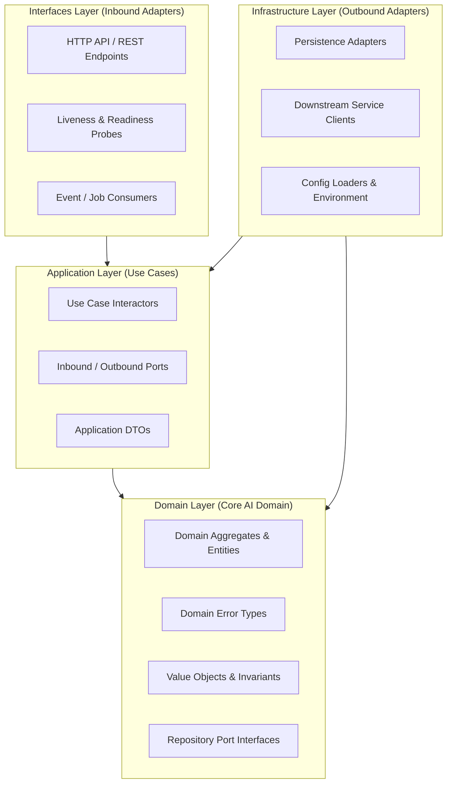

# OICUNT AI Platform Architecture Specification

**Repository**: `https://github.com/oicunt-ai/ai-platform`  
**Classification**: Engineering Architecture Standard  
**Status**: Authoritative Standard

---

## 1. System Overview & Purpose

The **OICUNT AI Platform** (`ai-platform`) is the dedicated, production-grade monorepo owning all AI-specific infrastructure, microservices, model routing, autonomous agents, tool runtimes, background processing workers, and telemetry for the OICUNT enterprise ecosystem.

This repository is engineered for long-term production scale, high reliability, and strict modularity. It establishes uncompromised architectural boundaries that isolate upstream AI provider volatilities, prevent vendor SDK leakage, and deliver deterministic, high-throughput, observable intelligence capabilities to client applications.

```
┌────────────────────────────────────────────────────────────────────────┐
│                        OICUNT Platform (Company)                       │
│  Users • AuthN/AuthZ • Billing • Subscriptions • Products • Usage • DBs│
└───────────────────────────────────┬────────────────────────────────────┘
                                    │ Trusted Service Boundary
                                    ▼ (Canonical Contracts)
┌────────────────────────────────────────────────────────────────────────┐
│                        OICUNT AI Platform                              │
│                                                                        │
│  ┌──────────────────┐  ┌──────────────────┐  ┌──────────────────────┐  │
│  │ AI Orchestration │  │ Model Registry   │  │ Tool & Agent Runtime │  │
│  └──────────────────┘  └──────────────────┘  └──────────────────────┘  │
│  ┌──────────────────┐  ┌──────────────────┐  ┌──────────────────────┐  │
│  │ Memory Service   │  │ Knowledge Service│  │ MCP Host / Clients   │  │
│  └──────────────────┘  └──────────────────┘  └──────────────────────┘  │
│  ┌──────────────────┐  ┌──────────────────┐                            │
│  │ Inference Service│  │ Model Gateway    │                            │
│  └──────────────────┘  └──────────────────┘                            │
└───────────────────────────────────┬────────────────────────────────────┘
                                    │ Egress Adapter Boundary
                                    ▼ (Provider Schemas)
┌────────────────────────────────────────────────────────────────────────┐
│                       Upstream AI Model Providers                      │
│            Anthropic • OpenAI • Google Gemini • AWS Bedrock            │
└────────────────────────────────────────────────────────────────────────┘
```

---

## 2. Platform Boundary: `platform` vs. `ai-platform`

The OICUNT enterprise maintains a strict division of architectural responsibility between two primary repositories:

```
┌─────────────────────────────────────────┐         ┌─────────────────────────────────────────┐
│     OICUNT Platform (Company Repo)      │         │           OICUNT AI Platform            │
│  https://github.com/oicunt-ai/platform  │         │ https://github.com/oicunt-ai/ai-platform│
├─────────────────────────────────────────┤         ├─────────────────────────────────────────┤
│ • Public API Gateway & Ingress          │         │ • AI Orchestration & Multi-turn Engine  │
│ • User Authentication & Sessions (AuthN)│         │ • Model Gateway & Vendor Dispatch       │
│ • Tenant & Organization Management      │         │ • Canonical Model Registry & Routing    │
│ • Billing, Subscriptions, Products, Usage │   ───►  │ • Tool Execution Sandboxes & Contracts  │
│ • Core Relational Databases             │ (Trusted│ • Autonomous Agent State Machines       │
│ • Enterprise Event Broker & Audit Log   │  Mesh)  │ • Model Context Protocol (MCP) Runtime  │
│ • General Background Daemons (Email/Ops)│         │ • High-Throughput Embeddings & Workers  │
│ • Company-wide CI/CD Infrastructure     │         │ • Document Processing & Semantic Chunks │
│                                         │         │ • GenAI Telemetry & Token Accounting    │
└─────────────────────────────────────────┘         └─────────────────────────────────────────┘
```

### Boundary Invariants

1. **Company Platform Ownership**: The platform repository authoritatively owns company-wide capabilities:
   - Billing
   - Subscriptions
   - Products
   - Usage metering and accounting
   - User authentication and session lifecycle (AuthN)
   - Public API Gateway and ingress routing
   - Tenant and organization management
   - Core relational databases and enterprise event brokers
2. **BILLY AI Assistant Product**: BILLY is the OICUNT AI Assistant product—a separate product repository that consumes platform capabilities (for user identity, subscription entitlements, and usage limits) and AI platform capabilities (for prompt orchestration, model completions, tool calls, and agent runs). BILLY is **not** a billing system.
3. **No Duplication of Company Capabilities**: `ai-platform` must **never** implement authentication services, user account stores, billing, subscriptions, products, usage tracking, payment processors, or public API ingress routing.
4. **Trusted Upstream Identity**: Inbound requests received by `ai-platform` have already passed through the platform API Gateway. Headers such as `X-User-ID`, `X-Tenant-ID`, and `X-Correlation-ID` are trusted authoritative metadata.
5. **Credential Containment**: Provider credentials (Anthropic API keys, OpenAI keys, Google Cloud ADC, AWS IAM roles) reside exclusively within `ai-platform` provider adapters. The company platform repository never touches upstream AI keys.
6. **Independence**: `ai-platform` maintains independent repository lifecycles, CI/CD pipelines, package versioning, and deployment manifests.

---

## 3. Canonical Service Architecture (Clean / Hexagonal)

All microservices within `services/` adhere strictly to the layered Clean / Hexagonal Architecture (Ports and Adapters) established across the OICUNT engineering organization:

```
interfaces (Inbound Adapters: HTTP routes, RPC dispatchers, health probes)
    ↓
application (Use Cases, Ports, Orchestration, DTOs)
    ↓
domain (Entities, Aggregates, Value Objects, Domain Errors, Invariants)
    ↓
infrastructure (Outbound Adapters: Storage, Message Publishers, HTTP Clients, Config)
```



### Layer Breakdown & Dependency Rules

| Layer              | Path                  | Purpose & Responsibilities                                                                                              | Permitted Dependencies                                                                 | Forbidden Dependencies                                                     |
| ------------------ | --------------------- | ----------------------------------------------------------------------------------------------------------------------- | -------------------------------------------------------------------------------------- | -------------------------------------------------------------------------- |
| **Domain**         | `src/domain/`         | Core business logic, domain entities, value objects, domain errors, and repository port interfaces. Pure TypeScript.    | `@oicunt-ai/model-types`, `@oicunt-ai/ai-types`, `@oicunt-ai/tool-types` (pure types). | Frameworks, HTTP, database drivers, logging libraries, concrete adapters.  |
| **Application**    | `src/application/`    | Use case interactors, command/query handlers, workflow execution, input/output DTOs, and outbound port contracts.       | `domain/`, `@oicunt-ai/*` shared packages.                                             | `infrastructure/`, `interfaces/`, concrete DB drivers, or HTTP frameworks. |
| **Infrastructure** | `src/infrastructure/` | Implements outbound ports (database repositories, message publishers, external service clients, configuration loaders). | `application/`, `domain/`, `@oicunt-ai/*`, external client libraries.                  | `interfaces/`.                                                             |
| **Interfaces**     | `src/interfaces/`     | Inbound drivers (HTTP routes, controllers, middleware, request validation, health probes).                              | `application/`, `domain/`, `@oicunt-ai/*`.                                             | Direct DB queries or bypass of application use cases.                      |

---

## 4. The 20 Architectural & Engineering Standards

### 4.1 Service Ownership Boundaries & Data Ownership

- **Autonomous Bounded Contexts**: Each service models a single bounded context according to Domain-Driven Design (DDD). Services own their domain rules, terminology, and invariants.
- **Database-Per-Service Rule**: Services must never share a database, schema, collection, or persistent datastore. All cross-boundary state access must occur via verified API contracts or published domain events.
- **No Shared Domain Entities**: Services never share internal entities with other services. Integration happens solely through contracts defined in `packages/*`.

### 4.2 Application/Domain/Infrastructure/Interfaces Separation

- **Inward Rule**: Outer layers (`interfaces`, `infrastructure`) depend on inner layers (`application`, `domain`). Inner layers never import from outer layers.
- **Ports & Adapters**: Application and Domain define _ports_ (interfaces). Infrastructure and Interfaces provide _adapters_ (implementations).
- **Composition Root**: Dependencies are composed at the composition root (`src/index.ts` / `src/service.ts`) during service boot.

### 4.3 AI-Specific Dependency Rules

- **Acyclic Dependency Graph**: Services must never establish cyclic dependencies.
- **Hierarchical Invocation**: Client requests flow: `API Gateway` &rarr; `Orchestrator` (which coordinates with `Model Registry`, `Memory`, and `Knowledge`) &rarr; `Inference` &rarr; `Model Gateway` &rarr; `Provider Adapter`.
- **No Direct Vendor Leaks**: Upstream provider SDKs (Anthropic, OpenAI, Google) are strictly forbidden from being imported by any service other than provider adapters inside `providers/`.

### 4.4 Provider Adapter Isolation

- **Anti-Corruption Layer**: Upstream model vendors present disparate APIs, tokenization strategies, and streaming schemas. The `providers/` boundary acts as a strict anti-corruption layer.
- **Zero Leakage**: Vendor SDK types, raw parameter names (`max_tokens_to_sample`, `temperature`, `system`), and vendor error codes must never escape `providers/`.
- **Bidirectional Translation**: Inbound requests map from `@oicunt-ai/ai-types` to vendor requests; outbound responses map to `NormalizedCompletionData` or `StreamEvent` SSE streams.

### 4.5 Canonical Model Abstraction & Dynamic Catalog Discovery

- **Platform Identifiers**: Public requests and internal service-to-service calls specify canonical OICUNT identifiers (e.g. `claude-sonnet`, `claude-opus`, `gpt-4o`, `gemini-pro`, as well as namespaced identifiers like `oicunt.model.general`), never raw vendor model names (`claude-3-5-sonnet-20241022`, `gpt-4o-2024-08-06`).
- **Dynamic Model Catalog**: The Model Registry exposes `GET /internal/v1/catalog` returning sanitized model entries (`ModelCatalogEntry[]`) for BILLY and client model pickers without leaking internal provider endpoints or secrets.
- **Reasoning Effort Governance**: Reasoning effort (`low`, `medium`, `high`) is a model capability and request parameter, NOT a separate model identifier. The Model Registry dynamically validates effort parameters against declared model capabilities (`capabilities.supportedEffortLevels`).
- **Transparent Provider Replacement**: Model versions map to one or more internal provider targets with priority and weights. Provider outages or maintenance cordoning trigger transparent failover without altering the user-selected model or requiring client redesign.
- **Separation of What vs. How**: Model Registry resolves WHAT targets are eligible; Model Gateway determines HOW to execute against those targets.

### 4.6 AI Request/Response Normalization

- **Unified Completion Payloads**: All completion endpoints consume `NormalizedCompletionRequest` and produce `NormalizedCompletionData`.
- **Token Accounting**: Every completion response reports standard `TokenUsage` (`promptTokens`, `completionTokens`, `totalTokens`, `reasoningTokens`, `cachedTokens`).

### 4.7 Streaming Conventions

- **Server-Sent Events (SSE)**: Streaming responses use `text/event-stream` with standard UTF-8 JSON payloads conforming to `StreamEvent`:
  - `token`: Partial text generation delta (`{ delta: string }`).
  - `tool_call`: Incremental tool call invocation (`{ id, name, argumentChunk }`).
  - `thinking`: Model internal reasoning delta (`{ delta: string }`).
  - `finish`: Terminal stream event containing `finishReason` and final `TokenUsage`.
  - `error`: Stream failure payload with canonical error code.
- **Backpressure**: Streaming handlers must handle client disconnects immediately via `AbortSignal`.

### 4.8 HTTP/gRPC Service Communication

- **Standard Envelopes**: HTTP endpoints produce standard JSON response envelopes (`{ success: true, data: T, meta?: ... }`).
- **Mandatory Headers**: Every request propagates `X-Correlation-ID`, `X-User-ID`, and `X-Tenant-ID`.
- **Timeouts & Circuit Breakers**: All inter-service calls enforce timeouts (configurable defaults: 5000ms for metadata, 60000ms for inference) and exponential backoff retries with jitter for idempotent operations.

### 4.9 Async Jobs and Event Communication

- **At-Least-Once Delivery**: Message delivery in distributed systems is at-least-once. All worker job consumers and event subscribers must be strictly idempotent.
- **Event Metadata**: Events carry distributed tracing metadata: `eventId`, `correlationId`, `causationId`, `timestamp`, `producer`, `version`.
- **Decoupled Transport**: Event definitions are decoupled from transport mechanics (RabbitMQ, SQS, Kafka).

### 4.10 Configuration and Secrets Management

- **Fail-Fast Boot**: Services validate configuration schemas at startup. If any required parameter is missing or invalid, the service terminates immediately with exit code 1.
- **Credential Containment**: Provider API keys, AWS credentials, and database secrets are loaded from environment secrets into memory and frozen.
- **No Direct `process.env` Access**: Direct reads of `process.env` outside `config.ts` are prohibited.

### 4.11 Error Handling Strategy

- **Functional Result Pattern**: Domain and application use cases return `AiServiceResult<T, E>` (`ok(data)` or `err(error)`) for predictable business states.
- **Typed Error Hierarchy**: Services define domain error classes inheriting from `AiDomainError`.
- **Information Leakage Prevention**: Internal database errors, vendor details, and stack traces must never be exposed to clients.

### 4.12 Structured Logging Standards

- **Machine-Parseable JSON**: In production, all logs are formatted as single-line JSON with `timestamp`, `level`, `service`, `correlationId`, and `message`.
- **Contextual Child Loggers**: Requests create child loggers binding correlation and user metadata.
- **PII & Prompt Scrubbing**: Passwords, API tokens, and sensitive customer data must be scrubbed before emitting log entries.

### 4.13 AI/GenAI Observability Standards

- **OpenTelemetry GenAI Semantics**: Spans adhere to OpenTelemetry GenAI semantic conventions (`gen_ai.system`, `gen_ai.request.model`, `gen_ai.usage.input_tokens`, `gen_ai.usage.output_tokens`).
- **Distributed Tracing**: All calls propagate W3C `traceparent` and correlation headers.
- **Metric Instrumentation**: AI services record token throughput, inference latency histograms, and tool execution durations via `@oicunt-ai/observability`.

### 4.14 Health and Readiness Endpoints

Every service exposes two standard probes:

- **Liveness Probe (`/healthz` or `/health/liveness`)**: Verifies that the Node.js event loop is responsive. Returns `200 OK`.
- **Readiness Probe (`/readyz` or `/health/readiness`)**: Verifies that downstream dependencies and configurations are initialized. Returns `200 OK` when ready, or `503 SERVICE UNAVAILABLE` during startup or failure.

### 4.15 Service-to-Service Identity & Security

- **Perimeter Authentication**: Public user tokens terminate at the company platform API Gateway.
- **Trusted Internal Metadata**: Downstream AI services receive authoritative `X-User-ID` and `X-Tenant-ID` headers injected exclusively by the platform gateway.
- **Internal Service Auth**: Service-to-service calls are authenticated via mTLS or signed internal service JWTs.

### 4.16 Testing Conventions & Quality Gates

Each service and package maintains three testing tiers:

- **Unit Tests (`tests/unit/`)**: Pure in-memory execution targeting domain rules and application interactors with test doubles; no disk or network I/O.
- **Integration Tests (`tests/integration/`)**: Tests HTTP probe routing, middleware pipelines, and adapter implementations.
- **Contract Tests (`tests/contract/`)**: Verifies JSON wire schemas and event structures against shared package specifications.

### 4.17 Worker Architecture

- **Asynchronous Execution**: High-latency batch operations (embeddings, document extraction, multi-step agent runs) execute in dedicated worker processes.
- **Resource Profiling**: Workers have distinct CPU/memory profiles and can run on specialized GPU node pools.
- **Graceful Shutdown**: Workers listen for termination signals, pause job ingestion, and finish in-flight jobs within a configurable deadline.

### 4.18 Shared Package Dependency Rules

- **Inward Dependency Flow**: Services, workers, and adapters depend on `packages/*`. Packages **never** depend on services, workers, or adapters.
- **Pure Types & Contracts**: Packages contain zero service runtime state and zero infrastructure dependencies.
- **DAG Enforcement**: Inter-package dependencies form a strict Directed Acyclic Graph (DAG) validated by TypeScript project references.

### 4.19 Security & Sandboxing Boundaries

- **Tool Execution Isolation**: Tools with side effects (code execution, network access) must run in isolated sandboxes with strict execution timeouts and resource constraints.
- **Non-Root Execution**: Container images run under unprivileged non-root users (`USER node`).

### 4.20 Model & Provider Separation

- **Model Registry (Catalog & Resolution)**: Owns canonical model definitions, dynamic catalog discovery (`GET /internal/v1/catalog`), capability flags (including reasoning effort levels), pricing tables, and eligible target bindings.
- **Model Gateway (Egress & Execution)**: Owns provider routing, retry budgets, circuit breakers, adapter dispatch, and streaming normalization.
- **Clean Decoupling**: Consuming clients (BILLY) select from user-facing canonical models and effort levels; the Orchestrator knows only about canonical models; only the Model Gateway knows how to dispatch to upstream provider targets.
- **Detailed Specification**: See the authoritative architecture contracts in [Model Routing Contract](./contracts/model-routing.md), [Model Registry Implementation Contract](./contracts/model-registry.md), [Model Gateway Architecture Contract](./contracts/model-gateway.md), and [AI Orchestrator Implementation Contract](./contracts/ai-orchestrator.md) for complete resolution schemas, domain aggregates, database ownership, dispatch contracts, orchestration flows, and failure handling mechanics.

---

## 5. Future AI Services Landscape

The following 10 services are planned for future implementation milestones:

```
services/
├── orchestrator/       # Conversational turn loop, multi-agent coordination, and tool loop
├── model-gateway/      # Outbound provider dispatch, resilience, fallback routing, stream normalization
├── model-registry/     # Canonical model catalog, model routing rules, cost tables, capability metadata
├── inference/          # Low-latency model execution routing, batch scheduling, priority queuing
├── memory/             # Working memory, conversational history, and episodic context stores (see docs/contracts/memory.md)
├── knowledge/          # Knowledge spaces/collections, document processing, chunking, and similarity retrieval (see docs/contracts/knowledge.md)
├── embeddings/         # High-throughput vector embedding generation endpoint
├── tools/              # Centralized tool execution engine, sandboxing, permission checks
├── agents/             # Autonomous agent state machine, persistent run loops, step execution
└── mcp/                # Model Context Protocol bridge and server connectors
```

### Detailed Service Responsibilities

| Service          | Responsibility                                                                                                                                                                                                            | Inbound Ports (Interfaces)                                   | Outbound Ports (Dependencies)                                                    |
| ---------------- | ------------------------------------------------------------------------------------------------------------------------------------------------------------------------------------------------------------------------- | ------------------------------------------------------------ | -------------------------------------------------------------------------------- |
| `orchestrator`   | Coordinates conversational turns, prompt assembly, and iterative tool loops. Does not contain provider-specific code (see [AI Orchestrator Contract](./contracts/ai-orchestrator.md)).                                    | HTTP turn endpoint, Event consumers                          | Inference, Model Registry, Memory, Knowledge, Tools                              |
| `model-gateway`  | The singular provider egress boundary. Normalizes payloads, manages provider fallbacks, enforces rate limits, handles SSE streams (see [Model Gateway Contract](./contracts/model-gateway.md)).                           | HTTP completion & stream dispatch                            | Provider Adapters (`providers/*`), Observability                                 |
| `model-registry` | Canonical model catalog. Maintains canonical IDs (`claude-sonnet`, `gpt-4o`, `oicunt.model.*`), provider target mappings, context limits, and cost tables (see [Model Registry Contract](./contracts/model-registry.md)). | HTTP catalog & resolution query                              | Database / Configuration store                                                   |
| `inference`      | Coordinates inference execution lifecycle, normalized request/response boundaries, deadline/cancellation propagation, and streaming (see [Inference Service Contract](./contracts/inference.md)).                         | HTTP inference request                                       | Model Gateway, Internal runtimes                                                 |
| `memory`         | Manages conversation memory windows, message persistence, token summarization, and episodic context stores (see [Memory Service Contract](./contracts/memory.md)).                                                        | HTTP memory query & update                                   | Dedicated memory storage adapter                                                 |
| `knowledge`      | Owns user/tenant collections, document lifecycle, chunking, abstract embeddings, vector similarity search, and provenance (see [Knowledge Service Contract](./contracts/knowledge.md)).                                   | HTTP retrieval and document API (`/internal/v1/knowledge/*`) | DocumentRepositoryPort, VectorStorePort, EmbeddingServicePort, ObjectStoragePort |
| `embeddings`     | Synchronous endpoint for text and multimodal vector embedding generation.                                                                                                                                                 | HTTP embedding generation                                    | Model Gateway / Inference runtime                                                |
| `tools`          | Sandboxed execution environment for deterministic tools and platform actions.                                                                                                                                             | HTTP tool invocation                                         | Sandboxed container runtime                                                      |
| `agents`         | Durable execution engine for multi-step autonomous agents, step state checkpoints, and pause/resume loops.                                                                                                                | HTTP agent run trigger, Job queue                            | Orchestrator, Tools, Memory, Storage                                             |
| `mcp`            | Model Context Protocol gateway connecting external tool and resource servers into the AI platform.                                                                                                                        | MCP stdio/SSE/WebSocket bridges                              | Tool runtime, Platform resources                                                 |

---

## 6. Future AI Workers Landscape

High-latency background jobs execute asynchronously in `workers/`:

```
workers/
├── embeddings/             # Batch vector embedding generation & index ingestion
├── document-processing/    # Multi-format document parsing, extraction, and semantic chunking
└── agent-jobs/             # Long-running background autonomous agent tasks
```

| Worker                | Inbound Trigger                       | Core Operation                                                        | Outbound Result                           |
| --------------------- | ------------------------------------- | --------------------------------------------------------------------- | ----------------------------------------- |
| `embeddings`          | Message queue job with chunk batch    | Computes embeddings in batched vector inference                       | Writes vectors to vector database         |
| `document-processing` | File ingestion event with storage URI | Extracts text/OCR from PDF, DOCX, HTML; applies semantic chunking     | Publishes chunk batch to embeddings queue |
| `agent-jobs`          | Background task dispatch              | Iterates multi-step ReAct agent loops; checkpoints intermediate steps | Emits audit events and task completions   |

---

## 7. Upstream Provider Adapters Boundary (`providers/`)

The `providers/` directory contains vendor-specific adapters isolating external LLM APIs:

- **Anthropic Adapter**: Maps `NormalizedCompletionRequest` to Anthropic Messages API; translates Claude SSE stream to `StreamEvent`.
- **OpenAI Adapter**: Maps to OpenAI Chat Completions API; translates chunks to `StreamEvent`.
- **Google Gemini Adapter**: Maps to Google GenAI SDK; translates stream chunks to `StreamEvent`.
- **AWS Bedrock Adapter**: Maps to Bedrock Converse API with SigV4 authentication.

**Invariant**: Provider adapters are loaded exclusively by the Model Gateway. No other component has access to provider SDKs or API keys.

---

## 8. Shared Packages Landscape (`packages/*`)

Foundational types, schemas, and observability interfaces:

```
packages/
├── model-types/     # Canonical model IDs, capabilities, token usage, pricing
├── ai-types/        # Chat messages, multimodal parts, completion requests/responses, stream events
├── tool-types/      # Tool parameter JSON schemas, execution contexts, tool results
├── agent-types/     # Agent configurations, execution states, step traces, run results
├── mcp-types/       # Model Context Protocol specifications, framing, resources, tools
└── observability/   # OpenTelemetry GenAI semantic conventions, token metrics, tracer doubles
```

---

## 9. Architectural Invariants Checklist

Every future implementation must satisfy the following invariants:

- [ ] AI services must never expose provider-specific APIs outside `providers/`.
- [ ] Provider SDKs must not leak into shared packages or orchestrators.
- [ ] AI services consume canonical OICUNT model identifiers (`claude-sonnet`, `gpt-4o`, `oicunt.model.*`).
- [ ] Provider-specific model IDs remain internal to provider configuration.
- [ ] Model Gateway is the singular provider egress boundary.
- [ ] Model Registry is the singular model catalog and routing configuration boundary.
- [ ] Dynamic model catalog discovery (`GET /internal/v1/catalog`) decouples client model selection from provider endpoints.
- [ ] Reasoning effort levels are dynamic capabilities and execution parameters, not distinct model entities.
- [ ] Orchestrator coordinates AI workflows but contains zero provider-specific code.
- [ ] Shared packages must not depend on services, workers, or providers.
- [ ] Services must own their persistent data (no shared databases).
- [ ] AI platform must not duplicate company-wide platform capabilities (Billing, Subscriptions, Products, Usage, AuthN, API Gateway).
- [ ] All services implement Hexagonal Architecture: `interfaces` &rarr; `application` &rarr; `domain` &rarr; `infrastructure`.
- [ ] All services expose standard `/healthz` (liveness) and `/readyz` (readiness) probes.
- [ ] All inter-service calls propagate `X-Correlation-ID`, `X-User-ID`, and `X-Tenant-ID`.
