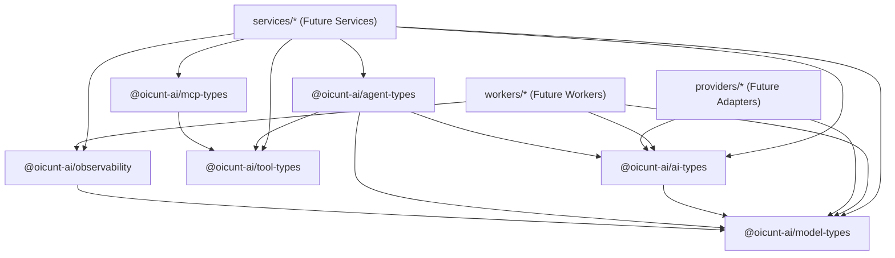

# OICUNT AI Platform Architecture Specification

**Repository**: `https://github.com/oicunt-ai/ai-platform`  
**Classification**: Engineering Architecture Standard  
**Status**: Authoritative Foundation

---

## 1. System Overview & Purpose

The **OICUNT AI Platform** (`ai-platform`) is the dedicated, production-grade monorepo owning all AI-specific infrastructure, services, models, agents, tools, and runtime execution environments for the OICUNT ecosystem.

This repository is designed from first principles for long-term production scale, high reliability, and strict modularity. It establishes uncompromised architectural boundaries that isolate upstream AI provider volatilities and provide deterministic, high-throughput, and observable intelligence capabilities.

```
┌────────────────────────────────────────────────────────────────────────┐
│                        OICUNT Platform (Company)                       │
│    Users • AuthN/AuthZ • Billing • Subscriptions • Products • Usage • DBs    │
└───────────────────────────────────┬────────────────────────────────────┘
                                    │ Trusted Service Boundary
                                    ▼ (Canonical Contracts)
┌────────────────────────────────────────────────────────────────────────┐
│                        OICUNT AI Platform                              │
│                                                                        │
│  ┌──────────────────┐  ┌──────────────────┐  ┌──────────────────────┐  │
│  │ AI Orchestration │  │ Canonical Models │  │ Tool & Agent Runtime │  │
│  └──────────────────┘  └──────────────────┘  └──────────────────────┘  │
│  ┌──────────────────┐  ┌──────────────────┐  ┌──────────────────────┐  │
│  │ Model Gateway    │  │ Vector/Embeddings│  │ MCP Host / Clients   │  │
│  └──────────────────┘  └──────────────────┘  └──────────────────────┘  │
└───────────────────────────────────┬────────────────────────────────────┘
                                    │ Egress Adapter Boundary
                                    ▼ (Provider Schemas)
┌────────────────────────────────────────────────────────────────────────┐
│                       Upstream AI Model Providers                      │
│            Anthropic • OpenAI • Google Gemini • AWS Bedrock            │
└────────────────────────────────────────────────────────────────────────┘
```

---

## 2. Core Architectural Principles

1. **Strict Capability Ownership**:
   AI-specific capabilities belong exclusively here. Company-wide concerns belong in the company platform repository.
2. **Normalized Wire & Domain Contracts**:
   All inter-service interactions within the AI platform use canonical OICUNT types (`@oicunt-ai/ai-types`, `@oicunt-ai/model-types`, etc.). Upstream vendor representations (OpenAI JSON, Anthropic JSON, Google protos) are strictly confined to provider adapters.
3. **Canonical Model Identifiers**:
   Platform services reference models via canonical identifiers (e.g. `oicunt.model.general`, `oicunt.model.reasoning`), never raw vendor model names (e.g. `claude-3-5-sonnet`, `gpt-4o`).
4. **Hexagonal Architecture (Ports and Adapters)**:
   Services and workers decouple domain and application logic from transport protocols, external databases, and model providers.
5. **Zero-Trust Observability**:
   Every prompt, completion, tool call, and agent step produces traceable OpenTelemetry GenAI spans with token attribution, latency tracking, and distributed correlation.
6. **Strict Static Typing**:
   TypeScript is enforced in its strictest mode across all workspaces with project references, zero implicit any, and strict null checks.

---

## 3. Platform Boundary: `platform` vs. `ai-platform`

The OICUNT enterprise divides architectural responsibility between two primary repositories:

```
┌─────────────────────────────────────────┐         ┌─────────────────────────────────────────┐
│     OICUNT Platform (Company Repo)      │         │           OICUNT AI Platform            │
│  https://github.com/oicunt-ai/platform  │         │ https://github.com/oicunt-ai/ai-platform│
├─────────────────────────────────────────┤         ├─────────────────────────────────────────┤
│ • Public API Gateway & Ingress          │         │ • AI Orchestration & Multi-turn Engine  │
│ • User Authentication & Sessions (AuthN)│         │ • Model Gateway & Vendor Dispatch       │
│ • Tenant & Organization Management      │         │ • Canonical Model Registry & Pricing    │
│ • Billing & Subscriptions               │   ───►  │ • Tool Execution Sandboxes & Contracts  │
│ • Products & Usage Metering             │ (Trusted│ • Autonomous Agent State Machines       │
│ • Core Relational Databases             │  Mesh)  │ • Model Context Protocol (MCP) Runtime  │
│ • Enterprise Event Broker & Audit Log   │         │ • High-Throughput Embeddings & Workers  │
│ • General Background Daemons (Email/Ops)│         │ • Document Processing & Semantic Chunks │
│ • Company-wide CI/CD Infrastructure     │         │ • GenAI Telemetry & Token Accounting    │
└─────────────────────────────────────────┘         └─────────────────────────────────────────┘
```

### Boundary Invariants

- **Company Platform Ownership**: The company platform repository authoritatively owns company-wide capabilities:
  - Billing
  - Subscriptions
  - Products
  - Usage
  - User authentication and session management
  - Public API Gateway and ingress routing
  - Tenant and organization management
  - Core relational databases and enterprise event brokers
- **BILLY AI Assistant Product**: BILLY is the OICUNT AI Assistant product—a separate product repository that consumes platform capabilities (for identity, subscriptions, entitlements, and usage metering) and ai-platform capabilities (for model inference, prompt orchestration, tool execution, and agents). BILLY is not a billing system.
- **No Duplication of Company Capabilities**: `ai-platform` does NOT implement authentication services, user account stores, billing, subscriptions, products, usage metering, payment processors, or public API ingress routing.
- **Trusted Upstream Identity**: Inbound requests received by `ai-platform` have already been verified by the platform API Gateway. Headers such as `X-User-ID`, `X-Tenant-ID`, and `X-Correlation-ID` are trusted authoritative metadata.
- **Credential Containment**: Provider credentials (Anthropic API keys, OpenAI keys, Google Cloud ADC, AWS IAM roles) are confined entirely within `ai-platform` provider adapters. The company platform repository never touches upstream AI keys.
- **Independence**: `ai-platform` maintains independent repository lifecycles, CI/CD pipelines, package versioning, and deployment manifests.

---

## 4. Repository Topology

```
ai-platform/
├── .github/                 # GitHub Actions workflows (CI quality gates)
├── docs/                    # Architecture and development documentation
│   ├── architecture.md      # Platform architecture specifications (this document)
│   └── development.md       # Development setup and contributor workflows
├── infrastructure/          # Infrastructure as Code (IaC) and cloud deployments
│   ├── docker/              # Multi-stage Dockerfiles
│   ├── helm/                # Service & worker Helm charts
│   ├── kubernetes/          # Raw & Kustomize manifests
│   └── terraform/           # Dedicated AI cloud infrastructure
├── packages/                # Shared domain contracts and type libraries
│   ├── agent-types/         # Agent loops, configs, steps, and run states
│   ├── ai-types/            # Chat messages, completions, and streaming events
│   ├── mcp-types/           # Model Context Protocol specifications
│   ├── model-types/         # Canonical model catalog, capabilities, and tokens
│   ├── observability/       # GenAI OpenTelemetry metrics and tracing
│   └── tool-types/          # Tool schemas, parameters, and execution contracts
├── providers/               # Upstream AI model provider adapter boundary
│   └── README.md
├── services/                # Autonomous AI microservices
│   └── README.md
├── workers/                 # Asynchronous background workers and daemons
│   ├── agent-jobs/          # Long-running background agent workflows
│   ├── document-processing/ # Ingestion, parsing, and semantic chunking
│   └── embeddings/          # Batch vector embedding generation
├── scripts/                 # Operations and verification scripts
│   ├── clean.mjs            # Workspace artifact cleaner
│   └── verify.mjs           # Local quality gate runner
└── tests/                   # Monorepo-wide integration and contract tests
    └── foundation.test.ts
```

---

## 5. Shared Package Boundaries & Dependency Direction

Shared packages under `packages/` provide the domain vocabulary and contracts for the entire AI platform.

### Dependency Rules

1. **Strict Inward Flow**: Services, workers, and provider adapters depend on shared packages. Shared packages **never** depend on services, workers, or provider adapters.
2. **Zero Circular Dependencies**: All inter-package dependencies form a directed acyclic graph (DAG).
3. **No External Runtime Dependencies**: Foundation packages maintain zero external runtime dependencies, ensuring ultra-fast compilation and isolation.



### Package Ownership Summary

| Package         | Workspace Name             | Responsibility                                                                                        |
| --------------- | -------------------------- | ----------------------------------------------------------------------------------------------------- |
| `model-types`   | `@oicunt-ai/model-types`   | Canonical model identifiers, capabilities, limits, pricing, token usage.                              |
| `ai-types`      | `@oicunt-ai/ai-types`      | Universal message parts, chat structures, normalized completion requests/responses, streaming events. |
| `tool-types`    | `@oicunt-ai/tool-types`    | Tool parameter JSON schemas, execution contexts, tool results, executor interfaces.                   |
| `agent-types`   | `@oicunt-ai/agent-types`   | Agent configuration, execution state machine, intermediate steps, run contexts.                       |
| `mcp-types`     | `@oicunt-ai/mcp-types`     | Model Context Protocol specifications, framing, transports, resources, prompts, tools.                |
| `observability` | `@oicunt-ai/observability` | OpenTelemetry GenAI semantic conventions, token attribution, latency tracking, test doubles.          |

---

## 6. Future AI Service Landscape

The following services are designated for development in subsequent milestones:

1. **`orchestrator`**:
   - Manages conversational turn loops, prompt assembly, system context injection, and coordinates tool calls with the tool runtime.
2. **`model-gateway`**:
   - Manages upstream provider dispatch, load shedding, streaming SSE normalization, token counting, and provider fallback strategies.
3. **`model-registry`**:
   - Maintains the catalog of canonical models, dynamic routing rules, cost accounting tables, and model capability matrices.
4. **`inference`**:
   - High-throughput dedicated inference router managing batching queues and private self-hosted model backends.
5. **`memory`**:
   - Manages short-term conversational windows, episodic summaries, and agent working memories.
6. **`knowledge`**:
   - Coordinates vector search, semantic ranking, and document retrieval for Retrieval-Augmented Generation (RAG).
7. **`embeddings`**:
   - Synchronous endpoint for generating text and multimodal vector embeddings.
8. **`tools`**:
   - Secure execution engine and sandboxes for deterministic tools and custom platform plugins.
9. **`agents`**:
   - Autonomous task runner managing durable step loops, state persistence, and human-in-the-loop approvals.
10. **`mcp`**:
    - Centralized Model Context Protocol server/client gateway exposing platform data and external tools.

---

## 7. Asynchronous Worker Architecture

Long-running, computationally heavy, or high-volume background tasks are routed to `workers/`:

- **`embeddings`**: Consumes document chunk batches and computes vector embeddings using batch-optimized inference endpoints.
- **`document-processing`**: Extracts unstructured documents (PDF, DOCX, HTML, etc.), performs OCR, and partitions content into semantic chunks.
- **`agent-jobs`**: Executes multi-turn agent tasks running in background queues, checkpointing intermediate thoughts and tool results.

Workers communicate via at-least-once message delivery. Consequently, all worker handlers must maintain strict idempotency.

---

## 8. Provider Abstraction Layer (`providers/`)

Upstream model vendors present disparate APIs, tokenization strategies, and streaming schemas. The `providers/` boundary acts as an anti-corruption layer:

1. **Isolation**: External SDKs (e.g. `@anthropic-ai/sdk`, `openai`, `@google/genai`) are contained entirely inside adapter modules.
2. **Standardization**: Adapters translate incoming `NormalizedCompletionRequest` into vendor requests and return `NormalizedCompletionData` or `StreamEvent` SSE streams.
3. **Resilience**: Rate-limit handling (HTTP 429), jittered exponential backoffs, and circuit breaking are implemented directly within provider adapters.

---

## 9. AI Observability & Telemetry Standard

Every AI interaction must be measured:

- **GenAI Semantics**: Spans adhere to OpenTelemetry GenAI standards (`gen_ai.system`, `gen_ai.request.model`, `gen_ai.usage.input_tokens`, `gen_ai.usage.output_tokens`).
- **Distributed Tracing**: All requests propagate `traceparent`, `X-Correlation-ID`, and request IDs.
- **Token Attribution**: Token metrics are recorded per model, tenant, user, and service to enable precise billing and capacity planning.

---

## 10. Continuous Integration Quality Gates

Before any change can be merged to `main`, it must pass all automated CI checks:

1. **Deterministic Installation**: `pnpm install --frozen-lockfile`
2. **Code Format Conformity**: `pnpm format:check`
3. **Static Analysis & Linting**: `pnpm lint`
4. **Type Soundness**: `pnpm type-check`
5. **Automated Test Suite**: `pnpm test`
6. **Package Compilation**: `pnpm build`
