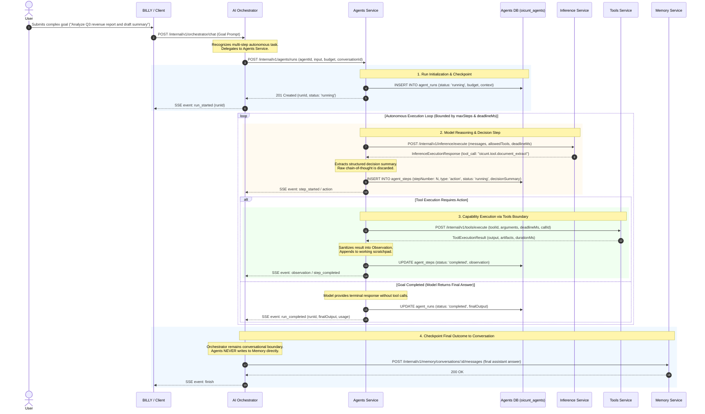
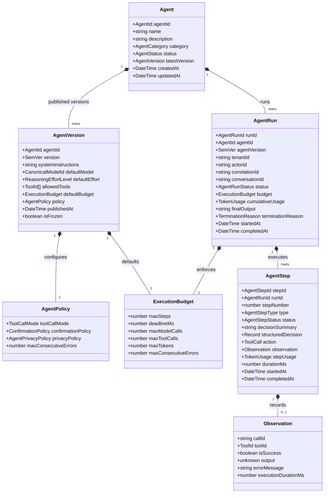
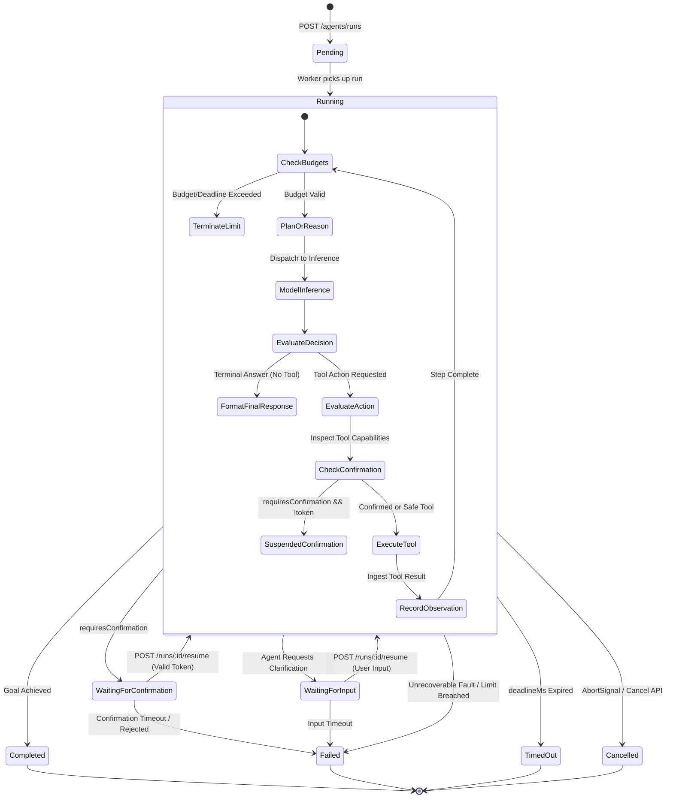
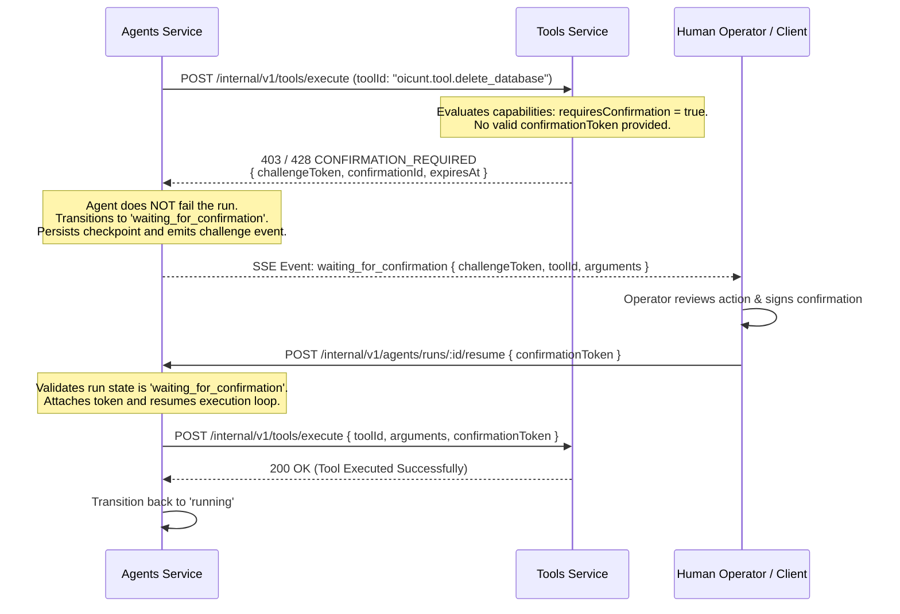

# OICUNT AI Platform Contract: Agents Service Architecture Specification

**Document Version**: 1.1.0  
**Status**: Authoritative Architectural Contract  
**Classification**: Engineering Architecture Standard  
**Service Location**: `services/agents`  
**Worker Location**: `workers/agent-jobs`

---

## 1. Executive Summary & Purpose

The **Agents Service** (`services/agents`) is the authoritative **autonomous, multi-step AI execution and runtime state management engine** for the **OICUNT AI Platform**. It serves as the dedicated capability layer responsible for governing, executing, checkpointing, and auditing multi-step autonomous agent runs, planning loops, reflective reasoning cycles, and tool-mediated goal decomposition.

While the **AI Orchestrator** governs single-turn conversational coordination, prompt composition, and direct client interactions, the **Agents Service** governs multi-step, autonomous problem-solving workflows where a goal cannot be satisfied in a single model turn. The Agents Service controls the iterative execution loop—directing model reasoning, selecting actions, dispatching tool calls, recording observations, managing intermediate memory scratchpads, enforcing strict loop termination bounds, and persisting state transitions—without ever bypassing platform security boundaries, calling model providers directly, or executing tool operations within its own process space.

```
┌────────────────────────────────────────────────────────────────────────┐
│                        Product Application (BILLY)                     │
│                • User Interface • Goal Prompt • Run Controls           │
└───────────────────────────────────┬────────────────────────────────────┘
                                    │ 1. Conversational Turn / Delegated Goal
                                    ▼
┌────────────────────────────────────────────────────────────────────────┐
│                            AI Orchestrator                             │
│                                                                        │
│   • Conversational Turn Coordination     • Prompt Hydration            │
│   • Conversational Memory Checkpoint     • Client Lifecycle & SSE Pipe │
└───────────────────────────────────┬────────────────────────────────────┘
                                    │ 2. POST /internal/v1/agents/runs
                                    │    (Start Autonomous Run)
                                    ▼
┌────────────────────────────────────────────────────────────────────────┐
│                              Agents Service                            │
│                                                                        │
│   • Agent Catalog & Versioning           • Multi-Step Loop Controller  │
│   • Goal Decomposition & Planning        • Step State Checkpointing    │
│   • Execution Budgets (Steps, Deadlines) • Pause / Resume / Cancel     │
│   • Action Decisions & Observations      • Auditable Run Traces        │
└───────┬────────────────────┬────────────────────┬──────────────────────┘
        │                    │                    │
        │ 3. (Session Context│ 4. POST /execute   │ 5. POST /execute
        │     from Orch)     │    (Tool Actions)  │    (Model Decisions)
        ▼                    ▼                    ▼
┌──────────────┐     ┌──────────────┐     ┌──────────────────────────────┐
│    Memory    │     │    Tools     │     │      Inference Service       │
│   Service    │     │   Service    │     │ • Execution Runtime Lifecycle│
└──────────────┘     └──────────────┘     └──────────────┬───────────────┘
 (Conversational       (Capabilities)                    │ 6. Dispatches
  Boundary Owned                                         ▼
  by Orchestrator)                   ▲            ┌──────────────────────────────┐
                                     │ 5b. RAG    │        Model Gateway         │
                             ┌───────┴──────┐     │ • Provider Egress Boundary   │
                             │  Knowledge   │     └──────────────┬───────────────┘
                             │   Service    │                    │ 7. Egress
                             └──────────────┘                    ▼
                                                  ┌──────────────────────────────┐
                                                  │      Provider Adapters       │
                                                  │ Anthropic • Bedrock • OpenAI │
                                                  └──────────────────────────────┘
```

> [!IMPORTANT]
> **Cardinal Boundary Rules**:
>
> 1. The Agents Service is an **autonomous workflow coordinator, not a platform bypass**. It coordinates _when_ to think and _what_ to do, but it **NEVER** calls upstream model providers directly, **NEVER** executes tools or shell code in its own runtime, **NEVER** implements MCP wire transports, and **NEVER** bypasses human-in-the-loop confirmation gates established by the Tools Service.
> 2. The Agents Service **NEVER writes conversational messages directly to the Memory Service**. The AI Orchestrator remains the sole conversational boundary. When an agent run completes, it returns its final output and telemetry to the Orchestrator, which authoritatively checkpoints the final user + assistant turn to Memory.
> 3. **Raw chain-of-thought (CoT) is NEVER persisted or exposed**. Agent state persists structured planning metadata, action intents, decision summaries, and sanitized observations, but raw model reasoning tokens are strictly ephemeral to model inference and are never written to database tables or exposed to clients.

---

### 1.1 Architectural Position in the Platform Ecosystem

The OICUNT AI Platform coordinates intelligence across nine authoritative subsystems:

| Subsystem           | Architectural Role                  | Core Question Owned                                 | State & Data Owned                                                                                  |
| :------------------ | :---------------------------------- | :-------------------------------------------------- | :-------------------------------------------------------------------------------------------------- |
| **Model Registry**  | Control Plane / Model Catalog       | _What models & targets exist?_                      | Canonical models, semantic versions, context limits, pricing, routing policies                      |
| **Model Gateway**   | Data Plane / Provider Egress        | _How is a model executed upstream?_                 | Provider adapters, circuit breakers, credentials, egress streams, retries                           |
| **Inference**       | Runtime Execution Boundary          | _How is an inference turn governed?_                | Request validation, TTFT tracking, privacy redaction, monotonic deadlines                           |
| **AI Orchestrator** | Application Interaction Coordinator | _How does a user turn or interaction proceed?_      | Multi-turn conversational context, prompt assembly, client SSE delivery, conversation checkpointing |
| **Memory**          | Conversational State Store          | _What was previously discussed?_                    | Conversation threads, ordered message sequences, sliding context windows                            |
| **Knowledge**       | Enterprise Knowledge & RAG Boundary | _What verified documents & facts exist?_            | Knowledge collections, document records, extracted chunks, vector references                        |
| **Embeddings**      | Vector Representation Runtime       | _How is text vectorized?_                           | Batch atomicity, dimension validation, provider-neutral embedding vectors                           |
| **Tools**           | Capability & Action Runtime         | _What actions can the AI perform safely?_           | Tool catalog, parameter schemas, sandbox execution, human confirmation tokens                       |
| **Agents**          | **Autonomous Multi-Step Runtime**   | _**How is a multi-step goal solved autonomously?**_ | **Agent definitions, versioned policies, runs, step traces, structured plans, observations**        |

---

### 1.2 End-to-End Agent Run Sequence Diagram



---

## 2. Responsibilities & Non-Responsibilities

### 2.1 What Agents Owns (Core Responsibilities)

1. **Agent Catalog & Definitions**: Authoritative registry of agent specifications (`oicunt.agent.*`), role descriptions, prompt templates, and capability declarations.
2. **Agent Versioning & Immutability**: Immutable semantic versioning (`AgentVersion`) ensuring that running workflows execute against frozen, reproducible configurations.
3. **Run Lifecycle State Machine**: Deterministic state transitions (`pending` &rarr; `running` &rarr; `waiting_for_confirmation` &rarr; `waiting_for_input` &rarr; `completed` / `failed` / `cancelled` / `timed_out`).
4. **Step-by-Step Loop Control**: Managing the execution loop (Plan &rarr; Act &rarr; Observe &rarr; Reflect &rarr; Terminate), evaluating termination heuristics, and maintaining progress towards the goal.
5. **Execution Budgets & Termination Invariants**: Enforcing strict, monotonic boundaries on `maxSteps`, `deadlineMs`, `maxModelCalls`, `maxToolCalls`, token allowances, and error thresholds.
6. **Structured Step Traces & Observations**: Maintaining ordered step histories, recording high-level decision summaries, and sanitizing tool outputs into structured observations.
7. **Pause, Resume, & Confirmation State**: Suspending run execution when downstream tools demand human cryptographic confirmation (`waiting_for_confirmation`) or when user input is needed (`waiting_for_input`), persisting state checkpoints, and safely resuming upon token/input injection.
8. **Asynchronous Run Execution & Worker Recovery**: Coordinating with background workers (`workers/agent-jobs`) via message queues (RabbitMQ), ensuring distributed lease ownership and idempotent step checkpoint recovery across worker restarts.
9. **Event Emission & Streaming**: Exposing real-time Server-Sent Events (SSE) representing run progression, step transitions, actions, observations, and completion summaries.
10. **Agent Execution Telemetry**: Emitting OpenTelemetry GenAI spans capturing step counts, loop latency, tool usage distributions, and token consumption.

### 2.2 What Agents Does NOT Own (Explicit Non-Responsibilities)

1. **NO Direct Provider Calls or SDKs**: The Agents Service **never** communicates with Anthropic, OpenAI, Google Gemini, or AWS Bedrock APIs, and never imports vendor SDKs.
2. **NO Model Routing or Target Resolution**: Resolving canonical models to provider endpoints and managing circuit breakers belongs to **Model Registry** and **Model Gateway**.
3. **NO Inference Lifecycle Management**: Enforcing TTFT metrics, inference privacy filters, and model streaming normalization belongs to the **Inference Service**.
4. **NO Tool Execution or Sandboxing**: Agents **never** executes shell scripts, runs code interpreters, initiates database writes, or calls external APIs directly. All actions are delegated to the **Tools Service**.
5. **NO Human Confirmation Token Generation**: Generating and signing cryptographic confirmation tokens belongs to the **Tools Service** and authoritative platform authorities. Agents only receives, forwards, and checks challenge status.
6. **NO Direct Conversational Memory Persistence**: The Agents Service **never writes conversational messages or turn records directly to Memory**. The AI Orchestrator authoritatively checkpoints completed turns into the **Memory Service**.
7. **NO Raw Chain-of-Thought Persistence or Exposure**: Raw model reasoning tokens are strictly ephemeral to inference execution. Agents persists structured decision summaries and plans, never raw chain-of-thought text.
8. **NO Document Storage, Chunking, or Vector Indexing**: Extracting text, maintaining vector databases, and indexing files belong to the **Knowledge Service**.
9. **NO Vector Embedding Generation**: Calculating embedding vectors belongs to the **Embeddings Service**.
10. **NO Wire-Level MCP Transport Hosting**: Managing stdio pipes, SSE transports, or WebSocket handshakes for external MCP servers belongs to the **MCP Bridge** and Tools runtime.
11. **NO User Authentication, Billing, or Usage Accounting**: User identity (AuthN), billing accounts, subscription limits, and enterprise quotas belong to the **Company Platform** (`platform`).

---

### 2.3 Subsystem Responsibility Comparison Matrix

| Concern / Capability               |  AI Orchestrator  |  Agents Service   | Inference Service |   Tools Service   | Memory Service | Knowledge Service |
| :--------------------------------- | :---------------: | :---------------: | :---------------: | :---------------: | :------------: | :---------------: |
| **Conversational Turn Loop**       | **Authoritative** |     Ignorant      |     Ignorant      |     Ignorant      |    Ignorant    |     Ignorant      |
| **Autonomous Multi-Step Loop**     |     Delegates     | **Authoritative** |     Ignorant      |     Ignorant      |    Ignorant    |     Ignorant      |
| **Conversational Turn Checkpoint** | **Authoritative** |     Forbidden     |     Ignorant      |     Ignorant      |  **Persists**  |     Ignorant      |
| **Agent Definition & Versioning**  |     Consumes      | **Authoritative** |     Ignorant      |     Ignorant      |    Ignorant    |     Ignorant      |
| **Model Invocation & Deadlines**   |     Delegates     |      Invokes      | **Authoritative** |     Ignorant      |    Ignorant    |     Ignorant      |
| **Tool Execution & Sandboxing**    |     Ignorant      |      Invokes      |     Ignorant      | **Authoritative** |    Ignorant    |     Ignorant      |
| **Tool Confirmation Verification** |     Ignorant      |   Passes Token    |     Ignorant      | **Authoritative** |    Ignorant    |     Ignorant      |
| **Agent Step & Scratchpad State**  |     Ignorant      | **Authoritative** |     Ignorant      |     Ignorant      |    Ignorant    |     Ignorant      |
| **Raw Chain-of-Thought Storage**   |     Forbidden     |   **Forbidden**   |  Ephemeral Only   |     Forbidden     |   Forbidden    |     Forbidden     |
| **Document Indexing & RAG Search** |    Coordinates    |     Via Tools     |     Ignorant      |   Capabilities    |    Ignorant    | **Authoritative** |
| **Upstream Provider Egress**       |     Forbidden     |     Forbidden     |    Via Gateway    |     Forbidden     |   Forbidden    |     Forbidden     |

---

## 3. Agent Domain Model & Core Aggregates



### 3.1 Domain Types & Values

```typescript
export type AgentId = `oicunt.agent.${string}`;
export type AgentRunId = `run_${string}`;
export type AgentStepId = `step_${string}`;

export type AgentCategory =
  | 'researcher' // In-depth information synthesis and document analysis
  | 'analyst' // Structured data analysis, calculations, and reporting
  | 'coordinator' // Multi-capability routing, planning, and task dispatch
  | 'coding' // Code inspection, patch generation, and workspace tasks
  | 'workflow' // Deterministic multi-step business workflow execution
  | 'custom'; // Tenant-defined dynamic agent

export type AgentStatus = 'draft' | 'active' | 'deprecated' | 'archived';

export type AgentRunStatus =
  | 'pending' // Created, queued for execution
  | 'running' // Actively executing a step
  | 'waiting_for_confirmation' // Suspended: tool requires cryptographic confirmation
  | 'waiting_for_input' // Suspended: agent requires external user clarification
  | 'paused' // Suspended manually by operator or policy
  | 'completed' // Terminal success: goal achieved with final output
  | 'failed' // Terminal failure: unrecoverable error or budget breach
  | 'cancelled' // Terminal cancel: explicit abort by caller
  | 'timed_out'; // Terminal timeout: execution deadline expired

export type AgentStepType =
  | 'planning' // Strategic decomposition or plan revision
  | 'thought' // Internal decision formulation (stored as decisionSummary)
  | 'action' // Capability execution intent (Tool call or Knowledge query)
  | 'observation' // Normalized outcome of an executed action
  | 'response'; // Terminal communication or intermediate milestone

export type AgentStepStatus = 'pending' | 'running' | 'completed' | 'failed' | 'skipped';

export type TerminationReason =
  | 'goal_achieved'
  | 'max_steps_exceeded'
  | 'deadline_exceeded'
  | 'token_budget_exceeded'
  | 'tool_call_limit_exceeded'
  | 'consecutive_errors_exceeded'
  | 'cancelled_by_user'
  | 'confirmation_expired'
  | 'confirmation_rejected'
  | 'input_timeout'
  | 'fatal_tool_error'
  | 'fatal_inference_error'
  | 'policy_violation';
```

### 3.2 Structured Step State vs Raw Reasoning

To preserve security, confidentiality, and data minimization, the Agents domain explicitly separates structured decisions from model internal chain-of-thought:

```typescript
export interface AgentStep {
  readonly stepId: AgentStepId;
  readonly runId: AgentRunId;
  readonly stepNumber: number;
  readonly type: AgentStepType;
  readonly status: AgentStepStatus;

  /**
   * High-level, human-readable summary of the decision made in this step.
   * Under NO circumstances is raw model chain-of-thought stored here.
   */
  readonly decisionSummary?: string;

  /**
   * Structured planning and action intent metadata (e.g. goal decomposition, next target).
   */
  readonly structuredDecision?: Record<string, unknown>;

  /** Invocation request if the step produced a tool call. */
  readonly action?: ToolCall;

  /** Normalized outcome if the step incorporated an observation. */
  readonly observation?: Observation;

  /** Token accounting recorded for this step. */
  readonly stepUsage?: TokenUsage;

  /** Step execution duration in milliseconds. */
  readonly durationMs: number;

  readonly startedAt: string;
  readonly completedAt?: string;
}
```

### 3.3 Execution Budget Value Object

The `ExecutionBudget` guarantees that an agent loop cannot execute unbounded or run up uncontrolled costs:

```typescript
export interface ExecutionBudget {
  /** Maximum allowable loop iterations (default: 15, hard system maximum: 50). */
  readonly maxSteps: number;

  /** Absolute monotonic epoch millisecond timestamp marking run deadline. */
  readonly deadlineMs: number;

  /** Maximum permitted LLM completions across the run (default: 20). */
  readonly maxModelCalls: number;

  /** Maximum permitted tool invocations across the run (default: 30). */
  readonly maxToolCalls: number;

  /** Cumulative token limit (prompt + completion + reasoning) across all steps. */
  readonly maxTokens?: number;

  /** Maximum consecutive step-level failures before halting (default: 3). */
  readonly maxConsecutiveErrors: number;
}
```

### 3.4 Observation Value Object

Tool and capability outputs are converted into an immutable `Observation` before being incorporated into subsequent reasoning turns:

```typescript
export interface Observation {
  readonly callId: string;
  readonly toolId: string;
  readonly isSuccess: boolean;
  readonly output?: unknown;
  readonly error?: {
    readonly code: string;
    readonly message: string;
    readonly retryable: boolean;
  };
  readonly executionDurationMs: number;
  readonly recordedAt: string;
}
```

---

## 4. Execution Model & Run Lifecycle

### 4.1 The Bounded Execution Loop State Machine

Agent execution proceeds through a deterministic state machine governed by the ReAct (Reasoning + Acting) and Plan-and-Solve patterns:



### 4.2 Lifecycle Progression Steps

1. **Initialization (`pending`)**:
   - The request validates the specified `agentId` and loads the frozen `AgentVersion`.
   - The effective `ExecutionBudget` is computed (caller overrides merged into version defaults, constrained by platform maximums).
   - The run record is durably inserted into `oicunt_agents` with status `running`.
2. **Loop Iteration Check**:
   - Verify `currentStep < budget.maxSteps`. If violated, terminate with `max_steps_exceeded`.
   - Verify `Date.now() < budget.deadlineMs`. If violated, terminate with `deadline_exceeded`.
   - Verify `consecutiveErrors < budget.maxConsecutiveErrors`. If violated, terminate with `consecutive_errors_exceeded`.
   - Verify cancellation has not been requested via `AbortSignal` or database flag.
3. **Prompt Composition & Model Reasoning**:
   - The agent composes the working prompt: system instructions + goal prompt + planning tree + scratchpad of prior steps and sanitized observations.
   - Dispatches completion to **Inference Service** (`POST /internal/v1/inference/execute`).
   - Extracts structured decision summary and intended action. **Raw model chain-of-thought is discarded.**
4. **Action Evaluation & Tool Invocation**:
   - If the model emits a final answer without requesting tools, the run transitions to `completed`.
   - If the model emits a tool call:
     - Verify the tool is included in `AgentVersion.allowedTools` and tenant entitlements.
     - Inspect tool metadata. If `requiresConfirmation` is true and no valid Ed25519 confirmation token is attached, transition the run to `waiting_for_confirmation`, persist the checkpoint, and emit a notification event.
     - If confirmed or safe, dispatch execution to **Tools Service** (`POST /internal/v1/tools/execute`).
5. **Observation Normalization & Step Recording**:
   - Ingest the `ToolExecutionResult`. If the tool output is large (> 32 KB), summarize or reference its stored artifact URI.
   - Record the `AgentStep` with type `observation` in the durable database.
   - Reset `consecutiveErrors` if the step succeeded; increment if failed.
6. **Continuation**:
   - Return to Step 2 for the next loop cycle until completion or termination.

---

### 4.3 External Input Lifecycle (`waiting_for_input`)

When an agent determines that it cannot proceed without human clarification, disambiguation, or domain choices, it transitions into the `waiting_for_input` state:

```typescript
export interface AgentInputChallenge {
  readonly inputId: string;
  readonly runId: AgentRunId;
  readonly stepNumber: number;
  readonly prompt: string;
  readonly schema?: Record<string, unknown>; // Optional JSON Schema for structured input
  readonly options?: readonly string[]; // Optional selectable options
  readonly defaultValue?: unknown;
  readonly expiresAt: string; // ISO-8601 timestamp (default: 15 minutes TTL)
}
```

1. **Trigger & Checkpoint**:
   - The model emits a special structured request for user input (`request_user_input`).
   - The Agents Service creates an `AgentInputChallenge`, persists it in `agent_checkpoints.pending_challenge`, and transitions the run to `waiting_for_input`.
2. **Client Notification**:
   - Emits an SSE event over the active stream:
     ```
     event: waiting_for_input
     data: {
       "runId": "run_01j7xyz123",
       "inputChallenge": {
         "inputId": "inp_4a1b2c",
         "stepNumber": 3,
         "prompt": "Please specify whether to include overseas subsidiaries in the fiscal report.",
         "options": ["Include all", "Domestic only", "Exclude subsidiaries"],
         "expiresAt": "2026-10-06T19:45:00.000Z"
       }
     }
     ```
3. **Input Submission**:
   - The client submits the response via `POST /internal/v1/agents/runs/:runId/resume`:
     ```json
     {
       "resumeType": "user_input",
       "inputId": "inp_4a1b2c",
       "value": "Domestic only"
     }
     ```
4. **Validation & Resumption**:
   - The service verifies the run status is `waiting_for_input` and `inputId` matches.
   - If `schema` or `options` were specified, the submitted value is strictly validated.
   - The value is encapsulated into an `Observation` (`toolId: 'system.user_input'`), appended to the scratchpad, `pending_challenge` is cleared, and status transitions back to `running`.
   - If the challenge expires before submission, the run halts with `status: 'failed'` and `terminationReason: 'input_timeout'`.

---

### 4.4 Agent-Level Retry Boundaries & Side-Effect Safety

Retries are strictly segregated across platform tiers to prevent exponential retry storms and duplicated side effects:

```
┌────────────────────────────────────────────────────────────────────────┐
│ Client (BILLY): User-driven retry (Click "Retry Run" / "Regenerate")   │
├────────────────────────────────────────────────────────────────────────┤
│ Agents Service: Logical Step Retries ONLY;                             │
│                 NEVER duplicates Gateway/Inference network retries;    │
│                 Side-effecting tools MUST reuse original callId;       │
│                 Confirmed tools CANNOT retry without fresh token       │
├────────────────────────────────────────────────────────────────────────┤
│ Tools Service: Retries ONLY idempotent read-only operations;           │
│                Enforces IdempotencyStore for side-effecting calls      │
├────────────────────────────────────────────────────────────────────────┤
│ Inference Service: Enforces Zero Mid-Stream Retry;                     │
│                    Relays execution errors without re-dispatch         │
├────────────────────────────────────────────────────────────────────────┤
│ Model Gateway: Retries transient provider errors (429, 503, Socket)    │
│                with exponential backoff and jitter across targets      │
└────────────────────────────────────────────────────────────────────────┘
```

1. **Zero Duplication of Lower-Level Retries**:
   - The Agents Service **never** catches low-level provider/gateway network errors (e.g. 502, 503, 504) and loops in-place. If the Inference Service returns `INFERENCE_FAILURE`, the downstream pipeline has already exhausted its target retries.
2. **Prompt-Level Corrective Re-prompting**:
   - If an LLM response is unparseable or violates tool schema formatting, the Agent may perform at most **one** corrective re-prompting step with format guidance. This counts against `budget.maxSteps`.
3. **Safe Tool Retries vs Side Effects**:
   - **Read-Only Tools (`isReadOnly: true`)**: Safe to retry or replace with an alternative search query.
   - **Side-Effecting Tools (`hasSideEffects: true`)**: If a side-effecting tool fails with an ambiguous outcome (e.g. gateway timeout), the Agent **must NEVER generate a new random call ID** to try again. Any retry of the identical action must reuse the original `callId` as an idempotency key so that the Tools Service IdempotencyStore prevents duplicate real-world execution.
   - **Confirmed Tools (`requiresConfirmation: true`)**: Ed25519 confirmation tokens are **strictly single-use**. Once consumed, a token is invalidated. If a confirmed tool execution fails, the Agent **CANNOT** re-execute the tool using the old token or without human approval. It must issue a fresh confirmation challenge to the operator.
4. **Consecutive Error Escalation**:
   - Each failed step increments `consecutiveErrors`. If `consecutiveErrors >= budget.maxConsecutiveErrors` (default: 3), the run terminates immediately with `consecutive_errors_exceeded`.

---

## 5. State & Persistence Model

### 5.1 Database-per-Service Principle

The Agents Service strictly enforces the **Database-per-Service pattern**. It authoritatively owns and connects to the isolated relational database:
`oicunt_agents` (PostgreSQL).

Under no circumstances does the Agents Service query or write to `oicunt_memory`, `oicunt_knowledge`, `oicunt_registry`, or company platform databases.

### 5.2 Persistence Schema Architecture

```sql
-- 1. Agent Catalog Definitions
CREATE TABLE agents (
    agent_id VARCHAR(64) PRIMARY KEY, -- e.g. 'oicunt.agent.financial_analyst'
    name VARCHAR(128) NOT NULL,
    description TEXT NOT NULL,
    category VARCHAR(32) NOT NULL,
    status VARCHAR(32) NOT NULL DEFAULT 'active',
    created_at TIMESTAMPTZ NOT NULL DEFAULT NOW(),
    updated_at TIMESTAMPTZ NOT NULL DEFAULT NOW()
);

-- 2. Immutable Published Agent Versions
CREATE TABLE agent_versions (
    agent_id VARCHAR(64) NOT NULL REFERENCES agents(agent_id),
    version VARCHAR(32) NOT NULL, -- SemVer: '1.0.0'
    system_instructions TEXT NOT NULL,
    default_model VARCHAR(64) NOT NULL,
    default_effort VARCHAR(16) NOT NULL DEFAULT 'medium',
    allowed_tools JSONB NOT NULL DEFAULT '[]'::jsonb,
    default_budget JSONB NOT NULL,
    policy JSONB NOT NULL,
    is_frozen BOOLEAN NOT NULL DEFAULT TRUE,
    published_at TIMESTAMPTZ NOT NULL DEFAULT NOW(),
    PRIMARY KEY (agent_id, version)
);

-- 3. Execution Runs
CREATE TABLE agent_runs (
    run_id VARCHAR(64) PRIMARY KEY, -- e.g. 'run_01j7...'
    agent_id VARCHAR(64) NOT NULL,
    agent_version VARCHAR(32) NOT NULL,
    tenant_id VARCHAR(64) NOT NULL,
    actor_id VARCHAR(64) NOT NULL,
    correlation_id VARCHAR(64) NOT NULL,
    conversation_id VARCHAR(64), -- Scoped association only; Agents NEVER writes to Memory
    status VARCHAR(32) NOT NULL,
    budget JSONB NOT NULL,
    cumulative_usage JSONB NOT NULL DEFAULT '{"promptTokens":0,"completionTokens":0,"totalTokens":0}'::jsonb,
    final_output TEXT,
    termination_reason VARCHAR(64),
    current_step_number INT NOT NULL DEFAULT 0,
    worker_lease_id VARCHAR(64), -- Worker process owning active execution
    lease_expires_at TIMESTAMPTZ, -- Distributed lease expiration timestamp
    started_at TIMESTAMPTZ NOT NULL DEFAULT NOW(),
    completed_at TIMESTAMPTZ,
    FOREIGN KEY (agent_id, agent_version) REFERENCES agent_versions(agent_id, version)
);
CREATE INDEX idx_agent_runs_tenant_status ON agent_runs(tenant_id, status);
CREATE INDEX idx_agent_runs_correlation ON agent_runs(correlation_id);

-- 4. Ordered Step History & Observations (Zero Raw Chain-of-Thought)
CREATE TABLE agent_steps (
    step_id VARCHAR(64) PRIMARY KEY, -- e.g. 'step_01j7...'
    run_id VARCHAR(64) NOT NULL REFERENCES agent_runs(run_id) ON DELETE CASCADE,
    step_number INT NOT NULL,
    step_type VARCHAR(32) NOT NULL, -- 'planning', 'thought', 'action', 'observation', 'response'
    status VARCHAR(32) NOT NULL,
    decision_summary TEXT, -- High-level rationale summary; NEVER raw chain-of-thought
    structured_decision JSONB, -- Planning metadata & target state
    action JSONB, -- Serialized ToolCall
    observation JSONB, -- Serialized Observation
    step_usage JSONB, -- TokenUsage for this step
    duration_ms INT NOT NULL DEFAULT 0,
    started_at TIMESTAMPTZ NOT NULL DEFAULT NOW(),
    completed_at TIMESTAMPTZ,
    UNIQUE (run_id, step_number)
);
CREATE INDEX idx_agent_steps_run ON agent_steps(run_id, step_number ASC);

-- 5. Execution Checkpoints (for Pause/Resume & Worker Recovery)
CREATE TABLE agent_checkpoints (
    checkpoint_id VARCHAR(64) PRIMARY KEY,
    run_id VARCHAR(64) NOT NULL REFERENCES agent_runs(run_id) ON DELETE CASCADE,
    step_number INT NOT NULL,
    state_payload JSONB NOT NULL, -- Working scratchpad, plan tree, sanitized history
    pending_challenge JSONB, -- Holds AgentInputChallenge or confirmation details
    created_at TIMESTAMPTZ NOT NULL DEFAULT NOW(),
    UNIQUE (run_id, step_number)
);
```

### 5.3 Distinction of State Ownership Across Boundaries

| State Category              | Authoritative Service | Storage Medium                   | Lifecycle & Scope                                                         |
| :-------------------------- | :-------------------- | :------------------------------- | :------------------------------------------------------------------------ |
| **Agent Catalog & Config**  | Agents Service        | `oicunt_agents` (PostgreSQL)     | Long-lived, immutable published releases                                  |
| **Agent Run & Step Traces** | Agents Service        | `oicunt_agents` (PostgreSQL)     | Scoped to specific goal execution, retained for audit                     |
| **Working Scratchpad**      | Agents Service        | `agent_checkpoints` (PostgreSQL) | Transient to active run, used for multi-step reasoning                    |
| **Raw Chain-of-Thought**    | **NONE**              | **Not Persisted**                | Ephemeral inference artifact; strictly discarded                          |
| **Conversational Dialog**   | **Memory Service**    | `oicunt_memory` (PostgreSQL)     | Long-lived chat session between human and assistant (Orchestrator writes) |
| **Document Knowledge**      | **Knowledge Service** | `oicunt_knowledge` + S3 + Vector | Enterprise-wide durable documents and semantic indices                    |

---

## 6. Safety, Security & Governance

### 6.1 Multi-Tenant Isolation & Trusted Identity

1. **Perimeter Authentication**: The Agents Service operates strictly within the trusted service mesh. All requests must carry authoritative metadata injected by the platform API Gateway:
   - `X-Tenant-ID`: Enterprise customer boundary.
   - `X-User-ID`: Initiating user.
   - `X-Actor-ID`: Authenticated service principal or human identity.
   - `X-Correlation-ID`: Distributed tracing identifier.
2. **Mandatory Query Scoping**: Every database lookup, run update, and step insertion includes `WHERE tenant_id = :tenantId`. Cross-tenant data leakage is structurally impossible.

### 6.2 Tool Confirmation Gating (Human-in-the-Loop)

An autonomous agent must **never** be capable of unilaterally executing high-impact, side-effecting tools simply because the LLM decided to invoke them.



- **Cryptographic Invariant**: Confirmation tokens use **Ed25519 asymmetric cryptography**. The Agents Service treats tokens as opaque strings and passes them directly to the Tools Service for cryptographic verification.
- **Single-Use Rule**: Confirmation tokens are consumed upon execution. Failed executions cannot be retried with the same token.
- **Expiration Enforcement**: If a confirmation token is not supplied within the challenge TTL (default: 15 minutes), the run automatically terminates with `status: 'failed'` and `terminationReason: 'confirmation_expired'`.

### 6.3 Sensitive Data & Reasoning Privacy

1. **Strict Prohibition on Exposing Raw Chain-of-Thought**:
   - Internal model chain-of-thought (CoT) is never exposed to clients, never logged, and never written to persistence.
   - The platform strictly distinguishes between internal raw model chain-of-thought (which is always private and ephemeral) and policy-governed normalized thinking events (`StreamThinkingPayload` / `event: thinking`).
2. **Normalized Thinking Event Policy (`AgentPrivacyPolicy`)**:
   ```typescript
   export interface AgentPrivacyPolicy {
     /**
      * If true, policy-approved, sanitized normalized thinking events may be streamed.
      * Under NO circumstances does this permit exposing raw chain-of-thought.
      */
     readonly emitNormalizedThinkingEvents: boolean;

     /**
      * Guarantees thinking blocks are scrubbed before structured JSON logs or traces are emitted.
      */
     readonly redactThinkingInLogs: boolean;
   }
   ```
3. **Credential Redaction**: Step traces and observations must never record authorization headers, API keys, or raw secrets.

---

## 7. Inter-Service Collaborations & Protocol Boundaries

### 7.1 Orchestrator &harr; Agents Boundary

The **AI Orchestrator** is the application-level coordinator; the **Agents Service** is the autonomous multi-step execution engine.

- **Triggering a Run**: When an application turn requires autonomous multi-step execution, Orchestrator invokes:
  ```http
  POST /internal/v1/agents/runs HTTP/1.1
  Host: agents.service.internal:8088
  Content-Type: application/json
  X-Tenant-ID: ten_alpha
  X-User-ID: usr_123
  X-Actor-ID: actor_billy
  X-Correlation-ID: 7f1c9d24-8b3e-4a67-9c12-3e4f5a6b7c8d

  {
    "agentId": "oicunt.agent.data_analyst",
    "version": "1.0.0",
    "input": "Summarize the customer churn report and identify top 3 drivers",
    "conversationId": "conv_abc123",
    "budget": {
      "maxSteps": 10,
      "timeoutMs": 120000
    },
    "stream": true,
    "mode": "sync"
  }
  ```
- **Execution Delivery**: For streaming requests, the Agents Service responds with `Content-Type: text/event-stream`, allowing the Orchestrator to pipe normalized agent events directly to the client.

### 7.2 Agents &harr; Inference Boundary

The Agents Service **never** calls LLM providers directly and **never** calls the Model Gateway directly. All model evaluations flow through the **Inference Service**:

- **Execution Call**:
  ```http
  POST /internal/v1/inference/execute HTTP/1.1
  Host: inference.service.internal:8084
  Content-Type: application/json
  X-Tenant-ID: ten_alpha
  X-User-ID: usr_123
  X-Actor-ID: agents-service
  X-Correlation-ID: 7f1c9d24-8b3e-4a67-9c12-3e4f5a6b7c8d

  {
    "requestId": "req_agent_step_1",
    "correlationId": "7f1c9d24-8b3e-4a67-9c12-3e4f5a6b7c8d",
    "canonicalModelId": "claude-sonnet",
    "messages": [ ... ],
    "tools": [ "oicunt.tool.document_extract", "oicunt.tool.calculator" ],
    "stream": false,
    "deadlineMs": 1728240000000
  }
  ```
- **Monotonic Deadline Propagation**: The agent passes its calculated `budget.deadlineMs` directly into `InferenceExecutionRequest.deadlineMs`. The deadline strictly decreases across downstream hops; it never expands.

### 7.3 Agents &harr; Tools Boundary

The Agents Service **never** executes tool code directly. When a model selects an action, the Agents Service calls the **Tools Service**:

- **Execution Call**:
  ```http
  POST /internal/v1/tools/execute HTTP/1.1
  Host: tools.service.internal:8087
  Content-Type: application/json
  X-Tenant-ID: ten_alpha
  X-User-ID: usr_123
  X-Actor-ID: usr_123
  X-Correlation-ID: 7f1c9d24-8b3e-4a67-9c12-3e4f5a6b7c8d

  {
    "toolId": "oicunt.tool.document_extract",
    "callId": "call_extract_01",
    "arguments": { "documentId": "doc_9988" },
    "confirmationToken": null,
    "timeoutMs": 30000
  }
  ```

### 7.4 Agents &harr; Memory Boundary

- **Absolute Prohibition on Direct Writes**: The Agents Service **never writes directly to Memory**.
- **Orchestrator Checkpoint**: The Orchestrator retains exclusive authority over conversational thread persistence. Once the Agents Service returns the terminal result, the Orchestrator formats the final assistant turn and checkpoints it to `services/memory`.

### 7.5 Agents &harr; Knowledge Boundary

- Agents access knowledge through the established **Knowledge Service** retrieval API (`POST /internal/v1/knowledge/retrieve`) or through a knowledge-backed tool registered in the Tools Service (`oicunt.tool.knowledge_search`).
- Agents do not store document files or maintain vector indexes.

### 7.6 Agents &harr; Model Context Protocol (MCP) Boundary

- The Agents Service **does not implement MCP wire transports** (stdio, SSE, WebSockets).
- MCP tools are exposed into the platform via the **Tools Service** (`services/tools`) under `source: 'mcp'`.
- The Agents Service treats MCP tools identically to any other canonical tool (`oicunt.tool.*`), maintaining complete decoupling from external protocol framing (see [MCP Architecture Contract](./mcp.md)).

---

## 8. Streaming Architecture & Event Taxonomy

### 8.1 Server-Sent Events (SSE) Protocol

When `stream: true` is requested, the Agents Service provides a real-time event stream (`Content-Type: text/event-stream`).

```
Agents Service SSE Stream ──► AI Orchestrator ──► Client Application (BILLY)
```

### 8.2 Standard Agent Event Sequence & Payloads

| Event Name                 | Phase     | Payload Contents                                                     | Description                                                                                 |
| :------------------------- | :-------- | :------------------------------------------------------------------- | :------------------------------------------------------------------------------------------ |
| `run_started`              | Ingress   | `{ runId, agentId, version, budget }`                                | Emitted when run is initialized and begins execution.                                       |
| `step_started`             | Loop      | `{ runId, stepNumber, type }`                                        | Emitted at the start of each execution step.                                                |
| `thought`                  | Reasoning | `{ runId, stepNumber, delta }`                                       | Emitted during model reasoning (ONLY if policy permits normalized thinking; never raw CoT). |
| `action_requested`         | Action    | `{ runId, stepNumber, toolId, callId, arguments }`                   | Emitted when model decides to invoke a tool.                                                |
| `waiting_for_confirmation` | Gating    | `{ runId, challengeToken, toolId, arguments, expiresAt }`            | Emitted when tool execution is suspended awaiting confirmation.                             |
| `waiting_for_input`        | Gating    | `{ runId, inputChallenge: { inputId, prompt, options, expiresAt } }` | Emitted when agent execution is suspended awaiting user input.                              |
| `run_resumed`              | Resume    | `{ runId, stepNumber, reason }`                                      | Emitted when run resumes after confirmation or user input.                                  |
| `observation`              | Result    | `{ runId, stepNumber, toolId, callId, isSuccess, durationMs }`       | Emitted when tool result is received and normalized.                                        |
| `step_completed`           | Loop      | `{ runId, stepNumber, durationMs, stepUsage }`                       | Emitted when a step completes successfully.                                                 |
| `run_completed`            | Terminal  | `{ runId, finalOutput, totalSteps, cumulativeUsage, durationMs }`    | Emitted when run successfully achieves its goal.                                            |
| `run_failed`               | Terminal  | `{ runId, error: { code, message, details }, totalSteps }`           | Emitted when run halts due to unrecoverable fault.                                          |
| `run_cancelled`            | Terminal  | `{ runId, reason, totalSteps, durationMs }`                          | Emitted when run is aborted by caller.                                                      |

---

## 9. Error Taxonomy & Propagation

### 9.1 Normalized Error Taxonomy

The Agents Service defines domain error classes inheriting from `AiDomainError`:

| Error Code                    | HTTP Status | Retryable | Description / Root Cause                                                                    |
| :---------------------------- | :---------: | :-------: | :------------------------------------------------------------------------------------------ |
| `INVALID_REQUEST`             |   **400**   |    No     | Malformed request body, missing agent ID, or invalid input.                                 |
| `AGENT_NOT_FOUND`             |   **404**   |    No     | The specified agent definition does not exist in catalog.                                   |
| `AGENT_VERSION_NOT_FOUND`     |   **404**   |    No     | The specified version does not exist or has been retracted.                                 |
| `RUN_NOT_FOUND`               |   **404**   |    No     | The requested `runId` does not exist for the calling tenant.                                |
| `INVALID_RUN_STATE`           |   **409**   |    No     | Attempted operation is illegal for current status (e.g. resuming an already completed run). |
| `STEP_LIMIT_EXCEEDED`         |   **422**   |    No     | Run exceeded the configured `maxSteps` without reaching goal.                               |
| `BUDGET_EXCEEDED`             |   **422**   |    No     | Run exceeded token or invocation budget.                                                    |
| `CONSECUTIVE_ERRORS_EXCEEDED` |   **422**   |    No     | Multiple consecutive step failures exceeded error threshold.                                |
| `CONFIRMATION_EXPIRED`        |   **410**   |    No     | Human confirmation token was not provided before challenge expiry.                          |
| `CONFIRMATION_REJECTED`       |   **403**   |    No     | Operator explicitly rejected tool confirmation.                                             |
| `INPUT_TIMEOUT`               |   **410**   |    No     | Required user input was not provided before challenge expiry.                               |
| `PERMISSION_DENIED`           |   **403**   |    No     | Tenant or actor lacks permission to invoke agent or tool.                                   |
| `POLICY_VIOLATION`            |   **403**   |    No     | Agent attempted action forbidden by configured `AgentPolicy`.                               |
| `DEADLINE_EXCEEDED`           |   **504**   |    Yes    | Execution deadline (`deadlineMs`) expired during run.                                       |
| `INFERENCE_FAILURE`           |   **502**   |    Yes    | Downstream Inference Service returned an unrecoverable failure.                             |
| `TOOL_EXECUTION_FAILURE`      |   **502**   |    Yes    | Downstream Tools Service failed execution.                                                  |
| `INTERNAL_AGENT_ERROR`        |   **500**   |    No     | Unexpected internal state or unhandled exception.                                           |

---

## 10. Observability, Audit & Lineage

### 10.1 Structured Lineage Metadata

Every agent run, step, and downstream invocation propagates full architectural lineage:

```
┌────────────────────────────────────────────────────────────────────────┐
│ tenantId: ten_enterprise_alpha                                         │
│  └── actorId: usr_994488                                               │
│       └── conversationId: conv_7f1c9d24 (Memory Dialog)                │
│            └── runId: run_01j7abcde (Agent Run Instance)               │
│                 ├── stepId: step_01j7abcde_01 (Model Reasoning)        │
│                 └── stepId: step_01j7abcde_02 (Tool Invocation)        │
│                      └── executionId: exec_tools_9988 (Tools Engine)   │
└────────────────────────────────────────────────────────────────────────┘
```

### 10.2 OpenTelemetry GenAI Semantic Conventions

Spans emitted by the Agents Service follow `@oicunt-ai/observability`:

```typescript
const span = tracer.startSpan('agent.run', {
  'gen_ai.system': 'oicunt-agents',
  'oicunt.agent.id': run.agentId,
  'oicunt.agent.version': run.agentVersion,
  'oicunt.agent.run_id': run.runId,
  'oicunt.tenant_id': context.tenantId,
  'oicunt.actor_id': context.actorId,
  'oicunt.budget.max_steps': run.budget.maxSteps,
  'oicunt.budget.deadline_ms': run.budget.deadlineMs,
});
```

---

## 11. Internal HTTP API & Wire Contracts

The Agents Service exposes clean, transport-independent REST endpoints under `/internal/v1/agents`:

### 11.1 Start Agent Run

```http
POST /internal/v1/agents/runs HTTP/1.1
Host: agents.service.internal:8088
Content-Type: application/json; charset=utf-8
X-Tenant-ID: ten_enterprise_alpha
X-User-ID: usr_12345
X-Actor-ID: usr_12345
X-Correlation-ID: 7f1c9d24-8b3e-4a67-9c12-3e4f5a6b7c8d

{
  "agentId": "oicunt.agent.financial_analyst",
  "version": "1.0.0",
  "input": "Analyze quarterly earnings report for Q3 and summarize risks.",
  "conversationId": "conv_8f9e0d1c",
  "budget": {
    "maxSteps": 12,
    "timeoutMs": 180000,
    "maxTokens": 50000
  },
  "mode": "sync",
  "stream": false
}
```

#### Response: Unary Run Result (`201 Created` or `200 OK`)

```json
{
  "success": true,
  "data": {
    "runId": "run_01j7xyz123",
    "agentId": "oicunt.agent.financial_analyst",
    "version": "1.0.0",
    "status": "completed",
    "finalOutput": "Based on the Q3 earnings report, the top three risks are...",
    "totalSteps": 5,
    "terminationReason": "goal_achieved",
    "cumulativeUsage": {
      "promptTokens": 4200,
      "completionTokens": 850,
      "totalTokens": 5050,
      "reasoningTokens": 320
    },
    "durationMs": 8450
  },
  "meta": {
    "requestId": "req_agents_9911",
    "correlationId": "7f1c9d24-8b3e-4a67-9c12-3e4f5a6b7c8d",
    "timestamp": "2026-10-06T18:30:00.000Z"
  }
}
```

### 11.2 Get Run Status & Summary

```http
GET /internal/v1/agents/runs/:runId HTTP/1.1
Host: agents.service.internal:8088
X-Tenant-ID: ten_enterprise_alpha
```

### 11.3 Get Ordered Step History

```http
GET /internal/v1/agents/runs/:runId/steps HTTP/1.1
Host: agents.service.internal:8088
X-Tenant-ID: ten_enterprise_alpha
```

### 11.4 Resume Suspended Run (Confirmation or User Input)

```http
POST /internal/v1/agents/runs/:runId/resume HTTP/1.1
Host: agents.service.internal:8088
Content-Type: application/json
X-Tenant-ID: ten_enterprise_alpha

{
  "resumeType": "confirmation",
  "confirmationToken": "eyJhbGciOiJFZDI1NTE5Iiw..."
}
```

Or for user input clarification:

```json
{
  "resumeType": "user_input",
  "inputId": "inp_4a1b2c",
  "value": "Domestic only"
}
```

### 11.5 Cancel Active Run

```http
POST /internal/v1/agents/runs/:runId/cancel HTTP/1.1
Host: agents.service.internal:8088
Content-Type: application/json
X-Tenant-ID: ten_enterprise_alpha

{
  "reason": "Cancelled by user via chat UI"
}
```

---

## 12. Execution Modes, Worker Ownership & Checkpoint Recovery

The Agents Service coordinates both low-latency synchronous runs and durable background tasks.

### 12.1 Synchronous vs Asynchronous Run Modes

| Dimension                | Synchronous Mode (`mode: 'sync'`)                                                | Asynchronous Mode (`mode: 'async'`)                                                                        |
| :----------------------- | :------------------------------------------------------------------------------- | :--------------------------------------------------------------------------------------------------------- |
| **Typical Use Cases**    | Interactive chat loops, quick validations (`maxSteps <= 5`, `timeoutMs <= 60s`). | Deep multi-step research, large batch processing, jobs with expected pause intervals.                      |
| **Execution Host**       | In-process HTTP request handler / SSE connection in `services/agents`.           | Dedicated background worker daemon (`workers/agent-jobs`).                                                 |
| **Connection Behavior**  | Client maintains open HTTP connection or SSE event stream.                       | Returns `202 Accepted` immediately (`{ runId, status: 'pending' }`); client polls or subscribes to events. |
| **Cancellation Trigger** | HTTP socket disconnect (`req.on('close')`) or `POST /cancel`.                    | `POST /cancel` API call or cancellation event over message bus.                                            |

### 12.2 Worker Ownership & Distributed Leasing

For asynchronous execution, multiple worker instances (`workers/agent-jobs`) scale horizontally:

1. **Broker Ingestion**: Newly created asynchronous runs publish a job to RabbitMQ exchange `oicunt.agents` (`routingKey: agent.run.dispatch`).
2. **Distributed Lease Acquisition**: When a worker dequeues a run:
   - It performs an atomic conditional update:
     ```sql
     UPDATE agent_runs
     SET worker_lease_id = :workerId,
         lease_expires_at = NOW() + INTERVAL '30 seconds',
         status = 'running'
     WHERE run_id = :runId
       AND (worker_lease_id IS NULL OR lease_expires_at < NOW())
       AND status IN ('pending', 'running');
     ```
   - Only the winning worker acquires execution rights.
3. **Heartbeat Maintenance**: The owning worker periodically extends `lease_expires_at` while active.

### 12.3 Checkpoint Recovery & Crash Resilience

1. **Atomic Checkpointing**: After every step, the worker executes a single database transaction:
   - Inserts `agent_steps` record (decision summary, action, observation, usage).
   - Upserts `agent_checkpoints` containing the current scratchpad and working memory state.
   - Updates `agent_runs.current_step_number` and `cumulative_usage`.
2. **Crash Recovery**: If a worker crashes (OOM, SIGKILL, hardware fault) mid-execution:
   - The worker's heartbeat ceases and `lease_expires_at` lapses.
   - The message acknowledgment fails or a reaper process detects the expired lease and requeues the run.
   - Another worker claims the lease, inspects `agent_checkpoints`, restores working state from `current_step_number`, and resumes execution at `current_step_number + 1`. It **never re-runs already checkpointed steps**.

### 12.4 Queued vs Running Cancellation

The platform strictly differentiates cancellation mechanics based on active run state:

- **Queued Cancellation (`status: 'pending'`)**:
  - The run is currently queued in RabbitMQ and has not been picked up by a worker.
  - `POST /runs/:runId/cancel` updates the database record directly: `status = 'cancelled'`, `termination_reason = 'cancelled_by_user'`.
  - When a worker subsequently dequeues the job, it performs an initial state check: seeing `status == 'cancelled'`, it immediately acks the message and discards the job without executing any model or tool calls.
- **Running Cancellation (`status: 'running'`)**:
  - The run is actively executing on a worker or HTTP handler.
  - `POST /runs/:runId/cancel` updates the database record to `cancelled` and publishes a cancellation signal (via distributed broadcast or Redis pub/sub).
  - The executing worker receives the signal and fires `AbortController.abort()` on its active downstream HTTP request to the Inference Service or Tools Service.
  - The worker cleanly unwinds the loop, releases the distributed lease, and records final `run_cancelled` telemetry.

---

## 13. Clean / Hexagonal Architecture & Directory Layout

The Agents Service strictly conforms to OICUNT Hexagonal Architecture standards:

```
services/agents/
├── src/
│   ├── domain/                         # Pure business logic, aggregates, domain errors
│   │   ├── entities/                   # Agent, AgentVersion, AgentRun, AgentStep
│   │   ├── value-objects/              # ExecutionBudget, Observation, AgentPolicy, AgentInputChallenge
│   │   ├── errors.ts                   # AgentDomainError hierarchy
│   │   └── ports/                      # RepositoryPort, InferencePort, ToolsPort
│   ├── application/                    # Use cases, interactors, DTOs
│   │   ├── dtos/                       # StartRunDto, ResumeRunDto, RunResultDto
│   │   ├── use-cases/                  # ExecuteRunLoopUseCase, ResumeRunUseCase, CancelRunUseCase
│   │   └── ports/                      # Outbound port interfaces
│   ├── infrastructure/                 # Outbound adapters (Postgres, RabbitMQ, HTTP clients)
│   │   ├── persistence/                # PostgresAgentRepository, PostgresRunRepository
│   │   ├── clients/                    # HttpInferenceClient, HttpToolsClient
│   │   ├── messaging/                  # RabbitMqRunPublisher
│   │   └── config.ts                   # Environment configuration & validation
│   ├── interfaces/                     # Inbound adapters (HTTP REST routes, SSE controllers)
│   │   └── http/                       # AgentsController, RunsController, Middleware
│   ├── index.ts                        # Entry point
│   └── service.ts                      # Composition root
├── tests/
│   ├── unit/                           # Domain logic & loop control unit tests
│   ├── integration/                    # Controller & repository integration tests
│   └── contract/                       # JSON wire schema contract tests
├── package.json
└── tsconfig.json
```

---

## 14. Health & Readiness Probes

### 14.1 Liveness Probe (`GET /health/liveness`)

- Verifies that the Node.js event loop is unblocked.
- Returns `200 OK` (`{ status: "ok" }`).

### 14.2 Readiness Probe (`GET /health/readiness`)

- Verifies network connectivity to the `oicunt_agents` PostgreSQL database, RabbitMQ broker, and downstream Inference and Tools services.
- Returns `200 OK` when ready; returns `503 SERVICE UNAVAILABLE` during startup or dependency partition.

---

## 15. Architectural Invariants Checklist

Any future implementation of the Agents Service MUST satisfy the following invariants:

- [ ] Agents **never** call third-party model providers directly.
- [ ] Agents **never** call Model Gateway directly (Inference Service is sole downstream runtime boundary).
- [ ] Agents **never** execute tools or arbitrary shell/code directly (Tools Service is sole capability boundary).
- [ ] Agents **never** write conversational messages directly to Memory (Orchestrator remains the sole conversational boundary).
- [ ] Agents **never** persist raw chain-of-thought in `agent_steps`, `agent_checkpoints`, or scratchpads.
- [ ] Raw model chain-of-thought is **never** exposed to clients; only policy-approved normalized thinking events may be streamed.
- [ ] Agents **never** bypass human-in-the-loop tool confirmation requirements.
- [ ] Ed25519 confirmation tokens from Tools remain strictly required for side-effecting operations.
- [ ] Confirmed tool executions are single-use; retries of confirmed tools require fresh operator confirmation.
- [ ] Side-effecting tool retries **must** reuse the original `callId` as an idempotency key.
- [ ] Agent loops **never** run indefinitely; bounded by `maxSteps`, `deadlineMs`, and `maxConsecutiveErrors`.
- [ ] Execution deadlines strictly decrease downstream; an agent run cannot extend its budget.
- [ ] Client cancellations propagate downstream immediately to Inference and Tools via `AbortSignal`.
- [ ] Queued cancellations are discarded upon dequeue without initiating execution.
- [ ] Tenant isolation is mandatory across all database queries (`WHERE tenant_id = :tenantId`).
- [ ] Agent definitions and versions are immutable once published.
- [ ] The Agents Service owns its dedicated database (`oicunt_agents`) and never writes to `oicunt_memory` or `oicunt_knowledge`.
- [ ] MCP wire protocols are never implemented in Agents; MCP capabilities are accessed via the Tools Service.
- [ ] Clean / Hexagonal Architecture is strictly maintained with zero circular dependencies.
- [ ] Standard `/health/liveness` and `/health/readiness` probes are exposed.
