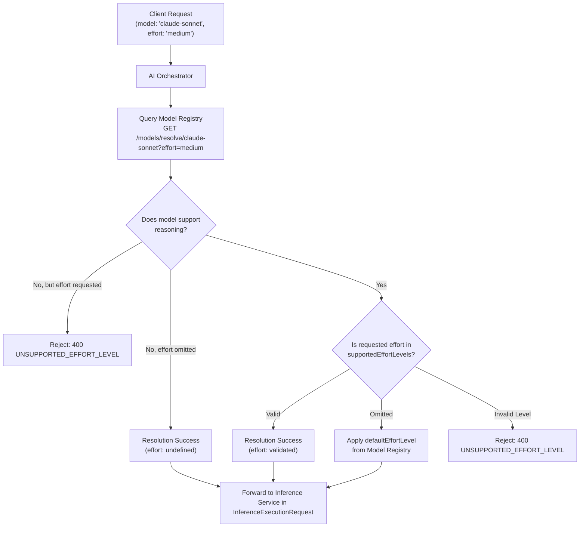

# OICUNT AI Platform Contract: AI Orchestrator Implementation Specification

**Document Version**: 1.0.0  
**Status**: Authoritative Architectural Contract  
**Classification**: Engineering Architecture Standard

---

## 1. Executive Summary & System Role

The **AI Orchestrator** (`services/orchestrator` / `services/ai-orchestrator`) is the singular, authoritative **application-level execution coordinator** between product applications (such as **BILLY** and future enterprise product backends) and the **OICUNT AI Platform**.

It provides high-level AI interaction orchestration: prompt composition, multi-turn conversation assembly, request lifecycle governance, streaming delivery, deadline budgeting, and downstream execution coordination.

```
┌────────────────────────────────────────────────────────────────────────┐
│                        BILLY (Product Application)                     │
│               • User Interface • Model Picker • Chat UI                │
└───────────────────────────────────┬────────────────────────────────────┘
                                    │ 0. GET /internal/v1/catalog (Discovery)
                                    │ 1. POST /internal/v1/orchestrator/chat
                                    │    (model: 'claude-sonnet', effort: 'medium')
                                    ▼
┌────────────────────────────────────────────────────────────────────────┐
│                            AI Orchestrator                             │
│                                                                        │
│   • Multi-Turn Context Coordination      • Model Identity Preservation │
│   • Request Validation & Token Limits    • Streaming Aggregation (SSE) │
│   • Lifecycle Cancellation & Deadlines   • Telemetry & Cost Accounting │
└───────────────────┬────────────────────────────────┬───────────────────┘
                    │                                │
                    │ 2. GET /models/resolve         │ 3. POST /inference/execute
                    │    (model, effort)             │    (InferenceExecutionRequest)
                    ▼                                ▼
┌──────────────────────────────────────┐  ┌──────────────────────────────┐
│            Model Registry            │  │      Inference Service       │
│           (Control Plane)            │  │     (Runtime Execution)      │
│  • Canonical Model Catalog           │  │  • Normalized Ingress        │
│  • Capabilities & Limit Validation   │  │  • Lifecycle Hooks & TTFT    │
│  • Eligible Provider Targets         │  │  • Privacy Redaction         │
│  • Routing Policy Configuration      │  │  • Deadline & Cancellation   │
└──────────────────────────────────────┘  └──────────────┬───────────────┘
                                                         │ 4. POST /models/dispatch
                                                         ▼
┌────────────────────────────────────────────────────────────────────────┐
│                       Model Gateway (Data Plane)                       │
│                                                                        │
│   • Provider Egress Boundary             • Circuit Breakers            │
│   • In-Target Retries & Jitter Backoff   • Dynamic Target Failover     │
└───────────────────────────────────┬────────────────────────────────────┘
                                    │ 5. Dispatches via Provider Adapter
                                    ▼
┌────────────────────────────────────────────────────────────────────────┐
│                   Provider Adapter Anti-Corruption Layer               │
│               Anthropic • OpenAI • Google Gemini • Bedrock             │
└───────────────────────────────────┬────────────────────────────────────┘
                                    │ 6. Vendor Wire Protocol / SDK
                                    ▼
┌────────────────────────────────────────────────────────────────────────┐
│                        Upstream Model Providers                        │
└────────────────────────────────────────────────────────────────────────┘
```

### 1.1 The Architectural Boundary Matrix: Orchestrator vs. Registry vs. Inference vs. Gateway

The platform enforces a strict separation of concerns across the core AI subsystems:

| Subsystem             | Architectural Role                               | Core Question Owned                                                                                                       | Data Owned                                                                                                   |
| :-------------------- | :----------------------------------------------- | :------------------------------------------------------------------------------------------------------------------------ | :----------------------------------------------------------------------------------------------------------- |
| **AI Orchestrator**   | **Application-Level Interaction Coordinator**    | **WHAT interaction should happen?**<br/>How is the prompt structured, streamed, and coordinated?                          | Multi-turn conversational context, turn state, client cancellation signals, aggregated usage.                |
| **Model Registry**    | **Control-Plane Catalog & Resolution Authority** | **WHAT models and targets exist?**<br/>What are their limits, capabilities, and configurations?                           | Canonical model definitions, semantic versions, eligible provider targets, pricing tables, routing policies. |
| **Inference Service** | **Inference-Runtime Execution Coordinator**      | **WHEN & HOW is inference coordinated at runtime?**<br/>How is the execution lifecycle governed, measured, and sanitized? | Inference execution lifecycle, TTFT tracking, privacy redaction, deadline & cancellation propagation.        |
| **Model Gateway**     | **Data-Plane Egress & Execution Engine**         | **HOW is the selected model executed against providers?**<br/>Which healthy provider target executes the request?         | Provider credentials, network sockets, retry budgets, circuit breakers, vendor error normalization.          |

```mermaid
sequenceDiagram
    autonumber
    actor User
    participant BILLY as BILLY (Client Application)
    participant APIGW as Platform API Gateway
    participant Orch as AI Orchestrator
    participant Reg as Model Registry (Control Plane)
    participant Inf as Inference Service (Runtime Plane)
    participant MGW as Model Gateway (Data Plane)
    participant Adapter as Provider Adapter
    participant Upstream as Upstream Model Provider

    User->>BILLY: Enters prompt (Selects 'Claude Sonnet', Effort: 'medium')
    BILLY->>APIGW: POST /api/v1/ai/completions (model: "claude-sonnet", effort: "medium")
    APIGW->>Orch: POST /internal/v1/orchestrator/chat (Headers: X-User-ID, X-Tenant-ID, X-Correlation-ID)
    Note over Orch: Validates messages, estimates context window,<br/>preserves user-selected canonical model identity
    Orch->>Reg: GET /internal/v1/models/resolve/claude-sonnet?effort=medium
    Note over Reg: Validates canonical model & effort capability<br/>Resolves eligible provider targets & limits
    Reg-->>Orch: 200 OK (ModelResolutionResponse)
    Note over Orch: Assembles InferenceExecutionRequest<br/>Calculates turn deadline & timeout
    Orch->>Inf: POST /internal/v1/inference/execute (InferenceExecutionRequest)
    Note over Inf: Evaluates lifecycle hooks, enforces deadlines,<br/>propagates cancellation signals
    Inf->>MGW: POST /internal/v1/models/dispatch (GatewayDispatchPayload)
    Note over MGW: Evaluates circuit breakers, attempts primary target,<br/>retries or falls back across eligible targets
    MGW->>Adapter: execute(ProviderExecutionRequest)
    Adapter->>Upstream: Vendor Wire Request / Stream
    Upstream-->>Adapter: Vendor Response Chunks / SSE
    Adapter-->>MGW: NormalizedCompletionData / StreamEvent SSE
    MGW-->>Inf: NormalizedCompletionData / StreamEvent SSE
    Note over Inf: Measures TTFT, latency, token throughput;<br/>applies reasoning privacy filtering
    Inf-->>Orch: InferenceExecutionResponse / StreamEvent SSE
    Note over Orch: Aggregates turn tokens, latency, cost;<br/>forwards normalized events to caller
    Orch-->>APIGW: Normalized Stream / Response
    APIGW-->>BILLY: Normalized Stream / Response
    BILLY-->>User: Renders assistant completion in real time
```

---

## 2. Component Responsibilities & Non-Responsibilities

### 2.1 Core Responsibilities

The AI Orchestrator authoritatively owns:

1. **Product Execution Ingress**: Serving as the unified AI execution entrypoint for BILLY and product services via `POST /internal/v1/orchestrator/chat`.
2. **Model Identity & Effort Preservation**: Retaining the user's selected canonical model identity (`claude-sonnet`, `claude-opus`, `gpt-4o`, `gemini-pro`, etc.) and validated reasoning effort (`low`, `medium`, `high`) throughout the entire execution pipeline without arbitrary model replacement.
3. **Model Registry Resolution**: Querying the Model Registry control plane (`GET /internal/v1/models/resolve/:id`) to retrieve approved target bindings, token bounds, and routing policies before execution.
4. **Resolution Caching**: Maintaining a local, short-lived, in-memory L1 resolution cache (TTL: 30–60 seconds) to minimize control-plane latency on rapid consecutive turns.
5. **Preflight Context Window Estimation**: Performing bounded preflight context-window estimation against limits provided by Model Registry (`contextWindowTokens`, `maxOutputTokens`) without importing provider-specific tokenizers, rejecting blatantly oversized dispatches early while leaving runtime execution to Inference and actual execution authority to the Model Gateway.
6. **Execution Budget & Deadline Management**: Establishing overall conversational turn deadlines (`deadlineMs`) and propagating them into downstream `InferenceExecutionRequest.deadlineMs`.
7. **Client Cancellation Propagation**: Listening for client HTTP disconnect events (`req.on('close')`) and immediately propagating `AbortSignal` downstream to cancel Inference Service execution (which in turn terminates Model Gateway provider execution).
8. **Inference Execution Dispatch**: Dispatching validated execution payloads exclusively to the **Inference Service** (`POST /internal/v1/inference/execute`) as its sole downstream runtime boundary. The Orchestrator does **not** call Model Gateway directly.
9. **Real-Time Streaming Delivery**: Consuming Server-Sent Events (`StreamEvent`) from the Inference Service and streaming normalized chunks (`token`, `thinking`, `tool_call`, `finish`, `error`) downstream to client applications.
10. **Execution Usage Propagation & Turn Telemetry**: Carrying and propagating normalized execution token usage (`TokenUsage`) received from the downstream pipeline, calculating turn-level estimated cost from Model Registry pricing tables for telemetry and span transparency, without owning durable usage storage or company-wide billing accounting.
11. **Error Normalization**: Mapping Model Registry and Inference Service errors to unified, secure product error payloads without leaking internal infrastructure details or provider secrets.

### 2.2 Explicit Non-Responsibilities

The AI Orchestrator strictly **does NOT** own:

1. **NO Direct Provider Calls**: The Orchestrator **never** initiates network connections to third-party model providers (Anthropic, OpenAI, Google, AWS Bedrock).
2. **NO Direct Model Gateway Calls**: The Orchestrator does **NOT** call the Model Gateway directly. The Model Gateway sits strictly behind the Inference Service in the execution pipeline (`Orchestrator → Inference → Model Gateway`).
3. **NO Provider Credentials**: The Orchestrator **never** loads, stores, or manages provider API keys, tokens, or IAM credentials.
4. **NO Provider SDKs or Tokenizers**: The Orchestrator **never** imports `@anthropic-ai/sdk`, `openai`, `@google/genai`, `@aws-sdk/client-bedrock-runtime`, or vendor-specific tokenizer libraries (`tiktoken`, etc.). Context window estimation is approximate unless an OICUNT-owned tokenizer is available, and must not leak vendor implementation details.
5. **NO Model Catalog Authority**: The Orchestrator **never** defines, persists, or mutates canonical model definitions, semantic versions, pricing tables, or capability flags (owned solely by Model Registry).
6. **NO Provider Target Routing or Circuit Breaking**: The Orchestrator **never** tracks provider target health, calculates circuit breaker error rates, executes target retries, or determines vendor failover (owned solely by Model Gateway behind Inference).
7. **NO Runtime Hooks or TTFT Tracking**: The Orchestrator does not execute inference runtime hooks or measure raw time-to-first-token (TTFT) metrics (owned by Inference Service).
8. **NO Persistent Conversation Database**: The Orchestrator does **not** introduce a shared mega database to store long-term chat threads or message histories. Persistent conversation state belongs to product services or the dedicated future `services/memory`.
9. **NO Durable Usage Aggregation or Billing Accounting**: The Orchestrator does **NOT** own durable company-wide usage aggregation or billing accounting. The Model Gateway supplies normalized execution usage, and the Orchestrator propagates it on the active turn. Authoritative, durable usage aggregation across tenants and billing-related usage accounting are owned exclusively by the future **Platform Usage** service in the company platform repository (`platform`). (Note: The Platform Usage service is not implemented now).
10. **NO Company Platform Concerns**: The Orchestrator **never** implements user password authentication, subscription verification, payment processing, or public ingress routing (owned by Company Platform).
11. **NO Embedded Tool Sandboxes or MCP Hosts**: The Orchestrator coordinates tool definitions in messages, but does **not** execute arbitrary code sandboxes or maintain direct MCP transport connections (delegated to future `services/tools` and `services/mcp`).

### 2.3 Architectural Responsibility Matrix

| Concern / Capability           | BILLY (Product) |       AI Orchestrator       | Model Registry  |    Inference Service     |        Model Gateway        | Provider Adapter | Upstream Provider |
| :----------------------------- | :-------------: | :-------------------------: | :-------------: | :----------------------: | :-------------------------: | :--------------: | :---------------: |
| **Model Picker UI**            |    **Owns**     |          Consumes           | Exposes Catalog |         Ignorant         |          Ignorant           |     Ignorant     |     Ignorant      |
| **Model Identity Authority**   |     Selects     |          Preserves          |    **Owns**     |        Preserves         |          Consumes           |     Ignorant     |     Ignorant      |
| **Reasoning Effort Selection** |     Selects     |          Preserves          |    Validates    |        Preserves         |          Consumes           |    Translates    |     Executes      |
| **Prompt Assembly**            |    Prepares     |       **Coordinates**       |    Ignorant     |         Ignorant         |         Dispatches          |     Ignorant     |     Ignorant      |
| **Context Window Validation**  |    Optional     | Preflight Estimate (Approx) | Defines Limits  | Runtime Parameter Bounds | **Authoritative Execution** |     Ignorant     |     Enforces      |
| **Target Resolution**          |    Ignorant     |           Invokes           |    **Owns**     |       Pass-Through       |          Consumes           |     Ignorant     |     Ignorant      |
| **Inference Execution**        |    Ignorant     |      Coordinates Turn       |    Ignorant     | **Coordinates Runtime**  |  **Owns Provider Egress**   |     Executes     |     Ignorant      |
| **Runtime Hooks & TTFT**       |    Ignorant     |          Ignorant           |    Ignorant     |         **Owns**         |          Ignorant           |     Ignorant     |     Ignorant      |
| **Provider Credentials**       |    Forbidden    |          Forbidden          |    Forbidden    |        Forbidden         |           Manages           |   **Injects**    |     Verifies      |
| **Circuit Breakers & Retries** |    Ignorant     |          Ignorant           |    Ignorant     |  Zero Mid-Stream Retry   |          **Owns**           |     Executes     |     Ignorant      |
| **Stream Chunk Translation**   |     Renders     |           Relays            |    Ignorant     | Filters Privacy & Relays |         Normalizes          |  **Translates**  |     Generates     |
| **Execution Token Usage**      |     Renders     |   **Propagates Metadata**   | Pricing Tables  |    Conveys Telemetry     | **Normalizes from Adapter** |      Counts      |     Measures      |
| **Durable Usage & Billing**    | Consumes Quotas |          Ignorant           |    Ignorant     |         Ignorant         |          Ignorant           |     Ignorant     |     Ignorant      |

_(Note: Authoritative durable usage aggregation and billing accounting are owned exclusively by the future Platform Usage service in `platform`)_

---

## 3. Inbound Request / Response Contracts

The AI Orchestrator exposes a clean, transport-independent HTTP API for product consumption under `/internal/v1/orchestrator`.

### 3.1 Chat Completion Endpoint

```http
POST /internal/v1/orchestrator/chat HTTP/1.1
Host: ai-orchestrator.service.internal:8080
Content-Type: application/json; charset=utf-8
Accept: application/json, text/event-stream
X-Service-Name: billy-api
X-Actor-ID: usr_9a8b7c6d5e4f
X-User-ID: usr_9a8b7c6d5e4f
X-Tenant-ID: ten_enterprise_alpha
X-Correlation-ID: 7f1c9d24-8b3e-4a67-9c12-3e4f5a6b7c8d
Authorization: Bearer <internal-service-token>
```

### 3.2 Request Schema (`OrchestratorChatRequest`)

```typescript
import type {
  CanonicalModelId,
  ModelInvocationParameters,
  ReasoningEffortLevel,
} from '@oicunt-ai/model-types';
import type { ChatMessage } from '@oicunt-ai/ai-types';

/**
 * Inbound chat execution payload received by the AI Orchestrator from product callers.
 */
export interface OrchestratorChatRequest {
  /**
   * The user-selected canonical model identity (e.g. 'claude-sonnet', 'claude-opus', 'gpt-4o', 'gemini-pro').
   * Required. The Orchestrator will resolve this model through the Model Registry and preserve its identity.
   */
  readonly model: CanonicalModelId;

  /**
   * Multi-turn chat message history forming the prompt context.
   * Required. Must contain at least one message.
   */
  readonly messages: readonly ChatMessage[];

  /**
   * Optional system instructions. When provided, the Orchestrator safely injects or prepends
   * this instruction into the canonical message list.
   */
  readonly systemPrompt?: string | undefined;

  /**
   * User-selected reasoning effort level ('low' | 'medium' | 'high').
   * Optional. If omitted, the Orchestrator defers to the model's default effort level configured in Model Registry.
   */
  readonly effort?: ReasoningEffortLevel | undefined;

  /**
   * Standard invocation hyperparameters (temperature, topP, maxTokens, stopSequences).
   * Optional.
   */
  readonly parameters?: ModelInvocationParameters | undefined;

  /**
   * Whether the client requests real-time Server-Sent Events (SSE) streaming.
   * Defaults to false (unary JSON response).
   */
  readonly stream?: boolean | undefined;

  /**
   * Multi-turn conversational session identifier.
   * Optional. Passed through to telemetry, audit, and future memory stores.
   */
  readonly conversationId?: string | undefined;

  /**
   * Lineage identifier for branching conversation trees.
   * Optional.
   */
  readonly parentMessageId?: string | undefined;

  /**
   * Tool definitions available for model invocation (JSON Schema format).
   * Optional. Supported only when model capabilities declare toolCalling: true.
   */
  readonly tools?: readonly OrchestratorToolDefinition[] | undefined;

  /**
   * Client-requested maximum execution duration in milliseconds.
   * Optional. Capped at the platform maximum (e.g., 300,000ms).
   */
  readonly timeoutMs?: number | undefined;

  /**
   * Arbitrary caller metadata passed through for distributed tracing and auditing.
   * Optional.
   */
  readonly metadata?: Record<string, unknown> | undefined;
}

/**
 * Tool definition structure passed into the Orchestrator.
 */
export interface OrchestratorToolDefinition {
  readonly name: string;
  readonly description: string;
  readonly parameters: Record<string, unknown>; // JSON Schema
  readonly isReadOnly?: boolean | undefined;
}
```

### 3.3 Unary Response Schema (`OrchestratorChatResponse`)

When `stream` is `false` (or omitted), the Orchestrator returns a standard OICUNT HTTP envelope:

```typescript
import type { CanonicalModelId, ReasoningEffortLevel, TokenUsage } from '@oicunt-ai/model-types';
import type { ChatMessage, FinishReason } from '@oicunt-ai/ai-types';

/**
 * Standard HTTP response envelope for unary chat execution.
 */
export interface OrchestratorChatResponse {
  readonly success: true;
  readonly data: OrchestratorChatData;
  readonly meta: {
    readonly requestId: string;
    readonly correlationId: string;
    readonly timestamp: string;
  };
}

/**
 * Normalized chat completion data returned from the Orchestrator.
 */
export interface OrchestratorChatData {
  /** The generated assistant message */
  readonly message: ChatMessage;

  /** Normalized completion termination reason ('stop', 'length', 'tool_calls', 'content_filter') */
  readonly finishReason: FinishReason;

  /** Detailed token accounting for the turn */
  readonly usage: TokenUsage;

  /** The canonical model that executed the completion */
  readonly model: CanonicalModelId;

  /** The resolved semantic version executed (e.g. 'v1.0.0') */
  readonly version: string;

  /** The effective reasoning effort applied (if reasoning was utilized) */
  readonly effort?: ReasoningEffortLevel | undefined;

  /** Unique completion identifier generated by the execution layer */
  readonly completionId: string;

  /** Conversational session identifier */
  readonly conversationId?: string | undefined;

  /** Total elapsed turn execution latency in milliseconds */
  readonly turnLatencyMs: number;

  /** Estimated turn cost in USD based on Model Registry pricing tables */
  readonly estimatedCostUsd?: number | undefined;
}
```

### 3.4 Streaming Response Schema (Server-Sent Events)

When `stream: true` (or `Accept: text/event-stream`), the endpoint streams UTF-8 Server-Sent Events conforming to the canonical `StreamEvent` standard:

```http
HTTP/1.1 200 OK
Content-Type: text/event-stream; charset=utf-8
Cache-Control: no-cache, no-transform
Connection: keep-alive
X-Request-ID: req_4a1b2c3d-e4f5-6789-abcd-ef0123456789
X-Correlation-ID: 7f1c9d24-8b3e-4a67-9c12-3e4f5a6b7c8d

event: token
data: {"delta":"The"}

event: token
data: {"delta":" capital"}

event: token
data: {"delta":" of France is Paris."}

event: finish
data: {"finishReason":"stop","usage":{"promptTokens":18,"completionTokens":7,"totalTokens":25},"completionId":"compl_8a7b6c5d","model":"claude-sonnet","version":"v1.0.0"}
```

---

## 4. Model Selection & Identity Preservation

### 4.1 Canonical Identity Preservation Invariant

> [!IMPORTANT]
> **The AI Orchestrator must NEVER silently swap or replace the user-selected model.**  
> If the user selects `claude-sonnet`, the Orchestrator coordinates execution exclusively for `claude-sonnet`. It must **never** swap `claude-sonnet` for `gpt-4o` or any other model lineage, regardless of provider availability, unless an explicit, future enterprise product policy explicitly directs such degradation.

#### Why Model Identity Preservation is Required:

1. **Prompt & Behavior Discrepancies**: Different model families interpret system instructions, formatting guidelines, XML tags, and reasoning tokens differently. A prompt optimized for Claude Sonnet may degrade or fail on GPT-4o.
2. **Deterministic User Expectations**: Users and product workflows explicitly select models based on coding style, tone, context window size, or reasoning characteristics.
3. **Transparent Target Failover within the Gateway**: Target redundancy is solved at the **provider target level** inside the Model Gateway behind the Inference Service (e.g. Anthropic direct &rarr; AWS Bedrock fallback for `claude-sonnet`), maintaining 100% model fidelity without cross-vendor substitution.

### 4.2 Dynamic Catalog Discovery Integration

Product applications (BILLY) dynamically query the Model Registry's public catalog endpoint:

```http
GET /internal/v1/catalog?selectableOnly=true HTTP/1.1
```

The client UI renders model cards and effort options dynamically based on the returned `ModelCatalogEntry[]`. When the user makes a selection, BILLY passes the canonical model identifier (`claude-sonnet`) and effort (`medium`) directly to the Orchestrator.

### 4.3 Handling Model Availability Lifecycle States

The Orchestrator evaluates the model's `status` returned during resolution:

- **`available`**: Normal execution.
- **`degraded`**: Execution proceeds; Orchestrator attaches a warning header (`X-Model-Degraded: true`) and logs a degradation alert.
- **`maintenance`**: Execution is rejected immediately with HTTP 503 `MODEL_IN_MAINTENANCE`. The Orchestrator does not attempt fallback to an arbitrary model.
- **`deprecated`**: Execution is rejected with HTTP 410 `MODEL_DEPRECATED`, instructing the client to select an active model from the catalog.

---

## 5. Reasoning Effort Selection & Governance

### 5.1 Effort as a First-Class Execution Parameter

Reasoning effort is a runtime execution parameter and a dynamic model capability, **NOT** a distinct model identity.

- Supported canonical effort levels: `'low' | 'medium' | 'high'`.
- Models without reasoning capabilities declare `capabilities.reasoning: false`.
- Models supporting reasoning declare `capabilities.supportedEffortLevels: ['low', 'medium', 'high']` and an optional `capabilities.defaultEffortLevel`.

### 5.2 Resolution & Enforcement Flow



The validated effort is forwarded in `InferenceExecutionRequest.effort`. The downstream pipeline forwards this to Model Gateway whose provider adapter translates this normalized effort into vendor-specific structures (e.g. Anthropic `budget_tokens`, OpenAI `reasoning_effort`).

---

## 6. Model Registry Interaction (Control Plane)

The AI Orchestrator communicates with the Model Registry via internal HTTP REST:

### 6.1 Resolution Request

```http
GET /internal/v1/models/resolve/claude-sonnet?effort=medium HTTP/1.1
Host: model-registry.service.internal:8081
X-Service-Name: ai-orchestrator
X-Actor-ID: ai-orchestrator-worker
X-Tenant-ID: ten_enterprise_alpha
X-Correlation-ID: 7f1c9d24-8b3e-4a67-9c12-3e4f5a6b7c8d
Authorization: Bearer <internal-service-token>
```

### 6.2 L1 In-Memory Resolution Cache

To prevent redundant network roundtrips during conversational back-and-forth, the Orchestrator maintains an in-memory L1 cache:

- **Cache Key**: `${canonicalModelId}:${version ?? 'active'}:${effort ?? 'none'}:${tenantId ?? 'global'}`
- **TTL**: 30 to 60 seconds (configurable).
- **Max Cache Size**: 1,000 entries with Least-Recently-Used (LRU) eviction.
- **Negative Caching**: Transient errors (500, network timeouts) are **never** cached.
- **Bypass**: Requests carrying `Cache-Control: no-cache` bypass L1 cache and force fresh resolution.

### 6.3 Handling Registry Resolution Failures

If the Model Registry is unreachable or returns an error:

- **HTTP 404 (`MODEL_NOT_FOUND`)**: Orchestrator immediately returns HTTP 404 to caller with `MODEL_NOT_FOUND`.
- **HTTP 400 (`UNSUPPORTED_EFFORT_LEVEL`)**: Orchestrator returns HTTP 400 to caller with validation details.
- **HTTP 503 (`NO_ELIGIBLE_TARGETS`)**: Orchestrator returns HTTP 503 indicating that all execution targets for the model are cordoned.
- **Network Timeout / 500**: Orchestrator performs up to 2 retries with short backoff (50ms, 100ms). If still unavailable, returns HTTP 503 `REGISTRY_UNAVAILABLE`.

---

## 7. Inference Service Interaction (Runtime Execution Plane)

The **Inference Service** (`services/inference`) is the authoritative inference-runtime coordination layer and the sole downstream execution boundary invoked by the AI Orchestrator. The Model Gateway sits strictly behind the Inference Service (`Orchestrator → Inference → Model Gateway`) and is never called directly by the Orchestrator.

### 7.1 Execution Invocation

```http
POST /internal/v1/inference/execute HTTP/1.1
Host: inference.service.internal:8084
Content-Type: application/json; charset=utf-8
Accept: application/json, text/event-stream
X-Service-Name: ai-orchestrator
X-Actor-ID: ai-orchestrator-worker
X-Tenant-ID: ten_enterprise_alpha
X-Correlation-ID: 7f1c9d24-8b3e-4a67-9c12-3e4f5a6b7c8d
X-Request-ID: req_4a1b2c3d-e4f5-6789-abcd-ef0123456789
Authorization: Bearer <internal-service-token>
```

### 7.2 Payload Construction (`InferenceExecutionRequest`)

The Orchestrator packages the resolved metadata, conversational context, and execution constraints into the standard `InferenceExecutionRequest` consumed by the Inference Service:

```typescript
const inferenceRequest: InferenceExecutionRequest = {
  requestId: context.requestId,
  correlationId: context.correlationId,
  conversationId: request.conversationId,
  canonicalModelId: resolution.canonicalModelId,
  version: resolution.version,
  messages: assembledMessages,
  parameters: request.parameters,
  effort: resolution.effort,
  tools: request.tools,
  stream: Boolean(request.stream),
  limits: resolution.limits,
  pricing: resolution.pricing,
  eligibleTargets: resolution.eligibleTargets,
  routingPolicy: resolution.routingPolicy,
  privacyPolicy: {
    exposeReasoning: request.privacyPolicy?.exposeReasoning ?? true,
    redactThinking: request.privacyPolicy?.redactThinking ?? false,
    redactThinkingInLogs: true,
  },
  tenantId: context.tenantId,
  userId: context.userId,
  actorId: context.actorId,
  metadata: request.metadata,
  deadlineMs: turnBudget.deadlineMs,
};
```

### 7.3 Unary Response Processing (`InferenceExecutionResponse`)

When `stream: false`, the Inference Service returns a standard response envelope containing normalized `InferenceResultData`:

```typescript
const response: InferenceExecutionResponse = await inferenceClient.executeUnary(
  inferenceRequest,
  abortController.signal,
);

const resultData = response.data;
```

---

## 8. Streaming Architecture & Protocols

### 8.1 Server-Sent Events Protocol

Streaming requests establish a chunked HTTP/1.1 connection with `Content-Type: text/event-stream`. The Orchestrator consumes events from the Inference Service and pipelines them to the client.

```
Model Gateway SSE Stream ──► Inference Service Stream ──► Orchestrator Pipeline ──► Product (BILLY) SSE Stream
       (StreamEvent)             (TTFT, Privacy Filter)         (Inspect & Audit)               (StreamEvent)
```

### 8.2 Stream Event Sequence & Payloads

1. **`event: thinking`**:
   - Emitted during reasoning phases for models supporting extended thinking.
   - Payload: `{ "delta": "string" }`
   - Privacy Governance: Tenants may configure policies to redact or preserve thinking deltas.
2. **`event: token`**:
   - Emitted for generated content tokens.
   - Payload: `{ "delta": "string" }`
3. **`event: tool_call`**:
   - Emitted when the model constructs a structured tool call invocation.
   - Payload: `{ "id": "call_123", "name": "get_weather", "argumentChunk": "{\"location\":\"Paris\"" }`
4. **`event: finish`**:
   - Terminal success event signaling completion of generation.
   - Payload: `{ "finishReason": "stop", "usage": { ... }, "completionId": "compl_abc", "model": "claude-sonnet" }`
5. **`event: error`**:
   - Terminal failure event emitted when an in-flight stream fails.
   - Payload: `{ "code": "STREAM_INTERRUPTED", "message": "Upstream connection dropped." }`

### 8.3 Zero Mid-Stream Retry Invariant

> [!IMPORTANT]
> **Once the first event (`token`, `thinking`, `tool_call`) is emitted to the client, NO RETRY OR TARGET FAILOVER IS PERMITTED.**  
> If an upstream target drops mid-stream, the Model Gateway terminates the stream with an `error` event. The Inference Service enforces the Zero Mid-Stream Retry Invariant and relays the error event. The Orchestrator forwards the error event and terminates the HTTP connection. Retrying after partial token emission would cause duplicated, corrupt, or hallucinatory user responses.

---

## 9. Cancellation & Disconnect Propagation

### 9.1 Lifecycle Propagation Flow

```mermaid
sequenceDiagram
    actor User
    participant BILLY as BILLY Client
    participant Orch as AI Orchestrator
    participant Inf as Inference Service
    participant MGW as Model Gateway
    participant Upstream as Upstream Provider

    User->>BILLY: Clicks "Stop Generation" / Closes Tab
    BILLY->>Orch: Aborts HTTP Connection (TCP FIN / RST)
    Note over Orch: req.on('close') triggers internal AbortController
    Orch->>Inf: Aborts HTTP Inference Request (AbortSignal)
    Note over Inf: Propagates AbortSignal downstream
    Inf->>MGW: Aborts HTTP Dispatch Request (AbortSignal)
    Note over MGW: Cancels upstream fetch, aborts backoff timer
    MGW->>Upstream: Aborts Provider Socket / Stream
    Note over Orch,Inf,MGW: Releases buffers, records finishReason: 'cancelled',<br/>marks OpenTelemetry span status: CANCELLED
```

### 9.2 Implementation Invariants

- The Orchestrator binds an `AbortController` to the inbound HTTP request socket (`req.on('close')`).
- If the socket closes before `res.writableEnded` is true, the `AbortController.abort()` signal fires immediately.
- The `AbortSignal` is passed to the downstream Inference Service HTTP client call (`HttpInferenceClient`).
- Cancelled turns return resources immediately, record `finishReason: 'cancelled'`, and finalize telemetry spans without logging false error alerts.

---

## 10. Deadlines and Execution Budgets

The platform enforces a layered timeout hierarchy:

```
┌────────────────────────────────────────────────────────────────────────┐
│ Client Request Timeout (e.g., BILLY Client: 120,000ms)                 │
├────────────────────────────────────────────────────────────────────────┤
│  ▼                                                                     │
│ Orchestrator Turn Execution Budget (deadlineMs = startTime + 115,000ms)│
│  ├── Registry Resolution Budget (Max: 3,000ms)                         │
│  └── Inference Runtime Budget (deadlineMs passed in InferenceExecution)│
│       └── Model Gateway Execution Budget (deadlineMs in Dispatch)      │
│            ├── Target 1 Execution (Provider Timeout: 60,000ms)         │
│            └── Target 2 Failover (Remaining Budget before deadlineMs)  │
└────────────────────────────────────────────────────────────────────────┘
```

1. **Client Timeout**: Client may supply `timeoutMs` in `OrchestratorChatRequest`. If omitted, default is `120,000ms` (capped at max `300,000ms`).
2. **Orchestrator Turn Deadline**: `deadlineMs = Date.now() + effectiveTimeoutMs`.
3. **Propagation to Inference Service**: `deadlineMs` is passed directly in `InferenceExecutionRequest.deadlineMs`. The Inference Service validates that the deadline is in the future, binds timeout controls, and passes the budget downstream to Model Gateway.
4. **Deadline Expiration**: If the deadline expires at any point, execution terminates immediately with HTTP 504 `INFERENCE_TIMEOUT`.

---

## 11. Context & Message Handling

### 11.1 Message Structure & Roles

The Orchestrator strictly models messages using `@oicunt-ai/ai-types`:

- **`system`**: System-level directives, guardrails, and role assignments.
- **`user`**: User inputs and multimodal prompt components.
- **`assistant`**: Model responses, reasoning thoughts, and tool call requests.
- **`tool`**: Tool execution results corresponding to a preceding assistant `tool_call`.

### 11.2 Multimodal Support

Messages support polymorphic parts via `MessageContentPart`:

- `TextPart`: Plain text strings (`type: 'text'`).
- `ImagePart`: Base64-encoded or URI-referenced images (`type: 'image'`).
- `ToolCallPart`: Tool invocations requested by the model (`type: 'tool_call'`).
- `ToolResultPart`: Tool execution outcomes (`type: 'tool_result'`).
- `ThinkingPart`: Extended thinking reasoning blocks (`type: 'thinking'`).

### 11.3 System Prompt Harmonization

If the client supplies `systemPrompt: string` in `OrchestratorChatRequest`, the Orchestrator harmonizes the conversation:

- If `messages[0]` is already a `system` message, the Orchestrator appends the prompt to the existing system message with a double newline delimiter.
- If `messages[0]` is not a `system` message, the Orchestrator prepends a new `ChatMessage { role: 'system', content: systemPrompt }` at index 0.

### 11.4 Context Window Validation & Preflight Estimation

Before dispatching to the Inference Service, the Orchestrator performs a bounded, preflight context-window check to reject clearly oversized requests early and preserve platform bandwidth:

1. **Preflight Context Limit Bounds**: The Orchestrator evaluates the incoming conversation against `resolution.limits.contextWindowTokens` and `resolution.limits.maxOutputTokens` authoritatively defined and supplied by the Model Registry.
2. **Strict Prohibition on Provider Tokenizers**: The Orchestrator must **NOT** introduce provider-specific tokenizers (such as `tiktoken`, Hugging Face tokenizers, or Anthropic/Google tokenizer SDKs) or any vendor SDK dependencies. Importing provider tokenization libraries into the Orchestrator violates the anti-corruption boundary and couples the coordinator to vendor release cycles.
3. **Approximate Estimation Semantics**: Token estimation in the Orchestrator is explicitly approximate unless an OICUNT-owned, provider-neutral tokenizer library is made available in `@oicunt-ai/*`. The Orchestrator employs lightweight, bounded heuristics (e.g., standard character-to-token approximations such as ~4 characters per token for Latin text, plus fixed token bounds for images and structured tool definitions).
4. **Downstream Execution Authority**: The **downstream execution engine (Model Gateway behind Inference) remains authoritative for actual provider execution**. If a prompt closely approaches the boundary and slips past the preflight heuristic, the downstream pipeline and upstream provider target will enforce the hard context boundary during execution, returning normalized error `CONTEXT_WINDOW_EXCEEDED`.
5. **No Provider Detail Leakage**: Context-window validation and estimation logic must **never** leak provider-specific implementation details, vendor encoding idiosyncrasies, or vendor-specific token budget formulas into the Orchestrator.
6. **Existing Error Behavior Preserved**: When the preflight token estimate (`estimatedPromptTokens + requestedMaxTokens`) decisively exceeds `resolution.limits.contextWindowTokens`, the Orchestrator immediately rejects the request with HTTP 400 `CONTEXT_WINDOW_EXCEEDED` and a sanitized error payload:

```json
{
  "success": false,
  "error": {
    "code": "CONTEXT_WINDOW_EXCEEDED",
    "message": "The combined message context exceeds the model context window limit of 200000 tokens.",
    "details": {
      "model": "claude-sonnet",
      "limit": 200000,
      "estimatedTokens": 215400
    }
  }
}
```

---

## 12. Identifier Taxonomy & Lineage

To ensure end-to-end auditability and traceability, identifiers are strictly structured across distinct architectural layers:

```
┌────────────────────────────────────────────────────────────────────────┐
│ conversationId: conv_8f9e0d1c-2b3a-4c5d-6e7f-8a9b0c1d2e3f (Session)    │
│  └── turnId: turn_3c4d5e6f-7a8b-9c0d-1e2f-3a4b5c6d7e8f (Exchange)      │
│       └── requestId: req_1a2b3c4d-5e6f-7a8b-9c0d-1e2f3a4b5c6d (HTTP)  │
│            └── completionId: compl_7d8e9f0a-1b2c-3d4e-5f6a-7b8c9d0e1f2a│
└────────────────────────────────────────────────────────────────────────┘
```

| Identifier            | Generation Point     | Scope                 | Description                                                                    |
| :-------------------- | :------------------- | :-------------------- | :----------------------------------------------------------------------------- |
| **`conversationId`**  | Product (BILLY)      | Multi-turn Session    | Identifies the conversational thread across multiple user/assistant exchanges. |
| **`parentMessageId`** | Product (BILLY)      | Message Branch        | Identifies the parent node in branching conversational trees.                  |
| **`turnId`**          | AI Orchestrator      | Single Turn           | Identifies one complete request-response exchange within a conversation.       |
| **`requestId`**       | Platform API Gateway | Inbound HTTP Request  | Tracks the specific HTTP request envelope through the service mesh.            |
| **`completionId`**    | Model Gateway        | Discrete LLM Artifact | Identifies the exact model generation produced by the provider adapter.        |
| **`correlationId`**   | Platform API Gateway | Distributed Trace     | Distributed tracing identifier propagated across all service hops.             |

---

## 13. Distributed Tracing & Correlation IDs

### 13.1 Correlation Propagation

Every inter-service call MUST propagate correlation metadata. If inbound requests lack correlation headers, the Orchestrator generates a UUID v4.

| Header Name        | Type    | Description                                                        |
| :----------------- | :------ | :----------------------------------------------------------------- |
| `X-Correlation-ID` | UUID v4 | Authoritative distributed trace correlation identifier.            |
| `X-Request-ID`     | UUID v4 | Individual HTTP transaction identifier.                            |
| `X-User-ID`        | String  | Authenticated user identity (e.g. `usr_12345`).                    |
| `X-Tenant-ID`      | String  | Enterprise organization/tenant identifier (e.g. `ten_enterprise`). |
| `X-Actor-ID`       | String  | Authenticated actor or service principal performing the request.   |
| `X-Service-Name`   | String  | Static calling service identifier (`ai-orchestrator`).             |

### 13.2 OpenTelemetry GenAI Span Conventions

The Orchestrator wraps every turn in an OpenTelemetry span conforming to `@oicunt-ai/observability`:

```typescript
const span = tracer.startSpan('orchestrator.chat_turn', {
  'gen_ai.system': resolution.family ?? 'custom',
  'gen_ai.request.model': request.model,
  'gen_ai.request.temperature': request.parameters?.temperature,
  'gen_ai.request.max_tokens': request.parameters?.maxTokens,
  'oicunt.canonical_model': resolution.canonicalModelId,
  'oicunt.model_version': resolution.version,
  'oicunt.effort': resolution.effort,
  'oicunt.conversation_id': request.conversationId,
  'oicunt.turn_id': turnId,
  'oicunt.correlation_id': context.correlationId,
});
```

---

## 14. Token Accounting & Cost Attribution Boundary

### 14.1 Usage Accounting Boundary & Responsibilities

The OICUNT AI Platform enforces a strict boundary between real-time execution telemetry and durable billing accounting:

1. **Model Gateway Provides Authoritative Execution Usage**: During execution, the upstream provider adapter extracts exact token metrics reported by the provider (or calculated by the adapter). The Model Gateway normalizes this into the platform-standard `TokenUsage` structure (`promptTokens`, `completionTokens`, `totalTokens`, `reasoningTokens`, `cachedTokens`) and returns it in `NormalizedCompletionData` or the terminal `finish` stream event.
2. **Orchestrator Carries and Propagates Usage Metadata**: The AI Orchestrator receives this normalized execution usage via the Inference Service from the Model Gateway and carries/propagates it downstream to product callers (in `OrchestratorChatData.usage` or SSE `finish` payload) and attaches it to OpenTelemetry spans (`orchestrator.chat_turn`).
3. **Orchestrator Does NOT Own Durable Usage Aggregation**: The Orchestrator does **NOT** maintain a database of historical token consumption, cumulative tenant quotas, or aggregated user metrics. It operates as an ephemeral turn coordinator.
4. **Orchestrator Does NOT Own Billing Accounting**: The Orchestrator does **NOT** manage invoices, subscription tier limits, credit debits, customer usage tracking, or financial ledgers.
5. **Future Platform Usage Service Owns Durable Aggregation & Billing Accounting**: Authoritative, durable company-wide usage aggregation, persistent tenant usage timeseries, and billing-related usage accounting are authoritatively owned by the future **Platform Usage** service residing in the company platform repository (`https://github.com/oicunt-ai/platform`).
6. **No Implementation of Usage Service Now**: The Platform Usage service belongs to the company platform architecture and is explicitly **not** implemented in this repository or at this time.

### 14.2 Turn-Level Execution Token Accounting

On a per-turn basis, the Orchestrator records and passes through the normalized `TokenUsage` reported by downstream execution:

- `promptTokens`: Total input tokens processed across the prompt and context messages.
- `completionTokens`: Output tokens generated by the assistant.
- `totalTokens`: Sum of input and completion tokens.
- `reasoningTokens`: Dedicated thinking/reasoning tokens consumed (for reasoning models).
- `cachedTokens`: Input tokens served from upstream prompt caches (where supported by the provider).

### 14.3 Turn-Level Estimated Cost Transparency

For immediate operational transparency, logging, and trace annotation, the Orchestrator calculates an estimated turn cost in USD using the pricing schedule supplied by the Model Registry:

$$\text{Cost} = \left(\frac{\text{promptTokens} - \text{cachedTokens}}{1\,000\,000} \times C_{\text{input}}\right) + \left(\frac{\text{cachedTokens}}{1\,000\,000} \times C_{\text{cached}}\right) + \left(\frac{\text{completionTokens}}{1\,000\,000} \times C_{\text{output}}\right)$$

Where $C_{\text{input}}$, $C_{\text{output}}$, and $C_{\text{cached}}$ are the rates per 1M tokens from `resolution.pricing`.

This estimated cost is attached to `OrchestratorChatData.estimatedCostUsd` and recorded in OpenTelemetry span attributes for real-time observability. It serves as operational telemetry, **not** an authoritative financial invoice or billing ledger entry.

---

## 15. Error Taxonomy & Propagation

### 15.1 Normalized Error Taxonomy

The AI Orchestrator defines a clean domain error taxonomy mapping internal failures to standardized HTTP responses:

| Error Code                    | HTTP Status | Retryable | Description / Root Cause                                                |
| :---------------------------- | :---------: | :-------: | :---------------------------------------------------------------------- |
| `INVALID_REQUEST`             |   **400**   |    No     | Malformed message structure, missing model, invalid parameters.         |
| `UNSUPPORTED_EFFORT_LEVEL`    |   **400**   |    No     | Model does not support reasoning or the requested effort level.         |
| `CONTEXT_WINDOW_EXCEEDED`     |   **400**   |    No     | Input messages exceed the canonical model's maximum context limit.      |
| `AUTHENTICATION_ERROR`        |   **401**   |    No     | Missing, invalid, or expired internal service authentication token.     |
| `FORBIDDEN`                   |   **403**   |    No     | Calling service is not authorized to invoke the Orchestrator.           |
| `MODEL_NOT_FOUND`             |   **404**   |    No     | The specified canonical model does not exist in the Model Registry.     |
| `MODEL_DEPRECATED`            |   **410**   |    No     | The specified model version has been permanently retired.               |
| `RATE_LIMIT_EXCEEDED`         |   **429**   |    Yes    | Upstream provider rate limits exhausted across all eligible targets.    |
| `REQUEST_CANCELLED`           |   **499**   |    No     | Client disconnected or closed connection before turn completed.         |
| `MODEL_IN_MAINTENANCE`        |   **503**   |    Yes    | The model or all its targets are currently marked for maintenance.      |
| `ALL_TARGETS_EXHAUSTED`       |   **503**   |    Yes    | All eligible provider targets failed execution (circuit broken / down). |
| `REGISTRY_UNAVAILABLE`        |   **503**   |    Yes    | Model Registry is unreachable or failing control-plane resolution.      |
| `INFERENCE_TIMEOUT`           |   **504**   |    Yes    | The request exceeded the configured execution deadline.                 |
| `INTERNAL_ORCHESTRATOR_ERROR` |   **500**   |    No     | Unexpected internal failure.                                            |

### 15.2 Error Masking & Information Leakage Prevention

> [!CAUTION]
> Under **NO circumstances** may raw provider error messages, upstream vendor HTTP status codes, provider API keys, database connection strings, or internal stack traces be returned to the client or embedded in error responses.

All errors are scrubbed and returned in the standard OICUNT error envelope:

```json
{
  "success": false,
  "error": {
    "code": "MODEL_IN_MAINTENANCE",
    "message": "The requested model is temporarily undergoing maintenance. Please select another model.",
    "details": {
      "model": "claude-sonnet"
    }
  },
  "meta": {
    "requestId": "req_12345",
    "correlationId": "7f1c9d24-8b3e-4a67-9c12-3e4f5a6b7c8d",
    "timestamp": "2026-10-05T14:30:00.000Z"
  }
}
```

---

## 16. Retry Responsibility Boundaries

### 16.1 Clear Layered Retry Boundaries

Retries are strictly segregated across platform tiers to prevent exponential retry storms:

```
┌────────────────────────────────────────────────────────────────────────┐
│ Client (BILLY): User-driven retry (Click "Regenerate" / Network Retry) │
├────────────────────────────────────────────────────────────────────────┤
│ AI Orchestrator: Retries ONLY control-plane Model Registry resolution  │
│                  NEVER retries an exhausted Inference Service execution│
├────────────────────────────────────────────────────────────────────────┤
│ Inference Service: Enforces Zero Mid-Stream Retry Invariant;           │
│                    passes through execution errors without re-dispatch │
├────────────────────────────────────────────────────────────────────────┤
│ Model Gateway: Retries transient provider errors (429, 503, Socket)    │
│                with exponential backoff and full jitter; executes      │
│                transparent failover to secondary targets               │
└────────────────────────────────────────────────────────────────────────┘
```

1. **Model Gateway Retries**: The Model Gateway (positioned behind Inference) authoritatively owns all execution-level retries and target failovers. When it returns `ALL_TARGETS_EXHAUSTED` or `RATE_LIMIT_EXCEEDED`, it has already exhausted all configured attempts and retry budgets across all targets.
2. **Inference Service Invariant**: The Inference Service enforces the Zero Mid-Stream Retry Invariant and relays normalized completion or failure events.
3. **Orchestrator Prohibitions**: The Orchestrator MUST NOT catch an `ALL_TARGETS_EXHAUSTED` or `RATE_LIMIT_EXCEEDED` error from the Inference Service and immediately dispatch to Inference again. Doing so violates the global retry budget and magnifies upstream thundering herds.
4. **Orchestrator Retry Scope**: The Orchestrator retries **only** transient network failures connecting to the Model Registry during the initial resolution query (up to 2 retries, 50ms/100ms backoff).

---

## 17. Security, Sandboxing & Trusted Identity

### 17.1 Perimeter Authentication & Trusted Metadata

1. **Perimeter Authentication**: Public user tokens (JWT, session cookies) terminate at the Platform API Gateway.
2. **Authoritative Headers**: Downstream AI services receive authoritative metadata (`X-User-ID`, `X-Tenant-ID`, `X-Actor-ID`) stamped exclusively by the platform ingress.
3. **Zero Direct User Access**: The AI Orchestrator is an internal microservice deployed inside the private service mesh; it is never exposed directly to public internet ingress.

### 17.2 Zero Provider Credential Principle

The Orchestrator contains zero provider API keys (Anthropic, OpenAI, Google) and zero cloud provider credentials. It cannot leak provider credentials because it does not possess them.

### 17.3 Non-Root Runtime Isolation

All Orchestrator container images run under unprivileged user permissions (`USER node`) with read-only root filesystems and strict memory limits.

---

## 18. Service-to-Service Authentication & Authorization

### 18.1 Internal Authentication

Inter-service requests to the Orchestrator MUST carry an internal authentication credential:

- Header: `Authorization: Bearer <internal-service-token>` or `X-Internal-Token: <token>`.
- Verified at HTTP middleware before routing to application interactors.

### 18.2 Service Whitelisting (`allowedServiceIdentities`)

The Orchestrator verifies that `X-Service-Name` belongs to an approved caller whitelist:

```typescript
const allowedServiceIdentities = [
  'platform-api-gateway',
  'billy-api',
  'ai-platform-admin',
  'agent-runner',
];
```

Calls originating from unknown services are rejected with HTTP 403 `FORBIDDEN`.

---

## 19. GenAI Observability & Metrics

### 19.1 Metric Definitions

The Orchestrator instruments operational metrics via `@oicunt-ai/observability`:

| Metric Name                           | Type      | Labels                      | Description                                                   |
| :------------------------------------ | :-------- | :-------------------------- | :------------------------------------------------------------ |
| `ai_orchestrator_requests_total`      | Counter   | `model`, `status`, `stream` | Total chat requests received.                                 |
| `ai_orchestrator_turn_duration_ms`    | Histogram | `model`, `status`           | End-to-end turn latency from request to finish.               |
| `ai_orchestrator_tokens_total`        | Counter   | `model`, `token_type`       | Total tokens processed (`prompt`, `completion`, `reasoning`). |
| `ai_orchestrator_cost_usd_total`      | Counter   | `model`, `tenant_id`        | Cumulative estimated inference cost in USD.                   |
| `ai_orchestrator_cancellations_total` | Counter   | `model`                     | Total requests aborted due to client disconnect.              |
| `ai_orchestrator_errors_total`        | Counter   | `model`, `error_code`       | Total failed chat executions by error code.                   |

### 19.2 Structured Logging

All log lines emit single-line JSON with context binding:

```json
{
  "timestamp": "2026-10-05T14:30:15.123Z",
  "level": "info",
  "service": "ai-orchestrator",
  "message": "Chat turn completed successfully",
  "correlationId": "7f1c9d24-8b3e-4a67-9c12-3e4f5a6b7c8d",
  "requestId": "req_1a2b3c4d",
  "conversationId": "conv_8f9e0d1c",
  "turnId": "turn_3c4d5e6f",
  "model": "claude-sonnet",
  "version": "v1.0.0",
  "effort": "medium",
  "durationMs": 1420,
  "usage": {
    "promptTokens": 150,
    "completionTokens": 85,
    "totalTokens": 235
  },
  "estimatedCostUsd": 0.001725
}
```

---

## 20. Architecture & Dependency Rules (Hexagonal / Clean)

The Orchestrator strictly follows the OICUNT Clean / Hexagonal Architecture standard:

```
src/
├── domain/                      # Pure business logic, value objects, domain errors
│   ├── entities/                # ChatTurn, ConversationalContext
│   ├── errors.ts                # OrchestratorDomainError hierarchy
│   └── types.ts                 # TurnConfig, ExecutionBudget
├── application/                 # Use cases, ports, DTOs
│   ├── dtos/                    # OrchestratorChatRequest, OrchestratorChatResponse
│   ├── ports/                   # ModelRegistryPort, InferencePort, ResolutionCachePort
│   └── use-cases/               # CoordinateChatTurnUseCase, StreamChatTurnUseCase
├── infrastructure/              # Outbound adapters (HTTP clients, cache, config)
│   ├── clients/                 # HttpModelRegistryClient, HttpInferenceClient
│   ├── cache/                   # InMemoryResolutionCache
│   └── config.ts                # Environment loading & validation
├── interfaces/                  # Inbound adapters (HTTP server, routes, controllers)
│   └── http/                    # Router, ChatController, AuthMiddleware, ErrorMiddleware
├── index.ts                     # Entry point
└── service.ts                   # Composition Root
```

### Dependency Rules:

- **`domain`**: Pure TypeScript. Depends only on `@oicunt-ai/model-types` and `@oicunt-ai/ai-types`.
- **`application`**: Depends on `domain` and ports. Never imports `infrastructure` or `interfaces`.
- **`infrastructure`**: Implements application ports. Depends on `application` and `domain`.
- **`interfaces`**: Inbound HTTP controllers. Calls application use cases.
- **FORBIDDEN**: Vendor LLM SDKs (`@anthropic-ai/sdk`, `openai`), direct calls to Model Gateway (Inference Service is sole downstream runtime boundary), direct database access to other services, circular dependencies.

---

## 21. Health and Readiness Probes

Every Orchestrator instance exposes standard Kubernetes probes:

### 21.1 Liveness Probe (`GET /health/liveness`)

- Verifies that the Node.js event loop is unblocked.
- Returns `200 OK` (`{ status: "ok" }`).

### 21.2 Readiness Probe (`GET /health/readiness`)

- Verifies network reachability to the **Model Registry** and **Inference Service**.
- Returns `200 OK` when downstream services respond to health pings.
- Returns `503 SERVICE UNAVAILABLE` during startup or downstream control-plane partition.

---

## 22. Future Extension Points

While the initial implementation focuses on conversational chat orchestration, the Orchestrator architecture defines clean outbound ports for future platform services:

### 22.1 Working Memory & Conversation History (`services/memory`)

- **Port**: `ConversationMemoryPort`
- **Specification**: [`docs/contracts/memory.md`](./memory.md)
- **Future Integration**: Automatically loads preceding conversation turns, summarizes older context into sliding memory windows, and checkpoints new turns into an episodic context store.

### 22.2 Knowledge & Semantic Retrieval / RAG (`services/knowledge` & `services/embeddings`)

- **Port**: `KnowledgePort`
- **Specification**: [`docs/contracts/knowledge.md`](./knowledge.md)
- **Integration**: Queries tenant-isolated knowledge collections via `retrieveRelevantContext(query, options, context, signal)`. The Orchestrator decides whether and how retrieved chunks and provenance are integrated into the conversational turn and formatted as model context before calling Inference. Knowledge never executes LLM inference or communicates with model providers directly.

### 22.3 Isolated Tool Sandboxes (`services/tools`)

- **Port**: `ToolExecutionPort`
- **Future Integration**: When a model returns a `tool_call` finish reason, the Orchestrator coordinates sandboxed execution in `services/tools`, appends the `tool_result` message, and resumes the conversational turn loop (ReAct loop).

### 22.4 Autonomous Multi-Step Agents (`services/agents`)

- **Port**: `AgentCoordinationPort`
- **Future Integration**: Supports long-running, multi-step agent runs, step checkpoints, and human-in-the-loop approvals.

### 22.5 Model Context Protocol Bridge (`services/mcp`)

- **Port**: `McpGatewayPort`
- **Future Integration**: Connects to dynamic external tool and resource servers over the Model Context Protocol (MCP), surfacing tools directly to models.

---

## 23. Architecture Invariants Checklist

Any future implementation of the AI Orchestrator MUST satisfy the following checklist:

- [ ] Orchestrator **never** calls third-party model providers directly.
- [ ] Orchestrator **never** calls Model Gateway directly (Inference Service is sole downstream runtime boundary).
- [ ] Orchestrator **never** contains provider API keys or credentials.
- [ ] Orchestrator **never** imports vendor SDKs (`@anthropic-ai/sdk`, `openai`, `@google/genai`).
- [ ] User's selected canonical model identity (`claude-sonnet`, etc.) is **strictly preserved** without silent model replacement.
- [ ] Reasoning effort is treated as a request parameter and validated against Model Registry capabilities.
- [ ] Model Registry authoritatively resolves eligible targets, capabilities, and token limits.
- [ ] Inference Service is the sole downstream execution coordinator; Model Gateway authoritatively executes dispatches, retries, and target fallbacks behind Inference.
- [ ] Streaming requests emit normalized SSE `StreamEvent` events in real time.
- [ ] Zero retry or target failover occurs after the first stream token is emitted.
- [ ] Client disconnects (`req.on('close')`) immediately propagate `AbortSignal` downstream to Inference Service.
- [ ] Global execution deadlines (`deadlineMs`) are calculated and passed to the Inference Service.
- [ ] Context limits are estimated using bounded heuristics without provider tokenizers; downstream execution engine (Model Gateway behind Inference) remains authoritative for execution.
- [ ] Execution token usage is propagated from Inference Service (originating from Model Gateway); durable usage aggregation and billing accounting are reserved for Platform Usage service.
- [ ] Internal error details and provider secrets are completely sanitized before returning responses.
- [ ] Clean / Hexagonal Architecture is strictly maintained with zero circular dependencies.
- [ ] Standard `/health/liveness` and `/health/readiness` probes are exposed.
