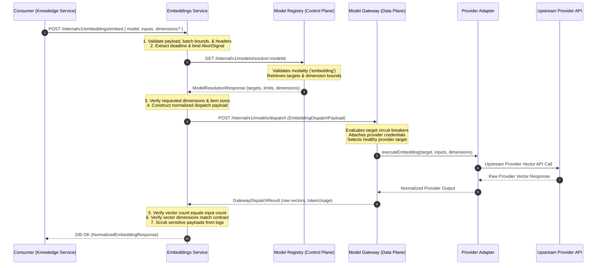

# OICUNT AI Platform Contract: Embeddings Service Architecture Specification

**Document Version**: 1.0.0  
**Status**: Authoritative Architectural Contract  
**Classification**: Engineering Architecture Standard  
**Service Location**: `services/embeddings`

---

## 1. Executive Summary & System Role

The **Embeddings Service** (`services/embeddings`) is the authoritative, provider-neutral **vector embedding generation layer** for the **OICUNT AI Platform**. It serves as the dedicated runtime boundary responsible for transforming normalized text payloads into dense semantic vector representations required by downstream platform capabilities—most notably the **Knowledge Service** (`services/knowledge`) for semantic search and document indexing, as well as future episodic memory retrieval and semantic routing.

The service encapsulates the mechanics of embedding generation: validating canonical embedding model identities, verifying model capability and dimension configurations via the **Model Registry**, dispatching execution through the platform's singular egress data plane (**Model Gateway**), enforcing strict batch and context window constraints, maintaining atomic item-to-vector ordering, and delivering normalized usage telemetry—all while strictly shielding consumers from vendor-specific SDKs, wire protocols, API credentials, and upstream provider volatility.

```
┌────────────────────────────────────────────────────────────────────────┐
│                      Embeddings Service Consumers                      │
│   Knowledge Service (RAG) • Episodic Memory • Semantic Classifiers     │
└───────────────────────────────────┬────────────────────────────────────┘
                                    │ 1. POST /internal/v1/embeddings/embed
                                    │    (Canonical Model, Inputs, Tenant)
                                    ▼
┌────────────────────────────────────────────────────────────────────────┐
│                           Embeddings Service                           │
│                                                                        │
│   • Request Validation & Batch Bounds    • Canonical Model Resolution  │
│   • Input Ordering & Atomicity           • Dimension Validation        │
│   • Deadline & Cancellation Propagation  • Sensitive Payload Scrubbing │
└───────────────────┬────────────────────────────────┬───────────────────┘
                    │                                │
                    │ 2. GET /models/resolve/:id     │ 3. POST /models/dispatch
                    │    (Modality & Dimensions)     │    (modality: 'embedding')
                    ▼                                ▼
┌──────────────────────────────────────┐ ┌───────────────────────────────┐
│            Model Registry            │ │         Model Gateway         │
│           (Control Plane)            │ │         (Data Plane)          │
│  • Canonical Embedding Models        │ │ • Singular Provider Egress    │
│  • Dimension & Context Limits        │ │ • Circuit Breakers & Retries  │
│  • Eligible Provider Targets         │ │ • Credential Containment      │
│  • Routing Policy Configuration      │ │ • Provider Adapters           │
└──────────────────────────────────────┘ └───────────────┬───────────────┘
                                                         │ 4. Provider Wire Call
                                                         ▼
                                         ┌───────────────────────────────┐
                                         │       Embedding Provider      │
                                         │  OpenAI • Google • Bedrock    │
                                         └───────────────────────────────┘
```

> [!IMPORTANT]
> **Cardinal Boundary Rule**: The Embeddings Service **NEVER** calls upstream model providers directly, never contains vendor SDKs or API credentials, never bypasses the Model Gateway, never persists vector indices or documents, and never executes LLM chat/completion inference. Upstream provider access is the exclusive responsibility of the **Model Gateway**.

---

### 1.1 The Seven-Tier AI Platform Architecture

The OICUNT AI Platform partitions responsibilities across seven dedicated subsystems:

| Subsystem              | Architectural Role                      | Core Question Owned                                                                                                                                 | State & Data Owned                                                                                               |
| :--------------------- | :-------------------------------------- | :-------------------------------------------------------------------------------------------------------------------------------------------------- | :--------------------------------------------------------------------------------------------------------------- |
| **AI Orchestrator**    | **Application Interaction Coordinator** | **WHAT interaction should happen?**<br/>How is prompt assembled, coordinated across turns, augmented with knowledge, and dispatched?                | Transient turn state, prompt context, turn deadlines. Stateless.                                                 |
| **Model Registry**     | **Control-Plane Catalog & Authority**   | **WHAT models and targets exist?**<br/>What are their limits, capabilities, pricing, dimensions, and routing policies?                              | Canonical model catalog, version definitions, eligible targets. Persistent.                                      |
| **Memory Service**     | **Conversational State Store**          | **WHAT was said and remembered?**<br/>How are past conversation messages stored, isolated, ordered, and retrieved for prompt context?               | Conversation threads, sequenced messages, sliding context windows, rolling summaries. Persistent.                |
| **Knowledge Service**  | **Enterprise Knowledge Authority**      | **WHAT knowledge exists and what can be retrieved?**<br/>How are documents ingested, chunked, and queried for semantic grounding?                   | Knowledge collections, document records, chunk metadata, vector index references. Persistent.                    |
| **Embeddings Service** | **Vector Generation Authority**         | **WHAT is the vector representation of this text?**<br/>How are texts batched, normalized, dimension-validated, and transformed into dense vectors? | Active batch operations, dimension contracts, batch limits, vector telemetry. Stateless.                         |
| **Inference Service**  | **Inference-Runtime Coordinator**       | **HOW is generative inference governed?**<br/>How are completion limits, streams, reasoning privacy, and turn budgets enforced?                     | Active inference lifecycles, execution deadlines, TTFT/ITL metrics, privacy filters. Stateless.                  |
| **Model Gateway**      | **Data-Plane Provider Egress Engine**   | **HOW is the provider executed?**<br/>Which healthy provider target executes the request, and how are network faults retried?                       | Provider credentials, target circuit breakers, retry budgets, target failover, vendor wire protocols. Stateless. |

---

## 2. Authoritative Architectural Boundaries & Separation of Concerns

### 2.1 What the Embeddings Service Owns

1. **Normalized Embedding Requests**: Ingestion and validation of provider-neutral embedding generation payloads.
2. **Canonical Model Identity Enforcement**: Enforcing OICUNT canonical model identities (`oicunt.model.embedding`, `text-embedding-3-small`, etc.) without exposing provider-specific model IDs to consumers.
3. **Model Resolution Coordination**: Resolving embedding model capability, default/supported dimensions, and context bounds via the **Model Registry**.
4. **Dimension Contract Validation**: Validating requested output dimensions against model capability (e.g., verifying fixed dimensions like 1536, or permissible dimensions for models supporting Matryoshka Representation Learning).
5. **Deterministic Batching & Ordering**: Accepting multi-item text arrays, maintaining strictly monotonic item-to-vector index mapping, and enforcing all-or-nothing batch atomicity.
6. **Input Bounds Enforcement**: Enforcing maximum batch item counts, individual text token/character limits, and rejecting empty inputs.
7. **Downstream Execution Routing**: Dispatching normalized embedding requests strictly to the **Model Gateway** for healthy target selection and provider egress.
8. **Normalized Output Envelope**: Returning dense vectors (`readonly number[]`), output dimensions, and canonical model/version metadata in a unified provider-neutral format.
9. **Usage Accounting**: Normalizing and returning input token counts and character metrics when available.
10. **Deadlines & Cancellation Governance**: Propagating caller deadlines monotonically and binding cancellation (`AbortSignal`) to abort upstream execution promptly.
11. **Normalized Error Taxonomy**: Mapping execution, validation, timeout, and provider errors into standard OICUNT error codes.
12. **Sensitive Data Scrubbing**: Guaranteeing that raw input text and floating-point vector payloads are scrubbed from standard logs and audit dumps.
13. **Tenant & Request Context Propagation**: Preserving `tenantId`, `userId`, `correlationId`, and `requestId` across all operations.
14. **Vector Telemetry & Metrics**: Emitting OpenTelemetry metrics for batch sizes, vector counts, latency, and token throughput.
15. **Stateless Runtime**: The service retains zero durable state and zero knowledge of collections, files, or vector databases.

---

### 2.2 What the Embeddings Service Must NOT Own

| Boundary Area                     | Non-Ownership Rule                                                                                | Authoritative Owner                              |
| :-------------------------------- | :------------------------------------------------------------------------------------------------ | :----------------------------------------------- |
| **Documents & Collections**       | Must not manage knowledge spaces, documents, MIME types, or ingestion states.                     | **Knowledge Service** (`services/knowledge`)     |
| **Text Extraction & Chunking**    | Must not parse raw files (PDF/HTML/DOCX) or divide text into semantic chunks.                     | **Knowledge Service** (`services/knowledge`)     |
| **Vector Storage & Indexing**     | Must not store vectors, manage index schemas, or connect to vector databases (Qdrant, pgvector).  | **Knowledge Service** (`services/knowledge`)     |
| **Similarity Retrieval & Search** | Must not execute k-NN, cosine distance, semantic search, or reranking.                            | **Knowledge Service** (`services/knowledge`)     |
| **Conversations & Memory**        | Must not store chat messages, user turns, agent state, or conversational context.                 | **Memory Service** (`services/memory`)           |
| **Generative LLM Inference**      | Must not generate text completions, chat responses, or execute reasoning models.                  | **Inference Service** (`services/inference`)     |
| **Prompt Assembly**               | Must not assemble prompts, inject context, or determine when embeddings are needed.               | **AI Orchestrator** (`services/ai-orchestrator`) |
| **Autonomous Agents & Tools**     | Must not execute multi-step agents, deterministic tools, or Model Context Protocol (MCP) actions. | **Agent Runtime** / **Tool Runtime**             |
| **Provider Credentials & Egress** | Must not hold API keys, manage vendor SDKs, retry network drops, or maintain circuit breakers.    | **Model Gateway** (`services/model-gateway`)     |
| **Model Catalog Authority**       | Must not maintain model pricing tables, target priority lists, or routing policy configurations.  | **Model Registry** (`services/model-registry`)   |
| **User AuthN & Billing**          | Must not authenticate user sessions, manage subscriptions, or meter customer billing.             | **Platform Repository** (`platform`)             |

---

## 3. Model Identity & Model Platform Integration

### 3.1 Canonical Embedding Model Identifiers

Consistent with the platform's model identity architecture ([`docs/contracts/model-registry.md`](./model-registry.md)), the Embeddings Service operates exclusively on **canonical OICUNT model identifiers**. Consuming services request canonical models; provider-specific model strings (`text-embedding-3-small`, `amazon.titan-embed-text-v2`, `text-embedding-004`) remain internal to provider targets.

```typescript
// Shared model identity contracts from @oicunt-ai/model-types
export type CanonicalEmbeddingModelId =
  | 'oicunt.model.embedding' // Platform default general-purpose dense embedding
  | 'oicunt.model.embedding.fast' // Low-latency high-throughput embedding
  | 'oicunt.model.embedding.code' // Codebase and technical text embedding
  | 'text-embedding-3-small' // Frontier small embedding model
  | 'text-embedding-3-large' // Frontier high-dimensional embedding model
  | (string & {});
```

### 3.2 Dynamic Resolution via Model Registry

Before dispatching embedding generation, the Embeddings Service resolves the model against the **Model Registry** (`GET /internal/v1/models/resolve/:id`):

1. **Modality Validation**: The resolved model version must declare `'embedding'` in its `modalities` array (`modalities.includes('embedding')`). If not, the request fails with `UNSUPPORTED_CAPABILITY`.
2. **Dimension Resolution**:
   - Every embedding model version declares a default output vector dimensionality (e.g., `1536`, `768`, `1024`).
   - If the caller requests custom dimensions (supported by models implementing Matryoshka Representation Learning), the Embeddings Service verifies that the requested dimension is permitted by the model's capabilities.
3. **Context Limits**: The Model Registry provides `contextWindowTokens` representing the maximum token budget per input item.
4. **Eligible Provider Targets**: The Model Registry returns active, healthy provider targets (`provider`, `upstreamModelId`, `priority`, `weight`).

### 3.3 Transparent Target Replacement Without Identity Drift

Under no circumstances may the Embeddings Service substitute an unrelated embedding model. If `oicunt.model.embedding` is configured with a primary OpenAI target and a secondary Bedrock fallback target, the fallback target must execute an identical or verified vector-compatible representation as defined by the platform routing policy. Changing the underlying embedding model family changes the vector space and breaks existing vector indices; therefore, target replacement policies for embedding models require strict vector-space equivalence.

---

## 4. Execution Architecture & Sequence Flow



---

## 5. Request & Response Contract Specification

### 5.1 Request Contract (`POST /internal/v1/embeddings/embed`)

#### HTTP Headers

| Header             | Type     | Required | Description                                       |
| :----------------- | :------- | :------- | :------------------------------------------------ |
| `Content-Type`     | `string` | **Yes**  | Must be `application/json`.                       |
| `Authorization`    | `string` | **Yes**  | Internal service bearer token (`Bearer <token>`). |
| `X-Tenant-ID`      | `string` | **Yes**  | Authoritative tenant identifier.                  |
| `X-Correlation-ID` | `string` | **Yes**  | Distributed tracing correlation identifier.       |
| `X-Request-ID`     | `string` | No       | Unique idempotency/request identifier.            |
| `X-User-ID`        | `string` | No       | Calling user or actor identifier.                 |
| `X-Deadline-At`    | `string` | No       | ISO-8601 timestamp defining execution deadline.   |

#### Request Payload Schema

```typescript
export interface EmbeddingGenerationRequest {
  /**
   * Canonical embedding model identifier.
   * Example: 'oicunt.model.embedding', 'text-embedding-3-small'
   */
  readonly model: string;

  /**
   * Non-empty array of input text strings to embed.
   * Batch size must not exceed the service maximum (default: 256).
   */
  readonly inputs: readonly string[];

  /**
   * Optional custom vector dimensions.
   * Only permitted for models supporting variable/Matryoshka dimensions.
   */
  readonly dimensions?: number | undefined;

  /**
   * Optional caller-provided metadata for audit or tracing.
   * Never passed upstream to model providers.
   */
  readonly metadata?: Record<string, unknown> | undefined;
}
```

#### Batch & Input Limits

1. **Batch Size Bounds**:
   - Minimum: `1` input string.
   - Maximum: Configurable per deployment (default: `256` items per request).
   - If `inputs.length === 0`: Fails immediately with `EMPTY_INPUT` (400).
   - If `inputs.length > maxBatchSize`: Fails immediately with `BATCH_TOO_LARGE` (400).
2. **Item Size Bounds**:
   - Each input string must not be empty or purely whitespace. Empty items fail with `EMPTY_INPUT_ITEM` (400).
   - Maximum characters per item: Configurable default `32,768` characters (~8,000 tokens), subject to the canonical model's `contextWindowTokens`. Items exceeding the bound fail with `INPUT_TOO_LARGE` (400).
3. **Ordering Invariant**:
   - The returned vector array is **strictly deterministic**: the vector at index `i` corresponds directly to `inputs[i]`.
   - Batch operations are **atomic**: partial generation is forbidden. If any single item fails upstream, the entire batch fails.

---

### 5.2 Response Contract

#### Response Payload Schema

```typescript
export interface EmbeddingVectorItem {
  /** 0-based index corresponding to inputs[index] */
  readonly index: number;

  /** Dense float vector representation */
  readonly vector: readonly number[];
}

export interface EmbeddingUsageMetadata {
  /** Total tokens evaluated across all inputs */
  readonly promptTokens: number;

  /** Total tokens billed/accounted */
  readonly totalTokens: number;
}

export interface NormalizedEmbeddingData {
  /** Canonical model identifier used for generation */
  readonly model: string;

  /** Resolved model version string */
  readonly modelVersion: string;

  /** Dimensionality of the returned vectors */
  readonly dimensions: number;

  /** Ordered list of generated embeddings */
  readonly embeddings: readonly EmbeddingVectorItem[];

  /** Token usage metadata */
  readonly usage: EmbeddingUsageMetadata;
}

export interface NormalizedEmbeddingResponse {
  readonly success: true;
  readonly data: NormalizedEmbeddingData;
  readonly meta: {
    readonly requestId: string;
    readonly correlationId: string;
    readonly latencyMs: number;
    readonly timestamp: string;
  };
}
```

#### Example Response Wire JSON

```json
{
  "success": true,
  "data": {
    "model": "oicunt.model.embedding",
    "modelVersion": "v1.0.0",
    "dimensions": 1536,
    "embeddings": [
      {
        "index": 0,
        "vector": [0.01245, -0.04512, 0.08912, -0.00314]
      },
      {
        "index": 1,
        "vector": [-0.03312, 0.08124, -0.01123, 0.05431]
      }
    ],
    "usage": {
      "promptTokens": 42,
      "totalTokens": 42
    }
  },
  "meta": {
    "requestId": "req_emb_01j7x4a2b9",
    "correlationId": "corr_9a8b7c6d5e",
    "latencyMs": 48,
    "timestamp": "2026-10-06T10:45:00.123Z"
  }
}
```

---

## 6. Error Taxonomy & Failure Semantics

The Embeddings Service implements standard OICUNT error classification. Errors distinguish clearly between client-correctable validation faults, transient provider issues, and terminal service errors.

| Error Code                  | HTTP Status | Retryable | Description                                                             |
| :-------------------------- | :---------: | :-------: | :---------------------------------------------------------------------- |
| `INVALID_REQUEST`           |     400     |    No     | Malformed JSON, missing fields, or invalid header metadata.             |
| `EMPTY_INPUT`               |     400     |    No     | The `inputs` array is empty (`length === 0`).                           |
| `EMPTY_INPUT_ITEM`          |     400     |    No     | An individual input item is an empty string or whitespace only.         |
| `INPUT_TOO_LARGE`           |     400     |    No     | A single input item exceeds the model's context or token limit.         |
| `BATCH_TOO_LARGE`           |     400     |    No     | Number of inputs exceeds the configured `maxBatchSize` limit.           |
| `UNSUPPORTED_MODEL`         |     404     |    No     | Requested canonical model is not registered in the Model Registry.      |
| `UNSUPPORTED_CAPABILITY`    |     400     |    No     | Model exists but does not support the `'embedding'` modality.           |
| `INVALID_DIMENSIONS`        |     400     |    No     | Requested dimensions are unsupported by the resolved model.             |
| `AUTHENTICATION_ERROR`      |     401     |    No     | Missing or invalid internal service token.                              |
| `FORBIDDEN`                 |     403     |    No     | Calling service or tenant not permitted to invoke the model.            |
| `RATE_LIMITED`              |     429     |    Yes    | Model Gateway or upstream provider rate limits exhausted.               |
| `REQUEST_CANCELLED`         |     499     |    No     | Caller disconnected or cancelled the request via `AbortSignal`.         |
| `DEADLINE_EXCEEDED`         |     504     |    Yes    | Execution exceeded caller deadline or internal timeout.                 |
| `MODEL_UNAVAILABLE`         |     503     |    Yes    | All eligible provider targets are currently degraded or in maintenance. |
| `PROVIDER_EXECUTION_FAILED` |     502     |    Yes    | Model Gateway upstream execution failed after internal retries.         |
| `INTERNAL_EMBEDDING_ERROR`  |     500     |    No     | Unexpected internal fault within the Embeddings Service.                |

### Error Envelope Schema

```typescript
export interface EmbeddingErrorEnvelope {
  readonly success: false;
  readonly error: {
    readonly code: string;
    readonly message: string;
    readonly retryable: boolean;
    readonly details?: unknown;
  };
  readonly meta: {
    readonly requestId: string;
    readonly correlationId: string;
    readonly timestamp: string;
  };
}
```

---

## 7. Deadlines and Cancellation Governance

1. **Inbound Deadline Propagation**:
   - The service inspects `X-Deadline-At` on incoming requests.
   - If the deadline has already expired prior to processing, the service terminates immediately with `DEADLINE_EXCEEDED` (504).
2. **Monotonic Timeout Calculation**:
   - The effective downstream timeout is strictly monotonic:
     $$\text{budgetMs} = \min(\text{deadlineAt} - \text{now}, \text{maxConfiguredTimeoutMs})$$
   - The service never manufactures an unconstrained timeout that outlives the caller's budget.
3. **Cancellation Propagation (`AbortSignal`)**:
   - If the calling client closes the HTTP connection, the inbound `AbortSignal` fires immediately.
   - The active `AbortSignal` is forwarded to downstream Model Gateway requests, instructing network sockets to abort promptly and preventing wasted compute.
   - Bounded execution ensures resources are freed without lingering background execution.

---

## 8. Security, Privacy & Data Scrubbing

1. **Perimeter-Protected Service Auth**: The Embeddings Service is an internal service. It binds exclusively to private mesh networks and requires valid internal service authorization tokens.
2. **Trusted Identity Headers**: `X-Tenant-ID` and `X-User-ID` are accepted only from trusted internal callers.
3. **Zero Credential Exposure**: No provider API keys (OpenAI, Google, AWS) exist within the Embeddings Service. Credentials reside exclusively within the **Model Gateway** provider adapters.
4. **Strict Payload Scrubbing**:
   - **Input Text Zero-Log Policy**: Raw input texts must **NEVER** appear in standard application logs, console output, or distributed trace attributes.
   - **Vector Zero-Log Policy**: Floating-point vector arrays must **NEVER** appear in standard logs.
   - **Allowed Log Fields**: `tenantId`, `model`, `batchSize`, `totalCharacters`, `promptTokens`, `dimensions`, `latencyMs`, `requestId`, `correlationId`.

---

## 9. Observability & Telemetry Standards

The Embeddings Service instruments OpenTelemetry metrics and traces conforming to platform standards:

### Metrics Instrumentation

| Metric Name                 | Type      | Description                           | Labels                         |
| :-------------------------- | :-------- | :------------------------------------ | :----------------------------- |
| `embeddings.requests.total` | Counter   | Total embedding requests received     | `model`, `tenant_id`, `status` |
| `embeddings.inputs.total`   | Counter   | Total individual input texts embedded | `model`, `tenant_id`           |
| `embeddings.tokens.total`   | Counter   | Total prompt tokens evaluated         | `model`, `tenant_id`           |
| `embeddings.duration.ms`    | Histogram | Request latency in milliseconds       | `model`, `status`              |
| `embeddings.batch_size`     | Histogram | Distribution of input items per batch | `model`                        |
| `embeddings.errors.total`   | Counter   | Errors by normalized error code       | `code`, `model`                |

### OpenTelemetry Distributed Tracing

- Spans are created for each embedding batch request: `embeddings.generate`.
- Span attributes include:
  - `gen_ai.system`: `"oicunt"`
  - `gen_ai.request.model`: canonical model ID
  - `gen_ai.usage.input_tokens`: total tokens
  - `embeddings.batch_size`: input count
  - `embeddings.dimensions`: output vector dimensions

---

## 10. Internal HTTP API Specification

The Embeddings Service exposes three internal HTTP endpoints:

### 10.1 `POST /internal/v1/embeddings/embed`

Generates dense vector embeddings for an input batch.

- **Access**: Internal trusted mesh only.
- **Request**: [`EmbeddingGenerationRequest`](#request-payload-schema)
- **Response**: [`NormalizedEmbeddingResponse`](#response-payload-schema)

### 10.2 `GET /health/liveness`

Verifies process responsiveness.

- **Response**: `200 OK`
- **Body**: `{ "status": "ok", "service": "embeddings", "timestamp": "..." }`

### 10.3 `GET /health/readiness`

Verifies connectivity to dependencies (Model Registry, Model Gateway).

- **Response**: `200 OK` (or `503 Service Unavailable` if dependencies are unreachable).
- **Body**: `{ "status": "ready", "dependencies": { "modelRegistry": true, "modelGateway": true } }`

---

## 11. Knowledge Service Integration & Vector Compatibility

### 11.1 The Integration Boundary

The Knowledge Service (`services/knowledge`) integrates with the Embeddings Service through its application port: [`EmbeddingServicePort`](file:///c:/CodeBase/OICUNT/ai-platform/docs/contracts/knowledge.md#53-outbound-port-embeddingserviceport-dedicated-embedding-service-boundary).

```
Knowledge Service
  └─► EmbeddingServicePort (Application Port)
        └─► HttpEmbeddingClient (Infrastructure Adapter)
              └─► POST /internal/v1/embeddings/embed (Embeddings Service)
```

The Knowledge Service remains completely decoupled from:

- Provider SDKs and vendor client libraries.
- Upstream provider model names.
- Upstream credential injection.
- Provider-specific rate limits and failovers.

### 11.2 The Vector Compatibility Invariant

Embedding vectors exist in a high-dimensional mathematical space defined uniquely by the **model architecture, training weights, and vector dimensionality**. Vectors generated by different models or versions (e.g., `text-embedding-3-small` vs. `bge-large-en`) **cannot be compared or queried against each other**.

To guarantee vector space homogeneity:

1. **Collection-Locked Embedding Configuration**:
   When a `KnowledgeCollection` is created in Knowledge, its `embeddingConfig` is locked permanently:
   ```typescript
   export interface EmbeddingModelConfig {
     readonly modelId: string; // e.g. 'oicunt.model.embedding'
     readonly dimensions: number; // e.g. 1536
     readonly version: string; // e.g. '1.0.0'
   }
   ```
2. **Homogeneous Index Guarantee**:
   All documents ingested into a collection must be embedded using that collection's locked `embeddingConfig`.
3. **Query Compatibility**:
   When `RetrieveContextUseCase` performs a similarity query against a collection, it generates the query vector using the exact `modelId` and `dimensions` configured on the target collection.
4. **Division of Ownership**:
   - **Embeddings Service**: Owns generating accurate, normalized vectors matching the requested canonical model and dimensions.
   - **Knowledge Service**: Owns preserving vector space consistency within its collections and vector indices.

---

## 12. Architectural Invariants Checklist

Every implementation of the Embeddings Service must strictly satisfy the following invariants:

1. **Provider-Neutral Interface**: The Embeddings Service exposes a uniform interface that contains no vendor-specific types, parameters, or schemas.
2. **No Direct Provider Access**: Consumers (Knowledge, Memory, Orchestrator) never call upstream embedding providers directly.
3. **No Provider Credentials in Embeddings**: Provider API keys and credentials reside exclusively within Model Gateway provider adapters.
4. **Canonical Model Identity Preservation**: Consumers request canonical OICUNT model identifiers; provider-specific model IDs remain strictly internal.
5. **No Model Catalog Duplication**: Canonical models, versions, limits, and targets are authoritatively resolved through the **Model Registry**.
6. **No Vector Storage Ownership**: The Embeddings Service does not own, connect to, or manage vector databases, vector collections, or persistent indices.
7. **No Document Lifecycle Ownership**: The Embeddings Service does not own documents, extraction, chunking, or ingestion state machines.
8. **No Retrieval Ownership**: The Embeddings Service does not execute similarity searches, k-NN queries, or rank retrieval candidates.
9. **No Generative Inference**: The Embeddings Service does not generate LLM completions, chat responses, or execute reasoning models.
10. **No Duplication of Gateway Resilience**: Provider retries, circuit breakers, and target failovers are owned authoritatively by the **Model Gateway**.
11. **Strict Batch Atomicity**: Embedding batches are atomic. Either all input items are successfully embedded in order, or the batch fails with a normalized error.
12. **Strict Positional Determinism**: The returned vector at `embeddings[i]` corresponds strictly to `inputs[i]`.
13. **Dimension Contract Validation**: Vector dimensionality is explicit, validated against model capability, and guaranteed in the response.
14. **Deadline & Cancellation Propagation**: All requests respect caller deadlines monotonically and propagate `AbortSignal` downstream.
15. **Sensitive Data Scrubbing**: Input texts and raw floating-point vectors are never logged in application logs or standard telemetry.
16. **Strict Tenant Isolation**: `X-Tenant-ID` is propagated across all internal service calls and bound to metrics.
17. **Stateless Runtime**: The service is completely stateless and possesses no persistent database of embeddings.
