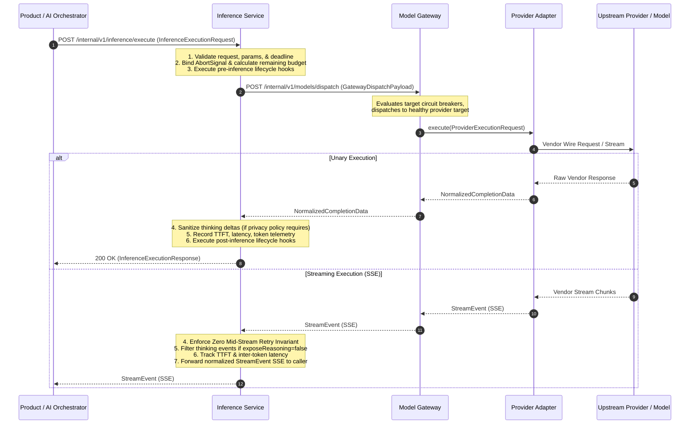
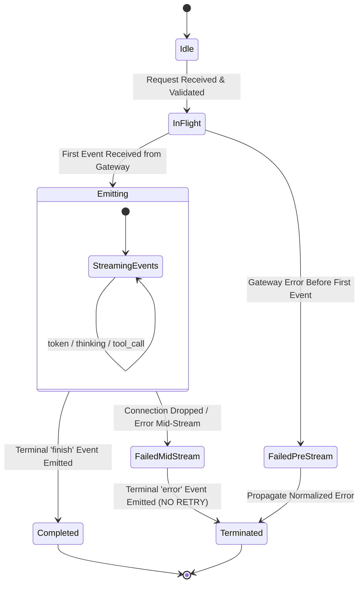

# OICUNT AI Platform Contract: Inference Service Architecture Specification

**Document Version**: 1.0.0  
**Status**: Authoritative Architectural Contract  
**Classification**: Engineering Architecture Standard  
**Service Location**: `services/inference`

---

## 1. Executive Summary & System Role

The **Inference Service** (`services/inference`) is the authoritative **inference-runtime coordination layer** for the **OICUNT AI Platform**. It serves as the dedicated execution lifecycle manager positioned directly between high-level application coordination (the **AI Orchestrator**) and provider egress execution (the **Model Gateway**).

Inference isolates the mechanics of runtime inference execution—including request-level validation, execution lifecycle hooks, deadline enforcement, cancellation propagation, normalized stream handling, privacy governance, and inference telemetry—without taking on prompt assembly, conversational memory, model catalog management, or provider egress resilience.

```
┌────────────────────────────────────────────────────────────────────────┐
│                        Product Application (BILLY)                     │
│                • User Interface • Model Picker • Chat UI               │
└───────────────────────────────────┬────────────────────────────────────┘
                                    │ 1. POST /internal/v1/orchestrator/chat
                                    ▼
┌────────────────────────────────────────────────────────────────────────┐
│                            AI Orchestrator                             │
│                                                                        │
│   • Multi-Turn Context Coordination      • Model Resolution & Cache    │
│   • Prompt & Tool Assembly               • Turn Budgeting              │
│   • Preflight Context Window Check       • Agent Execution Loops       │
└───────────────────┬────────────────────────────────┬───────────────────┘
                    │                                │
                    │ 2. GET /models/resolve         │ 3. POST /internal/v1/inference/execute
                    ▼                                │    (InferenceExecutionRequest)
┌──────────────────────────────────────┐             │
│            Model Registry            │             │
│           (Control Plane)            │             │
│  • Canonical Model Catalog           │             │
│  • Limits, Pricing & Capabilities    │             │
│  • Eligible Provider Targets         │             │
│  • Routing Policy Configuration      │             │
└──────────────────────────────────────┘             │
                                                     ▼
┌────────────────────────────────────────────────────────────────────────┐
│                       Inference (Runtime Layer)                        │
│                                                                        │
│   • Execution Lifecycle Management       • Normalized Stream Handling  │
│   • Deadline & Cancellation Propagation  • Reasoning Privacy Filter    │
│   • Inference-Level Validation           • Inference Telemetry (TTFT)  │
│   • Runtime Execution Hooks              • Stateless Coordination      │
└───────────────────────────────────┬────────────────────────────────────┘
                                    │ 4. POST /internal/v1/models/dispatch
                                    │    (GatewayDispatchPayload)
                                    ▼
┌────────────────────────────────────────────────────────────────────────┐
│                       Model Gateway (Data Plane)                       │
│                                                                        │
│   • Provider Egress Boundary             • Circuit Breakers            │
│   • In-Target Retries & Jitter Backoff   • Dynamic Target Failover     │
│   • Provider Credential Attachment       • Upstream Wire Translators   │
└───────────────────────────────────┬────────────────────────────────────┘
                                    │ 5. Dispatches via Provider Adapter
                                    ▼
┌────────────────────────────────────────────────────────────────────────┐
│                   Provider Adapter Anti-Corruption Layer               │
│               upstream provider • OpenAI • Google Gemini • Bedrock             │
│                  (and Future Internal Inference Pools)                 │
└────────────────────────────────────────────────────────────────────────┘
```

### 1.1 The Four-Tier Architectural Separation

The platform enforces a strict separation of concerns across the four core AI execution subsystems:

| Subsystem           | Architectural Role                      | Core Question Owned                                                                                                                        | State & Data Owned                                                                                     |
| :------------------ | :-------------------------------------- | :----------------------------------------------------------------------------------------------------------------------------------------- | :----------------------------------------------------------------------------------------------------- |
| **AI Orchestrator** | **Application Interaction Coordinator** | **WHAT interaction should happen?**<br/>How is the prompt assembled, coordinated across turns, and structured for agents?                  | Multi-turn conversational context, prompt history, turn budgets, agent state.                          |
| **Model Registry**  | **Control-Plane Catalog & Authority**   | **WHAT models and targets exist?**<br/>What are their limits, capabilities, pricing, and configurations?                                   | Canonical model definitions, semantic versions, eligible provider targets, routing policies.           |
| **Inference**       | **Inference-Runtime Coordinator**       | **HOW is the inference lifecycle governed?**<br/>How are execution limits, deadlines, streams, and privacy hooks applied during execution? | Inference lifecycle state, active execution deadlines, TTFT/ITL telemetry, privacy filters. Stateless. |
| **Model Gateway**   | **Data-Plane Provider Egress Engine**   | **HOW is the provider executed?**<br/>Which healthy provider target executes the request, and how are network faults retried?              | Provider credentials, target circuit breakers, retry budgets, target failover, vendor wire protocols.  |

### 1.2 End-to-End Sequence Diagram



---

## 2. Component Responsibilities & Non-Responsibilities

### 2.1 Core Responsibilities

The Inference Service authoritatively owns:

1. **Normalized Inference Ingress Boundary**: Exposing a unified, transport-neutral HTTP/SSE endpoint (`POST /internal/v1/inference/execute`) consuming `InferenceExecutionRequest`.
2. **Inference Execution Lifecycle**: Governing the full execution lifecycle of an inference invocation: pre-inference parameter validation, hook evaluation, dispatch coordination, stream aggregation, post-inference telemetry, and completion sanitization.
3. **Inference-Level Parameter Validation**: Verifying that execution parameters (temperature, topP, maxTokens, stopSequences) conform to model capability limits resolved by the Registry (e.g. validating `maxTokens <= limits.maxOutputTokens`).
4. **Deadline & Cancellation Propagation**:
   - Enforcing strict, monotonic deadline budgets (`deadlineMs`). Deadlines must **never** be extended or reset.
   - Immediately propagating client-side `AbortSignal` downstream to Model Gateway to terminate in-flight generation and prevent orphaned GPU consumption.
5. **Model Identity & Reasoning Effort Preservation**:
   - Guaranteeing that canonical model identifiers (`canonicalModelId`) and requested reasoning effort (`effort`) are strictly preserved and forwarded intact to Model Gateway.
   - Treating reasoning effort as an execution parameter, never converting it into a synthetic model identity.
6. **Normalized Streaming Handling**:
   - Relaying normalized Server-Sent Events (`StreamEvent`) from Model Gateway to the caller.
   - Enforcing the **Zero Mid-Stream Retry Invariant**: once the first output token/event is emitted to the downstream consumer, execution must never be retried or restarted.
   - Emitting clean, deterministic terminal events (`finish` or `error`).
7. **Reasoning Privacy & Chain-of-Thought Governance**: Enforcing reasoning privacy policies (`ReasoningPrivacyPolicy`) at the runtime boundary, ensuring internal model `thinking` blocks are never exposed to callers unless explicitly authorized.
8. **Inference Telemetry & Performance Instrumentation**:
   - Measuring and recording granular inference metrics: Time-To-First-Token (TTFT), Inter-Token Latency (ITL), total execution duration, token throughput (tokens/sec), and token counts.
   - Creating standardized OpenTelemetry spans (`inference.execution`) linked to distributed tracing contexts.
9. **Runtime Execution Hooks for Future Internal Inference**: Providing an extensible, decoupled hook port (`InferenceHookPort`) to allow future internal execution runtimes (self-hosted vLLM, TensorRT-LLM, Triton GPU clusters) and content guardrails to intercept execution without modifying the core inference service contract.
10. **Stateless Operation**: Maintaining complete statelessness. The Inference Service contains **no persistent database**, no conversation store, and no distributed caches.

### 2.2 Explicit Non-Responsibilities

The Inference Service strictly **does NOT** own:

1. **NO Model Catalog or Registration Authority**: Inference does **not** store or manage model definitions, versions, pricing tables, or capability flags. These belong exclusively to the **Model Registry**.
2. **NO Model Selection or Routing**: Inference does **not** choose which canonical model to invoke, nor does it decide routing strategy. Resolution metadata is supplied by the Orchestrator via the Registry.
3. **NO Provider SDKs, Wire Formats, or Credentials**: Inference **never** imports vendor SDKs (`a vendor SDK`, `openai`, `@google/genai`) and **never** manages provider API keys, tokens, or network sockets. Provider communication is strictly delegated to the **Model Gateway**.
4. **NO Provider-Level Retries, Circuit Breakers, or Fallback**: Inference does **not** implement circuit breakers across provider targets or retry vendor 429/503 errors across fallback targets. Egress resilience belongs solely to the **Model Gateway**.
5. **NO Conversational Context or History Management**: Inference does **not** manage multi-turn chat sessions, conversation threads, or token window truncation. Conversational history assembly belongs to the **AI Orchestrator** and future `services/memory`.
6. **NO RAG, Knowledge Retrieval, or Document Processing**: Inference does **not** query vector databases or assemble retrieved context chunks (owned by `services/knowledge` and `services/embeddings`).
7. **NO Tool Sandboxes, Agent Loops, or MCP Runtimes**: Inference carries tool schemas in payloads, but does **not** execute tool implementations, run autonomous agent loops, or host MCP bridges (owned by `services/tools`, `services/agents`, and `services/mcp`).
8. **NO Durable Billing, Subscription Quotas, or Usage Storage**: Inference reports transient token usage metadata on active turns, but does **not** store durable billing records or verify subscription entitlements (owned by the Company Platform).
9. **NO Product-Specific Logic**: Inference contains zero product code, UI concepts, or business logic.
10. **NO User Authentication or Identity Authority**: Inference operates within the trusted service mesh, accepting perimeter-authenticated identity headers (`X-User-ID`, `X-Tenant-ID`).

### 2.3 Subsystem Responsibility Matrix

| Capability / Concern               | AI Orchestrator  |         Inference         |  Model Registry   |   Model Gateway   | Upstream Provider |
| :--------------------------------- | :--------------: | :-----------------------: | :---------------: | :---------------: | :---------------: |
| **Model Catalog & Versions**       |     Consumes     |         Ignorant          | **Authoritative** |     Consumes      |      Vendor       |
| **Model Selection**                | **Coordinates**  |         Ignorant          |   Defines Rules   |     Ignorant      |     Ignorant      |
| **Prompt Assembly**                | **Coordinates**  |       Pass-through        |     Ignorant      |    Dispatches     |     Ignorant      |
| **Inference Parameter Validation** |    Preflight     |     **Authoritative**     |  Declares Limits  |     Enforces      |     Enforces      |
| **Deadline Budgeting**             |    Originates    |   **Enforces & Bounds**   |     Ignorant      |     Enforces      |     Ignorant      |
| **Client Cancellation**            | Detects & Passes |      **Propagates**       |     Ignorant      |   Halts Sockets   |   Halts Compute   |
| **Circuit Breakers & Retries**     |     Ignorant     |         Ignorant          |     Ignorant      | **Authoritative** |     Ignorant      |
| **Target Failover**                |     Ignorant     |         Ignorant          | Declares Targets  | **Authoritative** |     Ignorant      |
| **Provider Credentials**           |    Forbidden     |         Forbidden         |     Forbidden     | **Authoritative** |     Verifies      |
| **Vendor SDKs & Wire Formats**     |    Forbidden     |         Forbidden         |     Forbidden     | **Authoritative** |      Native       |
| **Stream Event Relaying**          |     Consumes     |  **Normalizes & Emits**   |     Ignorant      |     Produces      | Emits Wire Chunks |
| **Zero Mid-Stream Retry**          |     Enforces     |       **Enforces**        |     Ignorant      |   **Enforces**    |     Ignorant      |
| **Reasoning Privacy Redaction**    |   Coordinates    |       **Enforces**        |   Declares Cap    |    Dispatches     |     Generates     |
| **Inference Telemetry (TTFT)**     |    Turn Span     | **Inference Span & TTFT** |     Ignorant      |  Egress Duration  | Provider Metrics  |
| **Durable Usage & Billing**        |     Ignorant     |         Ignorant          |  Pricing Tables   | Raw Token Counts  |  Measured Usage   |

---

## 3. Inbound Request Contract

The Inference Service exposes a transport-independent, clean HTTP/1.1 REST and SSE interface under `/internal/v1/inference`.

### 3.1 Inference Execution Endpoint

```http
POST /internal/v1/inference/execute HTTP/1.1
Host: inference.service.internal:8080
Content-Type: application/json; charset=utf-8
Accept: application/json, text/event-stream
Authorization: Bearer <internal-service-token>
X-Service-Name: ai-orchestrator
X-Actor-ID: usr_9a8b7c6d5e4f
X-User-ID: usr_9a8b7c6d5e4f
X-Tenant-ID: ten_enterprise_alpha
X-Request-ID: req_4f1c9d24-8b3e-4a67-9c12-3e4f5a6b7c8d
X-Correlation-ID: corr_7f1c9d24-8b3e-4a67-9c12-3e4f5a6b7c8d
```

### 3.2 Inbound DTO: `InferenceExecutionRequest`

```typescript
import type {
  CanonicalModelId,
  ModelInvocationParameters,
  ModelLimits,
  ModelPricing,
  ReasoningEffortLevel,
} from '@oicunt-ai/model-types';
import type { ChatMessage } from '@oicunt-ai/ai-types';
import type { ResolvedTargetDto, GatewayRoutingPolicyDto } from './model-gateway.dto.js';

/**
 * Standard tool definition accepted for inference invocation.
 */
export interface InferenceToolDefinition {
  readonly name: string;
  readonly description: string;
  readonly parameters: Record<string, unknown>; // Standard JSON Schema
}

/**
 * Policy governing exposure and redaction of internal reasoning / thinking.
 */
export interface InferenceReasoningPrivacyPolicy {
  /**
   * Whether thinking content may be returned in the response or stream.
   * Default: true
   */
  readonly exposeReasoning?: boolean | undefined;

  /**
   * Whether thinking deltas are actively stripped before reaching the client.
   * Default: false
   */
  readonly redactThinking?: boolean | undefined;

  /**
   * Whether thinking content is scrubbed from structured log payloads.
   * Default: true
   */
  readonly redactThinkingInLogs?: boolean | undefined;
}

/**
 * Primary inbound execution payload consumed by the Inference Service.
 */
export interface InferenceExecutionRequest {
  /** Perimeter-generated unique request identifier */
  readonly requestId: string;

  /** Distributed tracing correlation identifier */
  readonly correlationId: string;

  /** Multi-turn conversational session identifier (if applicable) */
  readonly conversationId?: string | undefined;

  /**
   * Canonical model identifier (e.g. 'oicunt.model.catalog-alpha', 'provider-model-beta', 'provider-model-gamma').
   * Invariant: Must match a registered OICUNT canonical model identity.
   */
  readonly canonicalModelId: CanonicalModelId;

  /** Resolved semantic model version (e.g. 'v1.0.0') */
  readonly version: string;

  /** Normalized chat messages forming the inference prompt context */
  readonly messages: readonly ChatMessage[];

  /** Standard execution hyperparameters */
  readonly parameters?: ModelInvocationParameters | undefined;

  /** Reasoning effort level ('low' | 'medium' | 'high') */
  readonly effort?: ReasoningEffortLevel | undefined;

  /** Tool schemas available for model execution */
  readonly tools?: readonly InferenceToolDefinition[] | undefined;

  /** Whether execution must stream real-time Server-Sent Events */
  readonly stream: boolean;

  /** Context window and output token limits resolved from Model Registry */
  readonly limits: ModelLimits;

  /** Pricing structure for execution cost calculation */
  readonly pricing?: ModelPricing | undefined;

  /**
   * Opaque pass-through execution targets resolved by Model Registry for Model Gateway.
   * Forwarded intact to Model Gateway. Inference does not inspect, validate,
   * or govern target selection, routing, retries, fallback, or circuit breakers.
   */
  readonly eligibleTargets?: readonly ResolvedTargetDto[] | undefined;

  /**
   * Opaque pass-through routing policy from Model Registry for Model Gateway.
   * Forwarded intact to Model Gateway. Gateway remains solely responsible for
   * target selection, routing strategies, retries, fallback, and circuit breakers.
   */
  readonly routingPolicy?: GatewayRoutingPolicyDto | undefined;

  /** Privacy policy controlling exposure of chain-of-thought data */
  readonly privacyPolicy?: InferenceReasoningPrivacyPolicy | undefined;

  /** Platform tenant context */
  readonly tenantId?: string | undefined;

  /** Authenticated user identifier */
  readonly userId?: string | undefined;

  /** Internal service actor initiating execution */
  readonly actorId: string;

  /** Pass-through caller metadata for tracing and audit */
  readonly metadata?: Record<string, unknown> | undefined;

  /**
   * Absolute execution deadline as Epoch MS timestamp.
   * Required. Must be in the future (Date.now() < deadlineMs).
   */
  readonly deadlineMs: number;
}
```

> [!NOTE]
> **Gateway Routing Decoupling**: Inference does **not** define target models, routing algorithms, retry limits, or circuit breaker configurations. If `eligibleTargets` and `routingPolicy` are supplied from Model Registry resolution, Inference treats them as opaque pass-through metadata to be forwarded to Model Gateway. Model Gateway remains solely and authoritatively responsible for target selection, routing, retries, fallback, and circuit breakers.

---

## 4. Normalized Inference Result Contract

### 4.1 Unary Response Envelope

When `stream: false`, the Inference Service returns a standard OICUNT JSON response envelope with HTTP status `200 OK`.

```typescript
import type { CanonicalModelId, ReasoningEffortLevel, TokenUsage } from '@oicunt-ai/model-types';
import type { ChatMessage, FinishReason } from '@oicunt-ai/ai-types';

/**
 * Runtime execution performance and attribution metadata.
 * Note: Internal provider target and vendor identities remain strictly internal
 * to Model Gateway and distributed observability spans; they are never exposed
 * in the normalized inference response contract.
 */
export interface InferenceExecutionMetadata {
  /** Time from request receipt to completion generation (ms) */
  readonly latencyMs: number;

  /** Time to first token in milliseconds (if applicable) */
  readonly ttftMs?: number | undefined;

  /** Generation rate in tokens per second */
  readonly tokensPerSecond?: number | undefined;

  /** Estimated cost in USD calculated from pricing tables */
  readonly estimatedCostUsd?: number | undefined;
}

/**
 * Data payload for unary inference execution.
 */
export interface InferenceResultData {
  /** Unique completion identifier */
  readonly completionId: string;

  /** The canonical model identity executed */
  readonly model: CanonicalModelId;

  /** The semantic version executed */
  readonly version: string;

  /** The reasoning effort applied */
  readonly effort?: ReasoningEffortLevel | undefined;

  /** The assistant message resulting from inference */
  readonly message: ChatMessage;

  /** Termination condition for generation */
  readonly finishReason: FinishReason;

  /** Authoritative token usage reported by execution */
  readonly usage: TokenUsage;

  /** Runtime performance telemetry and metadata */
  readonly metadata: InferenceExecutionMetadata;
}

/**
 * Top-level unary inference execution response envelope.
 */
export interface InferenceExecutionResponse {
  readonly success: true;
  readonly data: InferenceResultData;
  readonly meta: {
    readonly requestId: string;
    readonly correlationId: string;
    readonly timestamp: string;
  };
}
```

### 4.2 Example Unary HTTP Response

```http
HTTP/1.1 200 OK
Content-Type: application/json; charset=utf-8
X-Request-ID: req_4f1c9d24-8b3e-4a67-9c12-3e4f5a6b7c8d
X-Correlation-ID: corr_7f1c9d24-8b3e-4a67-9c12-3e4f5a6b7c8d

{
  "success": true,
  "data": {
    "completionId": "cmpl_01HZX876543210ABCDEF",
    "model": "oicunt.model.catalog-alpha",
    "version": "v1.0.0",
    "effort": "medium",
    "message": {
      "role": "assistant",
      "content": "A transformer is a deep learning architecture based on self-attention..."
    },
    "finishReason": "stop",
    "usage": {
      "promptTokens": 142,
      "completionTokens": 56,
      "totalTokens": 198,
      "reasoningTokens": 0,
      "cachedTokens": 0
    },
    "metadata": {
      "latencyMs": 420,
      "ttftMs": 115,
      "tokensPerSecond": 133.3,
      "estimatedCostUsd": 0.001266
    }
  },
  "meta": {
    "requestId": "req_4f1c9d24-8b3e-4a67-9c12-3e4f5a6b7c8d",
    "correlationId": "corr_7f1c9d24-8b3e-4a67-9c12-3e4f5a6b7c8d",
    "timestamp": "2026-10-05T16:00:00.420Z"
  }
}
```

---

## 5. Streaming Execution Contract

### 5.1 Protocol & Header Specification

When `stream: true` or `Accept: text/event-stream` is requested, the Inference Service establishes a Server-Sent Events (SSE) connection:

```http
HTTP/1.1 200 OK
Content-Type: text/event-stream; charset=utf-8
Cache-Control: no-cache, no-transform
Connection: keep-alive
X-Accel-Buffering: no
X-Request-ID: req_4f1c9d24-8b3e-4a67-9c12-3e4f5a6b7c8d
X-Correlation-ID: corr_7f1c9d24-8b3e-4a67-9c12-3e4f5a6b7c8d
```

### 5.2 Server-Sent Events Schema

Streaming strictly conforms to the canonical `@oicunt-ai/ai-types` `StreamEvent` discriminated union:

```typescript
export type StreamEventType = 'token' | 'tool_call' | 'thinking' | 'finish' | 'error';

export interface StreamTokenPayload {
  readonly delta: string;
}

export interface StreamToolCallPayload {
  readonly id: string;
  readonly name: string;
  readonly argumentChunk: string;
}

export interface StreamThinkingPayload {
  readonly delta: string;
}

export interface StreamFinishPayload {
  readonly finishReason: FinishReason;
  readonly usage: TokenUsage;
}

export interface StreamErrorPayload {
  readonly code: string;
  readonly message: string;
  readonly details?: unknown;
}

export type StreamEvent =
  | { readonly event: 'token'; readonly data: StreamTokenPayload }
  | { readonly event: 'tool_call'; readonly data: StreamToolCallPayload }
  | { readonly event: 'thinking'; readonly data: StreamThinkingPayload }
  | { readonly event: 'finish'; readonly data: StreamFinishPayload }
  | { readonly event: 'error'; readonly data: StreamErrorPayload };
```

### 5.3 Streaming Lifecycle & Invariants



1. **Zero Mid-Stream Retry Invariant**:
   Once the first event (`token`, `thinking`, `tool_call`) is flushed across the wire to the client, the execution stream is committed. If an upstream network disconnect or provider error occurs after output emission:
   - Inference **must NOT** retry, restart, or re-dispatch execution.
   - Inference **must immediately emit** a terminal `error` event:
     ```
     event: error
     data: {"code":"STREAM_INTERRUPTED","message":"Upstream provider connection dropped mid-stream"}
     ```
   - Inference closes the stream immediately.
2. **Deterministic Termination**: Every stream must conclude with **exactly one** terminal event: either `finish` (success) or `error` (failure). No events may follow a terminal event.
3. **Reasoning Privacy in Streaming**: If `privacyPolicy.exposeReasoning === false`, Inference silences all `thinking` events received from Model Gateway. The client receives only `token`, `tool_call`, and terminal `finish` events.
4. **Backpressure & Client Disconnect**: If the downstream consumer disconnects (`res.on('close')`), the stream pipeline terminates immediately, triggering downstream cancellation to Model Gateway.

---

## 6. Error Taxonomy & Normalization Contract

### 6.1 Canonical Error Hierarchy

All errors produced or relayed by the Inference Service inherit from `InferenceError` (an `AiDomainError` subclass):

```typescript
export abstract class InferenceError extends Error {
  public abstract readonly code: string;
  public abstract readonly statusCode: number;
  public abstract readonly isRetryable: boolean;
  public readonly correlationId: string;
  public readonly details?: unknown;

  constructor(message: string, correlationId: string, details?: unknown) {
    super(message);
    this.name = this.constructor.name;
    this.correlationId = correlationId;
    this.details = details;
  }
}
```

### 6.2 Error Mapping & Taxonomy

| Error Class                       | Error Code                 | HTTP Status | Retryable? | Description                                                                                       |
| :-------------------------------- | :------------------------- | :---------: | :--------: | :------------------------------------------------------------------------------------------------ |
| `InvalidInferenceRequestError`    | `INVALID_REQUEST`          |     400     |     No     | Malformed request body, missing canonicalModelId, empty messages, or parameters exceeding bounds. |
| `InferenceAuthenticationError`    | `AUTHENTICATION_ERROR`     |     401     |     No     | Missing or invalid internal service token.                                                        |
| `InferenceForbiddenError`         | `FORBIDDEN`                |     403     |     No     | Calling service identity (`X-Service-Name`) not authorized to access Inference.                   |
| `InferenceContextExceededError`   | `CONTEXT_WINDOW_EXCEEDED`  |     422     |     No     | Requested maxTokens or estimated prompt size exceeds `limits.contextWindowTokens`.                |
| `InferenceUnsupportedEffortError` | `UNSUPPORTED_EFFORT_LEVEL` |     422     |     No     | Reasoning effort specified for a model that does not declare reasoning capabilities.              |
| `InferenceCancelledError`         | `REQUEST_CANCELLED`        |     499     |     No     | Request cancelled by client disconnect or caller `AbortSignal`.                                   |
| `AllTargetsExhaustedError`        | `ALL_TARGETS_EXHAUSTED`    |     503     |    Yes     | Model Gateway could not find a healthy provider target or exhausted retry budgets.                |
| `ModelUnavailableError`           | `MODEL_UNAVAILABLE`        |     503     |    Yes     | Upstream model provider reported transient unavailability or maintenance.                         |
| `InferenceTimeoutError`           | `INFERENCE_TIMEOUT`        |     504     |    Yes     | Execution exceeded `deadlineMs`.                                                                  |
| `InternalInferenceError`          | `INTERNAL_INFERENCE_ERROR` |     500     |     No     | Unexpected internal runtime failure in Inference Service.                                         |

### 6.3 Standard Error Response Envelope

```json
{
  "success": false,
  "error": {
    "code": "INFERENCE_TIMEOUT",
    "message": "Inference execution exceeded deadline of 30000ms",
    "retryable": true,
    "details": {
      "deadlineMs": 1775404800000,
      "elapsedMs": 30005
    }
  },
  "meta": {
    "requestId": "req_4f1c9d24-8b3e-4a67-9c12-3e4f5a6b7c8d",
    "correlationId": "corr_7f1c9d24-8b3e-4a67-9c12-3e4f5a6b7c8d",
    "timestamp": "2026-10-05T16:00:30.005Z"
  }
}
```

### 6.4 Information Leakage Prevention

- Inference **never** echoes raw provider responses, provider HTTP status codes, or provider error messages to clients.
- Internal stack traces, database strings, and infrastructure hostnames are completely stripped from error responses.

---

## 7. Cancellation Semantics & Deadline Propagation

### 7.1 Monotonic Deadline Invariant

> [!IMPORTANT]
> **Deadlines must NEVER be extended or reset.**  
> The `deadlineMs` provided by the caller represents the absolute system deadline for the entire turn. Inference computes the remaining time as `remainingMs = deadlineMs - Date.now()`.

1. **Preflight Deadline Validation**: If `remainingMs <= 0` at the moment of request receipt, Inference **rejects immediately** with `INFERENCE_TIMEOUT` (504) without invoking Model Gateway.
2. **Deadline Forwarding**: The exact `deadlineMs` value is passed unchanged to Model Gateway in `GatewayDispatchPayload`.
3. **Execution Timeout**: Inference sets a timer for `remainingMs`. If the timer triggers before Model Gateway completes or emits a terminal event, the execution `AbortController` is aborted with an `InferenceTimeoutError`.

### 7.2 Client Cancellation Propagation

1. **Signal Linking**: Inference links the incoming HTTP request socket disconnect event (`res.on('close')`) and any caller `parentSignal` into an internal `AbortController`.
2. **Immediate Downstream Propagation**: When the internal controller triggers, the `AbortSignal` is passed directly to the `ModelGatewayPort`.
3. **Socket Teardown**: Model Gateway terminates active provider HTTP/fetch sockets, releases provider network connections, and stops background processing.
4. **Immediate Loop Termination**: In streaming executions, the generator loop breaks immediately upon cancellation without awaiting pending chunks.

---

## 8. Model Identity, Reasoning Effort & Privacy Governance

### 8.1 Model Identity Immutability

- The canonical model identity (`canonicalModelId`) received in `InferenceExecutionRequest` is an inviolable business identifier selected by the user.
- Inference **must NEVER** rewrite, substitute, or downgrade the model identifier.
- The canonical identifier is forwarded strictly intact to Model Gateway and echoed in the execution response metadata.

### 8.2 Reasoning Effort Governance

- Reasoning effort (`effort`: `'low'` | `'medium'` | `'high'`) is an **execution parameter**, not a separate model identity.
- Inference preserves and forwards `effort` intact to Model Gateway.
- If a model's limits or capabilities do not support reasoning and an effort level was specified, Inference rejects the request with `UNSUPPORTED_EFFORT_LEVEL` (422) prior to gateway dispatch.

### 8.3 Reasoning Privacy & Chain-of-Thought Containment

- Reasoning models (e.g. a reasoning-capable catalog model with extended thinking, OpenAI o1/o3-mini, Gemini 2.0 Flash Thinking) produce internal reasoning deltas (`thinking` parts or events).
- The `InferenceReasoningPrivacyPolicy` governs runtime exposure:
  - **`exposeReasoning: false` (Default for public/unprivileged callers)**: Inference redacts or strips all `thinking` content parts from unary assistant messages and filters out all `thinking` events from streaming output.
  - **`redactThinkingInLogs: true` (Strict platform default)**: Thinking text is never written to structured log payloads at INFO or higher levels.

---

## 9. Model Gateway Dependency Boundary

The relationship between Inference and Model Gateway is strictly defined by an outbound port:

```
┌────────────────────────────────────────────────────────────────────────┐
│                        Inference Service                               │
│                                                                        │
│   • Preflight validation                 • Observability & TTFT        │
│   • Execution lifecycle hooks            • Reasoning privacy filter    │
└───────────────────────────────────┬────────────────────────────────────┘
                                    │ Outbound Port: ModelGatewayPort
                                    ▼
┌────────────────────────────────────────────────────────────────────────┐
│                       Model Gateway Service                            │
│                                                                        │
│   • Provider network egress              • Target circuit breakers     │
│   • Provider retries & jitter backoff    • Target failover routing     │
│   • Vendor credential injection          • Vendor wire serialization   │
└────────────────────────────────────────────────────────────────────────┘
```

### 9.1 Boundary Rules

1. **Zero Direct Provider Sockets**: Inference **never** establishes HTTP or gRPC connections to upstream provider, OpenAI, Google, AWS Bedrock, or any external vendor.
2. **Zero Provider Secrets**: Inference does **not** load or access provider API keys or cloud credentials.
3. **Zero Duplicate Resilience**: Inference **must not** implement circuit breakers across provider targets or execute target-level retry loops. These are solely the responsibility of the Model Gateway.
4. **Decoupled From Target Routing**: Inference is completely decoupled from Gateway target routing. Model Gateway remains solely and authoritatively responsible for target selection, routing policies, in-target retries, fallback sequencing, and circuit breakers. Inference does not evaluate or configure routing; any target resolution metadata (`eligibleTargets`, `routingPolicy`) forwarded from Model Registry is treated as opaque pass-through data to Model Gateway.

---

## 10. Observability, Metrics & Telemetry Specification

### 10.1 OpenTelemetry Distributed Tracing

Inference participates in distributed tracing using `@oicunt-ai/observability`. It starts an `inference.execution` span as a child of the Orchestrator's `orchestrator.chat_turn` span.

| Span Attribute                     | Type    | Description                                          | Example                      |
| :--------------------------------- | :------ | :--------------------------------------------------- | :--------------------------- |
| `oicunt.service`                   | string  | Originating service name                             | `inference`                  |
| `oicunt.canonical_model`           | string  | User-selected canonical model ID                     | `oicunt.model.catalog-alpha` |
| `oicunt.model_version`             | string  | Resolved semantic model version                      | `v1.0.0`                     |
| `oicunt.effort`                    | string  | Reasoning effort applied                             | `medium`                     |
| `oicunt.stream`                    | boolean | Whether execution was streaming                      | `true`                       |
| `oicunt.correlation_id`            | string  | Distributed correlation ID                           | `corr_7f1c9d24...`           |
| `oicunt.request_id`                | string  | Request tracking ID                                  | `req_4f1c9d24...`            |
| `oicunt.inference.ttft_ms`         | number  | Time-to-first-token in milliseconds                  | `112`                        |
| `oicunt.inference.duration_ms`     | number  | Total execution duration                             | `420`                        |
| `oicunt.inference.target_executed` | string  | Provider target executed (internal telemetry only)   | `provider-a-primary`         |
| `oicunt.provider`                  | string  | Upstream provider category (internal telemetry only) | `test-provider`              |
| `gen_ai.usage.prompt_tokens`       | number  | Input tokens consumed                                | `142`                        |
| `gen_ai.usage.completion_tokens`   | number  | Output tokens generated                              | `56`                         |
| `gen_ai.usage.total_tokens`        | number  | Total tokens consumed                                | `198`                        |

> [!NOTE]
> **Observability Isolation**: The target executed (`oicunt.inference.target_executed`) and upstream provider category (`oicunt.provider`) are captured strictly within internal distributed tracing spans and system logs for engineering diagnostics and auditability. They are **never** exposed in the public `InferenceExecutionResponse` payload to ensure vendor neutrality and prevent provider leakage.

### 10.2 Metric Instrumentation

| Metric Name                      | Type          | Unit | Description                                                                              |
| :------------------------------- | :------------ | :--- | :--------------------------------------------------------------------------------------- |
| `ai.inference.requests.total`    | Counter       | 1    | Total inference invocations partitioned by `model`, `status`, `stream`.                  |
| `ai.inference.duration_ms`       | Histogram     | ms   | Overall inference duration distribution.                                                 |
| `ai.inference.ttft_ms`           | Histogram     | ms   | Time-to-first-token distribution for streaming requests.                                 |
| `ai.inference.tokens.total`      | Counter       | 1    | Total tokens partitioned by `model`, `token_type` (`prompt`, `completion`, `reasoning`). |
| `ai.inference.active_executions` | UpDownCounter | 1    | Concurrent active in-flight inference requests.                                          |

### 10.3 Structured Logging Standards

- Logs use single-line machine-parseable JSON formatted via `JsonLogger`.
- Every log binds `correlationId`, `requestId`, `canonicalModelId`, and `service: "inference"`.
- **Strict Privacy Rule**: Prompt text, assistant completion text, and reasoning chains are **never** logged at `info` level or above.

---

## 11. Clean / Hexagonal Architecture & Service Structure

The Inference Service conforms strictly to the OICUNT Clean / Hexagonal architecture standards:

```
services/inference/
├── src/
│   ├── application/
│   │   ├── dtos/
│   │   │   ├── inference-execution.dto.ts
│   │   │   ├── inference-result.dto.ts
│   │   │   └── index.ts
│   │   ├── ports/
│   │   │   ├── model-gateway.port.ts
│   │   │   ├── inference-hook.port.ts
│   │   │   └── index.ts
│   │   ├── use-cases/
│   │   │   ├── execute-inference.use-case.ts
│   │   │   └── index.ts
│   │   └── index.ts
│   ├── domain/
│   │   ├── errors.ts
│   │   ├── privacy-policy.ts
│   │   ├── validation.ts
│   │   ├── types.ts
│   │   └── index.ts
│   ├── infrastructure/
│   │   ├── clients/
│   │   │   ├── http-model-gateway.client.ts
│   │   │   └── index.ts
│   │   ├── hooks/
│   │   │   ├── noop-inference-hook.ts
│   │   │   └── index.ts
│   │   ├── logging/
│   │   │   └── logger.ts
│   │   └── index.ts
│   ├── interfaces/
│   │   └── http/
│   │       ├── controllers/
│   │       │   ├── inference.controller.ts
│   │       │   └── index.ts
│   │       ├── auth.ts
│   │       ├── context.ts
│   │       ├── health.ts
│   │       ├── middleware.ts
│   │       ├── router.ts
│   │       └── index.ts
│   ├── config.ts
│   ├── index.ts
│   └── service.ts
├── tests/
│   ├── application/
│   ├── domain/
│   ├── interfaces/
│   └── test-doubles/
├── package.json
├── tsconfig.json
└── README.md
```

### 11.1 Dependency Direction Rules

```
interfaces (Inbound HTTP controllers, router, middleware)
    ↓
application (ExecuteInferenceUseCase, Inbound/Outbound ports, DTOs)
    ↓
domain (Inference errors, validation rules, privacy evaluators)
    ↑
infrastructure (HttpModelGatewayClient, NoopInferenceHook, JsonLogger)
```

- **Domain** is pure TypeScript with zero external framework or network dependencies.
- **Application** defines business logic and port interfaces; it never references `infrastructure` or `interfaces`.
- **Infrastructure** implements outbound ports defined by `application`.
- **Interfaces** exposes HTTP ingress and drives `application` use cases.

---

## 12. Ports & Adapters Specification

### 12.1 Outbound Port: `ModelGatewayPort`

```typescript
import type { StreamEvent, NormalizedCompletionData } from '@oicunt-ai/ai-types';
import type { GatewayDispatchPayload } from './model-gateway.dto.js';

/**
 * Outbound port for dispatching execution to the Model Gateway.
 */
export interface ModelGatewayPort {
  /**
   * Executes unary completion against Model Gateway.
   */
  dispatchUnary(
    payload: GatewayDispatchPayload,
    signal?: AbortSignal,
  ): Promise<NormalizedCompletionData>;

  /**
   * Executes streaming completion against Model Gateway.
   */
  dispatchStream(payload: GatewayDispatchPayload, signal?: AbortSignal): AsyncIterable<StreamEvent>;

  /**
   * Health probe for Model Gateway readiness.
   */
  checkHealth(signal?: AbortSignal): Promise<boolean>;
}
```

### 12.2 Outbound Port: `InferenceHookPort` (Future Extension Hook)

```typescript
import type { InferenceExecutionRequest } from '../dtos/inference-execution.dto.js';
import type { InferenceResultData } from '../dtos/inference-result.dto.js';

/**
 * Runtime execution hook port enabling pre/post execution lifecycle interception
 * (e.g. content guardrails, local inference routing, watermarking).
 */
export interface InferenceHookPort {
  /**
   * Hook executed prior to Model Gateway dispatch.
   * Can perform validation, token counting, or reject disallowed requests.
   */
  beforeExecution(request: InferenceExecutionRequest, signal?: AbortSignal): Promise<void>;

  /**
   * Hook executed after successful inference completion.
   */
  afterExecution(
    request: InferenceExecutionRequest,
    result: InferenceResultData,
    signal?: AbortSignal,
  ): Promise<void>;
}
```

---

## 13. System Invariants & Enforcement Checklist

The Inference Service enforces ten non-negotiable architectural invariants:

1. **Canonical Model Identity Immutability**: The canonical model identifier must never be mutated, substituted, or mapped to an alternative model during inference.
2. **Effort Preservation**: Reasoning effort remains an execution parameter and is passed unchanged to Model Gateway.
3. **No Direct Provider Access**: Inference must never contact upstream model providers or hold provider API credentials.
4. **No Duplicate Resilience**: Inference must not implement target-level retries, circuit breakers, or target failover.
5. **Zero Mid-Stream Retry Invariant**: Once the first output chunk is emitted to the downstream caller, the stream must never be retried or restarted.
6. **Strict Monotonic Deadlines**: The deadline timestamp (`deadlineMs`) must never be extended or reset during execution.
7. **Immediate Cancellation Propagation**: Caller disconnects and abort signals must immediately trigger downstream cancellation.
8. **Reasoning Privacy Containment**: Raw provider chain-of-thought text must never become visible to callers unless explicitly authorized by policy.
9. **Stateless Coordination**: The service must remain completely stateless with zero persistent database dependencies.
10. **Provider Isolation**: Provider-specific SDKs, wire protocols, and vendor errors remain strictly isolated behind the Model Gateway.

---

## 14. Future Extension Boundaries

1. **Self-Hosted / Local Inference Integration**: When OICUNT provisions internal GPU clusters (e.g. vLLM, TensorRT-LLM, Triton), the `InferenceHookPort` or dedicated internal provider targets in Model Gateway allow routing to local runtimes without modifying the Orchestrator.
2. **Runtime Content Moderation & Guardrails**: The `beforeExecution` and `afterExecution` hooks provide extension points for enterprise input/output guardrails and toxicity scanners.
3. **Priority & Batch Inference Queuing**: Future offline or asynchronous batch inference workloads can utilize the normalized `InferenceExecutionRequest` envelope with queue workers while sharing the same execution lifecycle logic.

---

## 15. Cross-System Architectural Alignment

- **AI Orchestrator** (`docs/contracts/ai-orchestrator.md`): Delegates raw turn execution to Inference (`POST /internal/v1/inference/execute`) after prompt assembly and model resolution.
- **Model Registry** (`docs/contracts/model-registry.md`): Authoritative source for model limits, capabilities, pricing, and targets forwarded through Inference to Model Gateway.
- **Model Gateway** (`docs/contracts/model-gateway.md`): Downstream dependency of Inference; handles physical egress, retries, circuit breakers, and provider adapters.
- **Platform Standards** (`docs/architecture.md`): Complies with Clean / Hexagonal standards, OICUNT observability specifications, and standard error taxonomy.
