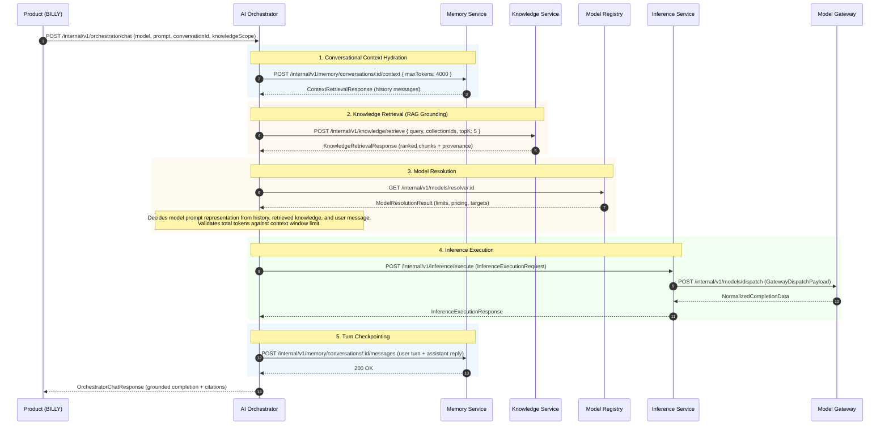

# OICUNT AI Platform Contract: Knowledge Service Architecture Specification

**Document Version**: 1.0.0  
**Status**: Authoritative Architectural Contract  
**Classification**: Engineering Architecture Standard  
**Service Location**: `services/knowledge`

---

## 1. Executive Summary & System Role

The **Knowledge Service** (`services/knowledge`) is the authoritative **enterprise knowledge management, document indexing, and semantic retrieval coordination layer** for the **OICUNT AI Platform**. It serves as the dedicated knowledge and context retrieval boundary positioned adjacent to the **AI Orchestrator** and **Autonomous Agents**, responsible for durably managing knowledge collections, tracking document processing lifecycles, governing text chunking, orchestrating embedding generation through the dedicated platform embedding boundary, and executing low-latency vector/hybrid similarity retrieval for prompt context augmentation (Retrieval-Augmented Generation / RAG).

Knowledge isolates the mechanics of document ingestion, textual extraction, chunking heuristics, embedding model versioning, index synchronization, and tenant-scoped retrieval. It operates with a **stateless application runtime** backed by clean abstractions over three distinct storage planes:

1. **Object Storage Plane**: Authoritatively owns raw file bytes and binary objects (e.g. S3 / MinIO). In the production architecture, clients stage raw files in Object Storage directly, and Knowledge receives an opaque object reference (`objectKey`) rather than receiving large file bytes synchronously.
2. **Metadata & Relational Store**: Collections, document records, processing state, ownership, and chunk metadata (PostgreSQL: `oicunt_knowledge`).
3. **Vector & Index Store**: Semantic chunk embeddings and similarity indices (abstract vector store).

```
┌────────────────────────────────────────────────────────────────────────┐
│                        Product Application (BILLY)                     │
│                • User Interface • Document Upload • Chat UI            │
└───────────────────────────────────┬────────────────────────────────────┘
                                    │ 1. Ingress Turn / File Upload
                                    ▼
┌────────────────────────────────────────────────────────────────────────┐
│                            AI Orchestrator                             │
│                                                                        │
│   • Multi-Turn Turn Coordination         • Model Registry Resolution   │
│   • Conversational History Hydration     • Grounded Prompt Assembly    │
│   • Preflight Context Window Sizing      • Execution Dispatching       │
└───────┬────────────────────┬───────────────────┬───────────────────────┘
        │                    │                   │
        │ 2. POST /context   │ 3. POST /retrieve │ 5. POST /execute
        │    (Conversation)  │    (Knowledge)    │    (InferenceRequest)
        ▼                    ▼                   ▼
┌──────────────┐     ┌──────────────┐     ┌──────────────────────────────┐
│    Memory    │     │  Knowledge   │     │      Inference Service       │
│   Service    │     │   Service    │     │ • Execution Runtime Lifecycle│
└───────┬──────┘     └───────┬──────┘     └──────────────┬───────────────┘
        │                    │                           │
        │ SQL                │ Ports & Adapters          │ 6. Dispatches
        ▼                    ├──────────────┐            ▼
┌──────────────┐             ▼              ▼     ┌──────────────────────────────┐
│  Dedicated   │     ┌──────────────┐ ┌──────────┐│        Model Gateway         │
│  Memory DB   │     │  Knowledge   │ │  Vector  ││ • Provider Egress Boundary   │
│ (PostgreSQL) │     │  Relational  │ │  Index   │└──────────────┬───────────────┘
└──────────────┘     │  (Postgres)  │ │  Store   │               │
                     └──────────────┘ └──────────┘               │ 7. Egress
                                                                 ▼
                                                  ┌──────────────────────────────┐
                                                  │      Provider Adapters       │
                                                  │ Anthropic • Bedrock • OpenAI │
                                                  └──────────────────────────────┘
```

> [!IMPORTANT]
> **Cardinal Boundary Rule**: Knowledge **NEVER** calls upstream model providers directly, never contains vendor SDKs or API keys, never executes LLM inference, and never selects which chat model answers a question. Upstream model execution is the exclusive responsibility of **Inference Service** and **Model Gateway**.

---

### 1.1 The Six-Tier AI Platform Architecture

The OICUNT AI Platform enforces strict architectural separation across six dedicated tiers:

| Subsystem             | Architectural Role                             | Core Question Owned                                                                                                                                                | State & Data Owned                                                                                               |
| :-------------------- | :--------------------------------------------- | :----------------------------------------------------------------------------------------------------------------------------------------------------------------- | :--------------------------------------------------------------------------------------------------------------- |
| **AI Orchestrator**   | **Application Interaction Coordinator**        | **WHAT interaction should happen?**<br/>How is prompt assembled, coordinated across turns, augmented with knowledge, and dispatched?                               | Transient turn state, prompt context, turn deadlines. Stateless.                                                 |
| **Model Registry**    | **Control-Plane Catalog & Authority**          | **WHAT models and targets exist?**<br/>What are their limits, capabilities, pricing, and routing policies?                                                         | Canonical model catalog, version definitions, eligible targets. Persistent.                                      |
| **Memory Service**    | **Conversational State Store**                 | **WHAT was said and remembered?**<br/>How are past conversation messages stored, isolated, ordered, and retrieved for prompt context?                              | Conversation threads, sequenced messages, sliding context windows, rolling summaries. Persistent.                |
| **Knowledge Service** | **Enterprise Knowledge & Retrieval Authority** | **WHAT knowledge exists and what relevant information can be retrieved?**<br/>How are documents ingested, chunked, embedded, indexed, and retrieved for grounding? | Knowledge collections, document records, extracted chunks, embedding metadata, vector references. Persistent.    |
| **Inference Service** | **Inference-Runtime Coordinator**              | **HOW is the inference lifecycle governed?**<br/>How are execution limits, deadlines, streams, and privacy hooks applied during execution?                         | Active inference lifecycles, execution deadlines, TTFT/ITL metrics, privacy filters. Stateless.                  |
| **Model Gateway**     | **Data-Plane Provider Egress Engine**          | **HOW is the provider executed?**<br/>Which healthy provider target executes the request, and how are network faults retried?                                      | Provider credentials, target circuit breakers, retry budgets, target failover, vendor wire protocols. Stateless. |

---

### 1.2 End-to-End Grounded Chat Turn Sequence Diagram



---

## 2. Authoritative Architectural Boundaries & Separation of Concerns

### 2.1 What Knowledge Owns

1. **Knowledge Collections & Scopes**: Logical boundaries (folders, projects, domains) partitioning documents within a tenant.
2. **Documents & Manifests**: Ingestion metadata, object-storage references, content types, processing states, versions, and source provenance.
3. **Document Ingestion Lifecycle**: Deterministic state machine governing extraction, chunking, embedding, indexing, and error handling.
4. **Object-Storage Ingestion Boundary**: Receives opaque object references (`objectKey`). Object storage authoritatively owns raw file bytes, preventing synchronous transfer of large files through the Knowledge API.
5. **Text Extraction & Sanitization**: Streaming stored objects via `ObjectStoragePort` and converting raw file payloads into clean, normalized textual content.
6. **Deterministic Chunking**: Splitting normalized text into semantic, bounded chunks with sliding overlap and header tracking.
7. **Dedicated Embedding Boundary**: Managing vector generation requests strictly through `EmbeddingServicePort` to the platform Embedding Service boundary (`services/embeddings`), without coupling to provider SDKs or depending on `services/inference`.
8. **Abstract Vector Index Boundary**: Storing, indexing, updating, and querying semantic vector spaces without coupling domain logic to a specific vector database vendor.
9. **Similarity Retrieval**: Executing similarity searches filtered strictly by tenant, collection, document state, and metadata constraints.
10. **Provenance & Citation Accounting**: Providing granular chunk-level source citations (document ID, chunk ID, collection ID, page/line numbers, scores) to downstream callers without prescribing prompt formatting.
11. **Tenant-Level & Document-Level Deletion**: Instant logical exclusion from retrieval, followed by asynchronous physical cleanup of chunks, vectors, and raw blobs.
12. **Tenant Isolation**: Mandatory, cryptographic-grade boundary enforcement across all database queries and vector filters.
13. **Storage Credential Isolation**: Retrieval and search operations never expose raw storage credentials or internal storage endpoints.

---

### 2.2 What Knowledge Must NOT Own

| Boundary Area                       | Non-Ownership Rule                                                                              | Authoritative Owner                              |
| :---------------------------------- | :---------------------------------------------------------------------------------------------- | :----------------------------------------------- |
| **Conversations & Working Context** | Must not store chat messages, user turns, agent messages, or sliding conversation windows.      | **Memory Service** (`services/memory`)           |
| **Model Catalog & Capabilities**    | Must not maintain LLM model lists, pricing, context window limits, or reasoning capabilities.   | **Model Registry** (`services/model-registry`)   |
| **LLM Inference Execution**         | Must not execute generative model completions or generative question answering.                 | **Inference Service** (`services/inference`)     |
| **Provider Egress & Retries**       | Must not manage provider API keys, HTTP egress to vendors, or target failover circuit breakers. | **Model Gateway** (`services/model-gateway`)     |
| **Prompt Assembly & Coordination**  | Must not construct prompts, decide chat turns, or determine if knowledge is needed for a turn.  | **AI Orchestrator** (`services/ai-orchestrator`) |
| **Autonomous Agent Execution**      | Must not manage agent loops, multi-step tasks, planning, or tool calling.                       | **Agent Runtime** (`services/agents`)            |
| **Tool Execution & Sandboxing**     | Must not execute deterministic tools, Python scripts, or MCP actions.                           | **Tool Runtime** (`services/tools`)              |
| **User Authentication & Billing**   | Must not handle user logins, passwords, subscription tiers, or credit card billing.             | **Company Platform** (`platform`)                |
| **Product Application State**       | Must not store product-specific UI preferences, user workspaces, or BILLY settings.             | **Product Application** (BILLY)                  |

---

### 2.3 Clarification of the Four AI Service Questions

To eliminate cross-service confusion, OICUNT services answer four distinct, orthogonal questions:

```
┌────────────────────────────────────────────────────────────────────────┐
│  AI Orchestrator:  "WHAT interaction should happen?"                   │
│  Knowledge:        "WHAT knowledge exists and can be retrieved?"       │
│  Inference:        "HOW is the inference lifecycle governed?"          │
│  Model Gateway:    "HOW is a provider target executed and retried?"   │
└────────────────────────────────────────────────────────────────────────┘
```

- **Knowledge does not choose the LLM**: Knowledge retrieves relevant chunks for a query; the AI Orchestrator decides which canonical model from Model Registry will read those chunks.
- **Knowledge does not talk to Model Gateway or Inference**: When Knowledge needs vector embeddings, it routes strictly through its dedicated abstract `EmbeddingServicePort` to the platform Embedding Service boundary (`services/embeddings`). The Knowledge domain does not depend on the Inference Service as an alternative embedding implementation; embedding execution remains behind the dedicated Embeddings capability.

---

## 3. Domain Model & Core Entities

The Knowledge domain is structured around clean Domain-Driven Design (DDD) principles:

```
┌────────────────────────────────────────────────────────────────────────┐
│                        KnowledgeCollection (Root)                      │
│   id • tenantId • name • description • embeddingConfig • createdAt     │
└───────────────────────────────────┬────────────────────────────────────┘
                                    │ 1 : N
                                    ▼
┌────────────────────────────────────────────────────────────────────────┐
│                             Document                                   │
│   id • tenantId • collectionId • title • sourceUri • mimeType •        │
│   status • contentLength • documentHash • metadata • createdAt         │
└───────────────────────────────────┬────────────────────────────────────┘
                                    │ 1 : N
                                    ▼
┌────────────────────────────────────────────────────────────────────────┐
│                          DocumentChunk                                 │
│   id • tenantId • documentId • collectionId • chunkIndex •             │
│   text • tokenEstimate • embeddingRef • metadata • createdAt           │
└────────────────────────────────────────────────────────────────────────┘
```

### 3.1 Domain Entity: `KnowledgeCollection`

A `KnowledgeCollection` represents a logical partition of enterprise documents (e.g. "HR Policies", "Legal Contracts", "Engineering Documentation"). All document operations and retrievals are scoped to one or more collections within a tenant.

```typescript
export interface EmbeddingModelConfig {
  /** Canonical embedding model identifier (e.g. 'text-embedding-3-small', 'bge-large-en') */
  readonly modelId: string;
  /** Embedding vector dimensions (e.g. 1536, 1024, 768) */
  readonly dimensions: number;
  /** Model version string */
  readonly version: string;
}

export interface KnowledgeCollection {
  readonly id: string;
  readonly tenantId: string;
  readonly name: string;
  readonly description?: string | undefined;
  /** Embedding configuration locked at collection creation to ensure index homogeneity */
  readonly embeddingConfig: EmbeddingModelConfig;
  readonly metadata?: Record<string, unknown> | undefined;
  readonly createdAt: string;
  readonly updatedAt: string;
}
```

---

### 3.2 Domain Entity: `Document`

A `Document` represents a discrete unit of ingested knowledge (e.g. PDF, Markdown file, text document, API doc).

```typescript
export type DocumentStatus =
  | 'created' // Registered in metadata store; raw file staged or pending
  | 'queued' // Enqueued for asynchronous extraction and processing
  | 'processing' // Actively undergoing extraction, chunking, or embedding
  | 'ready' // Fully processed, chunked, embedded, and indexed for retrieval
  | 'failed' // Ingestion encountered an unrecoverable error
  | 'deleted'; // Logically deleted; excluded from retrieval; pending cleanup

export interface DocumentErrorDetails {
  readonly phase: 'extraction' | 'chunking' | 'embedding' | 'indexing';
  readonly code: string;
  readonly message: string;
  readonly occurredAt: string;
}

export interface Document {
  readonly id: string;
  readonly tenantId: string;
  readonly collectionId: string;
  readonly title: string;
  /** Opaque object key/reference in Object Storage (e.g. 'ten_enterprise_alpha/raw/doc_arch_001.pdf') */
  readonly objectKey: string;
  /** Optional canonical source URI or external reference (e.g. 's3://oicunt-docs/...' or 'https://...') */
  readonly sourceUri?: string | undefined;
  readonly mimeType: string;
  readonly status: DocumentStatus;
  readonly contentLengthBytes: number;
  readonly documentHash: string; // SHA-256 for duplicate detection
  readonly totalChunks: number;
  readonly totalTokens: number;
  readonly error?: DocumentErrorDetails | undefined;
  readonly metadata: Record<string, unknown>;
  readonly createdBy: string;
  readonly createdAt: string;
  readonly updatedAt: string;
  readonly indexedAt?: string | undefined;
  readonly deletedAt?: string | undefined;
}
```

---

### 3.3 Domain Entity: `DocumentChunk`

A `DocumentChunk` represents an atomic segment of text extracted from a Document, formatted for embedding and retrieval.

```typescript
export interface DocumentChunk {
  readonly id: string;
  readonly tenantId: string;
  readonly collectionId: string;
  readonly documentId: string;
  /** 0-indexed position within the parent document */
  readonly chunkIndex: number;
  /** Sanitized textual content */
  readonly text: string;
  /** Estimated token count for prompt budgeting */
  readonly tokenEstimate: number;
  /** Reference ID in the vector index store */
  readonly vectorId?: string | undefined;
  /** Embedding model metadata used to generate this vector */
  readonly embeddingMetadata: EmbeddingModelConfig;
  /** Granular provenance metadata (e.g. page numbers, section headers) */
  readonly metadata: Record<string, unknown>;
  readonly createdAt: string;
}
```

---

### 3.4 Value Objects: `RetrievalQuery` & `RetrievalResult`

```typescript
export interface RetrievalQuery {
  readonly query: string;
  readonly collectionIds: readonly string[];
  readonly topK: number;
  readonly minScore?: number | undefined;
  readonly metadataFilters?: Record<string, unknown> | undefined;
}

export interface ChunkProvenance {
  readonly documentId: string;
  readonly collectionId: string;
  readonly documentTitle: string;
  readonly chunkIndex: number;
  readonly sourceUri?: string | undefined;
  readonly metadata: Record<string, unknown>;
}

export interface RetrievedChunk {
  readonly id: string;
  readonly text: string;
  readonly score: number;
  readonly tokenEstimate: number;
  readonly provenance: ChunkProvenance;
}

export interface RetrievalResult {
  readonly query: string;
  readonly chunks: readonly RetrievedChunk[];
  readonly totalChunksEvaluated: number;
  readonly returnedCount: number;
  readonly totalTokens: number;
  readonly latencyMs: number;
}
```

---

## 4. Document Processing Lifecycle State Machine

Document ingestion is governed by a strict, deterministic state machine.

```
       ┌───────────┐
       │  CREATED  │
       └─────┬─────┘
             │ Enqueue for Processing
             ▼
       ┌───────────┐
       │  QUEUED   │
       └─────┬─────┘
             │ Worker Picks Up Job
             ▼
       ┌───────────┐      Extraction / Chunking / Embedding / Indexing Error
       │PROCESSING ├───────────────────────────────────────────────────────┐
       └─────┬─────┘                                                       │
             │ Processing & Indexing Succeed                               │
             ▼                                                             ▼
       ┌───────────┐                                                 ┌───────────┐
       │   READY   │                                                 │  FAILED   │
       └─────┬─────┘                                                 └─────┬─────┘
             │ Delete Document                                             │
             └───────────────────────┬─────────────────────────────────────┘
                                     │
                                     ▼
                               ┌───────────┐
                               │  DELETED  │
                               └───────────┘
```

### 4.1 State Definitions & Transitions

| State        | Allowed Transitions                   | Invariants & Retrieval Rules                                                                    |
| :----------- | :------------------------------------ | :---------------------------------------------------------------------------------------------- |
| `created`    | `queued`, `failed`, `deleted`         | Metadata record exists. Raw payload staged. **Never retrievable**.                              |
| `queued`     | `processing`, `deleted`               | Job placed on asynchronous queue. Awaiting worker. **Never retrievable**.                       |
| `processing` | `ready`, `failed`, `deleted`          | Extraction, chunking, embedding, or indexing actively underway. **Never retrievable**.          |
| `ready`      | `deleted`, `processing` (re-indexing) | All chunks embedded and synced to vector store. **Retrievable** by authorized queries.          |
| `failed`     | `queued` (retry), `deleted`           | Encountered error during processing. Error details captured. **Never retrievable**.             |
| `deleted`    | _Terminal_                            | Logically tombstoned. Immediately excluded from all retrieval queries. Chunks marked for purge. |

---

### 4.2 Failure Behavior Across Lifecycle Phases

When document processing encounters a failure, the state machine behaves as follows:

1. **Extraction Failure** (e.g. corrupt PDF, unsupported file format, empty document):
   - Document status transitions immediately to `failed`.
   - `error` field set: `{ phase: 'extraction', code: 'EXTRACTION_FAILED', message: '...' }`.
   - No chunks or embeddings are created.
   - Raw file remains in Object Storage for debugging or manual re-try.
2. **Chunking Failure** (e.g. token limits exceeded, malformed unicode):
   - Document status transitions to `failed`.
   - `error` field set: `{ phase: 'chunking', code: 'CHUNKING_FAILED', message: '...' }`.
3. **Embedding Failure** (e.g. embedding model service unavailable, timeout, rate limit):
   - Job executes retry with exponential backoff up to worker max retries (default: 3).
   - If retries exhaust: transitions to `failed`.
   - `error` field set: `{ phase: 'embedding', code: 'EMBEDDING_UNAVAILABLE', message: '...' }`.
   - Partial vectors are NOT committed to the vector index.
4. **Indexing Failure** (e.g. vector store connection reset, index write timeout):
   - Job executes retry with backoff.
   - If retries exhaust: transitions to `failed`.
   - Rolled back: any chunks partially written to the vector store for this document are deleted by document ID.
5. **Deletion While Processing**:
   - If a caller issues `DELETE /documents/:id` while status is `processing`:
   - The document status immediately transitions to `deleted`.
   - The processing worker checks document status between phases (extraction &rarr; chunking &rarr; embedding &rarr; indexing). If status is `deleted`, the worker aborts further work and issues a cleanup command for any generated vectors.
6. **Processing Retry**:
   - Callers can request re-processing via `POST /documents/:id/retry`.
   - Allowed only for documents in `failed` status.
   - Transitions document to `queued`, resets `error` to undefined, and publishes an ingestion job.

---

## 5. Storage Boundaries & Clean Port Abstractions

The Knowledge Service strictly isolates storage mechanisms across three dedicated outbound ports. **No database driver or vector vendor library may be imported into the domain layer.**

```
┌────────────────────────────────────────────────────────────────────────┐
│                        Knowledge Domain Layer                          │
└──────────────┬───────────────────┬───────────────────┬─────────────────┘
               │                   │                   │
               │ Uses Port         │ Uses Port         │ Uses Port
               ▼                   ▼                   ▼
┌─────────────────────────┐ ┌─────────────┐ ┌────────────────────────────┐
│   DocumentRepositoryPort│ │VectorStore  │ │    ObjectStoragePort       │
│                         │ │Port         │ │                            │
└──────────────┬──────────┘ └──────┬──────┘ └──────────┬─────────────────┘
               │                   │                   │
               ▼                   ▼                   ▼
┌─────────────────────────┐ ┌─────────────┐ ┌────────────────────────────┐
│   PostgreSQL Adapter    │ │Vector DB    │ │   S3 / MinIO Adapter       │
│ (Collections, Documents,│ │Adapter      │ │ (Original Upload Files)    │
│  Chunks, Metadata)      │ │(Qdrant/PgVec│ │                            │
│                         │ │/Milvus)     │ │                            │
└─────────────────────────┘ └─────────────┘ └────────────────────────────┘
```

### 5.1 Outbound Port: `DocumentRepositoryPort` (Metadata & Relational Store)

Authoritatively persists collections, documents, chunk records, and ingestion status.

```typescript
export interface DocumentRepositoryPort {
  // Collections
  createCollection(collection: KnowledgeCollection): Promise<void>;
  getCollection(tenantId: string, collectionId: string): Promise<KnowledgeCollection | null>;
  listCollections(tenantId: string): Promise<readonly KnowledgeCollection[]>;

  // Documents
  createDocument(doc: Document): Promise<void>;
  updateDocumentStatus(
    tenantId: string,
    documentId: string,
    status: DocumentStatus,
    error?: DocumentErrorDetails,
  ): Promise<void>;
  getDocument(tenantId: string, documentId: string): Promise<Document | null>;
  listDocuments(
    tenantId: string,
    collectionId: string,
    options?: { status?: DocumentStatus; limit?: number; offset?: number },
  ): Promise<{ readonly documents: readonly Document[]; readonly totalCount: number }>;
  markDocumentDeleted(tenantId: string, documentId: string): Promise<boolean>;

  // Chunks
  saveChunks(chunks: readonly DocumentChunk[]): Promise<void>;
  getChunksByDocument(tenantId: string, documentId: string): Promise<readonly DocumentChunk[]>;
  deleteChunksByDocument(tenantId: string, documentId: string): Promise<number>;

  // Tenant Purge
  purgeTenantData(
    tenantId: string,
  ): Promise<{ readonly documentsDeleted: number; readonly chunksDeleted: number }>;
}
```

---

### 5.2 Outbound Port: `VectorStorePort` (Vector & Similarity Index Store)

Abstracts vector indexing and similarity search. The Knowledge domain knows nothing about Qdrant, Pinecone, pgvector, or Milvus.

```typescript
export interface VectorUpsertItem {
  readonly id: string; // chunk ID
  readonly tenantId: string;
  readonly collectionId: string;
  readonly documentId: string;
  readonly vector: readonly number[];
  readonly payload: Record<string, unknown>;
}

export interface VectorSearchQuery {
  readonly tenantId: string;
  readonly collectionIds: readonly string[];
  readonly vector: readonly number[];
  readonly topK: number;
  readonly minScore?: number | undefined;
  readonly filter?: Record<string, unknown> | undefined;
}

export interface VectorSearchResult {
  readonly id: string; // chunk ID
  readonly score: number;
  readonly payload: Record<string, unknown>;
}

export interface VectorStorePort {
  upsertVectors(items: readonly VectorUpsertItem[], signal?: AbortSignal): Promise<void>;
  searchVectors(
    query: VectorSearchQuery,
    signal?: AbortSignal,
  ): Promise<readonly VectorSearchResult[]>;
  deleteVectorsByDocument(
    tenantId: string,
    documentId: string,
    signal?: AbortSignal,
  ): Promise<void>;
  deleteVectorsByCollection(
    tenantId: string,
    collectionId: string,
    signal?: AbortSignal,
  ): Promise<void>;
  purgeTenantVectors(tenantId: string, signal?: AbortSignal): Promise<void>;
  checkHealth(signal?: AbortSignal): Promise<boolean>;
}
```

---

### 5.3 Outbound Port: `EmbeddingServicePort` (Dedicated Embedding Service Boundary)

Abstracts dense vector generation through the dedicated platform Embedding Service capability (`services/embeddings`). The Knowledge domain communicates solely through this port. Embedding execution remains behind the dedicated Embeddings boundary and does not depend on or route through `services/inference`. Provider and model specifics remain encapsulated behind the appropriate platform boundaries.

```typescript
export interface EmbeddingRequest {
  readonly texts: readonly string[];
  readonly modelId: string;
  readonly dimensions?: number | undefined;
  readonly tenantId: string;
  readonly correlationId: string;
}

export interface EmbeddingResponse {
  readonly embeddings: readonly (readonly number[])[];
  readonly modelId: string;
  readonly dimensions: number;
  readonly usage: { readonly totalTokens: number };
}

export interface EmbeddingServicePort {
  generateEmbeddings(request: EmbeddingRequest, signal?: AbortSignal): Promise<EmbeddingResponse>;
  checkHealth(signal?: AbortSignal): Promise<boolean>;
}
```

---

### 5.4 Outbound Port: `ObjectStoragePort` (Raw Binary Store)

Authoritatively interfaces with the object storage plane where raw file bytes reside.

**Production Ingestion Separation**:

- **Object Storage owns raw file bytes**: Callers stage large files directly in Object Storage (e.g. via pre-signed upload URLs) and register the resulting `objectKey` with Knowledge. The Knowledge API does not accept large raw file streams synchronously.
- **Knowledge owns metadata & processing state**: Knowledge references the stored object via an opaque `objectKey` and tracks extraction, chunking, and indexing.
- **Processing workers stream raw objects**: Background workers consume `DocumentProcessJob` and retrieve the binary stream via `getObjectStream(job.objectKey)`.
- **Physical purge**: When a document is permanently pruned, `deleteObject(doc.objectKey)` purges the raw object.
- **Credential containment**: Retrieval operations never expose raw object storage credentials, access keys, or internal storage endpoints.

```typescript
export interface StoredObjectMetadata {
  readonly key: string;
  readonly bucket: string;
  readonly sizeBytes: number;
  readonly mimeType: string;
  readonly hash: string;
}

export interface ObjectStoragePort {
  putObject(
    key: string,
    content: Buffer | NodeJS.ReadableStream,
    metadata: { mimeType: string; tenantId: string },
  ): Promise<StoredObjectMetadata>;
  getObjectStream(key: string): Promise<NodeJS.ReadableStream>;
  deleteObject(key: string): Promise<void>;
  deleteObjectsByPrefix(prefix: string): Promise<number>;
}
```

---

## 6. Asynchronous Processing Architecture

Document ingestion is split cleanly into a synchronous HTTP registration boundary and an asynchronous processing pipeline using platform background queues (RabbitMQ). In the production architecture, large file payloads do not pass through the Knowledge API synchronously; callers stage raw files in Object Storage and provide an opaque object reference (`objectKey`) to Knowledge.

```
[Client / Upstream Ingress]
       │
       │ 1. Uploads file to Object Storage (e.g. pre-signed URL)
       │    Receives opaque objectKey
       │ 2. POST /collections/:id/documents (HTTP)
       │    { objectKey, title, mimeType, contentLengthBytes, documentHash }
       ▼
┌────────────────────────┐
│  Knowledge Service API │
│  • Validates Request   │
│  • Stores Metadata     │
│  • Enqueues Job        │
└──────────┬─────────────┘
           │ 3. Publishes: knowledge.document.process
           ▼
┌────────────────────────┐
│  RabbitMQ / Job Queue  │
└──────────┬─────────────┘
           │ 4. Consumes Job
           ▼
┌────────────────────────────────────────────────────────┐
│               Document Processing Worker               │
│                                                        │
│  Phase 1: Fetch Raw Stream via ObjectStoragePort       │
│  Phase 2: Extract Text (PDF / Markdown / HTML / Text)  │
│  Phase 3: Chunk Text with Overlap & Token Estimates    │
│  Phase 4: Generate Vectors via EmbeddingServicePort    │
│  Phase 5: Upsert Vectors via VectorStorePort           │
│  Phase 6: Update Document Status -> READY in DB        │
└────────────────────────────────────────────────────────┘
```

### 6.1 Ingestion Job Message Schema (`DocumentProcessJob`)

```typescript
export interface DocumentProcessJob {
  readonly eventId: string;
  readonly documentId: string;
  readonly collectionId: string;
  readonly tenantId: string;
  readonly objectKey: string;
  readonly sourceUri?: string | undefined;
  readonly mimeType: string;
  readonly correlationId: string;
  readonly timestamp: string;
  readonly attemptNumber: number;
}
```

---

## 7. Synchronous Internal HTTP API Specification

All HTTP endpoints require internal service authentication (`Authorization: Bearer <internalToken>`) and canonical context headers.

### Standard Request Headers

```http
Content-Type: application/json; charset=utf-8
Accept: application/json
X-Service-Name: ai-orchestrator
X-Tenant-ID: ten_enterprise_alpha
X-User-ID: usr_12345
X-Actor-ID: actor_billy
X-Correlation-ID: 7f1c9d24-8b3e-4a67-9c12-3e4f5a6b7c8d
X-Request-ID: req_kn_01HZX123
X-Deadline-Ms: 1718000000000
```

---

### 7.1 Collection Management Endpoints

#### `POST /internal/v1/knowledge/collections`

Creates a new isolated knowledge collection for the tenant.

**Request Body**:

```json
{
  "name": "Engineering Knowledge Base",
  "description": "Internal architectural standards and API guides",
  "embeddingConfig": {
    "modelId": "text-embedding-3-small",
    "dimensions": 1536,
    "version": "1.0.0"
  },
  "metadata": {
    "department": "Engineering"
  }
}
```

**Response (201 Created)**:

```json
{
  "success": true,
  "data": {
    "id": "col_eng_docs_01",
    "tenantId": "ten_enterprise_alpha",
    "name": "Engineering Knowledge Base",
    "description": "Internal architectural standards and API guides",
    "embeddingConfig": {
      "modelId": "text-embedding-3-small",
      "dimensions": 1536,
      "version": "1.0.0"
    },
    "metadata": { "department": "Engineering" },
    "createdAt": "2026-10-06T12:00:00.000Z",
    "updatedAt": "2026-10-06T12:00:00.000Z"
  },
  "meta": {
    "requestId": "req_kn_01HZX123",
    "correlationId": "7f1c9d24-8b3e-4a67-9c12-3e4f5a6b7c8d",
    "timestamp": "2026-10-06T12:00:00.100Z"
  }
}
```

#### `GET /internal/v1/knowledge/collections`

Lists all collections owned by the requesting tenant.

#### `GET /internal/v1/knowledge/collections/:collectionId`

Fetches a single collection by ID, enforcing tenant isolation.

---

### 7.2 Document Management Endpoints

#### `POST /internal/v1/knowledge/collections/:collectionId/documents`

Registers and stages a new document for processing using an object-storage reference. Raw file bytes reside in Object Storage; Knowledge receives only the object reference and metadata.

**Request Body**:

```json
{
  "title": "Architecture Overview Specification",
  "mimeType": "text/markdown",
  "objectKey": "ten_enterprise_alpha/raw/doc_arch_001.md",
  "sourceUri": "s3://oicunt-knowledge/ten_enterprise_alpha/arch.md",
  "contentLengthBytes": 45120,
  "documentHash": "e3b0c44298fc1c149afbf4c8996fb92427ae41e4649b934ca495991b7852b855",
  "metadata": {
    "author": "System Architect",
    "confidentiality": "internal"
  }
}
```

**Response (202 Accepted)**:

```json
{
  "success": true,
  "data": {
    "id": "doc_arch_001",
    "collectionId": "col_eng_docs_01",
    "tenantId": "ten_enterprise_alpha",
    "title": "Architecture Overview Specification",
    "status": "queued",
    "objectKey": "ten_enterprise_alpha/raw/doc_arch_001.md",
    "sourceUri": "s3://oicunt-knowledge/ten_enterprise_alpha/arch.md",
    "mimeType": "text/markdown",
    "contentLengthBytes": 45120,
    "documentHash": "e3b0c44298fc1c149afbf4c8996fb92427ae41e4649b934ca495991b7852b855",
    "totalChunks": 0,
    "totalTokens": 0,
    "metadata": {
      "author": "System Architect",
      "confidentiality": "internal"
    },
    "createdAt": "2026-10-06T12:01:00.000Z",
    "updatedAt": "2026-10-06T12:01:00.000Z"
  },
  "meta": {
    "requestId": "req_kn_01HZX124",
    "correlationId": "7f1c9d24-8b3e-4a67-9c12-3e4f5a6b7c8d",
    "timestamp": "2026-10-06T12:01:00.050Z"
  }
}
```

#### `GET /internal/v1/knowledge/collections/:collectionId/documents`

Lists documents in a collection with optional status and pagination filters (`?status=ready&limit=20&offset=0`).

#### `GET /internal/v1/knowledge/documents/:documentId`

Retrieves document status, chunk count, and processing metadata.

#### `DELETE /internal/v1/knowledge/documents/:documentId`

Logically deletes the document. **Immediately** excludes it from all retrieval queries and marks chunks and vectors for asynchronous removal.

**Response (200 OK)**:

```json
{
  "success": true,
  "data": {
    "documentId": "doc_arch_001",
    "status": "deleted",
    "deletedAt": "2026-10-06T12:05:00.000Z"
  },
  "meta": {
    "requestId": "req_kn_01HZX125",
    "correlationId": "7f1c9d24-8b3e-4a67-9c12-3e4f5a6b7c8d",
    "timestamp": "2026-10-06T12:05:00.020Z"
  }
}
```

---

### 7.3 Semantic Retrieval Endpoint (Orchestrator Ingress)

#### `POST /internal/v1/knowledge/retrieve`

Executes semantic similarity search to return grounded context chunks.

**Request Body**:

```json
{
  "query": "How does the platform handle model provider failovers?",
  "collectionIds": ["col_eng_docs_01"],
  "topK": 3,
  "minScore": 0.65,
  "metadataFilters": {
    "confidentiality": "internal"
  }
}
```

**Response (200 OK)**:

```json
{
  "success": true,
  "data": {
    "query": "How does the platform handle model provider failovers?",
    "chunks": [
      {
        "id": "chk_987654",
        "text": "Model Gateway maintains active circuit breakers for every provider target. When consecutive network errors occur, the target transitions to OPEN and traffic fails over to secondary targets defined in the model's routing policy.",
        "score": 0.892,
        "tokenEstimate": 45,
        "provenance": {
          "documentId": "doc_arch_001",
          "collectionId": "col_eng_docs_01",
          "documentTitle": "Architecture Overview Specification",
          "chunkIndex": 12,
          "sourceUri": "s3://oicunt-knowledge/ten_enterprise_alpha/arch.md",
          "metadata": {
            "section": "Provider Failover & Circuit Breakers",
            "pageNumber": 4
          }
        }
      }
    ],
    "totalChunksEvaluated": 1500,
    "returnedCount": 1,
    "totalTokens": 45,
    "latencyMs": 18
  },
  "meta": {
    "requestId": "req_kn_01HZX126",
    "correlationId": "7f1c9d24-8b3e-4a67-9c12-3e4f5a6b7c8d",
    "timestamp": "2026-10-06T12:06:00.025Z"
  }
}
```

---

### 7.4 Tenant Administration Endpoints

#### `POST /internal/v1/knowledge/admin/tenants/:tenantId/purge`

Purges all documents, chunks, vectors, and staged files belonging to a specific tenant (compliance / account deletion).

**Response (200 OK)**:

```json
{
  "success": true,
  "data": {
    "tenantId": "ten_enterprise_alpha",
    "collectionsDeleted": 2,
    "documentsDeleted": 45,
    "chunksDeleted": 620,
    "purgedAt": "2026-10-06T12:10:00.000Z"
  },
  "meta": {
    "requestId": "req_kn_01HZX127",
    "correlationId": "7f1c9d24-8b3e-4a67-9c12-3e4f5a6b7c8d",
    "timestamp": "2026-10-06T12:10:00.500Z"
  }
}
```

---

### 7.5 Health & Readiness Probes

#### `GET /health/liveness` (or `/healthz`)

Returns `200 OK` `{ "status": "alive" }` if the process event loop is responsive.

#### `GET /health/readiness` (or `/readyz`)

Returns `200 OK` when PostgreSQL metadata store, vector store, and object storage connectivity are verified. Returns `503 SERVICE UNAVAILABLE` during startup or dependency failure.

---

## 8. AI Orchestrator Integration & Port Contract

The AI Orchestrator integrates with Knowledge through a clean, outbound application port: `KnowledgePort`.

```typescript
export interface KnowledgeCallContext {
  readonly tenantId: string;
  readonly userId?: string | undefined;
  readonly actorId?: string | undefined;
  readonly correlationId: string;
  readonly requestId: string;
  readonly deadlineMs?: number | undefined;
}

export interface KnowledgeRetrievalOptions {
  readonly collectionIds: readonly string[];
  readonly topK?: number | undefined;
  readonly minScore?: number | undefined;
  readonly metadataFilters?: Record<string, unknown> | undefined;
}

/**
 * Outbound port for interacting with the Knowledge Service.
 * Implemented by HttpKnowledgeClient in services/ai-orchestrator/src/infrastructure.
 */
export interface KnowledgePort {
  /**
   * Retrieves relevant grounded knowledge chunks to augment conversational context.
   */
  retrieveRelevantContext(
    query: string,
    options: KnowledgeRetrievalOptions,
    context: KnowledgeCallContext,
    signal?: AbortSignal,
  ): Promise<readonly RetrievedChunk[]>;

  /**
   * Probes health and reachability of the Knowledge Service.
   */
  checkHealth(signal?: AbortSignal): Promise<boolean>;
}
```

### 8.1 Retrieval Context & Prompt Construction Boundary

Knowledge returns normalized retrieved knowledge context (`readonly RetrievedChunk[]`) with complete provenance. The Knowledge contract **does not prescribe any specific prompt format, markup, or template** (such as `<grounded_knowledge>...</grounded_knowledge>`).

The division of architectural responsibility is strictly defined:

- **Knowledge Service Responsibility**:
  - Semantic retrieval across authorized collections.
  - Tenant isolation and access verification.
  - Relevance ranking and score computation.
  - Granular chunk provenance (document title, collection ID, chunk index, source URI).

- **AI Orchestrator Responsibility**:
  - Deciding whether and when knowledge retrieval participates in a conversational turn.
  - Combining retrieved knowledge context with conversation history and system instructions.
  - Deciding how retrieved knowledge becomes model context before calling Inference (e.g. system instructions, message attachments, structured tools, or prompt templates).
  - Constructing the final normalized `InferenceExecutionRequest` dispatched to the Inference Service.

---

## 9. Tenant Isolation, Security, & Authorization

1. **Mandatory Tenant Scoping**:
   - Every database query requires `WHERE tenant_id = $1`.
   - Every vector similarity query requires a strict tenant filter: `{ "must": [{ "key": "tenantId", "match": { "value": tenantId } }] }`.
2. **Untrusted Client Headers**:
   - Tenant identity (`X-Tenant-ID`) is accepted solely when injected by the authenticated platform boundary. Direct external client injection is blocked at the gateway.
3. **No Cross-Tenant Information Leakage**:
   - An attempted read or retrieval targeting another tenant's collection or document returns `404 Not Found`, identical to a non-existent entity, preventing existence enumeration.
4. **Document Access Boundaries**:
   - Collections can specify document-level access metadata (e.g. `allowedRoles`, `confidentiality`).
   - Retrieval queries can supply caller actor contexts (`X-Actor-ID`, `X-User-ID`) to apply metadata filters.
5. **PII & Raw Document Logging Prohibition**:
   - Raw document contents, chunk texts, and vector embeddings must **NEVER** be logged.
   - Logs record only document ID, collection ID, chunk counts, latency, and status transitions.
6. **Zero Secrets in Metadata**:
   - API keys, credentials, and authentication secrets must never be placed inside document metadata dictionaries.
7. **Storage Credential Isolation**:
   - The Knowledge Service never exposes object storage credentials, access keys, or internal storage endpoints.
   - Retrieved chunk provenance contains only safe logical identifiers and source references (`sourceUri`), never storage connection secrets.

---

## 10. Deletion, Retention, & Tenant Purge

The Knowledge Service implements a two-stage deletion model aligned with the Memory Service's retention philosophy:

```
┌────────────────────────────────────────────────────────────────────────┐
│                        Stage 1: Logical Deletion                       │
│  • DELETE /documents/:id updates status -> 'deleted' in Postgres.       │
│  • Immediately excluded from all similarity retrieval queries.         │
│  • Zero latency impact to caller; returns 200 OK immediately.          │
└───────────────────────────────────┬────────────────────────────────────┘
                                    │ Asynchronous Job:
                                    │ knowledge.document.cleanup
                                    ▼
┌────────────────────────────────────────────────────────────────────────┐
│                        Stage 2: Physical Cleanup                       │
│  • Vectors pruned from VectorStorePort (deleteVectorsByDocument).      │
│  • Chunks pruned from DocumentRepositoryPort (deleteChunksByDocument). │
│  • Raw file pruned from ObjectStoragePort (deleteObject).              │
│  • Postgres Document record tombstoned or hard deleted per policy.     │
└────────────────────────────────────────────────────────────────────────┘
```

---

## 11. Invariant Matrix & Retrieval Correctness

Every implementation of the Knowledge Service MUST uphold the following 15 invariants:

|   #    | Invariant                                                            | Enforcement Mechanism                                                                                                                                                                                            |
| :----: | :------------------------------------------------------------------- | :--------------------------------------------------------------------------------------------------------------------------------------------------------------------------------------------------------------- |
| **1**  | **Tenant isolation is mandatory**                                    | Enforced at SQL query level (`WHERE tenant_id = $1`) and vector filter level on every call.                                                                                                                      |
| **2**  | **Deleted documents are never returned**                             | Retrieval filters strictly require document status `ready`. `deleted` documents are excluded.                                                                                                                    |
| **3**  | **Only READY documents are retrievable**                             | Documents in `created`, `queued`, `processing`, or `failed` are invisible to retrieval.                                                                                                                          |
| **4**  | **Retrieval results contain provenance**                             | Every chunk returned includes document ID, collection ID, title, chunk index, and metadata.                                                                                                                      |
| **5**  | **Embedding execution remains behind dedicated Embeddings boundary** | Domain interfaces expose pure number arrays (`readonly number[]`). Embedding requests route strictly via `EmbeddingServicePort` to `services/embeddings`; Knowledge never calls Inference or upstream providers. |
| **6**  | **Embedding model identity & version are tracked**                   | Collections lock `EmbeddingModelConfig`. Every chunk records the embedding model ID and version used.                                                                                                            |
| **7**  | **Knowledge never performs LLM inference**                           | The service coordinates chunk extraction and search; it never generates text completions.                                                                                                                        |
| **8**  | **Knowledge never selects chat models**                              | Model selection is owned by Product & Orchestrator via Model Registry.                                                                                                                                           |
| **9**  | **Processing failures are observable**                               | Extraction, chunking, embedding, and indexing errors are captured in `document.error` and metrics.                                                                                                               |
| **10** | **Cancellation and deadlines propagate**                             | Client abort signals and execution deadlines (`X-Deadline-Ms`) cancel vector searches immediately.                                                                                                               |
| **11** | **Retrieval is bounded by explicit limits**                          | `topK` is bounded by a maximum allowable limit (default max: 50 chunks; service default: 5).                                                                                                                     |
| **12** | **Raw document contents are not logged**                             | Loggers must never output extracted text chunks, embeddings, or file contents.                                                                                                                                   |
| **13** | **Ingestion uses object-storage references**                         | Knowledge API receives opaque object references (`objectKey`), never synchronous file bytes. Object storage owns raw file bytes; processing workers retrieve objects via `ObjectStoragePort`.                    |
| **14** | **Prompt formatting is not prescribed**                              | Knowledge returns normalized chunks and provenance. The Knowledge contract does not prescribe prompt markup (e.g. `<grounded_knowledge>`); Orchestrator owns model prompt representation.                        |
| **15** | **Storage credentials are never leaked**                             | Retrieval operations and chunk provenance never expose raw object storage credentials or internal storage endpoints.                                                                                             |

---

## 12. Failure Handling & Canonical Error Hierarchy

All service errors map to standard OICUNT error envelopes with specific HTTP status codes and retryability classifications:

| Error Code                 | HTTP Status | Retryable? | Meaning                                                   |
| :------------------------- | :---------: | :--------: | :-------------------------------------------------------- |
| `INVALID_REQUEST`          |     400     |     No     | Malformed body, missing query, or invalid parameter.      |
| `AUTHENTICATION_ERROR`     |     401     |     No     | Missing or invalid internal service token.                |
| `FORBIDDEN`                |     403     |     No     | Tenant mismatch or unauthorized service identity.         |
| `COLLECTION_NOT_FOUND`     |     404     |     No     | Collection does not exist or belongs to another tenant.   |
| `DOCUMENT_NOT_FOUND`       |     404     |     No     | Document does not exist or belongs to another tenant.     |
| `DOCUMENT_NOT_READY`       |     409     |    Yes     | Document is still processing; chunks are not yet indexed. |
| `DOCUMENT_ALREADY_EXISTS`  |     409     |     No     | Duplicate document hash detected in same collection.      |
| `EXTRACTION_FAILED`        |     422     |     No     | Unparseable or corrupt document payload.                  |
| `CHUNKING_FAILED`          |     422     |     No     | Text could not be tokenized or chunked.                   |
| `EMBEDDING_UNAVAILABLE`    |     503     |    Yes     | Embedding service timeout, rate limit, or failure.        |
| `VECTOR_STORE_UNAVAILABLE` |     503     |    Yes     | Vector index connection failed or write timed out.        |
| `DEADLINE_EXCEEDED`        |     504     |    Yes     | Retrieval or vector search exceeded requested deadline.   |
| `REQUEST_CANCELLED`        |     499     |     No     | Upstream caller aborted request before completion.        |
| `TENANT_PURGE_FAILED`      |     500     |    Yes     | Tenant cleanup job encountered database error.            |
| `INTERNAL_KNOWLEDGE_ERROR` |     500     |     No     | Unhandled runtime exception.                              |

---

## 13. Observability, Telemetry, & Auditability

The Knowledge Service emits OpenTelemetry-compliant metrics and distributed tracing spans via `@oicunt-ai/observability`:

### 13.1 Tracing Spans

- `knowledge.document.process`: Covers the end-to-end background processing lifecycle.
  - Span attributes: `oicunt.tenant_id`, `oicunt.document_id`, `oicunt.collection_id`, `oicunt.chunks_count`, `oicunt.total_tokens`.
- `knowledge.retrieve`: Covers synchronous semantic retrieval calls.
  - Span attributes: `oicunt.tenant_id`, `oicunt.query_length`, `oicunt.top_k`, `oicunt.returned_chunks_count`.
- `knowledge.embedding.generate`: Covers outbound calls to embedding generation.
- `knowledge.vector.search`: Covers outbound calls to vector similarity search.

### 13.2 Metric Instruments

- `knowledge_documents_total`: Counter by `status`, `mime_type`, `tenant_id`.
- `knowledge_processing_duration_ms`: Histogram of processing time by phase (`extraction`, `chunking`, `embedding`, `indexing`).
- `knowledge_chunks_total`: Gauge of active indexed chunks by `collection_id`.
- `knowledge_retrieval_latency_ms`: Histogram of retrieval latency by `collection_id`.
- `knowledge_retrieval_results_count`: Histogram of returned chunk count per query.
- `knowledge_errors_total`: Counter by `phase` and `error_code`.

---

## 14. Future Extension Points

The following capabilities are deliberately excluded from Milestone 1 to maintain an agile, robust core. They are architected as clean future extension points:

1. **Multimodal Document Understanding & Vision**: Ingesting images, charts, and diagrams via visual understanding models.
2. **Optical Character Recognition (OCR)**: Scanned PDF and image text extraction pipelines.
3. **Hybrid Search (Dense + Sparse / BM25)**: Combining lexical keyword matching with vector similarity.
4. **Cross-Encoder Reranking**: Re-scoring top-K candidates using cross-encoder models (e.g. Cohere Rerank, BGE Reranker).
5. **Knowledge Graphs**: Extracting entities and relationships for graph-augmented generation (GraphRAG).
6. **Live External Connectors**: Ingestion connectors for Google Drive, Notion, Confluence, and GitHub.
7. **Automated Document Re-embedding**: Automated background workers for migrating collections to new embedding models.
8. **Document Summarization**: Generating roll-up hierarchical document summaries during ingestion.
