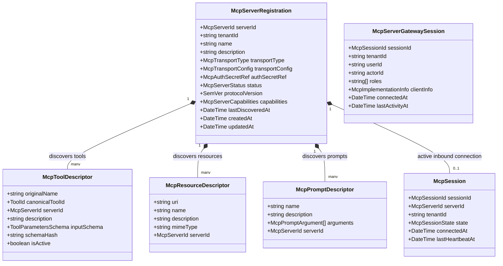
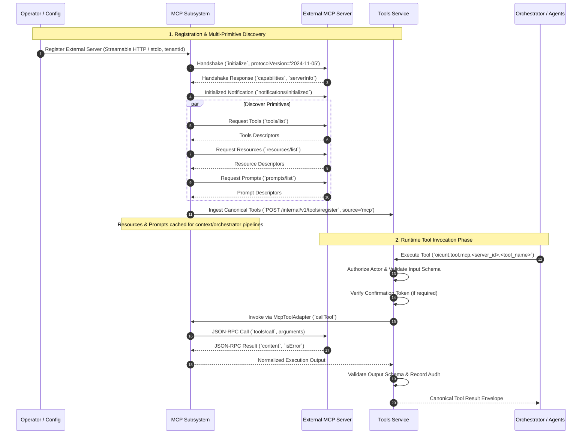
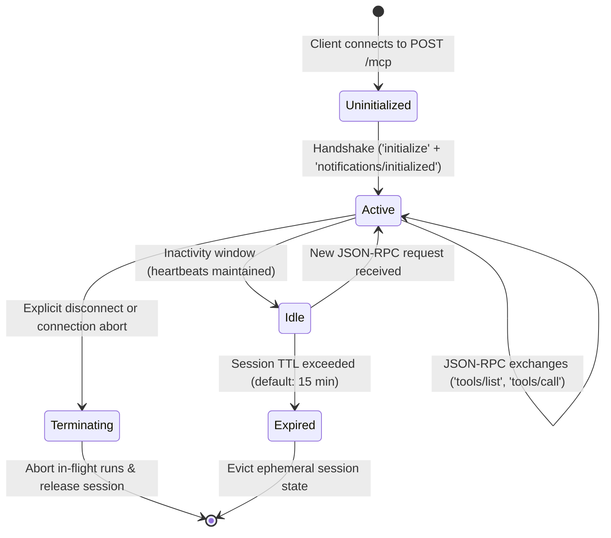
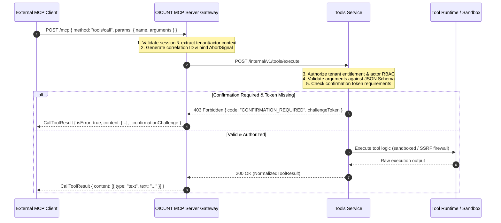
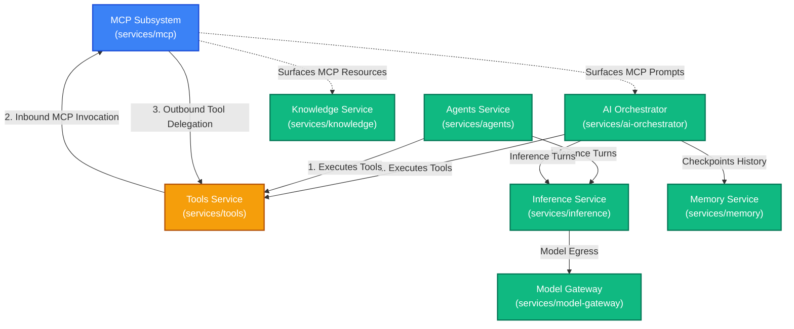

# OICUNT AI Platform Contract: Model Context Protocol (MCP) Architecture Specification

**Document Version**: 1.1.0  
**Status**: Authoritative Architectural Contract  
**Classification**: Engineering Architecture Standard  
**Subsystem**: `services/mcp` / Model Context Protocol Gateway & Bridge Boundary

---

## 1. Executive Summary & Core Mission

The **Model Context Protocol (MCP) Subsystem** (`services/mcp`) is the authoritative **interoperability protocol boundary** for the **OICUNT AI Platform**. It enables standardized, bidirectional capability exchange between OICUNT and external tool, resource, and prompt ecosystems using the open Model Context Protocol (MCP) specification.

MCP fulfills two distinct operational roles within the enterprise architecture:

1. **Consuming External MCP Servers (Inbound Capabilities)**: Connecting OICUNT agents and workflows to external MCP servers (such as local filesystem servers, GitHub, Postgres, Jira, or third-party enterprise servers) by discovering, normalizing, and registering their capabilities into the platform.
2. **Exposing OICUNT Capabilities through MCP (Outbound Capabilities)**: Serving approved OICUNT tools to external MCP-compliant clients (such as developer IDEs, desktop AI assistants, or partner agent runtimes) over secure, authenticated protocol transports.

> [!IMPORTANT]
> **The Cardinal Boundary Rule**:  
> **MCP is strictly an interoperability protocol boundary, NOT a second tool execution architecture.**  
> The **Tools Service** (`services/tools`) remains OICUNT's singular, authoritative runtime for capability cataloging, schema validation, actor authorization, cryptographic confirmation gating, sandboxed execution, SSRF firewalls, and audit logging.  
> External MCP tool capabilities **must enter OICUNT exclusively through the Tools boundary**. Conversely, an OICUNT MCP server **must delegate all execution directly back to the Tools Service** rather than executing capabilities itself.

```
┌────────────────────────────────────────────────────────────────────────────────────────┐
│                                External MCP Ecosystem                                  │
│       External MCP Clients (external desktop client, IDEs)  │  External MCP Servers (GitHub, DB)│
└──────────────────────────────────────┬─────────────────────────────────▲───────────────┘
                                       │ 1. Outbound Calls               │ 2. Inbound
                                       │    (Streamable HTTP / stdio)    │    Transport
                                       ▼                                 │
┌────────────────────────────────────────────────────────────────────────┴───────────────┐
│                          OICUNT MCP Subsystem (services/mcp)                           │
│                                                                                        │
│   ┌─────────────────────────────────────────┐  ┌────────────────────────────────────┐  │
│   │            OICUNT MCP Server            │  │        OICUNT MCP Client Bridge    │  │
│   │   • Protocol Handshake & Wire Framing   │  │   • Streamable HTTP / stdio Engine │  │
│   │   • External Client Auth & Tenant Scope │  │   • Multi-Primitive Discovery      │  │
│   │   • Outbound Tool Catalog Exposure      │  │   • Normalization into OICUNT Spec │  │
│   └────────────────────┬────────────────────┘  └─────────────────▲──────────────────┘  │
└────────────────────────┼─────────────────────────────────────────┼─────────────────────┘
                         │ Delegates Execution                     │ Dispatches Invocation
                         ▼                                         │ via McpToolAdapter
┌──────────────────────────────────────────────────────────────────┴─────────────────────┐
│                          Tools Service (services/tools)                                │
│                                                                                        │
│   • Canonical Tool Registry (`oicunt.tool.*`) • Multi-Tenant Authorization Perimeter   │
│   • JSON Schema (draft-07) Validation         • Cryptographic Ed25519 Confirmation     │
│   • SSRF Protection & Sandboxing              • Execution Auditing & Telemetry         │
└───────────────────────────────────▲────────────────────────────────────────────────────┘
                                    │ Authoritative Invocations
                                    │ (Zero Direct MCP Transport)
┌───────────────────────────────────┴────────────────────────────────────────────────────┐
│                    AI Orchestrator & Autonomous Agents Subsystems                      │
│            services/ai-orchestrator  │  services/agents  │  BILLY Assistant            │
└────────────────────────────────────────────────────────────────────────────────────────┘
```

---

## 2. Responsibilities & Non-Responsibilities

### 2.1 Authoritative Responsibilities (What MCP Owns)

1. **Protocol Framing & Standard Wire Transports**: Owns JSON-RPC 2.0 framing, encoding, decoding, and transport channel lifecycles conforming to the modern MCP specification:
   - **Streamable HTTP**: The primary remote transport for cloud-hosted MCP communication.
   - **stdio**: The supervised local subprocess transport for sidecars and containers.
   - **HTTP + SSE**: Legacy transport maintained strictly for backward compatibility with older servers/clients.
2. **External Server Connection Management**: Manages connection establishment, protocol version negotiation (canonical `2024-11-05`), health heartbeats, automatic reconnection backoff, and graceful session shutdown for registered external MCP servers.
3. **Multi-Primitive Discovery & Ingestion**: Queries external MCP servers across distinct primitive endpoints (`tools/list`, `resources/list`, `prompts/list`), ingests capability descriptors, detects dynamic change notifications (`notifications/tools/list_changed`, `notifications/resources/list_changed`), and maintains cache consistency.
4. **Tool Normalization**: Translates raw external MCP tool descriptors into canonical OICUNT `ToolDefinition` schemas conforming to platform standards, assigning deterministic namespaced identities (`oicunt.tool.mcp.<server_id>.<tool_name>`).
5. **Primitive Segregation**: Enforces strict boundaries between MCP tools, resources, and prompts, preventing primitive collapse into synthetic tools.
6. **Outbound MCP Server Gateway**: Serves approved OICUNT platform tools to authenticated external MCP clients over standardized Streamable HTTP and stdio transports.
7. **External Client Session & Context Boundary**: Authenticates incoming external MCP connections, enforces tenant-scoped isolation, extracts caller identity, and attaches tenant correlation metadata to downstream requests.
8. **Downstream Execution Delegation**: Forwards all MCP tool call requests (`tools/call`) to the internal Tools Service (`POST /internal/v1/tools/execute`) and packages normalized execution outputs into standard MCP result envelopes.
9. **Credential & Connection Configuration Storage**: Securely stores external MCP server endpoints, transport parameters, and encrypted authentication tokens.
10. **Protocol Error Normalization**: Maps wire-level JSON-RPC protocol errors (`-32700`, `-32600`, `-32601`, `-32602`, `-32603`) to canonical OICUNT error types and vice versa.
11. **Transport Observability**: Instruments OpenTelemetry spans and metrics for wire connection health, transport latency, RPC round-trip times, and session lifecycles without leaking payload data.

### 2.2 Explicit Non-Responsibilities (What MCP Must NOT Own)

1. **NO Tool Execution or Sandboxing**: The MCP subsystem **never** executes tool logic, runs arbitrary code, evaluates shell scripts, or maintains execution sandboxes. All execution belongs to the **Tools Service**.
2. **NO Independent Tool Authorization or Policy**: MCP does not make authoritative tool permission decisions or maintain separate access control lists. All authorization decisions belong to the **Tools Service**.
3. **NO Confirmation Token Generation or Verification**: Generating and signing cryptographic confirmation tokens (Ed25519) belongs exclusively to the **Tools Service**. MCP only transports confirmation tokens provided in requests.
4. **NO LLM Model Execution or Inference**: MCP never invokes model providers, never routes prompt completions, and never evaluates generative neural networks. Model execution belongs strictly to **Inference** and **Model Gateway**.
5. **NO Conversational Turn Loop or Agent State**: MCP does not maintain chat turn loops, context windows, message histories, or autonomous agent state machines. These belong to **AI Orchestrator**, **Memory**, and **Agents**.
6. **NO Direct Upstream Provider Access**: MCP never stores OpenAI, upstream provider, Gemini, or Bedrock API keys and never communicates with upstream AI model providers.
7. **NO Document Indexing or Vector Search**: Parsing document files, managing vector databases, or calculating text embeddings belong to **Knowledge** and **Embeddings**.
8. **NO Company-Wide User Authentication, Billing, or Usage Accounting**: User identity (AuthN), billing accounts, subscription tiers, and payment processing belong to the **Company Platform** (`platform`).
9. **NO Arbitrary Remote Code Execution (RCE)**: MCP never provides general-purpose remote execution or container breakout mechanisms.

---

## 3. MCP Primitive Taxonomy & Strict Segregation

A fundamental principle of the OICUNT MCP architecture is that **MCP primitives must remain distinct and must not be collapsed into a single Tool abstraction**:

```
┌────────────────────────────────────────────────────────────────────────────────────────┐
│                              MCP Protocol Primitives                                   │
├──────────────────────────┬─────────────────────────────┬───────────────────────────────┤
│        MCP Tools         │        MCP Resources        │          MCP Prompts          │
├──────────────────────────┼─────────────────────────────┼───────────────────────────────┤
│ • Executable actions     │ • URI-addressed context     │ • Parameterized templates     │
│ • Input parameters       │ • MIME-typed data           │ • Slash command bootstrapping │
│ • Side-effect potential  │ • Passive / Read-only       │ • User-initiated workflows    │
│ • Requires confirmation  │ • Subscribable updates      │ • Conversational scaffolding  │
├──────────────────────────┼─────────────────────────────┼───────────────────────────────┤
│        ↓ Mapped To       │         ↓ Mapped To         │          ↓ Mapped To          │
│   OICUNT Tools Service   │   Context / Knowledge RAG   │   AI Orchestrator Templates   │
│   (`oicunt.tool.mcp.*`)  │   (Context Hydration / RAG) │   (Prompt Assembly Pipeline)  │
└──────────────────────────┴─────────────────────────────┴───────────────────────────────┘
```

### 3.1 Primitive A: Tools (Executable Actions)

- **Nature**: Invocations that execute computational logic, invoke external APIs, perform mutations, or query operational systems (`tools/list`, `tools/call`).
- **OICUNT Mapping**:
  - Normalized into canonical OICUNT `ToolDefinition` entities under `source: 'mcp'`.
  - Registered in `services/tools` with deterministic identifiers (`oicunt.tool.mcp.<server_id>.<tool_name>`).
  - Executed exclusively through the Tools Service execution pipeline with full sandboxing, authorization, and confirmation token enforcement.

### 3.2 Primitive B: Resources (Contextual Data)

- **Nature**: Passive, URI-addressable reference materials, files, schema metadata, logs, or system state exposed by external systems (`resources/list`, `resources/read`, `resources/subscribe`).
- **OICUNT Mapping**:
  - **Resources remain resources and must NEVER automatically become Tools.**
  - Collapsing resources into synthetic read tools (e.g. `read_resource_xyz`) is strictly prohibited, as it pollutes model action spaces and misrepresents passive context as active tools.
  - In OICUNT, resources are ingested as:
    1. **Context Attachments**: Hydrated into model context windows by the AI Orchestrator when referenced by user or agent turns.
    2. **Knowledge Sources**: Extracted and indexed by the Knowledge Service (`services/knowledge`) for semantic retrieval and RAG augmentation.
  - Subscribed resource updates (`notifications/resources/updated`) emit internal cache-invalidation events to Knowledge and Orchestrator.

### 3.3 Primitive C: Prompts (Conversational Scaffolding)

- **Nature**: Pre-packaged, user-selectable conversational prompt templates with optional arguments (`prompts/list`, `prompts/get`), intended for workflow initialization and slash-command ergonomics.
- **OICUNT Mapping**:
  - **Prompts remain prompts and must NEVER automatically become Tools.**
  - Prompts are not executable functions; they are structured prompt recipes.
  - In OICUNT, MCP prompts are surfaced to the **AI Orchestrator** (`services/ai-orchestrator`) and consumer applications (such as BILLY) as selectable conversational templates. The Orchestrator resolves prompt arguments and initializes the conversation turn context accordingly.

---

## 4. MCP Transport Architecture (Modern Spec Alignment)

The MCP Subsystem aligns strictly with the current authoritative Model Context Protocol specification:

```
┌────────────────────────────────────────────────────────────────────────────────────────┐
│                              Standard MCP Transport Model                              │
├────────────────────────────────┬───────────────────────────────────────────────────────┤
│ Transport Channel              │ Architectural Role & Specification Status             │
├────────────────────────────────┼───────────────────────────────────────────────────────┤
│ **Streamable HTTP**            │ **Primary Remote Transport**                          │
│                                │ Standard modern remote transport for all HTTP traffic.│
│                                │ Chunked streaming responses, single endpoint session. │
├────────────────────────────────┼───────────────────────────────────────────────────────┤
│ **Supervised stdio**           │ **Primary Local Transport**                           │
│                                │ Supervised child process communication over pipes.    │
│                                │ Used for local sidecars, containers, and CLI hosts.   │
├────────────────────────────────┼───────────────────────────────────────────────────────┤
│ **HTTP + SSE**                 │ **Legacy / Backward-Compatibility Fallback**          │
│                                │ Historical transport utilizing split SSE downstream   │
│                                │ and HTTP POST upstream channels.                      │
└────────────────────────────────┴───────────────────────────────────────────────────────┘
```

> [!NOTE]
> **WebSocket Non-Core Status**:  
> WebSockets are **not** defined as a core transport in the official Model Context Protocol specification. OICUNT does not implement or require WebSocket framing for core MCP interoperability. Remote connections use Streamable HTTP.

### 4.1 Streamable HTTP (Primary Remote Transport)

- Modern standard for network-based MCP client-server communication.
- Operates over standard HTTP/1.1 or HTTP/2:
  - Client issues JSON-RPC requests via HTTP `POST` to the MCP endpoint.
  - Server responds with streaming HTTP responses (transfer-encoding: chunked) delivering streaming JSON-RPC responses and progress notifications.
  - Session state is coordinated via standard HTTP headers (`Mcp-Session-Id`) and secure cookies where applicable.
- Backed by platform TLS termination, mutual TLS (mTLS), and perimeter reverse proxies.

### 4.2 Supervised Local Subprocess (`stdio`)

- Used when connecting to local tools packaged as standalone executables, CLI binaries, or unprivileged container sidecars.
- The MCP Subsystem manages the subprocess lifecycle:
  - Spawns unprivileged child processes (`USER node` or dedicated sandbox user).
  - Binds standard input (`stdin`) and standard output (`stdout`) for newline-delimited JSON-RPC framing.
  - Redirects standard error (`stderr`) directly to OICUNT structured JSON logging for diagnostics.
  - Supervises process health: enforces maximum RSS memory limits, drops Linux capabilities, and executes graceful SIGTERM with a hard 5-second SIGKILL deadline on teardown.

### 4.3 HTTP + Server-Sent Events (Legacy Fallback)

- Maintained exclusively for backward compatibility with early MCP implementations.
- Client establishes an HTTP `GET` stream receiving `text/event-stream` messages for server-initiated events.
- Client submits upstream JSON-RPC messages via separate HTTP `POST` requests targeting an endpoint URI provided during the SSE connection handshake.

---

## 5. Architectural Domain Model & Core Aggregates



---

## 6. Direction A: Consuming External MCP Servers (Inbound Capabilities)



### 6.1 Capability Normalization into Canonical OICUNT Tool Schemas

1. **Deterministic Identity Generation**:
   $$\text{ToolId} = \text{"oicunt.tool.mcp."} + \text{serverId} + \text{"."} + \text{sanitizedToolName}$$
2. **Schema Sanitization**:
   - Parameter schemas are validated against standard JSON Schema (draft-07 / 2020-12).
   - Malformed schemas, unbounded recursion, and non-conforming types are rejected at discovery.
3. **Default Governance**:
   - Ingested external MCP tools default to `source: 'mcp'`.
   - Classified as `hasSideEffects: true` unless verified as read-only by registration policy.
   - Subject to platform confirmation gates and monotonic execution deadlines.

---

## 7. Direction B: OICUNT MCP Server Gateway (Phase 2 Outbound Architecture)

The **OICUNT MCP Server Gateway** enables external MCP-compliant clients (such as developer IDEs, desktop AI assistants, external agent runtimes, or partner platforms) to connect directly to the OICUNT AI Platform and utilize approved OICUNT tools through the standardized Model Context Protocol.

### 7.1 OICUNT MCP Server Boundary & Cardinal Execution Rule

```
External MCP Client (e.g. IDE / external desktop client)
        │
        │ 1. MCP JSON-RPC 2.0 (Streamable HTTP)
        ▼
┌────────────────────────────────────────────────────────────────────────┐
│               OICUNT MCP Server Gateway (services/mcp)                 │
│                                                                        │
│   • Wire Protocol Framing & Streamable HTTP Transport                  │
│   • Perimeter Authentication Termination & Tenant Context Binding      │
│   • Ephemeral Session Management (`Mcp-Session-Id`)                    │
│   • Dynamic Tool Catalog Projection (`tools/list`)                     │
│   • Request Cancellation & Deadline Propagation                        │
│   • Zero Tool Execution Logic • Zero Arbitrary Code Runtimes           │
└───────────────────────────────────┬────────────────────────────────────┘
                                    │
                                    │ 2. Delegated Execution & Discovery
                                    │    (POST /internal/v1/tools/execute)
                                    ▼
┌────────────────────────────────────────────────────────────────────────┐
│                     Tools Service (services/tools)                     │
│                                                                        │
│   • Canonical Tool Registry (`oicunt.tool.*`)                          │
│   • Multi-Tenant Entitlement & Actor RBAC Policy Enforcement           │
│   • JSON Schema (draft-07) Input & Output Validation                   │
│   • Cryptographic Ed25519 Confirmation Token Verification              │
│   • Sandboxed Execution, SSRF Firewall & Scrubbed Audit Logging        │
└────────────────────────────────────────────────────────────────────────┘
```

> [!IMPORTANT]
> **Cardinal Gateway Rule**:  
> The OICUNT MCP Server is **strictly an interoperability and protocol boundary**.  
> The MCP Server **never executes tool code directly**, never implements internal sandboxes, never bypasses Tools authorization, and never accesses tool implementations.  
> **All capability discovery and execution is delegated strictly to the internal Tools Service (`services/tools`)**.

---

### 7.2 Primary Transport & Wire Lifecycle: Streamable HTTP

Conforming to the modern MCP specification, **Streamable HTTP** serves as the primary remote transport for external clients connecting to the OICUNT MCP Server Gateway.

#### 7.2.1 Endpoint Structure

- **Unified Streamable HTTP Endpoint**: `POST /mcp`
  - Accepts standard JSON-RPC 2.0 payloads.
  - Returns either direct JSON-RPC responses or streaming chunked HTTP responses (`Transfer-Encoding: chunked`) depending on method characteristics.
- **Server-Sent Events (SSE) Stream Endpoint**: `GET /mcp` (or `GET /mcp/events`)
  - Supported for clients utilizing streaming events and server-initiated notifications.

#### 7.2.2 Wire Framing & Session Coordination

- **Session Header**: All requests following `initialize` MUST include the standard session identification header:
  ```http
  Mcp-Session-Id: mcp_sess_<uuid>
  ```
- **Content-Type**: Requests and responses enforce `application/json` or `text/event-stream`.
- **Keep-Alives & Latency Heartbeats**: Standard JSON-RPC `ping` requests are supported to evaluate connection health and preserve state through edge reverse proxies.
- **Non-Core Transport Status**: WebSockets are **explicitly excluded** as a core MCP wire transport.

#### 7.2.3 Server-Side Connection & Session Lifecycle



---

### 7.3 Phase 2 Supported Protocol Operations

The Phase 2 OICUNT MCP Server Gateway implements strictly the minimal necessary operations for secure, production-grade tool consumption:

| Operation                | JSON-RPC Method / Notification |     Type     | Description                                                                                                       |
| :----------------------- | :----------------------------- | :----------: | :---------------------------------------------------------------------------------------------------------------- |
| **Initialize Handshake** | `initialize`                   |   Request    | Negotiates protocol version (`2024-11-05`), exchanges implementation metadata, and registers client capabilities. |
| **Initialized Notice**   | `notifications/initialized`    | Notification | External client confirms completion of local initialization.                                                      |
| **List Tools**           | `tools/list`                   |   Request    | Enumerates approved tools permitted for the authenticated actor and tenant.                                       |
| **Call Tool**            | `tools/call`                   |   Request    | Invokes an approved tool with arguments, delegating synchronously to `services/tools`.                            |
| **Cancel Request**       | `notifications/cancelled`      | Notification | External client requests immediate abort of an in-flight tool call (`requestId`).                                 |
| **Ping Probe**           | `ping`                         |   Request    | Liveness probe returning an empty result object (`{}`).                                                           |

> [!NOTE]
> **Explicit Non-Scope for Phase 2**:  
> MCP Resources (`resources/*`) and Prompts (`prompts/*`) are **NOT** implemented in the Phase 2 Server Gateway. They remain reserved for future phases.

---

### 7.4 Perimeter Authentication & Identity Propagation

The OICUNT MCP Server Gateway operates behind the OICUNT platform security perimeter. It adheres to strict zero-trust identity rules:

```
External MCP Client
        │ Authorization: Bearer <client_api_key_or_token>
        ▼
┌────────────────────────────────────────────────────────────────────────┐
│                      Trusted Platform Perimeter                        │
│   • Validates client credential against Platform Auth Authority        │
│   • Resolves authoritative tenant, user, actor, and role claims        │
│   • Strips any untrusted client-supplied identity headers              │
└───────────────────────────────────┬────────────────────────────────────┘
                                    │ Validated Identity Context
                                    ▼
┌────────────────────────────────────────────────────────────────────────┐
│               OICUNT MCP Server Gateway (services/mcp)                 │
│   • Binds identity immutably to McpSession                             │
│   • Injects trusted headers for internal Tools Service calls           │
└───────────────────────────────────┬────────────────────────────────────┘
                                    │ Trusted Internal Headers:
                                    │ X-Tenant-ID, X-User-ID, X-Actor-ID,
                                    │ X-Correlation-ID, Authorization: Bearer
                                    ▼
┌────────────────────────────────────────────────────────────────────────┐
│                     Tools Service (services/tools)                     │
└────────────────────────────────────────────────────────────────────────┘
```

1. **Untrusted Client Identity Headers**: External clients are **strictly forbidden** from supplying identity headers (`X-Tenant-ID`, `X-User-ID`, `X-Actor-ID`). Any such headers arriving from external clients are discarded at the perimeter.
2. **Authoritative Credential Validation**: Clients authenticate via standard HTTP credentials (Platform API keys or user OAuth/JWT bearer tokens). The perimeter verifies the token and resolves:
   - `tenantId`: The customer organization / tenant boundary.
   - `userId`: The individual human user identity.
   - `actorId`: The principal identity for RBAC resolution.
   - `actorRoles`: Assigned security roles (e.g. `['developer', 'operator']`).
3. **Immutable Session Binding**: During the `initialize` handshake, the resolved identity is locked to the newly allocated `Mcp-Session-Id`. Every subsequent request bearing that session ID executes strictly under that authenticated identity.
4. **Internal Header Propagation**: When dispatching calls downstream to the Tools Service, the MCP Server attaches trusted internal headers:
   - `X-Tenant-ID: <session.tenantId>`
   - `X-User-ID: <session.userId>`
   - `X-Actor-ID: <session.actorId>`
   - `X-Correlation-ID: <correlationId>`
   - `X-Request-ID: <requestId>`
   - `Authorization: Bearer <internal_service_token>`

---

### 7.5 Multi-Tenant Isolation & Actor Scoping

Multi-tenant isolation is enforced at every layer of the MCP Server Gateway:

1. **Session-Level Isolation**: Every MCP session is bound to a single authoritative `tenantId`. A session cannot bridge, switch, or inspect another tenant's boundaries.
2. **Catalog Scoping (`tools/list`)**: When `tools/list` is called, the Gateway queries `services/tools` with the session's `tenantId` and `actorId`. Only tools actively enabled for that tenant and permitted by the actor's RBAC roles are returned.
3. **Execution Scoping (`tools/call`)**: When `tools/call` is executed, the Gateway validates that the tool invocation is routed with the session's authoritative `tenantId`. The Tools Service independently validates tenant entitlement before execution. Cross-tenant enumeration and invocation are impossible.

---

### 7.6 Dynamic Tool Catalog Projection

The OICUNT MCP Server does **NOT** maintain an independent authoritative tool catalog. Tools are projected dynamically from the Tools Service:

```
Tools Service (ToolDefinition)
        ↓
McpToolExporter / Projection Engine
        ↓
MCP Tool Descriptor (name, description, inputSchema)
```

1. **Dynamic Catalog Query**: On `tools/list`, the MCP Gateway queries:
   ```http
   GET /internal/v1/tools?tenantId={tenantId}&actorId={actorId}&format=mcp
   ```
2. **Projection Rules**:
   - **Tool Name**: The canonical `toolId` (e.g. `oicunt.tool.calculator.evaluate`) is projected as the MCP tool `name`.
   - **Description**: Projected directly from `ToolDefinition.description`.
   - **Parameters Schema**: Projected as `inputSchema`, conforming strictly to JSON Schema (draft-07).
3. **Cache Policy**: The Gateway may maintain a short-lived in-memory cache (TTL $\le 60\,\text{s}$) keyed by `(tenantId, actorId)` to prevent excessive internal RPCs, invalidated immediately if the platform signals tool state changes.

---

### 7.7 Tool Execution Delegation Pipeline & Invariants



#### Cardinal Execution Invariants:

1. **No Code Execution in MCP**: `services/mcp` contains zero execution runtimes, child sandboxes, or command evaluators.
2. **No Direct Tool Implementation Access**: MCP communicates with tools exclusively via the HTTP API of `services/tools`.
3. **No Authorization Bypass**: All capability executions pass through the Tools Service authorization engine.
4. **No Confirmation Bypass**: Any tool marked `requiresConfirmation: true` halts until a cryptographic confirmation token is presented.
5. **No Schema Bypass**: Parameter schemas are validated by the Tools Service against formal JSON Schemas.
6. **No Audit Bypass**: Every tool execution is durably audited in `services/tools`.

---

### 7.8 Human-in-the-Loop Confirmation Gating via MCP

Tools performing high-impact or destructive side-effects (`requiresConfirmation: true`) cannot execute on client initiative alone without human approval.

#### 7.8.1 Challenge Delivery

When an external client calls a confirmation-gated tool without a valid confirmation token, the Tools Service returns a `CONFIRMATION_REQUIRED` error with a cryptographically signed `challengeToken`. The MCP Gateway surfaces this as a structured `CallToolResult`:

```json
{
  "content": [
    {
      "type": "text",
      "text": "Action requires confirmation: This tool modifies protected infrastructure. Please confirm with your approval token."
    }
  ],
  "isError": true,
  "_confirmationChallenge": {
    "status": "confirmation_required",
    "toolId": "oicunt.tool.database.migrate",
    "challengeToken": "chlg_ed25519_9f82b7c4a1e...",
    "expiresAt": "2026-10-07T12:30:00Z"
  }
}
```

#### 7.8.2 Approval Resumption

1. The human user reviews and approves the operation in the client UI or OICUNT console.
2. An Ed25519-signed `confirmationToken` is issued.
3. The client re-submits `tools/call`, providing the token in `arguments._confirmationToken` or request metadata.
4. The MCP Gateway extracts the token and forwards it in `ToolExecutionRequest.confirmationToken`.
5. The Tools Service verifies the Ed25519 signature against its verification key, checks token expiration, and proceeds with execution.
6. The MCP Gateway remains strictly a transport for the challenge and token; **Tools Service remains the sole confirmation signing and verification authority**.

---

### 7.9 Bidirectional Error Normalization

Errors are normalized across the JSON-RPC wire boundary while preventing internal security leaks:

| OICUNT / Tools Error     | HTTP Status | MCP Wire Mapping                                      | MCP Representation                                   |
| :----------------------- | :---------: | :---------------------------------------------------- | :--------------------------------------------------- |
| `INVALID_TOOL_ARGUMENTS` |     400     | JSON-RPC `-32602` (Invalid params) or `isError: true` | Validation error message describing offending fields |
| `TOOL_NOT_FOUND`         |     404     | JSON-RPC `-32601` (Method not found)                  | `"Tool not found in tenant catalog"`                 |
| `PERMISSION_DENIED`      |     403     | JSON-RPC `-32003` (Unauthorized) or `isError: true`   | `"Unauthorized: actor lacks required role"`          |
| `CONFIRMATION_REQUIRED`  |     403     | `CallToolResult` with `isError: true`                 | Structured confirmation challenge payload            |
| `DEADLINE_EXCEEDED`      |     504     | JSON-RPC `-32008` (Timeout) or `isError: true`        | `"Execution exceeded monotonic deadline"`            |
| `REQUEST_CANCELLED`      |     499     | JSON-RPC `-32000` (Cancelled)                         | `"Execution cancelled by caller"`                    |
| `TOOL_RATE_LIMITED`      |     429     | JSON-RPC `-32029` (Rate limited)                      | `"Rate limit exceeded; retry after backoff"`         |
| `TOOL_EXECUTION_FAILED`  |     502     | `CallToolResult` with `isError: true`                 | Sanitized tool execution failure summary             |
| `INTERNAL_TOOL_ERROR`    |     500     | JSON-RPC `-32603` (Internal error)                    | Generic sanitized internal error message             |

#### Information Leakage Protection:

- Internal database connection errors, stack traces, hostnames, and internal IP addresses are **never** returned to external MCP clients.
- Error payloads are scrubbed to return actionable, safe diagnostic messages.

---

### 7.10 Cancellation, Deadlines & Side-Effect Safety

#### 7.10.1 Cancellation Propagation

- When an external client sends `notifications/cancelled` with `requestId`, the MCP Gateway matches the active in-flight request.
- The Gateway signals the attached `AbortController`, aborting the downstream HTTP request to the Tools Service.
- The Tools Service terminates sandboxed execution and aborts network operations promptly.

#### 7.10.2 Monotonic Deadlines

- Each request enforces a strict maximum execution deadline (default: 30 seconds).
- The deadline is propagated to the Tools Service via the `X-Deadline-At` header.
- If the deadline expires before completion, the execution is terminated immediately.

#### 7.10.3 Disconnect Handling

- If an external client disconnects or the TCP socket drops mid-flight, all active executions tied to that request or session are immediately aborted.

#### 7.10.4 Side-Effect Safety & Retry Prohibitions

> [!CAUTION]
> **Cardinal Side-Effect Rule**:  
> The OICUNT MCP Server Gateway **NEVER automatically retries failed or dropped tool calls that possess side effects (`hasSideEffects: true`)**.  
> If a network disconnect occurs during a mutating tool call, the Gateway reports the disconnect failure without re-dispatching the operation.

---

### 7.11 Ephemeral Session Management

Session state in the MCP Server Gateway is strictly ephemeral:

```typescript
export interface McpServerGatewaySession {
  readonly sessionId: string;
  readonly tenantId: string;
  readonly userId: string;
  readonly actorId: string;
  readonly roles: readonly string[];
  readonly clientInfo: {
    readonly name: string;
    readonly version: string;
  };
  readonly connectedAt: string;
  lastActivityAt: string;
}
```

1. **Storage Location**: Sessions reside strictly in **memory** within `services/mcp`. No session rows are persisted to PostgreSQL.
2. **Inactivity Expiration**: Sessions with no activity for 15 minutes (`900_000` ms) are automatically evicted.
3. **Maximum Session Lifetime**: Hard cap of 24 hours per session, requiring periodic client re-handshake.
4. **Multiplexed Requests**: Multiple concurrent JSON-RPC requests within the same session are supported concurrently, each isolated with its own request ID and cancellation signal.
5. **Zero Execution History in MCP**: Execution logs and audit trails are durably owned exclusively by `services/tools`. MCP retains zero durable execution records.

---

### 7.12 Gateway Security Posture & Guardrails

1. **Strict Perimeter Authentication**: Unauthenticated requests are rejected with `401 Unauthorized` before reaching protocol handlers.
2. **Payload Size Guardrails**: HTTP request bodies are capped at 2 MB. Tool parameter nesting depth is capped at 10 levels.
3. **Rate Limiting Perimeter**: Enforces per-tenant and per-session rate limits to protect internal tool backends from denial-of-service.
4. **Secret & Credential Masking**: Internal service tokens, database passwords, and API keys are never serialized in responses, logs, or error payloads.
5. **Zero Remote Code Execution (RCE)**: The Gateway contains no interpreters, eval loops, or shell execution mechanisms.

---

### 7.13 Observability & Telemetry Standards

The Gateway emits telemetry adhering to platform OpenTelemetry and logging standards:

1. **Metrics**:
   - `mcp.gateway.sessions.active`: Active connected external sessions gauge.
   - `mcp.gateway.requests.total`: Counter by method (`initialize`, `tools/list`, `tools/call`) and status.
   - `mcp.gateway.latency_ms`: Histogram of RPC request latency.
   - `mcp.gateway.tool_executions.total`: Counter by `toolId`, `tenantId`, and result status.
   - `mcp.gateway.cancellations.total`: Counter of client-initiated cancellations.
2. **Distributed Tracing**:
   - Initiates W3C trace spans for incoming MCP requests (`mcp.server.handle_request`).
   - Propagates `traceparent` and correlation IDs downstream to the Tools Service.
3. **Sanitized Structured Logging**:
   - Logs session lifecycles, RPC methods, and execution durations.
   - Parameter arguments and tool outputs are **never** logged in cleartext to prevent PII and credential leakage.

---

### 7.14 Future Boundaries (Explicit Non-Scope for Phase 2)

The following capabilities are explicitly deferred to future milestones and MUST NOT be included in Phase 2:

1. **MCP Resources Boundary**: Exposing platform documents, conversation memory, or knowledge bases as MCP resources (`resources/*`).
2. **MCP Prompts Boundary**: Exposing platform prompt templates as MCP prompts (`prompts/*`).
3. **Dynamic Resource & Tool Subscriptions**: Server-initiated push notifications (`resources/subscribe`, `tools/list_changed`).
4. **Public Developer Self-Service Portal**: Web portal for external developers to self-provision API keys.
5. **OAuth 2.0 PKCE Server**: Full third-party OAuth 2.0 authorization server integration.
6. **MCP Tool Marketplace / Registry**: Public marketplace for third-party tool discovery.
7. **Alternative Remote Transports**: WebSockets, gRPC, or custom socket transports.

---

## 8. Subsystem Inter-Service Relationships Across the AI Platform



### 8.1 Tools Service Boundary

- **The Sole Capability Boundary**: The Tools Service is the platform's singular capability catalog and execution runtime in both directions.
- **Direction A (Inbound Consumption)**: External MCP tools are normalized and registered in `services/tools` under `source: 'mcp'`. When an internal agent or orchestrator executes one of these tools, the invocation routes through the Tools Service pipeline and dispatches via [`McpToolAdapter`](file:///c:/CodeBase/OICUNT/ai-platform/services/tools/src/infrastructure/adapters/mcp-tool.adapter.ts) into the MCP subsystem's `McpToolCaller` interface.
- **Direction B (Outbound Exposure)**: External MCP clients connect to the OICUNT MCP Server Gateway. When a client invokes an OICUNT tool via `tools/call`, the MCP Gateway delegates execution directly to the Tools Service (`POST /internal/v1/tools/execute`). The Tools Service evaluates tenant entitlements, validates JSON Schemas, verifies cryptographic Ed25519 confirmation tokens, executes the tool within its sandboxed runtime, and durably records audit logs.
- **Zero Capability Bypass**: Neither direction ever bypasses the Tools Service. Neither direction ever executes arbitrary code in `services/mcp`.

### 8.2 AI Orchestrator & Autonomous Agents Boundary

- Orchestrator and Agents **never** implement MCP wire transports or manage child processes.
- To an agent, an MCP tool is indistinguishable from any other canonical tool: it is simply an `oicunt.tool.*` identifier.
- MCP prompts are consumed by the Orchestrator as prompt scaffolding, completely decoupled from tool execution.

### 8.3 Knowledge Service Boundary

- External MCP resources are read by Knowledge ingestion pipelines as external documents; they are never treated as executable tools.

---

## 9. Security Architecture & Threat Mitigation

### 9.1 Multi-Tenant Isolation

- External MCP server registrations and client sessions are strictly partitioned by `tenantId`. Cross-tenant discovery or execution is impossible.

### 9.2 SSRF Mitigation & Network Governance

- All remote Streamable HTTP / SSE endpoints pass through the platform SSRF firewall:
  - Blocks loopback addresses (`127.0.0.0/8`, `::1`).
  - Blocks private RFC-1918 subnets (`10.0.0.0/8`, `172.16.0.0/12`, `192.168.0.0/16`).
  - Blocks cloud link-local metadata endpoints (`169.254.169.254`, `fe80::/10`).
  - Enforces HTTPS in production environments.

### 9.3 Untrusted Metadata & Process Sandboxing

- Tool schemas are capped at 64 KB, and external servers are capped at 100 tools per registration.
- Local `stdio` subprocesses run unprivileged under non-root execution profiles with memory caps and hard signal deadlines.

### 9.4 Credential Containment

- Authentication tokens for external servers are encrypted at rest using AES-256-GCM and injected only at the transport egress boundary.
- Credentials never leak into structured logs, traces, or client-facing errors.

---

## 10. Reliability, Resilience & Side-Effect Safety

### 10.1 Connection Failures & Reconnection

- Active sessions maintain protocol heartbeats. If a connection drops, exponential backoff reconnection is applied with jitter.
- During disconnection, all tools associated with that server fail fast with `TOOL_UNAVAILABLE` (503).

### 10.2 Strict Prohibition on Unsafe Automatic Retries

- **Read-Only Invocations (`isReadOnly: true`)**: Transient transport drops may be retried at most twice with jitter.
- **Side-Effecting Invocations (`hasSideEffects: true`)**: **NEVER automatically retried at the transport layer**. If a connection drops during a side-effecting call, an error is returned immediately to prevent duplicated real-world side effects.

### 10.3 Monotonic Deadlines & Cancellation

- Monotonic execution deadlines (`deadlineMs`) are strictly propagated.
- Upstream client cancellations (`AbortSignal`) immediately emit standard `notifications/cancelled` JSON-RPC messages.

---

## 11. Persistence Model: Durable vs. Ephemeral State

```
┌────────────────────────────────────────────────────────────────────────┐
│                        Durable State (PostgreSQL)                      │
│                                                                        │
│   • External Server Registrations (`mcp_servers`)                      │
│   • Normalized Capability Metadata Cache (`mcp_server_tools`)          │
│   • Discovered Resource & Prompt Metadata                              │
│   • Server Health & Last Discovery Timestamps                          │
└────────────────────────────────────────────────────────────────────────┘

┌────────────────────────────────────────────────────────────────────────┐
│                     Ephemeral State (In-Memory Only)                   │
│                                                                        │
│   • Active Wire Transports (Streamable HTTP sessions)                  │
│   • Supervised Child Process Handles & PIDs (stdio)                    │
│   • Pending JSON-RPC Request Promises & Timers                         │
│   • Connected External Client Sessions                                │
└────────────────────────────────────────────────────────────────────────┘
```

> [!IMPORTANT]
> **Zero Execution History in MCP**: Execution records, input arguments, returned outputs, and invocation audit logs are **durably owned exclusively by the Tools Service** (`tool_executions` and `tool_audits` tables). The MCP subsystem never maintains a separate tool execution log.

---

## 12. Architectural Invariants Checklist

Any future implementation of the MCP subsystem MUST satisfy all invariants below:

- [ ] MCP is strictly an interoperability protocol boundary; it **never** executes tool logic directly.
- [ ] Tools Service (`services/tools`) is the sole execution, sandboxing, and governance boundary for all capabilities.
- [ ] External MCP tool capabilities enter OICUNT exclusively through the Tools Service under `source: 'mcp'`.
- [ ] The OICUNT MCP Server delegates all tool invocations directly to the Tools Service (`POST /internal/v1/tools/execute`).
- [ ] MCP primitives remain strictly segregated: Tools &rarr; Tools Service, Resources &rarr; Context/Knowledge, Prompts &rarr; Orchestrator templates.
- [ ] Resources and Prompts are **never** collapsed into synthetic Tool definitions.
- [ ] Streamable HTTP is the primary remote transport; stdio is the supervised local subprocess transport; HTTP+SSE is legacy fallback.
- [ ] WebSockets are not treated as a core MCP wire transport.
- [ ] Agents and AI Orchestrator **never** implement MCP wire transports or manage child processes.
- [ ] All external tool IDs follow canonical naming: `oicunt.tool.mcp.<server_id>.<tool_name>`.
- [ ] JSON Schema validation (draft-07 / 2020-12) is mandatory for all ingested and exported tool schemas.
- [ ] External MCP endpoints are strictly validated against SSRF protection policies (blocking private and loopback IPs).
- [ ] Multi-tenant isolation is enforced for all external server registrations and inbound client sessions.
- [ ] Credentials for external MCP servers are encrypted at rest and never exposed in logs or traces.
- [ ] Supervised `stdio` child processes run unprivileged with memory caps, executable allowlist, and strict signal termination.
- [ ] Phase 1: Inbound tools discovered from external servers enter OICUNT exclusively through the Tools Service under `source: 'mcp'`.
- [ ] Phase 1: Upstream client cancellations (`AbortSignal`) immediately emit `notifications/cancelled` to external MCP servers.
- [ ] Phase 2: OICUNT MCP Server Gateway exposes capabilities over Streamable HTTP (`POST /mcp`, `Mcp-Session-Id`).
- [ ] Phase 2: External client identity headers (`X-Tenant-ID`, `X-User-ID`, `X-Actor-ID`) are rejected at the perimeter; authoritative claims are resolved at perimeter and bound immutably to the session.
- [ ] Phase 2: External client sessions are strictly isolated to their authenticated tenant; cross-tenant tool discovery and invocation are impossible.
- [ ] Phase 2: The MCP Server Gateway maintains no independent tool catalog; tools are projected dynamically from the Tools Service (`GET /internal/v1/tools`).
- [ ] Phase 2: The MCP Server Gateway never executes tool logic directly and never bypasses Tools authorization, confirmation gates, schema validation, or audit logging.
- [ ] Phase 2: Confirmation challenges (`CONFIRMATION_REQUIRED`) are transported as structured challenges; Ed25519 verification remains owned exclusively by the Tools Service.
- [ ] Phase 2: External client cancellations (`notifications/cancelled`) propagate downstream cancellation (`AbortSignal`) to the Tools Service.
- [ ] Zero unsafe retries: MCP never automatically retries failed or disconnected side-effecting tool calls in either direction.
- [ ] MCP state is partitioned: configurations and metadata caches are durable; wire connections and client sessions are strictly ephemeral (in-memory only).
- [ ] Tool execution histories and audit records are owned strictly by the Tools Service, never duplicated in MCP.
- [ ] Standard `/health/liveness` and `/health/readiness` probes are exposed.
