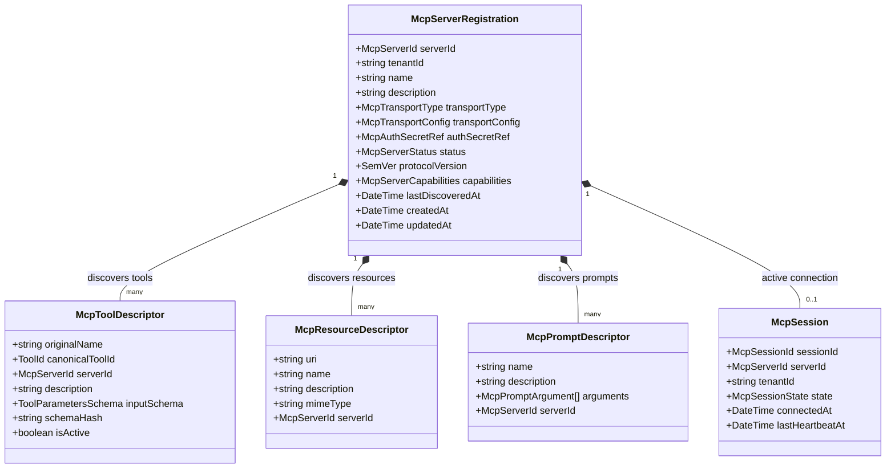
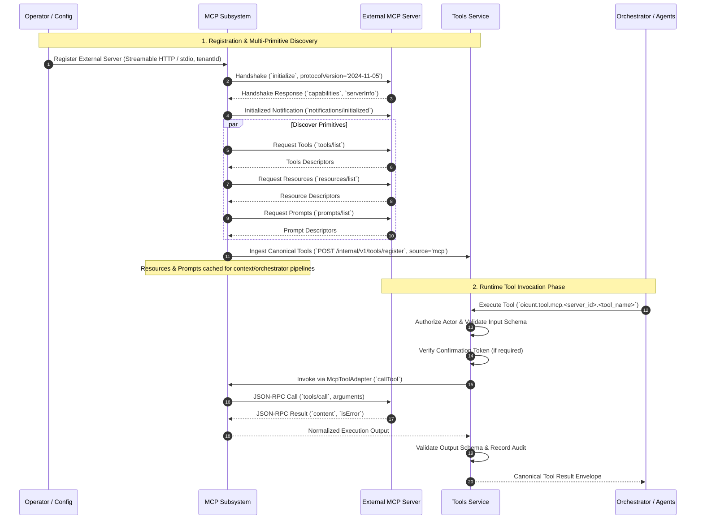
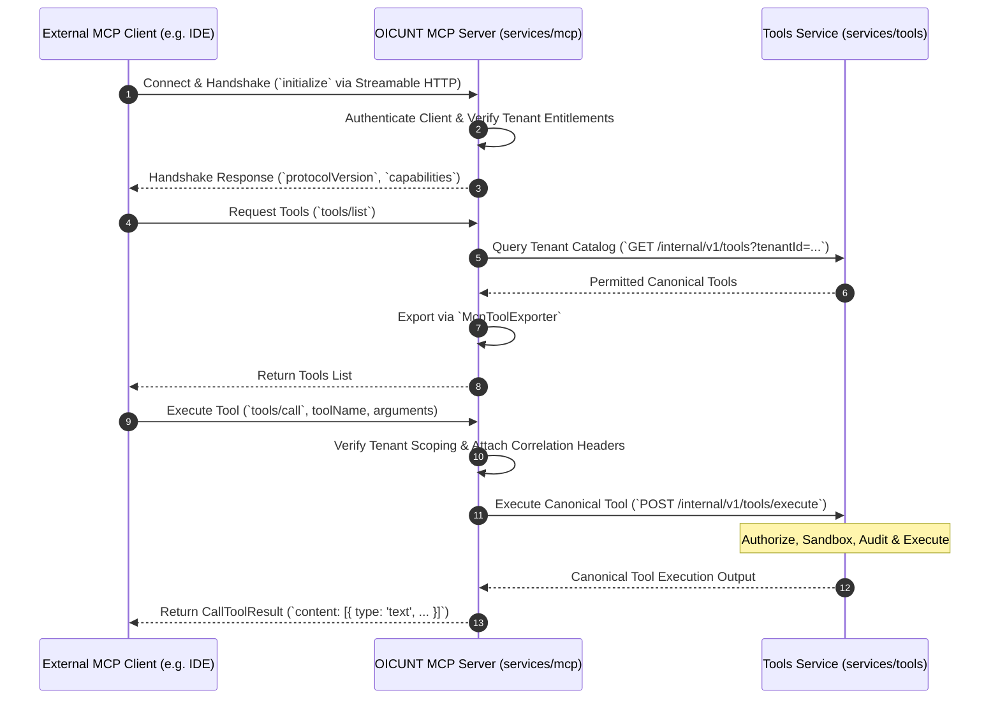
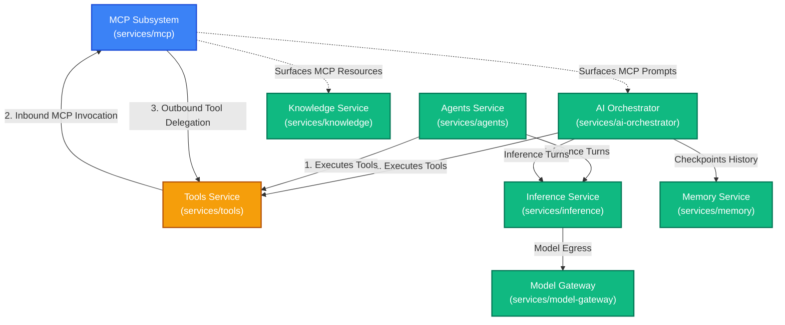

# OICUNT AI Platform Contract: Model Context Protocol (MCP) Architecture Specification

**Document Version**: 1.1.0  
**Status**: Authoritative Architectural Contract  
**Classification**: Engineering Architecture Standard  
**Subsystem**: `services/mcp` / Model Context Protocol Gateway & Bridge Boundary

---

## 1. Executive Summary & Core Mission

The **Model Context Protocol (MCP) Subsystem** (`services/mcp`) is the authoritative **interoperability protocol boundary** for the **OICUNT AI Platform**. It enables standardized, bidirectional capability exchange between OICUNT and external tool, resource, and prompt ecosystems using the open Model Context Protocol (MCP) specification.

MCP fulfills two distinct operational roles within the enterprise architecture:

1. **Consuming External MCP Servers (Inbound Capabilities)**: Connecting OICUNT agents and workflows to external MCP servers (such as local filesystem servers, GitHub, Postgres, Jira, or third-party enterprise servers) by discovering, normalizing, and registering their capabilities into the platform.
2. **Exposing OICUNT Capabilities through MCP (Outbound Capabilities)**: Serving approved OICUNT tools to external MCP-compliant clients (such as developer IDEs, desktop AI assistants, or partner agent runtimes) over secure, authenticated protocol transports.

> [!IMPORTANT]
> **The Cardinal Boundary Rule**:  
> **MCP is strictly an interoperability protocol boundary, NOT a second tool execution architecture.**  
> The **Tools Service** (`services/tools`) remains OICUNT's singular, authoritative runtime for capability cataloging, schema validation, actor authorization, cryptographic confirmation gating, sandboxed execution, SSRF firewalls, and audit logging.  
> External MCP tool capabilities **must enter OICUNT exclusively through the Tools boundary**. Conversely, an OICUNT MCP server **must delegate all execution directly back to the Tools Service** rather than executing capabilities itself.

```
┌────────────────────────────────────────────────────────────────────────────────────────┐
│                                External MCP Ecosystem                                  │
│       External MCP Clients (Claude Desktop, IDEs)  │  External MCP Servers (GitHub, DB)│
└──────────────────────────────────────┬─────────────────────────────────▲───────────────┘
                                       │ 1. Outbound Calls               │ 2. Inbound
                                       │    (Streamable HTTP / stdio)    │    Transport
                                       ▼                                 │
┌────────────────────────────────────────────────────────────────────────┴───────────────┐
│                          OICUNT MCP Subsystem (services/mcp)                           │
│                                                                                        │
│   ┌─────────────────────────────────────────┐  ┌────────────────────────────────────┐  │
│   │            OICUNT MCP Server            │  │        OICUNT MCP Client Bridge    │  │
│   │   • Protocol Handshake & Wire Framing   │  │   • Streamable HTTP / stdio Engine │  │
│   │   • External Client Auth & Tenant Scope │  │   • Multi-Primitive Discovery      │  │
│   │   • Outbound Tool Catalog Exposure      │  │   • Normalization into OICUNT Spec │  │
│   └────────────────────┬────────────────────┘  └─────────────────▲──────────────────┘  │
└────────────────────────┼─────────────────────────────────────────┼─────────────────────┘
                         │ Delegates Execution                     │ Dispatches Invocation
                         ▼                                         │ via McpToolAdapter
┌──────────────────────────────────────────────────────────────────┴─────────────────────┐
│                          Tools Service (services/tools)                                │
│                                                                                        │
│   • Canonical Tool Registry (`oicunt.tool.*`) • Multi-Tenant Authorization Perimeter   │
│   • JSON Schema (draft-07) Validation         • Cryptographic Ed25519 Confirmation     │
│   • SSRF Protection & Sandboxing              • Execution Auditing & Telemetry         │
└───────────────────────────────────▲────────────────────────────────────────────────────┘
                                    │ Authoritative Invocations
                                    │ (Zero Direct MCP Transport)
┌───────────────────────────────────┴────────────────────────────────────────────────────┐
│                    AI Orchestrator & Autonomous Agents Subsystems                      │
│            services/ai-orchestrator  │  services/agents  │  BILLY Assistant            │
└────────────────────────────────────────────────────────────────────────────────────────┘
```

---

## 2. Responsibilities & Non-Responsibilities

### 2.1 Authoritative Responsibilities (What MCP Owns)

1. **Protocol Framing & Standard Wire Transports**: Owns JSON-RPC 2.0 framing, encoding, decoding, and transport channel lifecycles conforming to the modern MCP specification:
   - **Streamable HTTP**: The primary remote transport for cloud-hosted MCP communication.
   - **stdio**: The supervised local subprocess transport for sidecars and containers.
   - **HTTP + SSE**: Legacy transport maintained strictly for backward compatibility with older servers/clients.
2. **External Server Connection Management**: Manages connection establishment, protocol version negotiation (canonical `2024-11-05`), health heartbeats, automatic reconnection backoff, and graceful session shutdown for registered external MCP servers.
3. **Multi-Primitive Discovery & Ingestion**: Queries external MCP servers across distinct primitive endpoints (`tools/list`, `resources/list`, `prompts/list`), ingests capability descriptors, detects dynamic change notifications (`notifications/tools/list_changed`, `notifications/resources/list_changed`), and maintains cache consistency.
4. **Tool Normalization**: Translates raw external MCP tool descriptors into canonical OICUNT `ToolDefinition` schemas conforming to platform standards, assigning deterministic namespaced identities (`oicunt.tool.mcp.<server_id>.<tool_name>`).
5. **Primitive Segregation**: Enforces strict boundaries between MCP tools, resources, and prompts, preventing primitive collapse into synthetic tools.
6. **Outbound MCP Server Gateway**: Serves approved OICUNT platform tools to authenticated external MCP clients over standardized Streamable HTTP and stdio transports.
7. **External Client Session & Context Boundary**: Authenticates incoming external MCP connections, enforces tenant-scoped isolation, extracts caller identity, and attaches tenant correlation metadata to downstream requests.
8. **Downstream Execution Delegation**: Forwards all MCP tool call requests (`tools/call`) to the internal Tools Service (`POST /internal/v1/tools/execute`) and packages normalized execution outputs into standard MCP result envelopes.
9. **Credential & Connection Configuration Storage**: Securely stores external MCP server endpoints, transport parameters, and encrypted authentication tokens.
10. **Protocol Error Normalization**: Maps wire-level JSON-RPC protocol errors (`-32700`, `-32600`, `-32601`, `-32602`, `-32603`) to canonical OICUNT error types and vice versa.
11. **Transport Observability**: Instruments OpenTelemetry spans and metrics for wire connection health, transport latency, RPC round-trip times, and session lifecycles without leaking payload data.

### 2.2 Explicit Non-Responsibilities (What MCP Must NOT Own)

1. **NO Tool Execution or Sandboxing**: The MCP subsystem **never** executes tool logic, runs arbitrary code, evaluates shell scripts, or maintains execution sandboxes. All execution belongs to the **Tools Service**.
2. **NO Independent Tool Authorization or Policy**: MCP does not make authoritative tool permission decisions or maintain separate access control lists. All authorization decisions belong to the **Tools Service**.
3. **NO Confirmation Token Generation or Verification**: Generating and signing cryptographic confirmation tokens (Ed25519) belongs exclusively to the **Tools Service**. MCP only transports confirmation tokens provided in requests.
4. **NO LLM Model Execution or Inference**: MCP never invokes model providers, never routes prompt completions, and never evaluates generative neural networks. Model execution belongs strictly to **Inference** and **Model Gateway**.
5. **NO Conversational Turn Loop or Agent State**: MCP does not maintain chat turn loops, context windows, message histories, or autonomous agent state machines. These belong to **AI Orchestrator**, **Memory**, and **Agents**.
6. **NO Direct Upstream Provider Access**: MCP never stores OpenAI, Anthropic, Gemini, or Bedrock API keys and never communicates with upstream AI model providers.
7. **NO Document Indexing or Vector Search**: Parsing document files, managing vector databases, or calculating text embeddings belong to **Knowledge** and **Embeddings**.
8. **NO Company-Wide User Authentication, Billing, or Usage Accounting**: User identity (AuthN), billing accounts, subscription tiers, and payment processing belong to the **Company Platform** (`platform`).
9. **NO Arbitrary Remote Code Execution (RCE)**: MCP never provides general-purpose remote execution or container breakout mechanisms.

---

## 3. MCP Primitive Taxonomy & Strict Segregation

A fundamental principle of the OICUNT MCP architecture is that **MCP primitives must remain distinct and must not be collapsed into a single Tool abstraction**:

```
┌────────────────────────────────────────────────────────────────────────────────────────┐
│                              MCP Protocol Primitives                                   │
├──────────────────────────┬─────────────────────────────┬───────────────────────────────┤
│        MCP Tools         │        MCP Resources        │          MCP Prompts          │
├──────────────────────────┼─────────────────────────────┼───────────────────────────────┤
│ • Executable actions     │ • URI-addressed context     │ • Parameterized templates     │
│ • Input parameters       │ • MIME-typed data           │ • Slash command bootstrapping │
│ • Side-effect potential  │ • Passive / Read-only       │ • User-initiated workflows    │
│ • Requires confirmation  │ • Subscribable updates      │ • Conversational scaffolding  │
├──────────────────────────┼─────────────────────────────┼───────────────────────────────┤
│        ↓ Mapped To       │         ↓ Mapped To         │          ↓ Mapped To          │
│   OICUNT Tools Service   │   Context / Knowledge RAG   │   AI Orchestrator Templates   │
│   (`oicunt.tool.mcp.*`)  │   (Context Hydration / RAG) │   (Prompt Assembly Pipeline)  │
└──────────────────────────┴─────────────────────────────┴───────────────────────────────┘
```

### 3.1 Primitive A: Tools (Executable Actions)

- **Nature**: Invocations that execute computational logic, invoke external APIs, perform mutations, or query operational systems (`tools/list`, `tools/call`).
- **OICUNT Mapping**:
  - Normalized into canonical OICUNT `ToolDefinition` entities under `source: 'mcp'`.
  - Registered in `services/tools` with deterministic identifiers (`oicunt.tool.mcp.<server_id>.<tool_name>`).
  - Executed exclusively through the Tools Service execution pipeline with full sandboxing, authorization, and confirmation token enforcement.

### 3.2 Primitive B: Resources (Contextual Data)

- **Nature**: Passive, URI-addressable reference materials, files, schema metadata, logs, or system state exposed by external systems (`resources/list`, `resources/read`, `resources/subscribe`).
- **OICUNT Mapping**:
  - **Resources remain resources and must NEVER automatically become Tools.**
  - Collapsing resources into synthetic read tools (e.g. `read_resource_xyz`) is strictly prohibited, as it pollutes model action spaces and misrepresents passive context as active tools.
  - In OICUNT, resources are ingested as:
    1. **Context Attachments**: Hydrated into model context windows by the AI Orchestrator when referenced by user or agent turns.
    2. **Knowledge Sources**: Extracted and indexed by the Knowledge Service (`services/knowledge`) for semantic retrieval and RAG augmentation.
  - Subscribed resource updates (`notifications/resources/updated`) emit internal cache-invalidation events to Knowledge and Orchestrator.

### 3.3 Primitive C: Prompts (Conversational Scaffolding)

- **Nature**: Pre-packaged, user-selectable conversational prompt templates with optional arguments (`prompts/list`, `prompts/get`), intended for workflow initialization and slash-command ergonomics.
- **OICUNT Mapping**:
  - **Prompts remain prompts and must NEVER automatically become Tools.**
  - Prompts are not executable functions; they are structured prompt recipes.
  - In OICUNT, MCP prompts are surfaced to the **AI Orchestrator** (`services/ai-orchestrator`) and consumer applications (such as BILLY) as selectable conversational templates. The Orchestrator resolves prompt arguments and initializes the conversation turn context accordingly.

---

## 4. MCP Transport Architecture (Modern Spec Alignment)

The MCP Subsystem aligns strictly with the current authoritative Model Context Protocol specification:

```
┌────────────────────────────────────────────────────────────────────────────────────────┐
│                              Standard MCP Transport Model                              │
├────────────────────────────────┬───────────────────────────────────────────────────────┤
│ Transport Channel              │ Architectural Role & Specification Status             │
├────────────────────────────────┼───────────────────────────────────────────────────────┤
│ **Streamable HTTP**            │ **Primary Remote Transport**                          │
│                                │ Standard modern remote transport for all HTTP traffic.│
│                                │ Chunked streaming responses, single endpoint session. │
├────────────────────────────────┼───────────────────────────────────────────────────────┤
│ **Supervised stdio**           │ **Primary Local Transport**                           │
│                                │ Supervised child process communication over pipes.    │
│                                │ Used for local sidecars, containers, and CLI hosts.   │
├────────────────────────────────┼───────────────────────────────────────────────────────┤
│ **HTTP + SSE**                 │ **Legacy / Backward-Compatibility Fallback**          │
│                                │ Historical transport utilizing split SSE downstream   │
│                                │ and HTTP POST upstream channels.                      │
└────────────────────────────────┴───────────────────────────────────────────────────────┘
```

> [!NOTE]
> **WebSocket Non-Core Status**:  
> WebSockets are **not** defined as a core transport in the official Model Context Protocol specification. OICUNT does not implement or require WebSocket framing for core MCP interoperability. Remote connections use Streamable HTTP.

### 4.1 Streamable HTTP (Primary Remote Transport)

- Modern standard for network-based MCP client-server communication.
- Operates over standard HTTP/1.1 or HTTP/2:
  - Client issues JSON-RPC requests via HTTP `POST` to the MCP endpoint.
  - Server responds with streaming HTTP responses (transfer-encoding: chunked) delivering streaming JSON-RPC responses and progress notifications.
  - Session state is coordinated via standard HTTP headers (`Mcp-Session-Id`) and secure cookies where applicable.
- Backed by platform TLS termination, mutual TLS (mTLS), and perimeter reverse proxies.

### 4.2 Supervised Local Subprocess (`stdio`)

- Used when connecting to local tools packaged as standalone executables, CLI binaries, or unprivileged container sidecars.
- The MCP Subsystem manages the subprocess lifecycle:
  - Spawns unprivileged child processes (`USER node` or dedicated sandbox user).
  - Binds standard input (`stdin`) and standard output (`stdout`) for newline-delimited JSON-RPC framing.
  - Redirects standard error (`stderr`) directly to OICUNT structured JSON logging for diagnostics.
  - Supervises process health: enforces maximum RSS memory limits, drops Linux capabilities, and executes graceful SIGTERM with a hard 5-second SIGKILL deadline on teardown.

### 4.3 HTTP + Server-Sent Events (Legacy Fallback)

- Maintained exclusively for backward compatibility with early MCP implementations.
- Client establishes an HTTP `GET` stream receiving `text/event-stream` messages for server-initiated events.
- Client submits upstream JSON-RPC messages via separate HTTP `POST` requests targeting an endpoint URI provided during the SSE connection handshake.

---

## 5. Architectural Domain Model & Core Aggregates



---

## 6. Direction A: Consuming External MCP Servers (Inbound Capabilities)



### 6.1 Capability Normalization into Canonical OICUNT Tool Schemas

1. **Deterministic Identity Generation**:
   $$\text{ToolId} = \text{"oicunt.tool.mcp."} + \text{serverId} + \text{"."} + \text{sanitizedToolName}$$
2. **Schema Sanitization**:
   - Parameter schemas are validated against standard JSON Schema (draft-07 / 2020-12).
   - Malformed schemas, unbounded recursion, and non-conforming types are rejected at discovery.
3. **Default Governance**:
   - Ingested external MCP tools default to `source: 'mcp'`.
   - Classified as `hasSideEffects: true` unless verified as read-only by registration policy.
   - Subject to platform confirmation gates and monotonic execution deadlines.

---

## 7. Direction B: Exposing OICUNT Capabilities through MCP (Outbound Capabilities)

The OICUNT AI Platform can act as an authoritative MCP Server, projecting approved internal tools outwards to external MCP-compliant clients:



- **Zero Capability Bypass**: The OICUNT MCP Server **never executes tool code directly**. All executions forward to `services/tools` (`POST /internal/v1/tools/execute`).
- **Confirmation Enforcement**: Calls requiring human confirmation return structured challenge errors to external clients unless accompanied by a valid Ed25519 confirmation token.

---

## 8. Subsystem Inter-Service Relationships Across the AI Platform



### 8.1 Tools Service Boundary

- The Tools Service is the sole runtime capability boundary.
- MCP tools are represented as `ToolDefinition` entries with `source: 'mcp'`.
- Execution dispatches via [`McpToolAdapter`](file:///c:/CodeBase/OICUNT/ai-platform/services/tools/src/infrastructure/adapters/mcp-tool.adapter.ts) into the MCP subsystem's `McpToolCaller` interface.

### 8.2 AI Orchestrator & Autonomous Agents Boundary

- Orchestrator and Agents **never** implement MCP wire transports or manage child processes.
- To an agent, an MCP tool is indistinguishable from any other canonical tool: it is simply an `oicunt.tool.*` identifier.
- MCP prompts are consumed by the Orchestrator as prompt scaffolding, completely decoupled from tool execution.

### 8.3 Knowledge Service Boundary

- External MCP resources are read by Knowledge ingestion pipelines as external documents; they are never treated as executable tools.

---

## 9. Security Architecture & Threat Mitigation

### 9.1 Multi-Tenant Isolation

- External MCP server registrations and client sessions are strictly partitioned by `tenantId`. Cross-tenant discovery or execution is impossible.

### 9.2 SSRF Mitigation & Network Governance

- All remote Streamable HTTP / SSE endpoints pass through the platform SSRF firewall:
  - Blocks loopback addresses (`127.0.0.0/8`, `::1`).
  - Blocks private RFC-1918 subnets (`10.0.0.0/8`, `172.16.0.0/12`, `192.168.0.0/16`).
  - Blocks cloud link-local metadata endpoints (`169.254.169.254`, `fe80::/10`).
  - Enforces HTTPS in production environments.

### 9.3 Untrusted Metadata & Process Sandboxing

- Tool schemas are capped at 64 KB, and external servers are capped at 100 tools per registration.
- Local `stdio` subprocesses run unprivileged under non-root execution profiles with memory caps and hard signal deadlines.

### 9.4 Credential Containment

- Authentication tokens for external servers are encrypted at rest using AES-256-GCM and injected only at the transport egress boundary.
- Credentials never leak into structured logs, traces, or client-facing errors.

---

## 10. Reliability, Resilience & Side-Effect Safety

### 10.1 Connection Failures & Reconnection

- Active sessions maintain protocol heartbeats. If a connection drops, exponential backoff reconnection is applied with jitter.
- During disconnection, all tools associated with that server fail fast with `TOOL_UNAVAILABLE` (503).

### 10.2 Strict Prohibition on Unsafe Automatic Retries

- **Read-Only Invocations (`isReadOnly: true`)**: Transient transport drops may be retried at most twice with jitter.
- **Side-Effecting Invocations (`hasSideEffects: true`)**: **NEVER automatically retried at the transport layer**. If a connection drops during a side-effecting call, an error is returned immediately to prevent duplicated real-world side effects.

### 10.3 Monotonic Deadlines & Cancellation

- Monotonic execution deadlines (`deadlineMs`) are strictly propagated.
- Upstream client cancellations (`AbortSignal`) immediately emit standard `notifications/cancelled` JSON-RPC messages.

---

## 11. Persistence Model: Durable vs. Ephemeral State

```
┌────────────────────────────────────────────────────────────────────────┐
│                        Durable State (PostgreSQL)                      │
│                                                                        │
│   • External Server Registrations (`mcp_servers`)                      │
│   • Normalized Capability Metadata Cache (`mcp_server_tools`)          │
│   • Discovered Resource & Prompt Metadata                              │
│   • Server Health & Last Discovery Timestamps                          │
└────────────────────────────────────────────────────────────────────────┘

┌────────────────────────────────────────────────────────────────────────┐
│                     Ephemeral State (In-Memory Only)                   │
│                                                                        │
│   • Active Wire Transports (Streamable HTTP sessions)                  │
│   • Supervised Child Process Handles & PIDs (stdio)                    │
│   • Pending JSON-RPC Request Promises & Timers                         │
│   • Connected External Client Sessions                                │
└────────────────────────────────────────────────────────────────────────┘
```

> [!IMPORTANT]
> **Zero Execution History in MCP**: Execution records, input arguments, returned outputs, and invocation audit logs are **durably owned exclusively by the Tools Service** (`tool_executions` and `tool_audits` tables). The MCP subsystem never maintains a separate tool execution log.

---

## 12. Architectural Invariants Checklist

Any future implementation of the MCP subsystem MUST satisfy all invariants below:

- [ ] MCP is strictly an interoperability protocol boundary; it **never** executes tool logic directly.
- [ ] Tools Service (`services/tools`) is the sole execution, sandboxing, and governance boundary for all capabilities.
- [ ] External MCP tool capabilities enter OICUNT exclusively through the Tools Service under `source: 'mcp'`.
- [ ] The OICUNT MCP Server delegates all tool invocations directly to the Tools Service (`POST /internal/v1/tools/execute`).
- [ ] MCP primitives remain strictly segregated: Tools &rarr; Tools Service, Resources &rarr; Context/Knowledge, Prompts &rarr; Orchestrator templates.
- [ ] Resources and Prompts are **never** collapsed into synthetic Tool definitions.
- [ ] Streamable HTTP is the primary remote transport; stdio is the supervised local subprocess transport; HTTP+SSE is legacy fallback.
- [ ] WebSockets are not treated as a core MCP wire transport.
- [ ] Agents and AI Orchestrator **never** implement MCP wire transports or manage child processes.
- [ ] All external tool IDs follow canonical naming: `oicunt.tool.mcp.<server_id>.<tool_name>`.
- [ ] JSON Schema validation (draft-07 / 2020-12) is mandatory for all ingested and exported tool schemas.
- [ ] External MCP endpoints are strictly validated against SSRF protection policies (blocking private and loopback IPs).
- [ ] Supervised `stdio` child processes run unprivileged with memory caps and strict signal termination.
- [ ] Multi-tenant isolation is enforced for all server registrations and client sessions.
- [ ] Credentials for external MCP servers are encrypted at rest and never exposed in logs or traces.
- [ ] Side-effecting tools (`hasSideEffects: true`) are **never** automatically retried across connection failures.
- [ ] Upstream client cancellations (`AbortSignal`) immediately emit `notifications/cancelled` to external servers.
- [ ] MCP state is partitioned: configurations and metadata caches are durable; wire connections are ephemeral.
- [ ] Tool execution histories and audit records are owned strictly by the Tools Service, never duplicated in MCP.
- [ ] Standard `/health/liveness` and `/health/readiness` probes are exposed.
