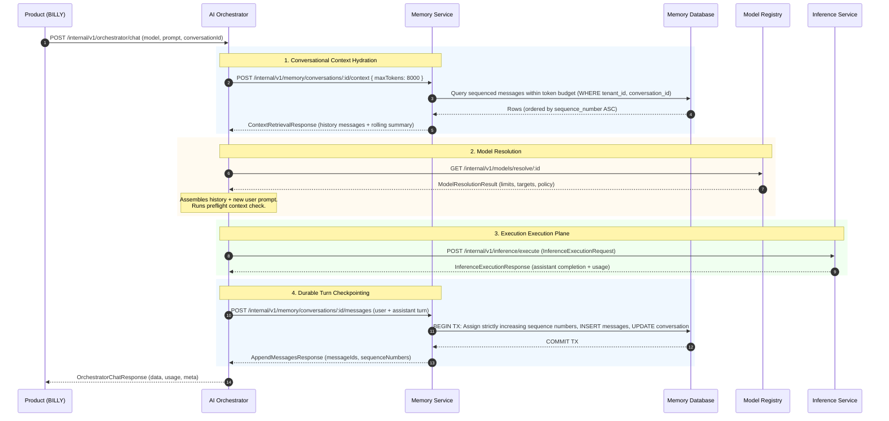

# OICUNT AI Platform Contract: Memory Service Architecture Specification

**Document Version**: 1.0.0  
**Status**: Authoritative Architectural Contract  
**Classification**: Engineering Architecture Standard  
**Service Location**: `services/memory`

---

## 1. Executive Summary & System Role

The **Memory Service** (`services/memory`) is the authoritative **conversational memory, working context, and conversation history storage layer** for the **OICUNT AI Platform** (with episodic memory / `MemoryItem` entities supported as a future extension). It is the dedicated state boundary positioned adjacent to the **AI Orchestrator** and **Autonomous Agents**, responsible for durably capturing, indexing, partitioning, and retrieving multi-turn conversation histories.

Memory isolates the mechanics of conversation thread lifecycle management, message sequencing, sliding context window assembly, tenant/user isolation, and retention policies. It operates with a **stateless application runtime** backed by an **isolated, dedicated persistence store** (Database-per-Service pattern).

```
┌────────────────────────────────────────────────────────────────────────┐
│                        Product Application (BILLY)                     │
│                • User Interface • Model Picker • Chat UI               │
└───────────────────────────────────┬────────────────────────────────────┘
                                    │ 1. POST /internal/v1/orchestrator/chat
                                    ▼
┌────────────────────────────────────────────────────────────────────────┐
│                            AI Orchestrator                             │
│                                                                        │
│   • Multi-Turn Turn Coordination         • Model Registry Resolution   │
│   • Prompt Assembly & Preflight Sizing   • Execution Dispatching       │
└──────────────┬────────────────────────────────┬────────────────────────┘
               │                                │
               │ 2. POST /conversations/:id     │ 4. POST /inference/execute
               │    /context (Fetch History)    │    (InferenceExecutionRequest)
               │                                │
               │ 5. POST /conversations/:id     │
               │    /messages (Append Turn)     ▼
               ▼                       ┌─────────────────────────────────┐
┌──────────────────────────────┐       │        Inference Service        │
│        Memory Service        │       │   • Execution Lifecycle Runtime │
│                              │       └────────────────┬────────────────┘
│  • Conversation Thread Store │                        │
│  • Message Sequencing        │                        │ 5. Dispatches
│  • Context Window Retrieval  │                        ▼
│  • Multi-Tenant Isolation    │       ┌─────────────────────────────────┐
│  • Retention & Deletion      │       │          Model Gateway          │
│  • Rolling Summaries         │       │   • Provider Egress Boundary    │
└──────────────┬───────────────┘       └────────────────┬────────────────┘
               │                                        │
               │ Database Queries                       │ 6. Dispatches
               ▼                                        ▼
┌──────────────────────────────┐       ┌─────────────────────────────────┐
│  Dedicated Memory Database   │       │        Provider Adapters        │
│ (PostgreSQL: oicunt_memory)  │       │   Anthropic • Bedrock • OpenAI  │
└──────────────────────────────┘       └─────────────────────────────────┘
```

### 1.1 The Five-Tier AI Platform Architecture

The OICUNT AI Platform enforces strict architectural separation across five dedicated tiers:

| Subsystem             | Architectural Role                      | Core Question Owned                                                                                                                        | State & Data Owned                                                                                                                                   |
| :-------------------- | :-------------------------------------- | :----------------------------------------------------------------------------------------------------------------------------------------- | :--------------------------------------------------------------------------------------------------------------------------------------------------- |
| **AI Orchestrator**   | **Application Interaction Coordinator** | **WHAT interaction should happen?**<br/>How is prompt assembled, coordinated across turns, and dispatched?                                 | Transient turn state, prompt context, turn deadlines. Stateless.                                                                                     |
| **Model Registry**    | **Control-Plane Catalog & Authority**   | **WHAT models and targets exist?**<br/>What are their limits, capabilities, pricing, and routing policies?                                 | Canonical model catalog, version definitions, eligible targets. Persistent.                                                                          |
| **Memory Service**    | **Conversational State Store**          | **WHAT was said and remembered?**<br/>How are past conversation messages stored, isolated, ordered, and retrieved for prompt context?      | Conversation threads, sequenced messages, sliding context windows, rolling summaries (episodic MemoryItem entities as future extension). Persistent. |
| **Inference Service** | **Inference-Runtime Coordinator**       | **HOW is the inference lifecycle governed?**<br/>How are execution limits, deadlines, streams, and privacy hooks applied during execution? | Active inference lifecycles, execution deadlines, TTFT/ITL metrics, privacy filters. Stateless.                                                      |
| **Model Gateway**     | **Data-Plane Provider Egress Engine**   | **HOW is the provider executed?**<br/>Which healthy provider target executes the request, and how are network faults retried?              | Provider credentials, target circuit breakers, retry budgets, target failover, vendor wire protocols. Stateless.                                     |

### 1.2 End-to-End Sequence Diagram



---

## 2. Component Responsibilities & Non-Responsibilities

### 2.1 Core Responsibilities

The Memory Service authoritatively owns:

1. **Conversation Thread Ownership & Lifecycle**:
   - Creating, reading, updating, archiving, and deleting conversation threads.
   - Managing conversation metadata (title, custom attributes, message count, estimated token footprint, status).
2. **Durable Message Persistence (MemoryItem / Episodic Memory as Future Extension)**:
   - Storing canonical chat messages (`ChatMessage`) conformant to `@oicunt-ai/ai-types` (system, user, assistant, tool).
   - Preserving multi-modal content parts (text, image metadata, tool calls, tool results, thinking blocks).
   - Storing message metadata (model used, completion ID, token usage, finish reason).
   - _Note_: Episodic memory items (`MemoryItem`) and standalone semantic facts are designated as a future extension, not part of the first implementation boundary.
3. **Deterministic Ordering & Sequencing**:
   - Guaranteeing strictly increasing and unique `sequenceNumber` integer values per conversation. Gaps are allowed; ordering must remain deterministic.
   - Preventing out-of-order message insertion and race conditions under concurrent requests.
4. **Context Window Retrieval for AI Orchestrator**:
   - Exposing high-performance context retrieval endpoints (`POST /internal/v1/memory/conversations/:id/context`) designed specifically for prompt assembly.
   - Applying sliding window algorithms bounded by token budgets (`maxTokens`) and message counts (`maxMessages`).
   - Returning messages ordered chronologically (`sequenceNumber ASC`) ready for model ingestion.
5. **Multi-Tenant & User Isolation**:
   - Enforcing mandatory `tenantId` scoping across all database tables, queries, and write operations.
   - Enforcing `userId` ownership checks to guarantee absolute multi-tenant and multi-user data segregation.
   - Structurally preventing cross-tenant information leakage.
6. **Retention, Deletion & Compliance Lifecycles**:
   - Enforcing soft-deletion (`status = 'deleted'`) and permanent hard purging.
   - Supporting Time-to-Live (TTL) expiration policies per tenant or conversation.
   - Supporting GDPR/CCPA compliance endpoints (Right to be Forgotten purge cascade).
7. **Stateless Service Runtime with Dedicated Persistence**:
   - Running stateless Node.js application instances behind load balancers.
   - Managing dedicated relational persistence (PostgreSQL `oicunt_memory`) via Database-per-Service.
   - Owning and running all persistence schema migrations.
8. **Compaction & Summarization State (Extension Point)**:
   - Retaining rolling conversation summaries (`MemorySummary`) in the domain model for context retrieval.
   - Summary generation and update mechanisms are treated as extension points; the core Memory contract does not require a `POST /summaries` API while component ownership remains unresolved.
   - Seamlessly splicing summarized older context with recent raw messages during context retrieval when a summary is present.
9. **Request Identity & Cancellation Propagation**:
   - Propagating distributed tracing identifiers (`X-Correlation-ID`, `X-Request-ID`).
   - Binding `AbortSignal` to database queries to terminate canceled requests immediately.

### 2.2 Explicit Negative Boundaries (What Memory Must NOT Do)

The Memory Service strictly **does NOT** own:

1. **NO Model Provider Calls**:
   - Memory **never** communicates with third-party model providers (Anthropic, OpenAI, Google, AWS Bedrock).
   - Memory contains **zero provider API keys or credentials**.
2. **NO Inference Execution**:
   - Memory **never** executes completions, runs models, or computes text generation.
   - Memory **never** imports vendor SDKs (`@anthropic-ai/sdk`, `openai`, `@google/genai`).
3. **NO Model Catalog or Selection Authority**:
   - Memory does not register models, evaluate routing policies, or query Model Registry.
   - Canonical model selection is owned by Product / Orchestrator.
4. **NO RAG, Knowledge Indexing, or Vector Search**:
   - Memory is strictly for conversational context and episodic turn state.
   - It does **not** index external enterprise documents, parse PDFs, create vector chunking pipelines, or execute vector similarity queries (owned exclusively by `services/knowledge` and `services/embeddings`).
5. **NO Tool Sandboxes, Agent Loops, or MCP Bridges**:
   - Memory stores tool call and tool result message payloads (as data), but **never** executes tools, runs code in sandboxes, or hosts Model Context Protocol (MCP) servers (owned by `services/tools`, `services/agents`, and `services/mcp`).
6. **NO Company-Wide User Authentication Authority**:
   - Memory does **not** authenticate user passwords or verify JWT signatures from public users.
   - It operates inside the platform perimeter, trusting identity headers (`X-Tenant-ID`, `X-User-ID`, `X-Actor-ID`) injected by the platform perimeter gateway.
7. **NO Billing Quotas or Subscription Management**:
   - Memory tracks token estimates for context window bounding, but **never** enforces subscription tiers, decrements credit balances, or stores company billing records (owned by the Company Platform).

### 2.3 Subsystem Responsibility Matrix

| Concern / Capability              | Product (BILLY) |    AI Orchestrator     |     Memory Service      |  Inference Service   |  Knowledge / RAG   |   Model Gateway   |
| :-------------------------------- | :-------------: | :--------------------: | :---------------------: | :------------------: | :----------------: | :---------------: |
| **Conversation Thread Lifecycle** |    Initiates    |      Coordinates       | **Authoritative Store** |       Ignorant       |      Ignorant      |     Ignorant      |
| **Message History Persistence**   |    Consumes     |      Appends Turn      | **Authoritative Store** |       Ignorant       |      Ignorant      |     Ignorant      |
| **Context Window Retrieval**      |    Requests     |  Requests for Prompt   | **Executes & Returns**  |       Ignorant       |      Ignorant      |     Ignorant      |
| **Prompt Assembly**               | Prepares Intent | **Assembles & Bounds** |    Supplies Context     |       Ignorant       | Supplies Grounding |     Ignorant      |
| **Document Vector Search / RAG**  |    Ignorant     |      Invokes Port      |        Ignorant         |       Ignorant       | **Authoritative**  |     Ignorant      |
| **Model Resolution & Limits**     |   Selects ID    |    Queries Registry    |        Ignorant         | Receives Passthrough |      Ignorant      |     Ignorant      |
| **Runtime Execution Lifecycle**   |    Ignorant     |       Dispatches       |        Ignorant         |  **Authoritative**   |      Ignorant      |     Ignorant      |
| **Provider Network Egress**       |    Ignorant     |        Ignorant        |        Ignorant         |       Ignorant       |      Ignorant      | **Authoritative** |

---

## 3. Domain Model & Core Entities

The Memory Service domain adheres to pure TypeScript definitions with zero third-party framework dependencies.

```
┌────────────────────────────────────────────────────────┐
│                   Conversation Entity                  │
│  • conversationId       • status (active/archived/del) │
│  • tenantId / userId    • messageCount                 │
│  • title / metadata     • totalTokensEstimate          │
└───────────────────────────┬────────────────────────────┘
                            │ 1 : N
                            ▼
┌────────────────────────────────────────────────────────┐
│               ConversationMessage Entity               │
│  • messageId            • role (user/assistant/etc.)   │
│  • turnId               • content (text/parts)         │
│  • sequenceNumber       • tokenEstimate / metadata     │
└────────────────────────────────────────────────────────┘
```

### 3.1 `Conversation` Entity

Represents an ongoing conversational thread owned by a user within a tenant:

```typescript
export type ConversationStatus = 'active' | 'archived' | 'deleted';

export interface Conversation {
  /** Canonical conversation identifier (e.g. 'conv_01HZX8K9...') */
  readonly id: string;

  /** Platform tenant scope (mandatory isolation boundary) */
  readonly tenantId: string;

  /** Authenticated user identifier */
  readonly userId: string;

  /** Optional human-readable conversation title */
  readonly title: string | null;

  /** Lifecycle state */
  readonly status: ConversationStatus;

  /** Extensible caller metadata (e.g. product source, client tags) */
  readonly metadata: Record<string, unknown>;

  /** Total number of messages stored in the conversation */
  readonly messageCount: number;

  /** Cumulative estimated token count across all active messages */
  readonly totalTokensEstimate: number;

  /** Timestamp when conversation was initialized */
  readonly createdAt: string;

  /** Timestamp of most recent update or message append */
  readonly updatedAt: string;

  /** Timestamp of the most recent message appended */
  readonly lastMessageAt: string | null;

  /** Expiration timestamp for automatic retention purging (null if indefinite) */
  readonly retentionExpiresAt: string | null;

  /** Soft-delete timestamp (null if active or archived) */
  readonly deletedAt: string | null;
}
```

### 3.2 `ConversationMessage` Entity

Represents an individual message within a conversation thread:

```typescript
import type { MessageContentPart, MessageRole } from '@oicunt-ai/ai-types';

export interface ConversationMessage {
  /** Unique message identifier (e.g. 'msg_01HZX9M2...') */
  readonly id: string;

  /** Enclosing conversation identifier */
  readonly conversationId: string;

  /** Platform tenant scope */
  readonly tenantId: string;

  /** Turn identifier grouping corresponding user/assistant exchange */
  readonly turnId: string;

  /**
   * Strictly increasing and unique sequence number within this conversation.
   * Invariant: Strictly increasing and unique per conversation; gaps are allowed while ordering remains deterministic.
   */
  readonly sequenceNumber: number;

  /** Canonical participant role */
  readonly role: MessageRole;

  /**
   * Message content: plain text string or polymorphic structured parts
   * (TextPart, ImagePart, ToolCallPart, ToolResultPart, ThinkingPart).
   */
  readonly content: string | readonly MessageContentPart[];

  /** Optional author or tool name */
  readonly name: string | null;

  /** Estimated tokens consumed by this message */
  readonly tokenEstimate: number;

  /** Execution metadata (model, completionId, finishReason, usage, latencyMs) */
  readonly metadata: Record<string, unknown>;

  /** Creation timestamp */
  readonly createdAt: string;
}
```

### 3.3 `ConversationTurn` Concept

A conversational turn groups the input from the user, any intermediate tool calls and tool responses, and the terminal assistant completion:

```typescript
export interface ConversationTurn {
  readonly turnId: string;
  readonly conversationId: string;
  readonly tenantId: string;
  readonly messages: readonly ConversationMessage[];
  readonly createdAt: string;
}
```

### 3.4 `MemorySummary` Entity (Domain Model)

Represents condensed conversational history retained in the domain model for context retrieval:

> [!NOTE]
> `MemorySummary` is maintained in the domain model to support compact context window hydration. However, summary generation and mutation are designated as an **extension point**; the core Memory contract does not mandate a mutation endpoint while summarization ownership is unresolved.

```typescript
export interface MemorySummary {
  /** Unique summary identifier (e.g. 'sum_01HZXA4P...') */
  readonly id: string;

  /** Enclosing conversation identifier */
  readonly conversationId: string;

  /** Platform tenant scope */
  readonly tenantId: string;

  /** Sequence number range condensed by this summary (inclusive) */
  readonly sequenceStart: number;
  readonly sequenceEnd: number;

  /** Condensed narrative text capturing key context, decisions, and facts */
  readonly summaryText: string;

  /** Estimated token count of the summaryText */
  readonly tokenEstimate: number;

  /** Summarizer metadata (model used, compaction timestamp) */
  readonly metadata: Record<string, unknown>;

  /** Creation timestamp */
  readonly createdAt: string;
}
```

### 3.5 `MemoryItem` Entity (Episodic Memory — Future Extension)

> [!NOTE]
> `MemoryItem` and episodic memory persistence are designated as a **future extension** and are **not part of the first implementation boundary**. The initial implementation boundary scopes strictly to conversation threads, sequenced messages, and context retrieval.

```typescript
export type MemoryItemType = 'fact' | 'preference' | 'summary' | 'turn';

/**
 * Future Extension: Episodic memory item capturing discrete facts or user preferences.
 * Out of scope for initial implementation boundary.
 */
export interface MemoryItem {
  /** Unique memory item identifier (e.g. 'mem_01HZXB5Q...') */
  readonly id: string;

  /** Platform tenant scope */
  readonly tenantId: string;

  /** Authenticated user identifier */
  readonly userId: string;

  /** Associated conversation (if tied to a specific thread) */
  readonly conversationId: string | null;

  /** Item category */
  readonly type: MemoryItemType;

  /** Narrative memory text or extracted fact */
  readonly content: string;

  /** Estimated tokens */
  readonly tokenEstimate: number;

  /** Lifecycle state */
  readonly status: 'active' | 'archived' | 'deleted';

  /** Arbitrary domain metadata */
  readonly metadata: Record<string, unknown>;

  /** Timestamps */
  readonly createdAt: string;
  readonly updatedAt: string;
}
```

### 3.6 Token Estimation Boundary

To maintain stateless independence from vendor SDKs while supporting prompt budget calculations:

- The Memory Service uses bounded heuristic token estimation (`~4 characters per token` for English text, plus structural overhead for tool calls and images).
- When a caller or Orchestrator provides explicit authoritative token usage reported by Model Gateway, Memory persists that authoritative metric in `message.tokenEstimate`.
- Provider tokenizers (`tiktoken`, `@anthropic-ai/tokenizer`) are **never imported**.

---

## 4. Service APIs & Wire Contracts

The Memory Service exposes an internal HTTP JSON REST interface under `/internal/v1/memory`.

### 4.1 Common Request Headers

Every request to the Memory Service MUST include:

| Header             | Type   | Required | Description                                                        |
| :----------------- | :----- | :------: | :----------------------------------------------------------------- |
| `Authorization`    | String |   Yes    | `Bearer <internal-service-token>`                                  |
| `X-Service-Name`   | String |   Yes    | Caller identifier (`ai-orchestrator`, `billy-api`, `agent-runner`) |
| `X-Tenant-ID`      | String |   Yes    | Authoritative platform tenant scope                                |
| `X-User-ID`        | String |   Yes    | Authoritative platform user identifier                             |
| `X-Correlation-ID` | String |   Yes    | Distributed tracing correlation ID                                 |
| `X-Request-ID`     | String |   Yes    | Request idempotency identifier                                     |
| `X-Actor-ID`       | String |    No    | Worker or actor executing on behalf of user                        |

### 4.2 Endpoint Inventory

| Method   | Path                                             | Primary Consumer       | Purpose                                            |
| :------- | :----------------------------------------------- | :--------------------- | :------------------------------------------------- |
| `POST`   | `/internal/v1/memory/conversations`              | Product (BILLY)        | Initialize a new conversation thread               |
| `GET`    | `/internal/v1/memory/conversations/:id`          | Product / Orchestrator | Fetch conversation thread metadata                 |
| `GET`    | `/internal/v1/memory/conversations`              | Product (BILLY)        | List conversation threads for a user/tenant        |
| `PATCH`  | `/internal/v1/memory/conversations/:id`          | Product (BILLY)        | Update title, metadata, or archive thread          |
| `DELETE` | `/internal/v1/memory/conversations/:id`          | Product (BILLY)        | Soft-delete or hard-purge a conversation           |
| `POST`   | `/internal/v1/memory/conversations/:id/messages` | AI Orchestrator        | Append completed turn messages to thread           |
| `GET`    | `/internal/v1/memory/conversations/:id/messages` | Product (BILLY)        | Paginated raw message history                      |
| `POST`   | `/internal/v1/memory/conversations/:id/context`  | **AI Orchestrator**    | **Hydrate bounded prompt context for active turn** |
| `POST`   | `/internal/v1/memory/tenants/:tenantId/purge`    | Compliance / Admin     | Hard-purge tenant or user data (GDPR)              |

> [!NOTE]
> Summary mutation endpoints (such as `POST .../summaries`) and episodic memory endpoints (`/internal/v1/memory/items`) are intentionally omitted from the core Memory contract:
>
> - **Summary Generation/Update**: Defined as an extension point while component ownership (e.g. Orchestrator turn vs background worker) remains unresolved.
> - **Episodic Memory / MemoryItem**: Defined as a future extension, not part of the first implementation boundary.

---

## 5. Context Retrieval for AI Orchestrator

The context retrieval endpoint is the primary runtime integration between the **AI Orchestrator** and the **Memory Service**.

### 5.1 Endpoint Specification

```http
POST /internal/v1/memory/conversations/:conversationId/context HTTP/1.1
Host: memory.service.internal:3005
Content-Type: application/json; charset=utf-8
X-Service-Name: ai-orchestrator
X-Tenant-ID: ten_enterprise_alpha
X-User-ID: usr_9a8b7c6d
X-Correlation-ID: 7f1c9d24-8b3e-4a67-9c12-3e4f5a6b7c8d
X-Request-ID: req_ctx_01HZXABC
Authorization: Bearer <internal-service-token>
```

### 5.2 Request DTO (`ContextRetrievalRequest`)

```typescript
export interface ContextRetrievalRequest {
  /**
   * Maximum token budget allocated for conversation history.
   * If omitted, defaults to service configuration (default: 8,192 tokens).
   */
  readonly maxTokens?: number | undefined;

  /**
   * Maximum number of recent messages to return.
   * If omitted, defaults to service configuration (default: 50 messages).
   */
  readonly maxMessages?: number | undefined;

  /**
   * Whether to include the rolling summary if older messages were compacted.
   * Default: true.
   */
  readonly includeSummary?: boolean | undefined;

  /**
   * Sequence number upper bound. Messages with sequenceNumber >= this value are excluded.
   * Useful when re-hydrating context prior to a specific historical turn.
   */
  readonly beforeSequenceNumber?: number | undefined;
}
```

### 5.3 Response DTO (`ContextRetrievalResponse`)

```typescript
import type { ChatMessage } from '@oicunt-ai/ai-types';

export interface ContextRetrievalData {
  readonly conversationId: string;

  /**
   * Sequenced chat messages ready for model prompt assembly,
   * sorted in chronological order (sequenceNumber ASC).
   */
  readonly messages: readonly ChatMessage[];

  /**
   * Condensed summary text of older messages pruned from the sliding window,
   * or null if no summary exists or all messages fit within maxTokens.
   */
  readonly summary: string | null;

  /** Total estimated token footprint of the returned messages + summary */
  readonly estimatedTokens: number;

  /** True if older messages exist in the conversation that were omitted due to budget */
  readonly hasMore: boolean;

  /** Total number of messages stored in the full conversation thread */
  readonly totalStoredMessages: number;

  /** Number of messages returned in this context payload */
  readonly returnedMessages: number;

  /** Earliest sequence number included in messages */
  readonly earliestSequenceNumber: number | null;

  /** Latest sequence number included in messages */
  readonly latestSequenceNumber: number | null;
}

export interface ContextRetrievalResponse {
  readonly success: true;
  readonly data: ContextRetrievalData;
  readonly meta: {
    readonly requestId: string;
    readonly correlationId: string;
    readonly timestamp: string;
  };
}
```

### 5.4 Sliding Window Algorithm & Token Budgeting

During context retrieval, the Memory Service executes the following deterministic algorithm:

1. **Active Summary Lookup**: If `includeSummary: true`, fetches the latest `MemorySummary` where `sequenceEnd < beforeSequenceNumber`.
2. **Reverse Accumulation**:
   - Queries messages `WHERE conversation_id = $1 AND tenant_id = $2 AND sequence_number > summary.sequenceEnd` ordered by `sequence_number DESC`.
   - Iterates backward, accumulating messages while `cumulativeTokens + message.tokenEstimate <= maxTokens` and `count < maxMessages`.
3. **Chronological Inversion**:
   - Inverts the accumulated list to chronological order (`sequence_number ASC`).
4. **Summary Attachment**:
   - If older messages exist prior to the earliest accumulated message and an active summary exists, includes `summaryText` in `data.summary`.
5. **Output**:
   - Returns sanitized `ChatMessage[]` instances conforming to `@oicunt-ai/ai-types`.

---

## 6. Storing Messages & Appending Turns

Following completion of a turn by the Orchestrator, new messages are appended to durable storage.

### 6.1 Endpoint Specification

```http
POST /internal/v1/memory/conversations/:conversationId/messages HTTP/1.1
Host: memory.service.internal:3005
Content-Type: application/json; charset=utf-8
X-Service-Name: ai-orchestrator
X-Tenant-ID: ten_enterprise_alpha
X-User-ID: usr_9a8b7c6d
X-Correlation-ID: 7f1c9d24-8b3e-4a67-9c12-3e4f5a6b7c8d
X-Request-ID: req_app_01HZXDEF
Authorization: Bearer <internal-service-token>
```

### 6.2 Request DTO (`AppendMessagesRequest`)

```typescript
import type { MessageContentPart, MessageRole } from '@oicunt-ai/ai-types';

export interface AppendMessageItem {
  readonly role: MessageRole;
  readonly content: string | readonly MessageContentPart[];
  readonly name?: string | undefined;
  readonly tokenEstimate?: number | undefined;
  readonly metadata?: Record<string, unknown> | undefined;
}

export interface AppendMessagesRequest {
  /** Turn identifier grouping this turn's messages */
  readonly turnId: string;

  /** Messages to append in order (e.g. user prompt followed by assistant completion) */
  readonly messages: readonly AppendMessageItem[];
}
```

### 6.3 Response DTO (`AppendMessagesResponse`)

```typescript
export interface AppendedMessageResult {
  readonly id: string;
  readonly turnId: string;
  readonly sequenceNumber: number;
  readonly role: MessageRole;
  readonly tokenEstimate: number;
  readonly createdAt: string;
}

export interface AppendMessagesResponse {
  readonly success: true;
  readonly data: {
    readonly conversationId: string;
    readonly turnId: string;
    readonly appendedCount: number;
    readonly totalConversationMessages: number;
    readonly totalConversationTokens: number;
    readonly messages: readonly AppendedMessageResult[];
  };
  readonly meta: {
    readonly requestId: string;
    readonly correlationId: string;
    readonly timestamp: string;
  };
}
```

### 6.4 Concurrency & Atomic Sequence Guarantee

To guarantee strictly increasing, unique sequence numbering without collisions under concurrent writes (gaps are permitted; ordering remains strictly deterministic):

```sql
-- Atomic sequence allocation transaction
BEGIN;

-- Lock the conversation row for update within the tenant boundary
SELECT message_count, total_tokens_estimate
FROM conversations
WHERE id = $1 AND tenant_id = $2
FOR UPDATE;

-- Insert each message with strictly increasing, unique sequenceNumber (gaps permitted)
INSERT INTO conversation_messages (
  id, conversation_id, tenant_id, turn_id, sequence_number, role, content, name, token_estimate, metadata, created_at
) VALUES
  ($3, $1, $2, $4, $5, $6, $7, $8, $9, $10, NOW()),
  ...;

-- Update conversation aggregate counters
UPDATE conversations
SET
  message_count = message_count + $inserted_count,
  total_tokens_estimate = total_tokens_estimate + $inserted_tokens,
  last_message_at = NOW(),
  updated_at = NOW()
WHERE id = $1 AND tenant_id = $2;

COMMIT;
```

---

## 7. Multi-Tenancy, User Isolation & Security

### 7.1 Compound Tenant Filtering Invariant

Every SQL query, update, and delete executed by the Memory Service MUST enforce `tenant_id` as part of the query filter and primary/foreign keys:

$$\forall q \in \text{Queries}, \quad \text{WHERE } q.\text{tenant\_id} = \text{session.tenant\_id}$$

Direct lookups by `id` alone are strictly prohibited to prevent cross-tenant data traversal.

```typescript
// VIOLATION (Forbidden):
const conv = await db.query('SELECT * FROM conversations WHERE id = $1', [convId]);

// MANDATORY (Compliant):
const conv = await db.query('SELECT * FROM conversations WHERE id = $1 AND tenant_id = $2', [
  convId,
  tenantId,
]);
```

### 7.2 User Scoping & Ownership Validation

- All conversations have a designated `userId`.
- When a request originates from an end-user service (such as `billy-api`), the Memory Service verifies that `conversation.userId === request.userId`.
- Service actors with administrative scope (`ai-platform-admin`, `agent-runner`) may access conversations across users within the tenant, provided `X-Tenant-ID` matches.

---

## 8. Ordering, Sequencing & Pagination

### 8.1 Strictly Increasing Sequence Invariant

- Every message in a conversation possesses an integer `sequenceNumber \ge 1`.
- Within any conversation thread, subsequent messages satisfy:
  $$\text{sequenceNumber}_{b} > \text{sequenceNumber}_{a} \quad \text{for message } b \text{ inserted after } a$$
- Sequence numbers are strictly increasing and unique per conversation. Gaps are allowed; ordering must remain deterministic.
- Database unique constraint: `UNIQUE (conversation_id, sequence_number)` strictly prevents duplicated sequence values.

### 8.2 Cursor-Based Pagination

For browsing message history in product user interfaces (`GET /internal/v1/memory/conversations/:id/messages`), the service uses cursor-based pagination on `sequenceNumber` to eliminate offset-drift during concurrent writes:

```typescript
export interface ListMessagesQuery {
  /** Cursor: sequenceNumber to paginate after (for forward pagination) */
  readonly afterSequence?: number;

  /** Cursor: sequenceNumber to paginate before (for backward pagination) */
  readonly beforeSequence?: number;

  /** Number of messages to return (default: 50, max: 100) */
  readonly limit?: number;

  /** Sort direction: 'asc' (chronological) or 'desc' (reverse chronological) */
  readonly order?: 'asc' | 'desc';
}
```

---

## 9. Retention, Deletion & Compliance Lifecycles

### 9.1 Conversation States

```
   ┌──────────┐   PATCH { status: 'archived' }   ┌────────────┐
   │  active  ├─────────────────────────────────►│  archived  │
   └────┬─────┘                                  └─────┬──────┘
        │                                              │
        │ DELETE                                       │ DELETE
        ▼                                              ▼
   ┌──────────────────────────────────────────────────────────┐
   │                         deleted                          │
   │           (soft-deleted, excluded from queries)          │
   └────────────────────────────┬─────────────────────────────┘
                                │ Hard Purge / TTL Expiry
                                ▼
   ┌──────────────────────────────────────────────────────────┐
   │                        PURGED                            │
   │          (cascaded physical deletion from disk)          │
   └──────────────────────────────────────────────────────────┘
```

### 9.2 Soft Deletion vs. Hard Purging

- **Soft Delete (`DELETE /internal/v1/memory/conversations/:id?hard=false`)**:
  - Sets `status = 'deleted'` and `deleted_at = NOW()`.
  - Excluded from all context retrieval, listing, and message appending.
  - Can be recovered by administrator within retention window.
- **Hard Purge (`DELETE /internal/v1/memory/conversations/:id?hard=true`)**:
  - Executes cascading `DELETE FROM conversations WHERE id = $1 AND tenant_id = $2`.
  - Foreign key cascades physically remove all corresponding `conversation_messages`, `conversation_summaries`, and any future `memory_items`.
  - Zero remnants remain on storage volumes.

### 9.3 GDPR / CCPA Right to be Forgotten Cascade

For compliance purges across all conversations of a user or tenant:

```http
POST /internal/v1/memory/tenants/:tenantId/purge HTTP/1.1
Content-Type: application/json; charset=utf-8
X-Service-Name: ai-platform-admin
Authorization: Bearer <internal-service-token>

{
  "userId": "usr_9a8b7c6d",
  "reason": "gdpr_erasure_request"
}
```

The service physically deletes all records associated with `tenantId` and `userId` in a single atomic transaction.

---

## 10. Stateless Runtime vs. Persistent Data Architecture

### 10.1 Stateless Application Runtime

- Multiple instances of `services/memory` run in parallel behind standard Kubernetes ClusterIP / Service mesh.
- No in-memory caching of conversation state across requests.
- Node.js event loop handles HTTP requests, validates DTOs, and issues parameterized SQL queries to the pool.

### 10.2 Dedicated Relational Persistence (`oicunt_memory`)

In accordance with the **Database-per-Service Rule**, the Memory Service owns its private PostgreSQL database (`oicunt_memory`). No other platform service may connect directly to this database.

### 10.3 Relational Schema Definition

```sql
-- Conversations Table
CREATE TABLE conversations (
    id VARCHAR(64) PRIMARY KEY,
    tenant_id VARCHAR(64) NOT NULL,
    user_id VARCHAR(64) NOT NULL,
    title VARCHAR(255) NULL,
    status VARCHAR(32) NOT NULL DEFAULT 'active',
    metadata JSONB NOT NULL DEFAULT '{}'::jsonb,
    message_count INTEGER NOT NULL DEFAULT 0,
    total_tokens_estimate INTEGER NOT NULL DEFAULT 0,
    created_at TIMESTAMPTZ NOT NULL DEFAULT NOW(),
    updated_at TIMESTAMPTZ NOT NULL DEFAULT NOW(),
    last_message_at TIMESTAMPTZ NULL,
    retention_expires_at TIMESTAMPTZ NULL,
    deleted_at TIMESTAMPTZ NULL
);

CREATE INDEX idx_conversations_tenant_user ON conversations (tenant_id, user_id, status);
CREATE INDEX idx_conversations_tenant_updated ON conversations (tenant_id, updated_at DESC);
CREATE INDEX idx_conversations_retention ON conversations (retention_expires_at)
    WHERE status != 'deleted' AND retention_expires_at IS NOT NULL;

-- Messages Table
CREATE TABLE conversation_messages (
    id VARCHAR(64) PRIMARY KEY,
    conversation_id VARCHAR(64) NOT NULL REFERENCES conversations(id) ON DELETE CASCADE,
    tenant_id VARCHAR(64) NOT NULL,
    turn_id VARCHAR(64) NOT NULL,
    sequence_number INTEGER NOT NULL,
    role VARCHAR(32) NOT NULL,
    content JSONB NOT NULL,
    name VARCHAR(128) NULL,
    token_estimate INTEGER NOT NULL DEFAULT 0,
    metadata JSONB NOT NULL DEFAULT '{}'::jsonb,
    created_at TIMESTAMPTZ NOT NULL DEFAULT NOW(),
    CONSTRAINT uq_messages_conversation_sequence UNIQUE (conversation_id, sequence_number)
);

CREATE INDEX idx_messages_conversation_seq_desc ON conversation_messages (conversation_id, sequence_number DESC);
CREATE INDEX idx_messages_tenant_turn ON conversation_messages (tenant_id, turn_id);

-- Summaries Table
CREATE TABLE conversation_summaries (
    id VARCHAR(64) PRIMARY KEY,
    conversation_id VARCHAR(64) NOT NULL REFERENCES conversations(id) ON DELETE CASCADE,
    tenant_id VARCHAR(64) NOT NULL,
    sequence_start INTEGER NOT NULL,
    sequence_end INTEGER NOT NULL,
    summary_text TEXT NOT NULL,
    token_estimate INTEGER NOT NULL DEFAULT 0,
    metadata JSONB NOT NULL DEFAULT '{}'::jsonb,
    created_at TIMESTAMPTZ NOT NULL DEFAULT NOW(),
    updated_at TIMESTAMPTZ NOT NULL DEFAULT NOW()
);

CREATE INDEX idx_summaries_conv_seq_end ON conversation_summaries (conversation_id, sequence_end DESC);

-- Future Extension: Memory Items Table (Episodic / Semantic Facts)
-- NOTE: Not part of the first implementation boundary. Included for future schema evolution planning.
CREATE TABLE memory_items (
    id VARCHAR(64) PRIMARY KEY,
    tenant_id VARCHAR(64) NOT NULL,
    user_id VARCHAR(64) NOT NULL,
    conversation_id VARCHAR(64) NULL REFERENCES conversations(id) ON DELETE SET NULL,
    type VARCHAR(32) NOT NULL, -- 'fact', 'preference', 'summary', 'turn'
    content TEXT NOT NULL,
    token_estimate INTEGER NOT NULL DEFAULT 0,
    status VARCHAR(32) NOT NULL DEFAULT 'active',
    metadata JSONB NOT NULL DEFAULT '{}'::jsonb,
    created_at TIMESTAMPTZ NOT NULL DEFAULT NOW(),
    updated_at TIMESTAMPTZ NOT NULL DEFAULT NOW()
);

CREATE INDEX idx_memory_items_tenant_user ON memory_items (tenant_id, user_id, type, status);
```

---

## 11. Request Identity, Deadlines & Cancellation

### 11.1 Cancellation Propagation & `AbortSignal`

When the client disconnects or the AI Orchestrator aborts turn execution:

```typescript
public async getContext(
  request: ContextRetrievalRequest,
  signal?: AbortSignal
): Promise<ContextRetrievalResponse> {
  if (signal?.aborted) {
    throw new RequestCancelledError('Context retrieval cancelled by caller');
  }

  // Pass signal directly to PostgreSQL client query runner
  const result = await this.db.query(sql, params, { signal });
  return result;
}
```

If `signal` aborts while the SQL query is in flight, the database client immediately issues a `DISCARD ALL` / cancels the running backend query on PostgreSQL, freeing database connection pool slots.

### 11.2 Monotonic Deadline Enforcement

Callers may supply `deadlineMs` (Epoch timestamp). If `Date.now() >= deadlineMs`, the Memory Service immediately returns HTTP 504 `STORAGE_TIMEOUT` without issuing database queries.

---

## 12. Authorization & Service-to-Service Boundary

### 12.1 Perimeter Trust & Service Whitelisting

The Memory Service validates that inbound requests originate from approved platform microservices:

```typescript
const allowedServiceIdentities = [
  'ai-orchestrator',
  'billy-api',
  'agent-runner',
  'platform-api-gateway',
  'ai-platform-admin',
  'memory-worker',
];
```

Requests lacking a valid `Authorization: Bearer <internal-service-token>` receive HTTP 401 `AUTHENTICATION_ERROR`. Calls with unauthorized `X-Service-Name` identities receive HTTP 403 `FORBIDDEN`.

---

## 13. Future Compatibility: Summarization & Long-Term Memory

The Memory Service contract establishes future-proof extension boundaries for long-term and semantic memory without compromising the core transactional conversation store:

### 13.1 Compaction & Summarization Extension Point

- **Domain Model Retention**: `MemorySummary` is retained as a first-class domain entity and integrated into the context retrieval schema (`ContextRetrievalResponse.data.summary`).
- **Extension Point Status**: Summary generation and update are designated as extension points rather than mandatory core service endpoints. The core Memory contract intentionally does NOT require a `POST /summaries` API while component ownership remains unresolved.
- **Unresolved Ownership**: Whether summarization is triggered synchronously by the AI Orchestrator as a compaction turn, asynchronously by an out-of-band background worker, or via an event-driven storage hook is an unresolved architectural boundary.
- **Context Retrieval Compatibility**: When a summary is persisted via future extension adapters, `POST /context` seamlessly splices the summary text and skips compacted messages within `sequenceStart..sequenceEnd`.

### 13.2 Episodic Memory & Boundary with Knowledge Services (Future Extension)

- **First Implementation Boundary**: The initial implementation boundary scopes strictly to conversation threads (`Conversation`), sequenced turn messages (`ConversationMessage`), and prompt context retrieval.
- **Episodic Memory Extension (`MemoryItem`)**: Discrete user preferences, cross-conversation facts, and entity memories are reserved as a future extension milestone, not part of the initial implementation boundary.
- **Knowledge Service (`services/knowledge`) Role**: Indexes enterprise knowledge and external documents.
- **Embeddings Service (`services/embeddings`) Role**: Generates vector representations.
- **Rule**: If episodic memory items require semantic vector search in the future, the Memory Service emits data change events or stores vector IDs; it **does NOT host a vector database or run similarity search**.

---

## 14. Observability, Metrics & Telemetry

### 14.1 OpenTelemetry Spans

The Memory Service instruments operations via `@oicunt-ai/observability`:

- `memory.get_context`: Latency of context window retrieval.
- `memory.append_messages`: Latency of atomic turn write.
- `memory.list_conversations`: Latency of conversation queries.

### 14.2 Prometheus Metrics

| Metric Name                       | Type      | Labels                | Description                                   |
| :-------------------------------- | :-------- | :-------------------- | :-------------------------------------------- |
| `ai_memory_requests_total`        | Counter   | `operation`, `status` | Total HTTP requests processed.                |
| `ai_memory_duration_ms`           | Histogram | `operation`           | Database and interactor latency distribution. |
| `ai_memory_messages_total`        | Counter   | `tenant_id`, `role`   | Total messages stored.                        |
| `ai_memory_tokens_stored_total`   | Counter   | `tenant_id`           | Estimated token volume persisted.             |
| `ai_memory_active_conversations`  | Gauge     | `tenant_id`           | Number of active conversation threads.        |
| `ai_memory_db_connections_active` | Gauge     | &mdash;               | Active PostgreSQL connection pool count.      |

### 14.3 Structured Single-Line JSON Logs

```json
{
  "timestamp": "2026-10-06T11:00:00.123Z",
  "level": "info",
  "service": "memory",
  "message": "Conversational context retrieved",
  "correlationId": "7f1c9d24-8b3e-4a67-9c12-3e4f5a6b7c8d",
  "requestId": "req_ctx_01HZXABC",
  "tenantId": "ten_enterprise_alpha",
  "userId": "usr_9a8b7c6d",
  "conversationId": "conv_01HZX8K9",
  "returnedMessages": 14,
  "estimatedTokens": 4120,
  "durationMs": 12
}
```

---

## 15. Hexagonal Architecture & Dependency Rules

The implementation of `services/memory` strictly follows Clean / Hexagonal Architecture:

```
services/memory/
├── src/
│   ├── domain/                  # Entities, value objects, domain errors, token estimator
│   │   ├── conversation.ts      # Conversation thread aggregate
│   │   ├── message.ts           # Sequenced message entity
│   │   ├── summary.ts           # Rolling summary entity
│   │   ├── errors.ts            # MemoryDomainError hierarchy
│   │   └── types.ts             # Domain statuses, pagination tokens
│   ├── application/             # Use cases, ports, DTOs
│   │   ├── dtos/                # ContextRetrievalRequest, AppendMessagesRequest, etc.
│   │   ├── ports/               # ConversationRepositoryPort, MemoryCachePort
│   │   └── use-cases/           # GetContextUseCase, AppendMessagesUseCase, etc.
│   ├── infrastructure/          # Outbound adapters (Database, Migrations, Metrics)
│   │   ├── database/            # PostgresConnection, Migrator, SQL Queries
│   │   ├── repositories/        # PostgresConversationRepository
│   │   └── logging/             # Structured JSON logger
│   ├── interfaces/              # Inbound adapters (HTTP API)
│   │   └── http/                # Router, ContextController, HealthController, Auth
│   ├── config.ts                # Environment loading & validation
│   ├── index.ts                 # Entry point
│   └── service.ts               # Composition root
├── tests/
├── package.json
├── tsconfig.json
└── README.md
```

### Dependency Invariants:

- **`domain`**: Pure TypeScript. Depends only on `@oicunt-ai/ai-types` (for message types). Zero database, HTTP, or framework imports.
- **`application`**: Depends on `domain` and ports. Never imports `infrastructure` or `interfaces`.
- **`infrastructure`**: Implements application ports (e.g. `PostgresConversationRepository`). Depends on `application` and `domain`.
- **`interfaces`**: Inbound HTTP controllers. Calls application use cases.
- **FORBIDDEN**: Vendor LLM SDKs (`@anthropic-ai/sdk`, `openai`), provider credentials, Model Gateway imports, cross-service database access.

---

## 16. Health and Readiness Probes

### 16.1 Liveness Probe (`GET /health/liveness` or `/healthz`)

- Returns HTTP 200 OK (`{ status: "alive" }`) verifying the Node.js event loop is responsive.

### 16.2 Readiness Probe (`GET /health/readiness` or `/readyz`)

- Executes `SELECT 1` against the dedicated PostgreSQL connection pool.
- Returns HTTP 200 OK (`{ status: "ready" }`) when the database pool is healthy.
- Returns HTTP 503 Service Unavailable during startup, migration execution, or database connection drop.

---

## 17. Architecture Invariants Checklist

Any implementation of the Memory Service MUST satisfy the following checklist:

- [ ] Memory **never** calls model providers or external LLM endpoints directly.
- [ ] Memory **never** contains provider API keys or credentials.
- [ ] Memory **never** imports vendor SDKs (`@anthropic-ai/sdk`, `openai`, `@google/genai`).
- [ ] Memory **never** executes completions, runs inference, or selects models.
- [ ] Memory **never** executes tools, hosts code sandboxes, or runs agent loops.
- [ ] Memory **never** performs document chunking, vector indexing, or semantic search.
- [ ] Every database query, update, and delete strictly enforces `tenant_id` filtering.
- [ ] Sequence numbers are strictly increasing and unique integers per conversation; gaps are allowed while ordering remains deterministic.
- [ ] Concurrent message writes use transactional locking (`FOR UPDATE`) to prevent sequence race conditions.
- [ ] Context retrieval (`POST /context`) returns messages in chronological order (`sequenceNumber ASC`) bounded by token/message limits.
- [ ] `AbortSignal` is propagated to database queries to terminate canceled executions immediately.
- [ ] Soft-deleted conversations are immediately excluded from context retrieval and message appending.
- [ ] Hard purges cascade physically across all conversation records, messages, and summaries (including future memory items) without remnants.
- [ ] Memory maintains a dedicated PostgreSQL database (`oicunt_memory`); no other service connects directly to it.
- [ ] First implementation boundary scopes strictly to conversation threads, sequenced messages, and context retrieval; episodic memory (`MemoryItem`) and summary generation/update are future extension points.
- [ ] Standard `/health/liveness` and `/health/readiness` probes are exposed.
