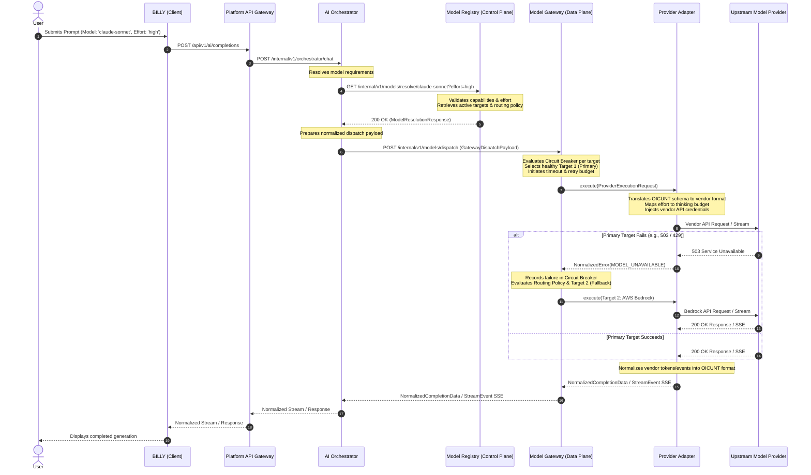

# OICUNT AI Platform Contract: Model Gateway Architecture Specification

**Document Version**: 1.0.0  
**Status**: Authoritative Architectural Contract  
**Classification**: Engineering Architecture Standard

---

## 1. Executive Summary & System Context

The **Model Gateway** (`services/model-gateway`) is the singular, authoritative **data-plane execution boundary** for all AI model inference across the **OICUNT AI Platform**. It serves as the sole egress point to upstream AI model providers (such as Anthropic, OpenAI, Google Gemini, AWS Bedrock, Azure OpenAI, and future self-hosted OICUNT inference clusters).

The Model Gateway guarantees that neither client applications (BILLY) nor middle-tier service orchestrators (AI Orchestrator) ever communicate directly with external model providers, hold provider credentials, or couple their business logic to vendor-specific SDKs, wire protocols, or error schemas.

```
┌────────────────────────────────────────────────────────────────────────┐
│                        BILLY (Client Interface)                        │
└───────────────────────────────────┬────────────────────────────────────┘
                                    │ 1. POST /api/v1/ai/completions
                                    │    (model: 'claude-sonnet', effort: 'high')
                                    ▼
┌────────────────────────────────────────────────────────────────────────┐
│                            AI Orchestrator                             │
└───────────────────┬────────────────────────────────┬───────────────────┘
                    │                                │
                    │ 2. GET /models/resolve         │ 4. POST /models/dispatch
                    │    (model, effort)             │    (Normalized Request +
                    ▼                                │     Resolution Metadata)
┌──────────────────────────────────────┐             │
│            Model Registry            │             │
│           (Control Plane)            │             │
│  • Canonical Identifiers             │             │
│  • Capabilities & Limits             │             │
│  • Eligible Provider Targets         │             │
│  • Routing Policies                  │             │
└───────────────────┬──────────────────┘             │
                    │ 3. Resolution Response         │
                    │    (Eligible Targets, Limits)  │
                    └────────────────────────────────┤
                                                     ▼
┌────────────────────────────────────────────────────────────────────────┐
│                       Model Gateway (Data Plane)                       │
│                                                                        │
│   Execution Router • Circuit Breaker • Retries • Fallback • Telemetry   │
└───────────────────────────────────┬────────────────────────────────────┘
                                    │ 5. Dispatches to selected target
                                    ▼
┌────────────────────────────────────────────────────────────────────────┐
│                   Provider Adapter Anti-Corruption Layer               │
│                                                                        │
│   Schema Translation • Credential Attachment • Stream Normalization    │
└───────────────────────────────────┬────────────────────────────────────┘
                                    │ 6. Vendor Wire Protocol / SDK
                                    ▼
┌────────────────────────────────────────────────────────────────────────┐
│                     Upstream Model Providers                           │
│        Anthropic • OpenAI • Google Gemini • AWS Bedrock • vLLM         │
└────────────────────────────────────────────────────────────────────────┘
```

### 1.1 The Fundamental Invariant: What vs. How

The architectural boundary between the Model Registry and the Model Gateway is non-negotiable:

> [!IMPORTANT]
> **MODEL REGISTRY owns WHAT should execute.**  
> It is the control-plane authority for canonical models, semantic versions, feature capabilities, context limits, pricing, and eligible provider targets.
>
> **MODEL GATEWAY owns HOW to execute it.**  
> It is the data-plane execution engine owning provider credentials, egress network calls, retry budgets, timeout enforcement, circuit breakers, dynamic target failover, and bidirectional schema normalization.



---

## 2. Component Responsibilities & Boundary Definition

To prevent scope creep and architectural leakage, platform responsibilities are allocated strictly across five components:

```
┌────────────────────────────────────────────────────────────────────────┐
│                              AI Orchestrator                           │
│   • Multi-turn conversation management & prompt composition            │
│   • Context assembly, retrieval-augmented generation (RAG) injection   │
│   • Tool coordination & agent execution loop                           │
│   • Queries Model Registry to resolve canonical models to targets      │
│   • Submits normalized execution requests to Model Gateway             │
└────────────────────────────────────────────────────────────────────────┘
                                    │
                                    ▼
┌───────────────────────────────────┴────────────────────────────────────┐
│                              Model Gateway                             │
│   • Single point of network egress for upstream model inference        │
│   • Ingestion of normalized execution requests and resolution metadata │
│   • Dynamic target selection respecting priority, weights, and health  │
│   • Circuit breaker management per provider target                     │
│   • Execution retries with exponential backoff and full jitter         │
│   • Transparent failover across eligible targets backing same model    │
│   • Request deadline, timeout, and cancellation lifecycle enforcement  │
│   • Unified OpenTelemetry GenAI span generation & cost tracking        │
└────────────────────────────────────────────────────────────────────────┘
                                    │
                                    ▼
┌───────────────────────────────────┴────────────────────────────────────┐
│                            Provider Adapter                            │
│   • Strict anti-corruption layer isolating specific vendor APIs        │
│   • Possession & injection of vendor credentials (API keys, IAM)       │
│   • Translation of normalized OICUNT requests to vendor-specific wire  │
│   • Translation of OICUNT reasoning effort into vendor-specific fields │
│   • Normalization of vendor HTTP/JSON responses to OICUNT completions  │
│   • Normalization of vendor SSE chunk streams to OICUNT StreamEvents   │
│   • Normalization of vendor error payloads into canonical error codes  │
└────────────────────────────────────────────────────────────────────────┘
                                    │
                                    ▼
┌───────────────────────────────────┴────────────────────────────────────┐
│                        Upstream Model Provider                         │
│   • Proprietary third-party AI service or inference engine             │
│   • Executes foundational transformer inference                        │
└────────────────────────────────────────────────────────────────────────┘
```

### 2.1 Detailed Responsibility Matrix

| Concern / Capability             | Model Registry  | AI Orchestrator | Model Gateway  | Provider Adapter | Upstream Provider |
| -------------------------------- | :-------------: | :-------------: | :------------: | :--------------: | :---------------: |
| **Canonical Model Catalog**      |    **Owns**     |    Consumes     |    Consumes    |       N/A        |        N/A        |
| **Model Selection (Pickers)**    |    **Owns**     |  Relays to UI   |      N/A       |       N/A        |        N/A        |
| **Effort Validation (Limits)**   |    **Owns**     |    Consumes     |    Consumes    |    Translates    |     Executes      |
| **Eligible Target Resolution**   |    **Owns**     |    Consumes     |    Executes    |       N/A        |        N/A        |
| **Conversation State / History** |       N/A       |    **Owns**     |      N/A       |       N/A        |        N/A        |
| **Tool Orchestration Loop**      |       N/A       |    **Owns**     |      N/A       |       N/A        |        N/A        |
| **Prompt Template Rendering**    |       N/A       |    **Owns**     |      N/A       |       N/A        |        N/A        |
| **Provider Network Egress**      |   Prohibited    |   Prohibited    |    **Owns**    |     Executes     |     Receives      |
| **Provider API Credentials**     |   Prohibited    |   Prohibited    |    Boundary    |     **Owns**     |     Validates     |
| **Vendor SDK Dependencies**      |   Prohibited    |   Prohibited    |   Prohibited   |     **Owns**     |        N/A        |
| **Target Circuit Breakers**      |       N/A       |       N/A       |    **Owns**    |  Reports Errors  |        N/A        |
| **Execution Retries & Jitter**   |       N/A       |       N/A       |    **Owns**    |    Stateless     |        N/A        |
| **Dynamic Target Failover**      |       N/A       |       N/A       |    **Owns**    |    Stateless     |        N/A        |
| **Stream Event Normalization**   |       N/A       |    Consumes     |     Relays     |     **Owns**     |     Emits Raw     |
| **Error Code Normalization**     |       N/A       |    Consumes     |   Normalizes   |  **Translates**  |     Emits Raw     |
| **Token Usage & Cost Metric**    | Defines Pricing |    Consumes     | **Calculates** |   Extracts Raw   |    Reports Raw    |

### 2.2 What MUST NOT Belong to the Model Gateway

To maintain architectural integrity, the Model Gateway must never absorb the following responsibilities:

1. **NO Model Catalog Authority**: The Gateway does not define canonical models, does not maintain catalog discovery endpoints, and does not determine which models exist.
2. **NO Independent Target Invention**: The Gateway never discovers or invents provider targets. It only executes targets explicitly resolved and returned by the Model Registry.
3. **NO Multi-Turn Chat Memory**: The Gateway does not store conversation history, manage thread persistence, or maintain session state. Every completion request is an independent, stateless invocation.
4. **NO Prompt Engineering or Templating**: The Gateway does not format system prompts, render mustache/jinja templates, or modify user prompt semantics.
5. **NO Autonomous Tool Execution**: The Gateway inspects tool definitions only to pass them to provider adapters. It never executes tools, invokes webhooks, or resolves tool outputs.
6. **NO Billing or Subscription Entitlement Enforcement**: The Gateway does not check customer account balances, verify credit card limits, or manage SaaS subscription tiers (owned by platform services and checked at the perimeter).
7. **NO Public Perimeter Ingress Routing**: The Gateway is strictly an internal platform service accessible only within the trusted service mesh. It does not terminate public end-user HTTP sessions.
8. **NO Persistent Storage of Payloads**: The Gateway does not persist prompts, messages, or model completions to relational databases or document stores.

---

## 3. Normalized Input Contract

The Model Gateway exposes a transport-independent, normalized dispatch contract consumed by the AI Orchestrator. The request cleanly unifies execution parameters, conversational context, and resolution metadata from the Model Registry without exposing vendor-specific constructs.

### 3.1 Gateway Dispatch Payload (`GatewayDispatchPayload`)

```typescript
import type {
  CanonicalModelId,
  ModelInvocationParameters,
  ModelLimits,
  ModelModality,
  ModelPricing,
  ReasoningEffortLevel,
} from '@oicunt-ai/model-types';
import type { ChatMessage } from '@oicunt-ai/ai-types';

/**
 * Normalized execution payload received by the Model Gateway from the AI Orchestrator.
 */
export interface GatewayDispatchPayload {
  /** Perimeter-generated authoritative request identifier */
  readonly requestId: string;

  /** Distributed tracing correlation identifier */
  readonly correlationId: string;

  /** Multi-turn conversational session identifier (if applicable) */
  readonly conversationId?: string | undefined;

  /** The user-selected canonical model identity (e.g. 'claude-sonnet', 'gpt-4o') */
  readonly canonicalModelId: CanonicalModelId;

  /** The resolved semantic model version (e.g. 'v1.0.0') */
  readonly version: string;

  /** Normalized chat messages comprising the conversation context */
  readonly messages: readonly ChatMessage[];

  /** Standard execution parameters (temperature, topP, maxTokens, stopSequences) */
  readonly parameters?: ModelInvocationParameters | undefined;

  /** Validated OICUNT reasoning effort level ('low' | 'medium' | 'high') */
  readonly effort?: ReasoningEffortLevel | undefined;

  /** Tool definitions formatted in standard JSON Schema (if model supports tools) */
  readonly tools?: readonly GatewayToolDefinition[] | undefined;

  /** Whether the caller requested real-time streaming execution */
  readonly stream: boolean;

  /** Operating limits resolved from the Model Registry */
  readonly limits: ModelLimits;

  /** Pricing metadata for token cost attribution */
  readonly pricing: ModelPricing;

  /** Ordered list of eligible provider execution targets resolved by the Registry */
  readonly eligibleTargets: readonly ResolvedTargetDto[];

  /** Routing policy configuration governing retries and fallback */
  readonly routingPolicy: GatewayRoutingPolicyDto;

  /** Platform tenant context */
  readonly tenantId?: string | undefined;

  /** Authoritative authenticated user identifier */
  readonly userId?: string | undefined;

  /** Internal service actor identifier initiating the dispatch */
  readonly actorId: string;

  /** Optional caller metadata passed through for tracing and auditing */
  readonly metadata?: Record<string, unknown> | undefined;

  /** Overall invocation deadline timestamp (ISO 8601 or Epoch MS) */
  readonly deadlineMs?: number | undefined;
}

/**
 * Standard tool definition accepted by the Model Gateway.
 */
export interface GatewayToolDefinition {
  readonly name: string;
  readonly description: string;
  readonly parameters: Record<string, unknown>; // JSON Schema object
}

/**
 * Target configuration provided by the Model Registry.
 */
export interface ResolvedTargetDto {
  readonly targetId: string;
  readonly provider:
    'anthropic' | 'openai' | 'google' | 'bedrock' | 'azure-openai' | 'local' | 'custom';
  readonly upstreamModelId: string;
  readonly priority: number;
  readonly weight: number;
  readonly region?: string | undefined;
  readonly adapterOptions?: Record<string, unknown> | undefined;
  readonly supportsStreaming: boolean;
  readonly maxConcurrency?: number | undefined;
}

/**
 * Routing policy configuration provided by the Model Registry.
 */
export interface GatewayRoutingPolicyDto {
  readonly strategy: 'priority-fallback' | 'weighted-round-robin' | 'lowest-latency';
  readonly maxFallbackAttempts: number;
  readonly requireHealthyTarget: boolean;
  readonly degradationBehavior: 'fail-fast' | 'fallback-to-fast' | 'queue';
}
```

---

## 4. Model Registry Integration

The Model Gateway consumes the resolution output produced by the Model Registry (`ModelResolutionResponse`). It treats the Model Registry as the **sole authority for target eligibility**.

```
┌────────────────────────────────────────────────────────┐
│             Model Registry Resolution Output           │
│                                                        │
│  canonicalModelId: 'claude-sonnet'                     │
│  version: 'v1.0.0'                                     │
│  effort: 'high'                                        │
│  limits: { contextWindowTokens: 200000, maxOutput: 8192}│
│  routingPolicy: { strategy: 'priority-fallback', ... } │
│  eligibleTargets: [                                    │
│    { targetId: 'target-1', provider: 'anthropic', ... }│
│    { targetId: 'target-2', provider: 'bedrock', ... }  │
│  ]                                                     │
└───────────────────────────┬────────────────────────────┘
                            │
                            │ Consumed deterministically
                            ▼
┌────────────────────────────────────────────────────────┐
│                     Model Gateway                      │
│                                                        │
│  1. Verifies eligible targets are non-empty            │
│  2. Filters targets against runtime Circuit Breakers   │
│  3. Dispatches execution to Target 1                   │
│  4. If Target 1 fails with retryable error:            │
│     Executes next target (Target 2)                    │
│  5. Emits normalized telemetry using Registry pricing  │
└────────────────────────────────────────────────────────┘
```

### 4.1 Integration Rules

1. **Strict Target Derivation**: The Model Gateway **never** queries third-party endpoints or platform databases to find alternative model targets. It operates exclusively upon the `eligibleTargets` array provided in the resolution payload.
2. **Deterministic Priority Execution**: When `strategy === 'priority-fallback'`, targets are evaluated in strictly ascending order of their `priority` rank (Priority 1 first, Priority 2 second).
3. **Weight Distribution**: Targets sharing identical priority ranks are evaluated based on their assigned `weight` via weighted random selection.
4. **Limits Enforcement**: The Gateway validates that `messages` and requested `parameters.maxTokens` do not exceed `limits.contextWindowTokens` or `limits.maxOutputTokens`. If exceeded, the request is rejected immediately with `CONTEXT_WINDOW_EXCEEDED` without contacting any provider.
5. **Cost Attribution**: Upon completion, the Gateway calculates inference cost using `pricing.costPerMillionInputTokens` and `pricing.costPerMillionOutputTokens` and includes it in telemetry spans.

---

## 5. Provider Adapter Contract

Provider Adapters are strictly isolated anti-corruption layers residing behind the Model Gateway. Each adapter encapsulates the proprietary SDK, wire protocol, authentication headers, and quirky serialization behaviors of a specific vendor.

```
┌────────────────────────────────────────────────────────────────────────┐
│                              Model Gateway                             │
└───────────────────────────────────┬────────────────────────────────────┘
                                    │
                       ProviderAdapter Interface
                                    │
         ┌──────────────────────────┼──────────────────────────┐
         ▼                          ▼                          ▼
┌───────────────────┐      ┌───────────────────┐      ┌───────────────────┐
│ AnthropicAdapter  │      │   OpenAIAdapter   │      │   GoogleAdapter   │
│ • Uses API Key    │      │ • Uses API Key    │      │ • Uses ADC/OAuth  │
│ • Messages API    │      │ • ChatCompletions │      │ • Gemini API      │
│ • thinking budget │      │ • reasoning_effort│      │ • thinking_config │
└───────────────────┘      └───────────────────┘      └───────────────────┘
```

### 5.1 Provider Adapter Interface (`IProviderAdapter`)

```typescript
import type { NormalizedCompletionData, StreamEvent } from '@oicunt-ai/ai-types';

/**
 * Request passed to a concrete provider adapter.
 */
export interface ProviderExecutionRequest {
  /** Authoritative platform request ID */
  readonly requestId: string;

  /** Distributed tracing correlation ID */
  readonly correlationId: string;

  /** Unique execution attempt identifier minted by the Gateway */
  readonly completionId: string;

  /** Concrete target selected for execution */
  readonly target: ResolvedTargetDto;

  /** Full normalized dispatch payload */
  readonly payload: GatewayDispatchPayload;

  /** Remaining timeout deadline in milliseconds for this attempt */
  readonly attemptTimeoutMs: number;

  /** Cancellation signal triggered on client disconnect or timeout */
  readonly cancellationSignal: AbortSignal;
}

/**
 * Anti-corruption contract required of all model provider adapters.
 */
export interface IProviderAdapter {
  /** The provider category handled by this adapter */
  readonly provider: string;

  /**
   * Executes a synchronous (unary) model completion request.
   */
  executeUnary(request: ProviderExecutionRequest): Promise<NormalizedCompletionData>;

  /**
   * Executes a streaming model completion request yielding normalized SSE events.
   */
  executeStream(request: ProviderExecutionRequest): AsyncIterable<StreamEvent>;

  /**
   * Performs an operational health check on the target (connectivity and credentials).
   * Note: This is an internal runtime probe for the Gateway's local circuit-breaker state machine
   * and readiness checks. It MUST NOT directly mutate Model Registry database records or control-plane state.
   */
  healthCheck(target: ResolvedTargetDto): Promise<boolean>;
}
```

### 5.2 Adapter Invariants

1. **Zero Vendor Leakage**: Adapter code must never return raw vendor response types (e.g., `Anthropic.Message`, `OpenAI.ChatCompletion`) or throw raw vendor exceptions. All return types must strictly adhere to `@oicunt-ai/ai-types`.
2. **Credential Encapsulation**: Vendor SDK client instances must be initialized strictly within the adapter boundary using credentials supplied from the Gateway runtime environment.
3. **Stateless Operations**: Adapters must be stateless. They must not retain conversational turns, prompt caches, or execution state across invocations.
4. **Cancellation Propagation**: When `cancellationSignal` fires, the adapter must immediately abort the underlying HTTP request or terminate the vendor SDK stream.

---

## 6. Effort & Reasoning Translation Mechanics

In the OICUNT AI Platform, reasoning effort is a **first-class normalized parameter** (`'low' | 'medium' | 'high'`), decoupled from vendor-specific implementations. The Provider Adapter is solely responsible for translating this normalized value into vendor-specific parameters.

### 6.1 Vendor Mapping Matrix

| OICUNT Normalized Effort | Anthropic Adapter (`thinking`)              | OpenAI Adapter (`reasoning_effort`) | Google Gemini Adapter (`thinking_config`) | AWS Bedrock (Claude)                        |
| ------------------------ | ------------------------------------------- | ----------------------------------- | ----------------------------------------- | ------------------------------------------- |
| `undefined` / `none`     | `{ type: "disabled" }`                      | Omitted / `null`                    | `{ thinking_budget: 0 }`                  | `{ type: "disabled" }`                      |
| `'low'`                  | `{ type: "enabled", budget_tokens: 2048 }`  | `reasoning_effort: "low"`           | `{ thinking_budget: 2048 }`               | `{ type: "enabled", budget_tokens: 2048 }`  |
| `'medium'`               | `{ type: "enabled", budget_tokens: 8192 }`  | `reasoning_effort: "medium"`        | `{ thinking_budget: 8192 }`               | `{ type: "enabled", budget_tokens: 8192 }`  |
| `'high'`                 | `{ type: "enabled", budget_tokens: 16384 }` | `reasoning_effort: "high"`          | `{ thinking_budget: 16384 }`              | `{ type: "enabled", budget_tokens: 16384 }` |

### 6.2 Effort Validation & Fallback Invariants

1. **No Vendor Effort Leaks**: Upstream vendor parameters like `budget_tokens` or `thinking_config` must **never** appear in `GatewayDispatchPayload` or client requests.
2. **Unsupported Effort Handling**:
   - If a provider target cannot execute the requested effort (for example, if a fallback target is pinned to a snapshot that does not support extended thinking), the adapter must reject the attempt with `UNSUPPORTED_EFFORT_LEVEL`.
   - The Gateway will catch this error and immediately evaluate the next eligible target.
   - If no other targets support the requested effort, the Gateway returns a normalized `400 UNSUPPORTED_EFFORT_LEVEL` error.
3. **No Silent Effort Degradation**: An adapter must **never** silently downgrade or strip reasoning effort without an explicit degradation directive from the Model Registry's routing policy.

---

## 7. Streaming Lifecycle & Event Normalization

Streaming completions use an asynchronous event stream conforming to the `StreamEvent` taxonomy defined in `@oicunt-ai/ai-types`.

```
┌────────────────────────────────────────────────────────┐
│ StreamEvent Lifecycle:                                 │
│                                                        │
│ 1. thinking   → { delta: string }                      │
│ 2. token      → { delta: string }                      │
│ 3. tool_call  → { id: str, name: str, argumentChunk: } │
│ 4. finish     → { finishReason: str, usage: TokenUsage}│
│                                                        │
│ * In case of failure:                                  │
│ 5. error      → { code: str, message: str, details }   │
└────────────────────────────────────────────────────────┘
```

### 7.1 Stream Normalization Rules

1. **Thinking Event Mapping & Privacy Control**: For models with extended thinking enabled, reasoning tokens are mapped to `{ event: 'thinking', data: { delta: string } }` strictly under explicit product and privacy policy approval (see Section 7.2). Reasoning tokens must never be conflated with conversational text.
2. **Token Delta Mapping**: Conversational output tokens must be yielded as `{ event: 'token', data: { delta: string } }`.
3. **Tool Call Chunks**: Incremental tool call arguments emitted by models must be yielded as `{ event: 'tool_call', data: { id, name, argumentChunk } }`.
4. **Terminal Event**: Every successful stream must conclude with exactly one terminal `{ event: 'finish', data: { finishReason, usage } }` event containing authoritative token counts.
5. **Transport Decoupling**: The core Gateway execution engine yields `AsyncIterable<StreamEvent>`. At the HTTP boundary, this is serialized as standard `text/event-stream` (Server-Sent Events) formatted as:
   ```
   event: token
   data: {"delta":"Hello"}

   event: finish
   data: {"finishReason":"stop","usage":{"promptTokens":10,"completionTokens":1,"totalTokens":11}}
   ```
6. **Client Disconnect**: If the client closes the HTTP connection during streaming, the Gateway aborts the `cancellationSignal`, terminating the upstream provider stream within $\le 50\text{ms}$.

### 7.2 Reasoning / Thinking Privacy & Event Gating Boundary

When executing models with extended reasoning enabled (`effort` set to `'low'`, `'medium'`, or `'high'`), upstream provider APIs (e.g. Anthropic thinking blocks, OpenAI reasoning tokens, Gemini thoughts) return raw internal chain-of-thought data to the Provider Adapter.

The Model Gateway establishes a strict **privacy boundary**:

1. **No Automatic Exposure to Users**:
   - Provider reasoning/thinking data **MUST NOT automatically become user-visible stream events or message parts**.
   - Raw chain-of-thought generated by foundational models frequently includes unvetted intermediate deliberations, prompt reconstruction, internal tool deliberations, or sensitive heuristic scratchpads. Exposing raw thinking merely because a provider adapter received it is strictly prohibited.
2. **Explicit Policy Gating**:
   - The normalized `thinking` stream event (`{ event: 'thinking', data: { delta: string } }`) and chat message `ThinkingPart` must only contain reasoning information **explicitly permitted by the OICUNT product and privacy contract**.
   - By default, internal thinking data is captured only within internal execution telemetry (with strict PII/prompt scrubbing and access control) or discarded according to tenant data retention settings.
   - Reasoning stream events are emitted to the client **ONLY WHEN** explicitly enabled by authorized product configuration (e.g., explicit developer debugging mode or dedicated reasoning inspection interfaces).
3. **Future Product Extensibility**:
   - This design preserves first-class normalized reasoning support across all adapters and protocols, ensuring future product-controlled reasoning experiences can be enabled without breaking changes, while securing user privacy and proprietary platform prompts today.

---

## 8. Resilience Engine: Retries & Idempotency

The Model Gateway encapsulates all retry logic to shield upstream callers from transient network hiccups and temporary vendor rate limits.

### 8.1 Retryability Classification

| Error Category                  | HTTP Code | Retryable on Same Target? |  Fallback to Next Target?   | Rationale                                        |
| ------------------------------- | :-------: | :-----------------------: | :-------------------------: | ------------------------------------------------ |
| `RATE_LIMIT_EXCEEDED`           |    429    |  **YES** (with backoff)   | **YES** (on budget exhaust) | Vendor capacity limits; transient                |
| `MODEL_UNAVAILABLE`             |    503    |   **YES** (short delay)   |     **YES** (immediate)     | Vendor service disruption                        |
| `PROVIDER_SERVER_ERROR`         | 502 / 504 |          **YES**          |           **YES**           | Upstream bad gateway / gateway timeout           |
| `INFERENCE_TIMEOUT`             |    504    |          **NO**           |           **YES**           | Target failed to respond within attempt deadline |
| `CONTEXT_WINDOW_EXCEEDED`       |    400    |          **NO**           |           **NO**            | Deterministic prompt overflow; fatal             |
| `INVALID_REQUEST`               |    400    |          **NO**           |           **NO**            | Schema validation error; fatal                   |
| `CONTENT_POLICY_VIOLATION`      |    422    |          **NO**           |           **NO**            | Safety filter violation; fatal                   |
| `PROVIDER_AUTHENTICATION_ERROR` |    500    |          **NO**           |           **YES**           | Bad API key on target; skip to fallback          |
| `UNSUPPORTED_EFFORT_LEVEL`      |    400    |          **NO**           |           **YES**           | Target snapshot lacks reasoning capability       |

### 8.2 Backoff Policy & Formula

> [!NOTE]
> All retry values below are **configurable default policy values** specified in service configuration, overridable by Registry routing policies.

1. **Jittered Exponential Backoff**:
   - Initial Backoff Delay ($T_{\text{initial}}$): Default `500ms`.
   - Backoff Multiplier ($M$): Default `2.0`.
   - Maximum Backoff Delay ($T_{\text{max}}$): Default `8000ms`.
   - Full Jitter Formula:
     $$\text{delay} = \text{random}\left(0, \min\left(T_{\text{max}}, T_{\text{initial}} \times M^{\text{attempt}}\right)\right)$$
2. **Maximum Retry Attempts**: Default `3` attempts per target before declaring the target attempt exhausted.
3. **Idempotency**: All model generation requests are read-only and idempotent. Retrying an unstarted or timed-out request is safe.
4. **Streaming Retry Constraint**:
   > [!CAUTION]
   > **A streaming request can ONLY be retried if ZERO bytes/events have been yielded to the caller.**  
   > Once an initial `token`, `thinking`, or `tool_call` event has been sent over the wire, retrying is strictly prohibited because the client has already observed partial state. If a failure occurs mid-stream, the Gateway must emit an `error` stream event and close the connection cleanly.

### 8.3 Unified Request Execution Budget & Bounded Retries/Fallbacks

To prevent unbounded, cascading execution chains across targets:

$$\text{Target A (3 attempts)} \longrightarrow \text{Target B (3 attempts)} \longrightarrow \text{Target C (3 attempts)} \quad (\text{unbounded combinatorics: } 9 \text{ attempts!})$$

The Model Gateway enforces a **unified, request-level execution budget**:

1. **Shared Authoritative Request Deadline**:
   - The overall request deadline (`deadlineMs` / `timeoutMs`) established by the caller or perimeter is **authoritative**.
   - Every execution attempt—whether an initial call, an in-target retry, or a fallback attempt on a secondary target—**consumes time against this single shared deadline**.
   - Before dispatching any attempt, the Gateway checks remaining time:
     $$\text{remainingBudget} = \text{deadlineMs} - \text{currentTime}$$
   - If $\text{remainingBudget} < T_{\text{min\_connection}}$ (configurable default policy value: `1000ms`), further retries or fallbacks are immediately aborted with `INFERENCE_TIMEOUT`. Downstream provider calls can never outlive the upstream request deadline.
2. **Bounded Per-Target Retries**:
   - In-target retries on the same target are bounded by configurable default policy (default: `maxAttemptsPerTarget = 3`).
3. **Bounded Fallback Attempts**:
   - Fallback target transitions are bounded by the routing policy provided by the Model Registry (default: `maxFallbackAttempts = 2`).
4. **Global Execution Attempt Ceiling**:
   - Across all targets combined, the Gateway enforces a global execution attempt cap (configurable default policy: `maxTotalExecutionAttempts = 4`).
   - If Target A consumes 3 attempts before exhausting its budget, Target B has at most 1 attempt remaining before the global limit halts execution and returns `ALL_TARGETS_EXHAUSTED`.
   - All numeric limits are operational default policy values, configurable per environment, model tier, or tenant SLA.
5. **Streaming Invariance: No Restart After Output Emission**:
   > [!CAUTION]
   > **Streaming execution cannot restart or retry after output has been emitted.**  
   > If even a single byte or stream event (`token`, `thinking`, `tool_call`) has been yielded over the wire to the caller, in-target retries and cross-target fallbacks are strictly prohibited. Attempting to failover mid-stream would result in corrupted, duplicated, or divergent client completions. The Gateway must immediately emit an `error` stream event and terminate the stream.

---

## 9. Dynamic Failover & Fallback Execution

When a primary provider target fails or exhausts its retry budget, the Model Gateway automatically executes the next eligible target declared in the Model Registry resolution payload.

```
┌────────────────────────────────────────────────────────┐
│ User Selected: 'claude-sonnet'                         │
│ Model Registry Eligible Targets:                       │
│   Target 1 (Priority 1): anthropic / direct            │
│   Target 2 (Priority 2): bedrock / us-east-1           │
└───────────────────────────┬────────────────────────────┘
                            │
                            ▼
               ┌─────────────────────────┐
               │ Try Target 1 (Anthropic)│
               └────────────┬────────────┘
                            │
                   503 Model Unavailable
                   (Retries Exhausted)
                            │
                            ▼
               ┌─────────────────────────┐
               │ Fallback to Target 2    │
               │        (Bedrock)        │
               └────────────┬────────────┘
                            │
                    200 OK Generated
                            │
                            ▼
┌────────────────────────────────────────────────────────┐
│ Completion Returned: 'claude-sonnet'                   │
│ • Client observes success without disruption           │
│ • Canonical model identity never changes               │
│ • Telemetry records fallback event for operations      │
└────────────────────────────────────────────────────────┘
```

### 9.1 Failover Invariants

1. **Model Identity Invariance**: Failover **never** changes the user-selected canonical model identity. If the user selected `claude-sonnet`, the output is guaranteed to be generated by a target authorized for `claude-sonnet`.
2. **Prohibition of Unrelated Model Swapping**: The Gateway must **never** silently substitute an unrelated model (e.g., swapping `claude-sonnet` with `gpt-4o` or `gemini-flash`) unless the Model Registry explicitly configured such a degradation rule in the active routing policy.
3. **Exhaustion Behavior**: If all eligible targets fail, the Gateway returns `503 MODEL_UNAVAILABLE` with an error message indicating that all available execution targets are currently offline.

---

## 10. Timeouts, Deadlines & Resource Budgets

To prevent cascading thread exhaustion and hung requests, every invocation is governed by strict, hierarchical deadlines.

### 10.1 Timeout Hierarchy

```
┌────────────────────────────────────────────────────────────────────────┐
│ Overall Request Deadline (e.g. 120,000ms)                              │
│                                                                        │
│   ┌──────────────────────────────────────────────────┐                 │
│   │ Target 1 Attempt Budget (e.g. 45,000ms)          │                 │
│   │                                                  │                 │
│   │   • Connection Timeout (5,000ms)                 │                 │
│   │   • Time-to-First-Token (TTFT) Timeout (15,000ms)│                 │
│   │   • Inter-Chunk Idle Timeout (10,000ms)          │                 │
│   └──────────────────────────────────────────────────┘                 │
│                           │                                            │
│                 Target 1 Times Out                                     │
│                           ▼                                            │
│   ┌──────────────────────────────────────────────────┐                 │
│   │ Target 2 Attempt Budget (Remaining: 75,000ms)    │                 │
│   │                                                  │                 │
│   │   • Connection Timeout (5,000ms)                 │                 │
│   │   • TTFT Timeout (15,000ms)                      │                 │
│   └──────────────────────────────────────────────────┘                 │
└────────────────────────────────────────────────────────────────────────┘
```

### 10.2 Timeout Specifications

1. **Connection Timeout**: Default `5000ms`. Maximum duration allowed to establish TCP/TLS handshake with the upstream provider.
2. **Time to First Token (TTFT) Timeout**: Default `15000ms` (configurable up to `60000ms` for reasoning models with extended thinking). If the provider accepts the connection but emits no tokens within this budget, the attempt is aborted.
3. **Inter-Chunk Idle Timeout**: Default `10000ms`. In streaming mode, if an established stream pauses for longer than this duration without yielding data, the connection is deemed dead and terminated.
4. **Total Request Deadline**: Enforced across the entire Gateway invocation. Downstream target attempts are clamped such that:
   $$\text{attemptTimeout} = \min\left(\text{targetMaxTimeout}, \text{overallDeadline} - \text{currentTime}\right)$$

---

## 11. Runtime Health & Circuit Breaker State Machine

The Model Gateway maintains an in-memory (or distributed cache-backed) **Circuit Breaker** per `targetId` to shield failing upstream providers from stampeding requests and protect platform response latencies.

```
       ┌────────────────────────┐
       │         CLOSED         │◄─────────────────────────┐
       │ (Target Healthy: 100%) │                          │
       └───────────┬────────────┘                          │
                   │                                       │
      Failure rate > threshold                             │ Probe succeeds
      (e.g., 50% over 20 calls)                            │
                   │                                       │
                   ▼                                       │
       ┌────────────────────────┐         Cooldown         │
       │          OPEN          ├─────── expires ─────────►│
       │ (Requests fast-failed) │       (e.g. 30s)         │
       └────────────────────────┘                          │
                                                           │
                                             ┌─────────────┴──────────┐
                                             │       HALF-OPEN        │
                                             │ (Allows 1 probe call)  │
                                             └─────────────┬──────────┘
                                                           │
                                                           │ Probe fails
                                                           ▼
                                                  Return to OPEN state
```

### 11.1 Distinct Health Responsibilities

- **Model Registry (Administrative / Control-Plane Health)**: Owns the authoritative, persistent availability status (`available`, `degraded`, `maintenance`, `deprecated`) stored in its dedicated PostgreSQL database schema. Updated exclusively via administrative mutations or platform automated reconciliation sweeps.
- **Model Gateway (Runtime / Data-Plane Operational Health)**: Owns ephemeral execution health and circuit-breaker states (`CLOSED`, `OPEN`, `HALF_OPEN`) stored in-memory or in an ephemeral cache. Reacts instantaneously to live request failures, upstream network timeouts, 5xx bursts, and rate limit exhaustion.

### 11.2 Provider Health Checks vs. Model Registry Control-Plane Boundary

The `IProviderAdapter.healthCheck(target)` method is strictly a **data-plane runtime operational probe**:

1. **Local Operational Scope**:
   - The Gateway executes `adapter.healthCheck(target)` during container startup readiness checks, background target liveness polling, or circuit breaker `HALF_OPEN` probe evaluations to test connectivity and credential validity.
2. **Absolute Prohibition on Registry Mutation**:
   - **A provider health check performed by the Gateway MUST NOT directly mutate Model Registry state or database tables.**
   - The Model Gateway does not possess database write privileges or connections to the Model Registry's datastore.
   - Operating in the data plane, the Gateway must never alter control-plane target configurations, availability statuses, or routing weights in response to a failed probe.
3. **Decoupled Degradation Handling**:
   - When a health check or runtime probe fails, the Gateway mutates only its **local runtime circuit-breaker state** (transitioning the target to `OPEN`), temporarily suppressing the target from its active dispatch queue and routing requests to eligible fallback targets.
   - If persistent upstream failure requires formal administrative cordoning (e.g., marking a target as `maintenance` in the catalog), that lifecycle transition is executed independently via the Model Registry's administrative HTTP API (`PATCH /internal/v1/models/:id/targets/:targetId/status`) by platform operations or an external supervisor, never synchronously from the Gateway's execution path.

---

## 12. Normalized Error Contract & Hierarchy

Proprietary vendor error payloads and raw HTTP error codes must never leak past the Model Gateway. The Gateway normalizes all errors into the platform standard error structure:

```typescript
export interface GatewayErrorPayload {
  readonly code: GatewayErrorCode;
  readonly message: string;
  readonly retryable: boolean;
  readonly canonicalModelId: string;
  readonly targetId?: string | undefined;
  readonly correlationId: string;
  readonly details?: Record<string, unknown> | undefined;
}

export type GatewayErrorCode =
  | 'RATE_LIMIT_EXCEEDED'
  | 'CONTEXT_WINDOW_EXCEEDED'
  | 'PROVIDER_AUTHENTICATION_ERROR'
  | 'CONTENT_POLICY_VIOLATION'
  | 'MODEL_UNAVAILABLE'
  | 'INFERENCE_TIMEOUT'
  | 'UNSUPPORTED_EFFORT_LEVEL'
  | 'UNSUPPORTED_CAPABILITY'
  | 'INVALID_REQUEST'
  | 'STREAM_INTERRUPTED'
  | 'REQUEST_CANCELLED'
  | 'ALL_TARGETS_EXHAUSTED'
  | 'INTERNAL_GATEWAY_ERROR';
```

### 12.1 Vendor Error Mapping Table

| Upstream Vendor Error                        | HTTP Status | Canonical Code                  | User Message                                                      |
| -------------------------------------------- | :---------: | ------------------------------- | ----------------------------------------------------------------- |
| `rate_limit_exceeded`, `insufficient_quota`  |     429     | `RATE_LIMIT_EXCEEDED`           | "Model throughput limits exceeded. Please retry momentarily."     |
| `context_length_exceeded`, `prompt_too_long` |     400     | `CONTEXT_WINDOW_EXCEEDED`       | "Prompt exceeds maximum allowed context window."                  |
| `invalid_api_key`, `authentication_error`    |     500     | `PROVIDER_AUTHENTICATION_ERROR` | "Model service configuration error." (Internal alarm)             |
| `content_filter`, `safety_policy_violation`  |     422     | `CONTENT_POLICY_VIOLATION`      | "Prompt or completion triggered content safety policies."         |
| `model_overloaded`, `service_unavailable`    |     503     | `MODEL_UNAVAILABLE`             | "Model provider is currently experiencing downtime."              |
| `request_timeout`, `upstream_timeout`        |     504     | `INFERENCE_TIMEOUT`             | "Model inference timed out."                                      |
| `thinking_not_supported`, `invalid_effort`   |     400     | `UNSUPPORTED_EFFORT_LEVEL`      | "Selected model does not support the requested reasoning effort." |
| Premature stream socket close                |     502     | `STREAM_INTERRUPTED`            | "Model response stream was interrupted prematurely."              |
| Client disconnect via AbortSignal            |     499     | `REQUEST_CANCELLED`             | "Inference request was cancelled by caller."                      |
| Gateway internal bug / process failure       |     500     | `INTERNAL_GATEWAY_ERROR`        | "Internal AI platform execution failure."                         |

### 12.2 Failure Disambiguation & Secret Redaction Boundaries

To prevent operational confusion and eliminate security risks, the Model Gateway strictly disambiguates three failure categories:

1. **Provider Authentication & Credential Failure (`PROVIDER_AUTHENTICATION_ERROR` - HTTP 500)**:
   - **Root Cause**: An upstream provider explicitly rejects the request due to authentication or credential faults (e.g. revoked API key, expired AWS IAM credentials, invalid service account signature, IP CIDR whitelist rejection, bad authorization header).
   - **Operational Classification**: Target configuration defect; non-retryable on the same target.
   - **Zero Secret / Raw Payload Exposure**:
     - Upstream vendor error bodies, status texts, header dumps, key names, token substrings, and raw responses **must be stripped immediately by the Provider Adapter**.
     - Raw vendor payloads must **never** be passed into `details`, logged in unredacted fields, or exposed to the AI Orchestrator or BILLY.
   - **Execution Behavior**: The Gateway suppresses that target in its local circuit breaker, logs a sanitized internal alert with the target identifier, and immediately attempts failover to the next eligible target backing the same canonical model (e.g. falling back from Anthropic direct to Bedrock).
   - **Caller Contract**: If all fallback targets are exhausted, the caller receives a normalized `PROVIDER_AUTHENTICATION_ERROR` with a generic, sanitized user message (`"Model service configuration error."`). No credential or vendor-specific identifiers leak over the public/internal wire.

2. **Provider Availability Failure (`MODEL_UNAVAILABLE` - HTTP 503 / `INFERENCE_TIMEOUT` - HTTP 504)**:
   - **Root Cause**: Upstream provider service disruption, 503 Overloaded state, capacity exhaustion, or network timeouts.
   - **Distinction from Auth**: Credentials are completely valid, but the external provider infrastructure cannot currently process inference requests.
   - **Execution Behavior**: Eligible for jittered retries on the same target (up to target retry budget) and automatic failover to fallback targets. Sanitized error payload with no vendor internals leaked.

3. **Internal Gateway Failure (`INTERNAL_GATEWAY_ERROR` - HTTP 500)**:
   - **Root Cause**: An unexpected fault originating strictly within the Model Gateway service process itself (e.g., process out-of-memory, unhandled internal exception, payload parsing defect, corrupted routing pipeline) **before or during** execution, completely decoupled from upstream vendor responses.
   - **Distinction**: Represents a platform software or runtime infrastructure bug, not an upstream vendor rejection.
   - **Caller Contract**: Returns standard internal error response with trace correlation ID, without exposing internal stack traces.

---

## 13. Response Normalization Contract

For non-streaming invocations, the Model Gateway returns `NormalizedCompletionData` conforming to `@oicunt-ai/ai-types`.

```typescript
import type { CanonicalModelId, TokenUsage } from '@oicunt-ai/model-types';
import type { ChatMessage, FinishReason } from '@oicunt-ai/ai-types';

export interface NormalizedCompletionData {
  /** Unique completion identifier minted for this execution attempt */
  readonly completionId: string;

  /** The user-selected canonical model identity */
  readonly model: CanonicalModelId;

  /** The completed assistant chat message */
  readonly message: ChatMessage;

  /** Standardized termination reason */
  readonly finishReason: FinishReason;

  /** Detailed token accounting */
  readonly usage: TokenUsage;

  /** Total elapsed execution duration in milliseconds */
  readonly latencyMs: number;
}
```

---

## 14. Security & Credential Boundary

The Model Gateway enforces a zero-trust credential isolation perimeter:

```
┌────────────────────────────────────────────────────────┐
│                    UNTRUSTED ZONES                     │
│                                                        │
│   BILLY • AI Orchestrator • Model Registry • Client    │
│                                                        │
│             ZERO PROVIDER CREDENTIALS                  │
└───────────────────────────┬────────────────────────────┘
                            │
               Strict Service Mesh Perimeter
                            │
                            ▼
┌────────────────────────────────────────────────────────┐
│                     TRUSTED ZONE                       │
│                                                        │
│            Model Gateway & Provider Adapters           │
│                                                        │
│   • ANTHROPIC_API_KEY      • OPENAI_API_KEY            │
│   • GOOGLE_ADC_SECRETS     • AWS_IAM_ROLES             │
└────────────────────────────────────────────────────────┘
```

### 14.1 Security Rules

1. **Absolute Key Containment**: Upstream vendor credentials exist **only** within the execution runtime of the Model Gateway.
2. **Never in Shared Packages**: No shared types package (`@oicunt-ai/model-types`, `@oicunt-ai/ai-types`) may contain credential types or access environment secrets.
3. **Zero Secret Leakage in Logs**: API keys, bearer tokens, and signature headers must be scrubbed before emitting structured logs or OpenTelemetry spans.
4. **Secret Rotation**: Provider adapters must support runtime credential reloading from memory or secret vaults without requiring full service restarts.
5. **No Header Spoofing**: The Gateway never trusts incoming provider credentials from HTTP request headers.

---

## 15. Telemetry, Observability & Cost Accounting

Every model invocation generates high-fidelity OpenTelemetry GenAI spans conforming to standard conventions:

```typescript
// OpenTelemetry Span Attributes emitted per invocation
const spanAttributes = {
  'gen_ai.system': target.provider,
  'gen_ai.request.model': target.upstreamModelId,
  'gen_ai.usage.input_tokens': usage.promptTokens,
  'gen_ai.usage.output_tokens': usage.completionTokens,
  'gen_ai.response.finish_reasons': [finishReason],
  'oicunt.canonical_model': canonicalModelId,
  'oicunt.model_version': version,
  'oicunt.target_id': target.targetId,
  'oicunt.correlation_id': correlationId,
  'oicunt.request_id': requestId,
  'oicunt.completion_id': completionId,
  'oicunt.attempt_count': attemptNumber,
  'oicunt.cost_usd': estimatedCostUsd,
};
```

### 15.1 Cost Calculation Formula

$$\text{Total Cost (USD)} = \left(\frac{\text{promptTokens}}{10^6} \times \text{costPerMillionInputTokens}\right) + \left(\frac{\text{completionTokens}}{10^6} \times \text{costPerMillionOutputTokens}\right)$$

---

## 16. Provider Isolation & Multi-Vendor Extensibility

The Model Gateway supports seamless addition of new model vendors without requiring modifications to BILLY or the AI Orchestrator:

1. **Vendor Landscape**:
   - `anthropic`: Anthropic Direct Messages API
   - `openai`: OpenAI Chat Completions & Reasoning API
   - `google`: Google Gemini Generative Language API
   - `bedrock`: AWS Bedrock Converse API
   - `azure-openai`: Azure OpenAI Service
   - `local`: Self-hosted vLLM / Triton inference cluster
2. **Zero-Code Platform Integration**: Adding a new provider requires only:
   - Implementing a new adapter inside `providers/` conforming to `IProviderAdapter`.
   - Registering a new target in the Model Registry.
   - BILLY and AI Orchestrator automatically gain access through dynamic catalog discovery.

---

## 17. Provider Replacement Walkthrough

This scenario illustrates transparent failover during upstream vendor degradation:

```
Step 1: User selects 'claude-sonnet' in BILLY with effort 'medium'.
Step 2: AI Orchestrator calls Model Registry resolution.
Step 3: Registry resolves:
        - Target 1: Anthropic direct (priority 1)
        - Target 2: AWS Bedrock (priority 2)
Step 4: AI Orchestrator dispatches to Model Gateway.
Step 5: Model Gateway invokes Target 1.
        -> Anthropic returns 503 Overloaded.
Step 6: Gateway records failure on Target 1 circuit breaker.
Step 7: Gateway examines routing policy (maxFallbackAttempts: 2).
Step 8: Gateway executes Target 2 (AWS Bedrock).
        -> AWS Bedrock returns 200 OK with full completion.
Step 9: Gateway normalizes Bedrock completion into NormalizedCompletionData.
Step 10: AI Orchestrator receives successful completion for 'claude-sonnet'.
Step 11: BILLY displays answer to user. User experiences zero disruption.
```

---

## 18. Internal Model Gateway Service API

The Model Gateway exposes an internal HTTP/RPC endpoint consumed by the AI Orchestrator:

```
POST /internal/v1/models/dispatch
Headers:
  x-service-name: ai-orchestrator
  x-request-id: <uuid>
  x-correlation-id: <uuid>
  x-tenant-id: <uuid>
  x-user-id: <uuid>
Content-Type: application/json
Accept: application/json, text/event-stream

Body: GatewayDispatchPayload
```

- When `stream: false`: Returns `200 OK` with JSON envelope containing `NormalizedCompletionData`.
- When `stream: true`: Returns `200 OK` with `Content-Type: text/event-stream` emitting standard `StreamEvent` SSE chunks.

---

## 19. Data Ownership & State Management

The Model Gateway is intentionally **stateless**:

1. **No Persistent Relational Database**: The Gateway does not own a PostgreSQL database. It stores zero user, prompt, or catalog records.
2. **Ephemeral Runtime Health State**: Circuit breaker failure counters and sliding-window statistics are stored in-memory, with an optional Redis cluster backing for multi-replica state sharing.
3. **Audit Ledger**: High-level execution logs and OpenTelemetry spans are published asynchronously to the platform telemetry collector.

---

## 20. Comprehensive Failure & Degradation Matrix

| Failure Mode                            |      Retry?       | Fallback? | Canonical Error Code            | User-Visible Experience                                               |
| --------------------------------------- | :---------------: | :-------: | ------------------------------- | --------------------------------------------------------------------- |
| **Model Registry Unreachable**          |     Yes (1x)      |    No     | `MODEL_UNAVAILABLE`             | "Model service temporarily unavailable. Please retry momentarily."    |
| **Primary Target 503 / 502**            |     Yes (3x)      |  **Yes**  | `MODEL_UNAVAILABLE`             | Transparent failover to secondary provider; no user disruption        |
| **Primary Target 429 Rate Limit**       | Yes (with jitter) |  **Yes**  | `RATE_LIMIT_EXCEEDED`           | Transparent failover to secondary provider; minor latency increase    |
| **Context Window Overrun**              |      **No**       |  **No**   | `CONTEXT_WINDOW_EXCEEDED`       | Fast-fail: "Prompt exceeds maximum allowed context window."           |
| **Unsupported Effort Level**            |      **No**       |  **Yes**  | `UNSUPPORTED_EFFORT_LEVEL`      | Fails over to target supporting effort; if none, clean rejection      |
| **All Targets Exhausted**               |        No         |    No     | `ALL_TARGETS_EXHAUSTED`         | "All providers for this model are currently unavailable."             |
| **Client Disconnects Mid-Stream**       |        No         |    No     | `REQUEST_CANCELLED`             | Upstream generation aborted immediately; partial tokens logged        |
| **Provider Auth Failure (Key Revoked)** |        No         |  **Yes**  | `PROVIDER_AUTHENTICATION_ERROR` | Transparent failover to backup target; internal critical alert raised |

---

## 21. Non-Negotiable Architectural Invariants

The following invariants are binding engineering standards for all current and future implementations:

1. **BILLY never calls providers directly.** All model access passes through the AI Orchestrator and Model Gateway.
2. **AI Orchestrator never calls providers directly.** It resolves targets via the Model Registry and dispatches via the Model Gateway.
3. **Model Registry never calls providers.** It has zero network access to upstream model APIs.
4. **Model Gateway is the sole upstream inference egress boundary.** No other service may initiate connections to vendor LLM endpoints.
5. **Provider SDKs exist only behind Provider Adapters.** Upstream SDK libraries must never be imported outside `providers/`.
6. **Provider-specific IDs never become public BILLY contracts.** BILLY operates exclusively with canonical identifiers (`claude-sonnet`, `gpt-4o`).
7. **Provider-specific formats never escape Adapters.** All input, output, streaming, and error formats must be normalized to platform standards.
8. **User-selected model identity remains separate from provider target identity.** Failover changes the provider target, never the canonical model.
9. **Reasoning effort remains an OICUNT-level normalized concept.** It is translated dynamically into vendor parameters by adapters.
10. **Model Registry decides WHAT; Model Gateway decides HOW.** Control plane and data plane boundaries must never blur.
11. **Streaming retries are prohibited once output has been emitted.** Zero bytes can be retried once delivered to a client, and streaming cannot restart after output emission.
12. **Provider credentials reside exclusively within the Model Gateway perimeter.** No keys in BILLY, Orchestrator, or Registry.
13. **Provider health checks never mutate Model Registry state.** Gateway runtime probes affect only local circuit-breaker state, never control-plane database records.
14. **Provider authentication errors never leak secrets or raw provider responses.** Credential failures are sanitized to generic platform error codes.
15. **Retries and fallbacks share a single bounded request deadline.** Multiplicative combinations across targets are strictly capped by request deadlines and global execution ceilings.
16. **Reasoning/thinking data is never exposed without explicit policy permission.** Private chain-of-thought is policy-gated and never exposed merely because an adapter received it.
