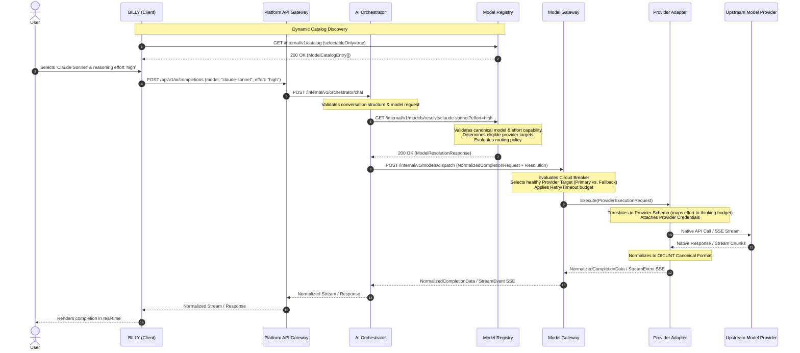
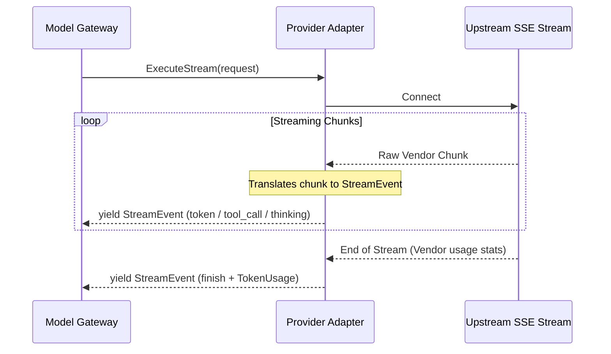

# OICUNT AI Platform Contract: Model Registry & Model Gateway Routing

**Document Version**: 1.1.0  
**Status**: Authoritative Architectural Contract  
**Classification**: Engineering Architecture Standard

---

## 1. Executive Summary & System Context

This document establishes the formal, binding architectural contract between the **Model Registry**, the **Model Gateway**, upstream **Provider Adapters**, and consuming systems (**BILLY** and the **AI Orchestrator**).

It defines the end-to-end routing lifecycle, taxonomy, dynamic catalog discovery, model resolution schemas, dispatch payloads, resilience mechanics, security boundaries, and telemetry requirements for all AI model inference across the **OICUNT AI Platform**.

### 1.1 Canonical Request Flow

The canonical request path flows sequentially across six distinct architectural boundaries:

```
┌─────────────────────────┐
│         BILLY           │ (Client Application)
└────────────┬────────────┘
             │ 0. GET /internal/v1/catalog (Dynamic Catalog Discovery)
             ▼
┌─────────────────────────┐
│     Model Registry      │
└────────────┬────────────┘
             │ [User selects Model: 'claude-sonnet', Effort: 'high']
             │
             │ 1. POST /api/v1/ai/completions (model: 'claude-sonnet', effort: 'high')
             ▼
┌─────────────────────────┐
│     AI Orchestrator     │
└────────────┬────────────┘
             │ 2. GET /internal/v1/models/resolve/claude-sonnet?effort=high
             ▼
┌─────────────────────────┐
│     Model Registry      │
└────────────┬────────────┘
             │ 3. ModelResolutionResponse (Eligible Targets, Limits, Effort, Metadata)
             ▼
┌─────────────────────────┐
│     AI Orchestrator     │
└────────────┬────────────┘
             │ 4. POST /internal/v1/models/dispatch (Normalized Request + Resolution Data)
             ▼
┌─────────────────────────┐
│      Model Gateway      │
└────────────┬────────────┘
             │ 5. Invokes Provider Adapter (Target selection, Fallback, Retries, Circuit Breaker)
             ▼
┌─────────────────────────┐
│    Provider Adapter     │
└────────────┬────────────┘
             │ 6. Upstream Wire Protocol & SDKs (Anthropic, Bedrock, OpenAI, Google)
             ▼
┌─────────────────────────┐
│ Upstream Model Provider │
└─────────────────────────┘
```



---

## 2. Core Boundary Distinction: Registry vs. Gateway

The separation between Model Registry and Model Gateway enforces a fundamental architectural invariant:

> [!IMPORTANT]
> **Model Registry decides WHAT model/targets are eligible.**  
> **Model Gateway decides HOW to execute against those eligible targets.**

### Responsibility Separation Matrix

| Capability / Concern                                    |       Model Registry Owns       |       Model Gateway Owns        |
| ------------------------------------------------------- | :-----------------------------: | :-----------------------------: |
| **Model Catalog Discovery** (`GET /catalog`)            |   **YES** (Sanitized catalog)   |               NO                |
| **Canonical Model Identifiers** (`claude-sonnet`, etc.) |   **YES** (Catalog authority)   |            Consumes             |
| **Reasoning Effort Capability & Validation**            |   **YES** (Validates limits)    |      Translates in adapter      |
| **Model Metadata, Description & Capabilities**          |             **YES**             |            Consumes             |
| **Context Window & Output Token Limits**                |             **YES**             |            Enforces             |
| **Pricing Metadata & Token Cost Tables**                |             **YES**             |   Attaches to usage telemetry   |
| **Model Availability & Deprecation Status**             | **YES** (Administrative status) |      Evaluates live health      |
| **Eligible Provider & Model Target Definitions**        | **YES** (Catalog configuration) |       Dispatches against        |
| **Model Aliases & Version Mapping**                     |             **YES**             |            Consumes             |
| **Routing Policy Configuration** (Weights, Priorities)  |     **YES** (Defines rules)     |         Executes rules          |
| **Provider Egress Boundary**                            |               NO                | **YES** (Singular egress point) |
| **Provider Adapter Selection & Invocation**             |               NO                |             **YES**             |
| **Normalized Completion Execution**                     |               NO                |             **YES**             |
| **Provider-Specific API Keys & Credentials**            |               NO                | **YES** (Confined to adapters)  |
| **Upstream Retries & Exponential Backoff**              |               NO                |             **YES**             |
| **Call Timeouts & Deadlines**                           |               NO                |             **YES**             |
| **Circuit Breakers & Active Health Probing**            |               NO                |             **YES**             |
| **Dynamic Provider Failover & Fallback**                |               NO                |             **YES**             |
| **Streaming Chunk Normalization (SSE)**                 |               NO                |             **YES**             |
| **Provider Error & Status Code Normalization**          |               NO                |             **YES**             |
| **Provider Response Envelope Normalization**            |               NO                |             **YES**             |

### Client & Orchestrator Prohibitions

1. **BILLY and AI Orchestrator must NEVER contain provider-specific model IDs** (e.g. `claude-3-5-sonnet-20241022`, `gpt-4o-2024-08-06`).
2. **BILLY and AI Orchestrator must NEVER contain provider SDK logic** or communicate directly with upstream provider endpoints.
3. **Upstream provider credentials must NEVER leave the Model Gateway / Provider Adapter boundary.**

---

## 3. Taxonomy & Domain Concepts

To prevent architectural ambiguity, the following concepts are strictly delineated:

```
┌────────────────────────────────────────────────────────────────────────┐
│ Canonical Model ID: claude-sonnet (or oicunt.model.general)            │
│ Family: claude                                                         │
├────────────────────────────────────────────────────────────────────────┤
│ Version: v1.0.0 (Active Release)                                       │
│ Modalities: [text, image]                                              │
│ Capabilities:                                                          │
│   streaming: true, toolCalling: true, reasoning: true                  │
│   supportedEffortLevels: ["low", "medium", "high"]                     │
│   defaultEffortLevel: "medium"                                         │
│ Routing Policy: priority-with-fallback                                 │
├────────────────────────────────────────────────────────────────────────┤
│ Eligible Targets (Multiple Targets for Transparent Failover):          │
│  ├── Target 1 (Priority 1, Primary):                                   │
│  │     Provider: anthropic                                             │
│  │     Upstream Model ID: claude-3-5-sonnet-20241022                   │
│  │     Status: available                                               │
│  └── Target 2 (Priority 2, Fallback):                                  │
│        Provider: bedrock                                               │
│        Upstream Model ID: anthropic.claude-3-5-sonnet-20241022-v2:0    │
│        Status: available                                               │
└────────────────────────────────────────────────────────────────────────┘
```

### Concept Definitions

1. **`canonicalModelId`**:  
   The stable, platform-owned semantic identifier exposed across OICUNT services and client APIs (e.g. `claude-sonnet`, `claude-opus`, `gpt-4o`, `gemini-pro`, `oicunt.model.general`). It represents an authoritative model definition, decoupled from provider endpoints.
2. **`family`**:  
   The model family grouping (e.g. `'claude'`, `'gpt'`, `'gemini'`). Used by client applications (BILLY) for catalog categorization and filtering.
3. **`effort` (`ReasoningEffortLevel`)**:  
   An execution parameter and capability (`'low' | 'medium' | 'high'`), NOT a separate model identity. Dynamically declared in model capabilities and validated by the Model Registry.
4. **`modelVersion`**:  
   The platform version string of a canonical model definition (e.g. `v1.0.0`, `v1.2.0`). It allows non-breaking upgrades of underlying targets while pinning deterministic behavior when required.
5. **`provider`**:  
   The upstream model vendor or infrastructure category: `'anthropic' | 'openai' | 'google' | 'bedrock' | 'azure-openai' | 'local' | 'custom'`.
6. **`upstreamModelId`**:  
   The proprietary, vendor-assigned model identifier required by the upstream API (e.g. `claude-3-5-sonnet-20241022`, `gpt-4o-2024-08-06`, `gemini-1.5-pro-002`). This identifier remains strictly internal to provider adapters and model target configurations.
7. **`modelTarget`**:  
   A concrete execution endpoint binding a `provider`, `upstreamModelId`, priority, weight, regional endpoint, and execution limits. Multiple targets can back a single model version, enabling transparent provider replacement.
8. **`routingPolicy`**:  
   The declarative policy governing target evaluation, traffic weighting, failover precedence, and degradation postures.

### Canonical Model Catalog Examples

The platform defines standard canonical model identifiers in `@oicunt-ai/model-types`:

| Canonical Model Identifier | Family   | Capabilities & Reasoning                              | Typical Workloads                                             |
| -------------------------- | -------- | ----------------------------------------------------- | ------------------------------------------------------------- |
| `claude-sonnet`            | `claude` | Multimodal, Tools, Reasoning (effort: low, med, high) | Frontier coding, multi-turn reasoning, agent execution        |
| `claude-opus`              | `claude` | Multimodal, Tools, Deep Reasoning (effort: low..high) | Complex systems design, deep research, mathematical deduction |
| `claude-haiku`             | `claude` | Fast text, vision, streaming                          | High-throughput fast interactions, summaries, triage          |
| `gpt-4o`                   | `gpt`    | Multimodal, Tools, Structured Outputs                 | General conversational, structured JSON, tool execution       |
| `gemini-pro`               | `gemini` | Long-context multimodal, Tools, Reasoning             | Massive context analysis, document extraction, multimodal QA  |
| `oicunt.model.general`     | `custom` | Conversational intelligence & synthesis               | Enterprise default conversational turns                       |
| `oicunt.model.embedding`   | `custom` | High-dimensional vector representation                | Semantic indexing, retrieval-augmented generation (RAG)       |

---

## 4. Normalized Model Resolution Contract

The AI Orchestrator queries the Model Registry to resolve a canonical model identifier before dispatching execution to the Model Gateway.

### 4.1 Model Catalog Discovery (`GET /internal/v1/catalog`)

Before presenting model choices to users, BILLY or client orchestrators query the sanitized catalog endpoint:

```typescript
export interface ModelCatalogEntry {
  readonly id: string;
  readonly displayName: string;
  readonly description: string;
  readonly family?: string;
  readonly modalities: readonly ModelModality[];
  readonly capabilities: ModelCapabilities;
  readonly isReasoning: boolean;
  readonly supportedEffortLevels?: readonly ReasoningEffortLevel[];
  readonly defaultEffortLevel?: ReasoningEffortLevel;
  readonly limits: ModelLimits;
  readonly pricing: ModelPricing;
  readonly status: ModelAvailabilityStatus;
  readonly activeVersion: string;
}
```

### 4.2 Model Resolution Request

```typescript
export interface ModelResolutionRequest {
  /** The canonical model ID to resolve (e.g. 'claude-sonnet', 'gpt-4o') */
  readonly canonicalModelId: CanonicalModelId;
  /** Optional specific version or release tag (e.g. 'v1.0.0'); defaults to active */
  readonly version?: string;
  /** Optional reasoning effort level ('low' | 'medium' | 'high') */
  readonly effort?: ReasoningEffortLevel;
  /** Optional tenant identifier for tenant-specific overrides or entitlements */
  readonly tenantId?: string;
  /** Correlation context */
  readonly correlationId: string;
}
```

### 4.3 Model Resolution Response

```typescript
export interface ModelResolutionResponse {
  /** Canonical model identifier resolved */
  readonly canonicalModelId: CanonicalModelId;
  /** Model family classification */
  readonly family?: string;
  /** Resolved model version */
  readonly version: string;
  /** Display name and human-readable description */
  readonly displayName: string;
  readonly description: string;
  /** Modality support */
  readonly modalities: readonly ModelModality[];
  /** Model feature capabilities */
  readonly capabilities: ModelCapabilities;
  /** Effective reasoning effort level (validated or defaulted) */
  readonly effort?: ReasoningEffortLevel;
  /** Context window and generation limits */
  readonly limits: ModelLimits;
  /** Pricing structure for token usage calculation */
  readonly pricing: ModelPricing;
  /** Current operational availability status */
  readonly status: ModelAvailabilityStatus;
  /** Ordered list of eligible execution targets */
  readonly eligibleTargets: readonly ModelTarget[];
  /** Routing policy configuration */
  readonly routingPolicy: RoutingPolicyConfig;
  /** Resolution timestamp */
  readonly resolvedAt: string;
}
```

### 4.4 Model Target Representation

```typescript
export type ModelAvailabilityStatus = 'available' | 'degraded' | 'maintenance' | 'deprecated';

export interface ModelTarget {
  /** Unique target identifier within registry (e.g. 'target-anthropic-sonnet-us') */
  readonly targetId: string;
  /** Target provider category */
  readonly provider: ModelProviderType;
  /** Upstream proprietary model ID (strictly internal) */
  readonly upstreamModelId: string;
  /** Dispatch priority (1 = primary, 2 = secondary fallback, etc.) */
  readonly priority: number;
  /** Traffic routing weight (1-100) for targets with identical priority */
  readonly weight: number;
  /** Regional deployment or endpoint identifier */
  readonly region?: string;
  /** Specific provider adapter parameters or overrides */
  readonly adapterOptions?: Record<string, unknown>;
  /** Whether the target supports Server-Sent Events streaming */
  readonly supportsStreaming: boolean;
  /** Maximum concurrent request capacity for this target */
  readonly maxConcurrency?: number;
}
```

### 4.5 Routing Policy Configuration

```typescript
export type RoutingStrategy = 'priority-fallback' | 'weighted-round-robin' | 'lowest-latency';

export interface RoutingPolicyConfig {
  readonly strategy: RoutingStrategy;
  /** Maximum number of fallback target attempts before failing the call */
  readonly maxFallbackAttempts: number;
  /** Health check requirement before routing */
  readonly requireHealthyTarget: boolean;
  /** Graceful degradation posture */
  readonly degradationBehavior: 'fail-fast' | 'fallback-to-fast' | 'queue';
}
```

---

## 5. Normalized Provider Dispatch & Execution Contract

The Model Gateway receives a normalized completion request along with resolved targets and dispatches it to the appropriate Provider Adapter.

### 5.1 Provider Dispatch Request (`ProviderExecutionRequest`)

```typescript
export interface ProviderExecutionRequest {
  /** Authoritative platform request ID */
  readonly requestId: string;
  /** Distributed correlation ID */
  readonly correlationId: string;
  /** Unique completion identifier generated for this attempt */
  readonly completionId: string;
  /** Target selected by Model Gateway from eligible targets */
  readonly target: ModelTarget;
  /** Normalized completion payload */
  readonly request: NormalizedCompletionRequest;
  /** Execution timeout deadline in milliseconds */
  readonly timeoutMs: number;
  /** Cancellation signal */
  readonly cancellationSignal?: AbortSignal;
}
```

### 5.2 Provider Dispatch Response (`ProviderExecutionResponse`)

For synchronous invocations, the Provider Adapter returns normalized completion data:

```typescript
export interface ProviderExecutionResponse {
  readonly completionId: string;
  readonly canonicalModelId: CanonicalModelId;
  readonly targetId: string;
  readonly provider: ModelProviderType;
  readonly message: ChatMessage;
  readonly finishReason: FinishReason;
  readonly usage: TokenUsage;
  readonly latencyMs: number;
  readonly firstTokenLatencyMs?: number;
}
```

### 5.3 Streaming Contract & Event Taxonomy

For streaming invocations (`stream: true`), Provider Adapters translate raw vendor streams into an `AsyncIterable<StreamEvent>` conforming to `@oicunt-ai/ai-types`:

```
┌────────────────────────────────────────────────────────┐
│ StreamEvent Taxonomy:                                  │
│                                                        │
│ 1. token      → { delta: string }                      │
│ 2. tool_call  → { id: string, name: string, chunk: str}│
│ 3. thinking   → { delta: string }                      │
│ 4. finish     → { finishReason: str, usage: TokenUsage}│
│ 5. error      → { code: string, message: string }      │
└────────────────────────────────────────────────────────┘
```



---

## 6. Execution Mechanics & Resilience Invariants

The Model Gateway encapsulates all resilience and execution mechanics:

```
                  ┌───────────────────────────────┐
                  │    Incoming Dispatch Call     │
                  └──────────────┬────────────────┘
                                 │
                   ┌─────────────▼─────────────┐
                   │ Select Target by Priority │
                   └─────────────┬─────────────┘
                                 │
                   ┌─────────────▼─────────────┐
        ┌─────────►│  Circuit Breaker Closed?  ├─────────┐
        │          └─────────────┬─────────────┘         │
        │                        │ Yes                   │ No (Open)
        │          ┌─────────────▼─────────────┐         │
        │          │ Execute Provider Adapter  │         │
        │          └─────────────┬─────────────┘         │
        │                        │                       │
        │               ┌────────┴────────┐              │
        │        Success│                 │Failure       │
        │               ▼                 ▼              │
        │        ┌─────────────┐   ┌─────────────┐       │
        │        │ Return /    │   │ Error       │       │
        │        │ Yield SSE   │   │ Retryable?  │       │
        │        └─────────────┘   └──┬───────┬──┘       │
        │                             │Yes    │No        │
        │                  Retry Exceeded?    │          │
        │                  ┌──────────┴───┐   │          │
        │              No  │              │Yes│          │
        │                  ▼              ▼   ▼          │
        │             ┌─────────┐      ┌─────────────┐   │
        │             │ Backoff │      │ Fallback to │◄──┘
        └─────────────┤ & Retry │      │ Next Target │
                      └─────────┘      └──────┬──────┘
                                              │ More Targets?
                                      ┌───────┴───────┐
                                   Yes│               │No
                                      ▼               ▼
                               ┌─────────────┐ ┌─────────────┐
                               │ Next Target │ │ Fatal Error │
                               └─────────────┘ └─────────────┘
```

### 6.1 Provider Selection Rules

1. **Priority Ordering**: Targets are evaluated in ascending `priority` order (`1`, then `2`, then `3`).
2. **Weight Distribution**: If multiple targets share the same priority, the gateway distributes traffic according to their relative `weight` values.
3. **Health Filter**: Targets with an open circuit breaker are immediately skipped in favor of the next eligible target.

### 6.2 Fallback Rules

1. **Fallback Triggers**: Failover to the next target occurs on:
   - Upstream service unavailability (`503`, `502`, `504`)
   - Persistent rate limits (`429`) after retry budget exhaustion
   - Circuit breaker in `OPEN` state
   - Target connection timeouts
2. **Non-Fallback Errors**: Failover is **prohibited** on non-retryable client errors:
   - Invalid prompt or schema validation errors (`400`)
   - Context window token overflow (`400 / context_length_exceeded`)
   - Content policy / safety filter violations (`400 / content_filter`)
     These errors terminate the request immediately and return the corresponding canonical error.

### 6.3 Retry Policy & Backoff Rules

> [!NOTE]
> The numeric parameters below are **configurable default policy values** specified in service configuration or target routing policies. They represent baseline operational recommendations, not immutable architectural invariants, and can be tuned per environment, model tier, or tenant SLA.

1. **Jittered Exponential Backoff**:
   - **Initial Backoff Delay**: Default `500ms` (configurable per target/provider policy).
   - **Backoff Multiplier**: Default `2.0` (configurable).
   - **Maximum Backoff Delay**: Default `8000ms` (configurable ceiling).
   - **Jitter Strategy**: Full jitter formula: `sleep = random(0, min(maxDelay, initialDelay * multiplier^attempt))`
2. **Retry Budgets**:
   - **Maximum Retry Attempts**: Default `3` attempts per target (configurable policy value) before declaring the attempt exhausted on that target and evaluating failover to the next eligible target.
3. **Idempotency Invariant**: Retries are permitted for all read-only model completion requests.

### 6.4 Timeout Budgets

> [!NOTE]
> All timeout values are **configurable default policy values** that can be customized via service configuration, model target definitions, or tenant SLA policies. They are operational parameters rather than rigid architectural constraints.

1. **Resolution Timeout** (Model Registry resolution query):
   - **Default Policy Value**: `1000ms`.
   - Tunable per environment based on internal network topology and caching strategy.
2. **Time to First Token (TTFT)** (Model Gateway &rarr; Provider streaming):
   - **Default Policy Value**: `15000ms`.
   - Configurable per canonical model tier (e.g. reasoning models with extended thinking chains can configure higher TTFT budgets, whereas fast models may configure lower budgets).
   - If no initial token arrives within the configured TTFT deadline, the gateway aborts the attempt and evaluates failover to the next target.
3. **Total Generation Timeout**:
   - **Default Policy Value**: `120000ms` (2 minutes).
   - Configurable per canonical model tier, modality, and requested maximum output tokens (`maxTokens`).

### 6.5 Circuit Breaker Behavior

The Model Gateway maintains an in-memory circuit breaker per `targetId` to protect upstream providers and insulate the platform from persistent downstream failures. All thresholds are **configurable default policy values**:

- **Closed State**: Normal operation. All requests routed to target.
- **Open State**: Triggered when the failure rate exceeds the configurable threshold (default policy: `50%` failure rate over a sliding window of `20` requests). The target is marked temporarily unhealthy; subsequent requests bypass it immediately to the next eligible target.
- **Half-Open State**: After a configurable cooldown interval (default policy: `30 seconds`), the circuit transitions to half-open state, allowing a single probe request to test upstream recovery. If the probe succeeds, the circuit resets to closed; if it fails, the cooldown timer resets.
- **Configurability**: Threshold percentages, sliding window sizes, and cooldown intervals are configurable per provider target to accommodate vendor-specific rate limit profiles and SLA variations.

---

## 7. Error Normalization & Security Boundaries

### 7.1 Provider Error Normalization

Provider adapters translate proprietary vendor errors into canonical platform error codes:

| Upstream Provider Error (Raw)                        |  HTTP Status   | Canonical Platform Code         | User Message                                                  |
| ---------------------------------------------------- | :------------: | ------------------------------- | ------------------------------------------------------------- |
| `rate_limit_exceeded`, `resource_exhausted`          |      429       | `RATE_LIMIT_EXCEEDED`           | "Model throughput limits exceeded. Please retry momentarily." |
| `context_length_exceeded`, `string_above_max_length` |      400       | `CONTEXT_WINDOW_EXCEEDED`       | "Prompt exceeds maximum allowed context window."              |
| `invalid_api_key`, `authentication_error`            | 500 (Internal) | `PROVIDER_AUTHENTICATION_ERROR` | "Model service configuration error." (Internal alarm)         |
| `content_policy_violation`, `safety_filter`          |      422       | `CONTENT_POLICY_VIOLATION`      | "Prompt or completion triggered content safety policies."     |
| `model_overloaded`, `service_unavailable`            |      503       | `MODEL_UNAVAILABLE`             | "Model provider is currently experiencing downtime."          |
| `request_timeout`, `upstream_timeout`                |      504       | `INFERENCE_TIMEOUT`             | "Model generation timed out."                                 |

### 7.2 Security & Credential Boundaries

1. **Credential Isolation**:
   - Upstream API keys (e.g. `ANTHROPIC_API_KEY`, `OPENAI_API_KEY`) and IAM roles are strictly contained within `providers/*` adapter runtimes.
   - Credentials must **never** be logged, returned in API error messages, or passed to the Orchestrator, Model Registry, or BILLY.
2. **Information Leakage Prevention**:
   - Raw stack traces and upstream vendor error payloads must be stripped from client-facing responses.
   - Internal model target names (e.g. `claude-3-5-sonnet-20241022`) must never leak to BILLY or external clients.

---

## 8. Identifiers, Correlation & Observability

### 8.1 Identifier Hierarchy

To maintain unambiguous distributed traceability, the platform defines strict identifier ownership:

| Identifier       | Generation Authority  | Scope & Lifecycle                 | Purpose                                                                                                           |
| ---------------- | --------------------- | --------------------------------- | ----------------------------------------------------------------------------------------------------------------- |
| `requestId`      | Platform API Gateway  | Per HTTP request lifecycle        | Authoritative root identifier for client request tracking. Generated at perimeter; never forged.                  |
| `correlationId`  | API Gateway or Client | Cross-system distributed workflow | Distributed tracing across asynchronous queues, workers, and multi-service workflows.                             |
| `conversationId` | BILLY / Product Layer | Multi-turn user session           | Groups individual turns into a persistent conversational thread. Owned by the application domain.                 |
| `completionId`   | Model Gateway         | Per model inference attempt       | Identifies an individual completion execution. A new `completionId` is minted for each retry or fallback attempt. |

### 8.2 Observability Requirements

Every model invocation must record OpenTelemetry GenAI spans using `@oicunt-ai/observability`:

```typescript
// Required span attributes per model dispatch
const attributes: GenAiSpanAttributes = {
  'gen_ai.system': target.provider,
  'gen_ai.request.model': target.upstreamModelId,
  'gen_ai.usage.input_tokens': usage.promptTokens,
  'gen_ai.usage.output_tokens': usage.completionTokens,
  'gen_ai.response.finish_reasons': [finishReason],
  'oicunt.canonical_model': canonicalModelId,
  'oicunt.correlation_id': correlationId,
};
```

### 8.3 Pricing & Token Attribution

The Model Gateway computes estimated cost per completion using pricing tables provided by the Model Registry:

$$\text{Total Cost} = \left(\frac{\text{promptTokens}}{10^6} \times \text{costPerMillionInputTokens}\right) + \left(\frac{\text{completionTokens}}{10^6} \times \text{costPerMillionOutputTokens}\right)$$

Estimated cost is attached to span metrics to enable real-time tenant billing and cost monitoring without coupling to external billing systems.

---

## 9. Failure Scenarios & Degradation Matrix

| Failure Scenario                | Model Registry Behavior       | Model Gateway Behavior                                                                             | Orchestrator Impact                                    |
| ------------------------------- | ----------------------------- | -------------------------------------------------------------------------------------------------- | ------------------------------------------------------ |
| **Unknown Canonical Model ID**  | Returns `404 MODEL_NOT_FOUND` | Not invoked                                                                                        | Halts turn with descriptive client error               |
| **Primary Target Circuit Open** | Returns targets normally      | Skips primary target; executes secondary fallback target                                           | Seamless generation; fallback target recorded in trace |
| **Upstream 429 (Rate Limit)**   | Returns targets normally      | Retries with jitter up to budget; on exhaustion, falls over to secondary target                    | Transparent retry/fallback; slight latency increase    |
| **All Targets Exhausted**       | Returns targets normally      | Exhausts all eligible targets; returns `503 MODEL_UNAVAILABLE`                                     | Emits normalized failure to user with retry suggestion |
| **Client Aborts Stream (SSE)**  | Not affected                  | Receives `AbortSignal`; cancels upstream HTTP request immediately                                  | Turn cancelled cleanly; partial tokens recorded        |
| **Model Registry Unreachable**  | Down                          | Gateway uses cached resolution cache (configurable default TTL: 60s) if available; else fails fast | Request fails if cache cold                            |

---

## 10. Architectural Verification Checklist

Future service implementations must satisfy:

- [ ] Model Registry exclusively owns canonical model identifiers, metadata, capabilities, limits, pricing, and eligible targets.
- [ ] Model Gateway exclusively owns provider dispatch, credentials, retries, timeouts, circuit breakers, failover, and streaming normalization.
- [ ] BILLY and AI Orchestrator contain zero provider-specific model IDs or vendor API logic.
- [ ] Provider SDKs are confined exclusively to `providers/` and never imported elsewhere.
- [ ] Every request carries authoritative `requestId` and distributed `correlationId`.
- [ ] Every completion produces a unique `completionId`.
- [ ] All errors map to canonical platform error codes with zero raw vendor leakage.
