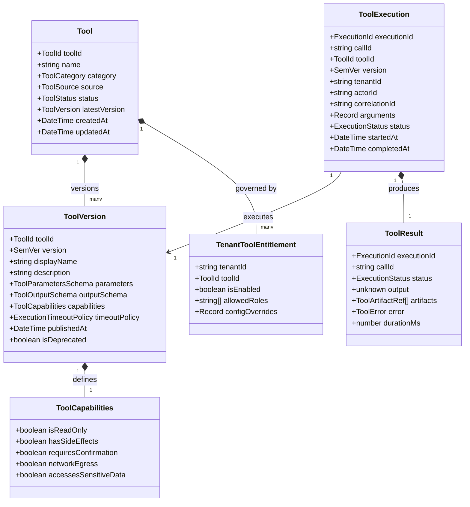
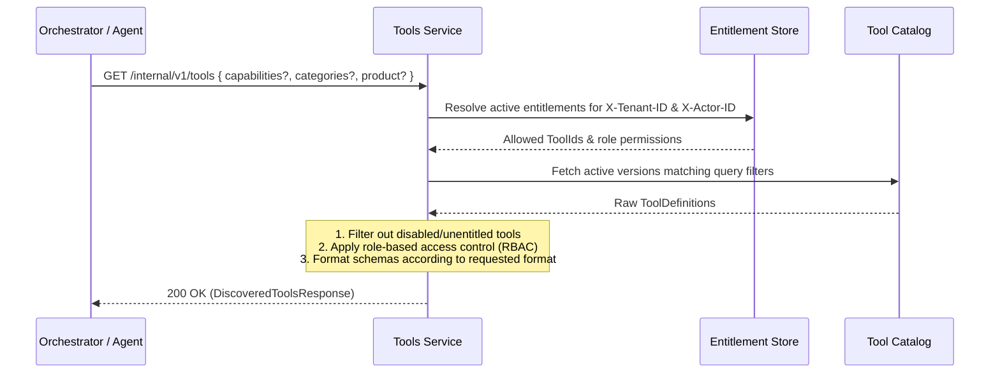
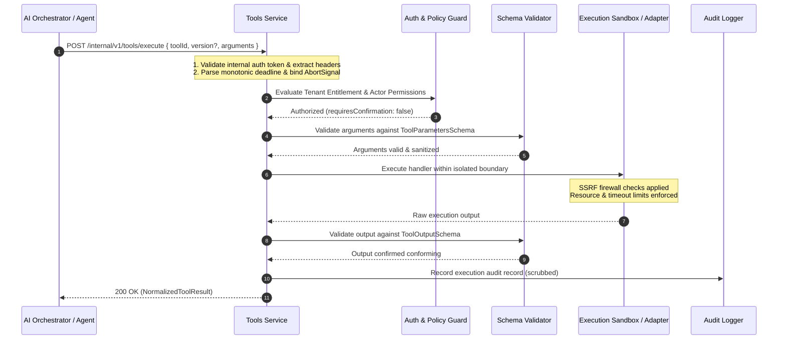

# OICUNT AI Platform Contract: Tools Service Architecture Specification

**Document Version**: 1.0.0  
**Status**: Authoritative Architectural Contract  
**Classification**: Engineering Architecture Standard  
**Service Location**: `services/tools`

---

## 1. Executive Summary & Purpose

The **Tools Service** (`services/tools`) is the authoritative, centralized **tool catalog, execution engine, and capability governance boundary** for the **OICUNT AI Platform**. It serves as the singular platform layer responsible for registering, discovering, authorizing, sandboxing, executing, and auditing all deterministic actions, external integrations, computational routines, and service-to-service operations invoked by AI systems.

The Tools Service provides an uncompromised abstraction over heterogeneous capabilities: validating inputs against rigorous JSON Schemas, enforcing multi-tenant isolation and actor-level authorization, gating sensitive side-effects behind human-in-the-loop confirmation, executing untrusted workloads in fortified sandboxes with strict SSRF mitigation, propagating monotonic execution deadlines and cancellation signals, and returning normalized, provider-neutral outputs—all while strictly shielding AI agents and consumers from raw execution environments, vendor SDKs, and network volatilities.

```
┌────────────────────────────────────────────────────────────────────────┐
│                        Tools Service Consumers                         │
│       AI Orchestrator • Autonomous Agents • BILLY • MCP Bridge         │
└───────────────────────────────────┬────────────────────────────────────┘
                                    │ 1. Discover Tools / Invocations
                                    │    (tenant, actor, permissions)
                                    ▼
┌────────────────────────────────────────────────────────────────────────┐
│                              Tools Service                             │
│                                                                        │
│   • Canonical Tool Catalog & Versioning  • Parameter Schema Validation │
│   • Tenant & Actor Authorization         • Monotonic Deadlines & Abort │
│   • Human Confirmation Token Gating      • SSRF Firewall & Sandboxing  │
│   • Output Normalization & Artifacts     • Security Audit & Telemetry  │
└───────┬───────────────────┬────────────────────┬───────────────────────┘
        │                   │                    │
        │ 2a. Internal      │ 2b. Sandboxed      │ 2c. Service / Remote
        ▼                   ▼                    ▼
┌──────────────┐    ┌──────────────┐     ┌───────────────────────────────┐
│ In-Process   │    │ Ephemeral    │     │ External APIs / Mesh Services │
│ Pure Logic   │    │ MicroVM / WASM│     │ OICUNT Microservices / MCP    │
│ Math / Text  │    │ Code Sandbox │     │ Web Search / Database Queries │
└──────────────┘    └──────────────┘     └───────────────────────────────┘
```

> [!IMPORTANT]
> **Cardinal Boundary Rule**: The Tools Service is the **canonical internal capability execution boundary**. It owns _what tools exist_ and _how they execute safely_. Consuming agents, the AI Orchestrator, and external Model Context Protocol (MCP) bridges **never** execute tool code directly, never bypass the Tools authorization perimeter, and never implement independent tool sandboxes.

---

### 1.1 Architectural Position in the Eight-Tier Platform

The OICUNT AI Platform coordinates intelligence across eight authoritative subsystems:

| Subsystem           | Architectural Role                | Core Question Owned                           | State & Data Owned                                                      |
| :------------------ | :-------------------------------- | :-------------------------------------------- | :---------------------------------------------------------------------- |
| **Model Registry**  | Control Plane / Model Catalog     | _What models & targets exist?_                | Model metadata, versions, context limits, pricing, routing policy       |
| **Model Gateway**   | Data Plane / Provider Egress      | _How is a model executed upstream?_           | Provider adapters, circuit breakers, credentials, egress streams        |
| **Inference**       | Runtime Execution Boundary        | _How is an inference turn governed?_          | Request validation, TTFT hooks, streaming normalization, deadlines      |
| **AI Orchestrator** | Application Execution Coordinator | _How does a turn or workflow proceed?_        | Prompt assembly, context hydration, turn loop, tool orchestration       |
| **Memory**          | Conversational State Engine       | _What was previously discussed?_              | Conversation history, ordered message turns, token summaries            |
| **Knowledge**       | Knowledge & RAG Boundary          | _What verified facts/docs exist?_             | Knowledge collections, documents, semantic chunks, vector search        |
| **Embeddings**      | Vector Representation Runtime     | _How is text vectorized?_                     | Dimension validation, batch atomicity, provider-neutral embeddings      |
| **Tools**           | **Capability & Action Runtime**   | _**What actions can the AI perform safely?**_ | **Tool definitions, parameter schemas, execution sandboxes, audit log** |

---

## 2. Responsibilities & Non-Responsibilities

### 2.1 What Tools Owns (Authoritative Responsibilities)

1. **Tool Catalog & Identity**: Authoritative registration, discovery, deprecation, and lifecycle management of canonical tool identities (`oicunt.tool.*`).
2. **Schema Definition & Validation**: Enforces strict JSON Schema (draft-07 / 2020-12) validation for both tool input arguments and execution outputs.
3. **Multi-Tenant Authorization & Entitlements**: Resolves whether a requesting tenant and actor are permitted to discover or invoke a specific tool version.
4. **Human-in-the-Loop Confirmation Gates**: Enforces cryptographic confirmation token verification for high-impact, side-effecting operations before execution.
5. **Sandboxed Execution Runtime**: Provides isolated execution environments (ephemeral containers, microVMs, WebAssembly, or unprivileged workers) with resource caps (CPU, memory, wall time).
6. **Network Egress & SSRF Governance**: Implements a strict, non-bypassable egress firewall for tools performing external HTTP or remote calls, preventing Server-Side Request Forgery against internal infrastructure.
7. **Monotonic Deadlines & Cancellation**: Propagates execution deadlines and terminates in-flight operations promptly upon receiving `AbortSignal`.
8. **Execution Idempotency**: Guards side-effecting tools against duplicate executions using caller-provided idempotency keys and distributed locking.
9. **Normalized Result & Artifact Packaging**: Transforms heterogeneous tool outputs into uniform result envelopes and offloads large payloads to Object Storage.
10. **Normalized Error Taxonomy**: Classifies tool execution faults into standardized error codes distinct from LLM model or inference failures.
11. **Security Audit Logging**: Durably records auditable records for sensitive tool invocations without leaking credentials or PII.
12. **Observability & Telemetry**: Instruments execution metrics, distributed traces, and sanitized logs conforming to platform standards.

### 2.2 What Tools Does NOT Own (Non-Responsibilities)

1. **No LLM Inference**: The Tools Service never generates completions, never loads tokenizer models, and never runs generative neural networks.
2. **No Model Routing or Provider Credentials**: LLM credentials and provider targets belong strictly to the **Model Gateway**.
3. **No Conversational Prompt Construction**: Tools does not format prompt messages, conversation context, or system prompts. Prompt assembly belongs to the **AI Orchestrator**.
4. **No Turn Loop or Tool-Choice Decisions**: Tools does not decide _which_ tool to call or _when_ to stop calling tools. That decision loop belongs to the **AI Orchestrator** and **Autonomous Agents**.
5. **No Conversational State**: Message history and conversation checkpoints belong exclusively to the **Memory Service**.
6. **No Vector Indexing or RAG Retrieval**: Storing documents, chunking text, and executing vector similarity queries belong to the **Knowledge Service**. (Knowledge may register a tool _backed_ by its API, but Tools does not own the knowledge index).
7. **No Autonomous Agent State Machines**: Managing multi-step goal decomposition, reflection, agent step persistence, and pause/resume run loops belongs to the **Agent Service**.
8. **No Wire-Level MCP Transport Hosting**: MCP wire protocol framing (stdio pipes, SSE transports, WebSocket handshakes) belongs to the **MCP Bridge**. Tools provides the underlying execution boundary that MCP exposes or imports.
9. **No Company-Wide User Authentication or Billing**: Public user login, JWT issuance, tenant creation, and subscription metering belong to the company platform (`https://github.com/oicunt-ai/platform`).
10. **No Arbitrary Remote Code Execution (RCE)**: Tools does not provide unrestricted shell access, root container execution, or host filesystem mounts to any caller.

---

## 3. Tool Domain Model & Core Aggregates



### 3.1 Domain Types & Entities

```typescript
export type ToolId = `oicunt.tool.${string}`;

export type ToolCategory =
  | 'computation' // Deterministic calculation, math, code interpreters
  | 'search' // Web search, index lookups, catalog queries
  | 'knowledge' // Knowledge retrieval, document Q&A
  | 'communication' // Email, notifications, messaging (side-effecting)
  | 'system' // Platform internals, health diagnostics
  | 'integration' // Third-party SaaS connectors (CRM, ERP, Issue trackers)
  | 'custom'; // Tenant-defined dynamic extensions

export type ToolSource =
  | 'internal' // In-process pure TypeScript logic
  | 'service' // OICUNT internal microservice (HTTP/gRPC private mesh)
  | 'sandbox' // Ephemeral isolated sandbox runtime (microVM/WASM)
  | 'external_api' // Governed third-party HTTPS API
  | 'mcp'; // Model Context Protocol remote connector

export type ToolStatus = 'draft' | 'active' | 'deprecated' | 'disabled';

export interface ToolCapabilities {
  /** Idempotent read operation with zero side effects. Safe to retry. */
  readonly isReadOnly: boolean;

  /** Mutates external state (e.g. sends email, modifies database). */
  readonly hasSideEffects: boolean;

  /** Demands explicit human approval and a valid signed confirmation token. */
  readonly requiresConfirmation: boolean;

  /** Requires outbound network/HTTP connectivity (governed by SSRF firewall). */
  readonly networkEgress: boolean;

  /** Accesses sensitive financial, personal, or credential data. */
  readonly accessesSensitiveData: boolean;
}

export interface ExecutionTimeoutPolicy {
  /** Default execution timeout in milliseconds (e.g. 5,000ms). */
  readonly defaultTimeoutMs: number;

  /** Absolute upper ceiling on execution time (e.g. 30,000ms for sync, 300,000ms for async). */
  readonly maxTimeoutMs: number;
}
```

---

## 4. Tool Schema & Parameter Specification

To guarantee provider-neutral interoperability across OpenAI, Anthropic, Google Gemini, and MCP clients, tool schemas are authored in standard **JSON Schema** (draft-07).

### 4.1 Canonical Tool Definition Schema

```typescript
export interface JsonSchemaProperty {
  readonly type: 'string' | 'number' | 'integer' | 'boolean' | 'array' | 'object' | 'null';
  readonly description?: string | undefined;
  readonly enum?: readonly (string | number | boolean)[] | undefined;
  readonly items?: JsonSchemaProperty | undefined;
  readonly properties?: Record<string, JsonSchemaProperty> | undefined;
  readonly required?: readonly string[] | undefined;
  readonly default?: unknown | undefined;
  readonly minimum?: number | undefined;
  readonly maximum?: number | undefined;
  readonly pattern?: string | undefined;
  /** Flags sensitive argument property (scrubbed from audit logs). */
  readonly sensitive?: boolean | undefined;
}

export interface ToolParametersSchema {
  readonly type: 'object';
  readonly properties: Record<string, JsonSchemaProperty>;
  readonly required?: readonly string[] | undefined;
  readonly additionalProperties?: boolean | undefined;
}

export interface ToolOutputSchema {
  readonly type: 'object' | 'array' | 'string' | 'number' | 'boolean';
  readonly properties?: Record<string, JsonSchemaProperty> | undefined;
  readonly description?: string | undefined;
}

export interface ToolDefinition {
  /** Canonical tool identifier (e.g. 'oicunt.tool.calculator.evaluate') */
  readonly toolId: ToolId;

  /** Human-readable display label */
  readonly displayName: string;

  /** Detailed instruction for model reasoning and prompt inclusion */
  readonly description: string;

  /** Immutable semantic version string */
  readonly version: string;

  /** Category classification */
  readonly category: ToolCategory;

  /** Implementation runtime source */
  readonly source: ToolSource;

  /** Behavioral capability flags */
  readonly capabilities: ToolCapabilities;

  /** Input parameters schema */
  readonly parameters: ToolParametersSchema;

  /** Structured output schema */
  readonly outputSchema?: ToolOutputSchema | undefined;

  /** Timeout boundaries */
  readonly timeoutPolicy: ExecutionTimeoutPolicy;

  /** Lifecycle status */
  readonly status: ToolStatus;

  /** Informational tags for capability filtering */
  readonly tags: readonly string[];
}
```

### 4.2 Multi-Vendor Schema Translation (Provider-Neutral Export)

The Tools Service provides native schema exporters translating `ToolDefinition` to vendor-specific wire formats:

```mermaid
flowchart LR
    Canonical[Canonical ToolDefinition<br/>JSON Schema Draft-07] --> Exporter[Tools Schema Exporter]
    Exporter --> OpenAI[OpenAI Tools Format<br/>type: 'function', function: { ... }]
    Exporter --> Anthropic[Anthropic Tools Format<br/>name, description, input_schema]
    Exporter --> Gemini[Google Gemini Format<br/>functionDeclarations: [ ... ]]
    Exporter --> MCP[MCP Tool Descriptor<br/>name, description, inputSchema]
```

---

## 5. Tool Registration, Versioning & Lifecycle Governance

### 5.1 Registration Modalities

1. **Static Platform Manifests**: Core built-in utilities (calculators, string formatters, unit converters) are bundled and validated during service compilation.
2. **Dynamic Service Registration (`POST /internal/v1/tools/register`)**: Internal OICUNT microservices (e.g. Knowledge, Billing Ingress, CRM) register capabilities at startup via secure internal mesh calls.
3. **MCP Connector Synchronization**: Connected MCP servers register discovered capabilities through the MCP Bridge adapter.

### 5.2 Version Immutability & Upgrade Semantics

1. **Version Immutability**: Once a version (e.g. `1.2.0`) is published, its parameter schemas, output schemas, and capability flags are **permanently frozen**.
2. **Semantic Versioning Rules**:
   - **Patch (`x.y.Z`)**: Internal implementation bug fix; zero schema changes.
   - **Minor (`x.Y.0`)**: Backwards-compatible additions (optional parameter added, richer output properties).
   - **Major (`X.0.0`)**: Breaking change (required parameter added, parameter renamed, parameter removed).
3. **Deprecation Grace Period**: Deprecated tools remain invocable for backwards compatibility but are excluded from default discovery queries.

---

## 6. Tool Discovery & Context Filtering

Callers (such as the AI Orchestrator or Autonomous Agents) discover available tools before initiating a turn:

```http
GET /internal/v1/tools?product=billy&capabilities=read_only
X-Tenant-ID: tenant_123
X-User-ID: user_456
X-Actor-ID: actor_789
```

### 6.1 Discovery Pipeline



1. **Tenant Entitlement Filtering**: Tools not enabled for the tenant are completely hidden.
2. **Actor RBAC Evaluation**: Tools requiring elevated privileges are excluded if the actor lacks required roles.
3. **Contextual Scoping**: Prompts only receive tools relevant to the active application context, minimizing token consumption and hallucination surface area.

---

## 7. Execution Architecture & Sequence Flow

The Tools Service supports two execution modes:

1. **Synchronous Execution (`POST /internal/v1/tools/execute`)**: Low-latency deterministic operations ($\le 30\,\text{s}$). The connection blocks until output is returned.
2. **Asynchronous Job Execution (`POST /internal/v1/tools/execute-async`)**: Long-running operations ($> 30\,\text{s}$), batch runs, or human-approval workflows. Returns `202 Accepted` with an `executionId` for status polling or event dispatch.

### 7.1 Synchronous Execution Flow



---

## 8. Request & Response Contract Specification

### 8.1 Synchronous Invocation Request (`POST /internal/v1/tools/execute`)

#### HTTP Headers

| Header              | Type     | Required | Description                                       |
| :------------------ | :------- | :------- | :------------------------------------------------ |
| `Content-Type`      | `string` | **Yes**  | Must be `application/json`.                       |
| `Authorization`     | `string` | **Yes**  | Internal service bearer token (`Bearer <token>`). |
| `X-Tenant-ID`       | `string` | **Yes**  | Authoritative tenant identifier.                  |
| `X-User-ID`         | `string` | **Yes**  | Calling user identifier.                          |
| `X-Actor-ID`        | `string` | **Yes**  | Security actor / principal identifier.            |
| `X-Correlation-ID`  | `string` | **Yes**  | Distributed tracing correlation identifier.       |
| `X-Request-ID`      | `string` | No       | Request identifier for tracing and idempotency.   |
| `X-Deadline-At`     | `string` | No       | ISO-8601 monotonic deadline timestamp.            |
| `X-Idempotency-Key` | `string` | No       | Idempotency token for side-effecting operations.  |

#### Request Payload Schema

```typescript
export interface ToolExecutionRequest {
  /**
   * Tool invocation call ID generated by the model (e.g. 'call_abc123').
   * Correlates tool outputs back to LLM conversational turns.
   */
  readonly callId: string;

  /**
   * Canonical tool identifier (e.g. 'oicunt.tool.calculator.evaluate').
   */
  readonly toolId: ToolId;

  /**
   * Optional explicit tool version. If omitted, resolves to latest active version.
   */
  readonly version?: string | undefined;

  /**
   * Input arguments passed to the tool. Must conform to ToolParametersSchema.
   */
  readonly arguments: Record<string, unknown>;

  /**
   * Signed confirmation token required for tools with requiresConfirmation: true.
   */
  readonly confirmationToken?: string | undefined;

  /**
   * Optional execution metadata passed to tracing and audit logs.
   */
  readonly metadata?: Record<string, unknown> | undefined;
}
```

### 8.2 Response Contract (`NormalizedToolResult`)

```typescript
export interface ToolArtifactRef {
  /** Unique artifact identifier */
  readonly artifactId: string;
  /** Human-readable filename */
  readonly name: string;
  /** MIME type (e.g. 'application/pdf', 'image/png', 'text/csv') */
  readonly mimeType: string;
  /** Size in bytes */
  readonly sizeBytes: number;
  /** Storage URI or download URL (accessible by authorized caller) */
  readonly uri: string;
}

export interface ToolErrorDto {
  readonly code: string;
  readonly message: string;
  readonly retryable: boolean;
  readonly details?: unknown | undefined;
}

export interface NormalizedToolResultData {
  /** Model-generated call ID echoed back */
  readonly callId: string;

  /** Tool identifier executed */
  readonly toolId: ToolId;

  /** Exact tool version executed */
  readonly version: string;

  /** Execution status */
  readonly status: 'success' | 'failure';

  /** Structured output data (if status is 'success') */
  readonly output?: unknown | undefined;

  /** Plain-text summary representation optimized for model context inclusion */
  readonly textSummary?: string | undefined;

  /** Error details (if status is 'failure') */
  readonly error?: ToolErrorDto | undefined;

  /** Offloaded binary or large data artifacts */
  readonly artifacts?: readonly ToolArtifactRef[] | undefined;

  /** Execution runtime metadata */
  readonly execution: {
    readonly executionId: string;
    readonly durationMs: number;
    readonly isReadOnly: boolean;
    readonly executedAt: string;
  };
}

export interface NormalizedToolResponse {
  readonly success: boolean;
  readonly data: NormalizedToolResultData;
  readonly meta: {
    readonly requestId: string;
    readonly correlationId: string;
    readonly timestamp: string;
  };
}
```

---

## 9. Input & Output Validation Standards

1. **Pre-Execution Schema Gate**:
   - The Tools Service parses `request.arguments` against `ToolParametersSchema` using a compiled JSON Schema validator (e.g. Ajv).
   - If validation fails, execution aborts **immediately** with `INVALID_TOOL_ARGUMENTS` (400) without invoking the tool handler.
   - Detailed property-level error paths are returned to help the LLM correct hallucinated arguments in iterative agent loops.
2. **Post-Execution Output Validation**:
   - Handlers must produce outputs satisfying `ToolOutputSchema`.
   - If a handler returns corrupt or non-conforming data, the service intercepts it, logs an internal alert, and returns `MALFORMED_TOOL_RESULT` (502).
3. **Payload Size Limits**:
   - Inbound argument payload limit: Default `10 MB`.
   - Inline output payload limit: Default `10 MB`.
   - Payloads exceeding `10 MB` must be written to **Object Storage** by the tool handler and returned as a `ToolArtifactRef`.

---

## 10. Security Architecture, Sandboxing & SSRF Mitigation

Because tools execute computational logic, make network calls, and interact with external systems, the Tools Service represents a primary security perimeter.

```
┌────────────────────────────────────────────────────────────────────────┐
│                        Inbound Tool Invocation                         │
└───────────────────────────────────┬────────────────────────────────────┘
                                    │
                       1. AuthN & Tenant Entitlement
                                    ▼
                       2. Human Confirmation Gate
                                    ▼
                       3. JSON Schema Validation
                                    ▼
┌────────────────────────────────────────────────────────────────────────┐
│                   Tool Execution Boundary Isolation                    │
│                                                                        │
│   ┌──────────────────────────────┐  ┌──────────────────────────────┐   │
│   │   Ephemeral Code Sandbox     │  │     SSRF Egress Firewall     │   │
│   │   • gVisor / MicroVM / WASM  │  │   • Strict IP Blocklist      │   │
│   │   • Read-only Root FS        │  │   • DNS Rebinding Protection │   │
│   │   • CPU & Memory Quotas      │  │   • Cloud Metadata Blocked   │   │
│   │   • Dropped Capabilities     │  │   • Internal Mesh Blocked    │   │
│   └──────────────────────────────┘  └──────────────────────────────┘   │
└───────────────────────────────────┬────────────────────────────────────┘
                                    │
                       4. Scrubbed Audit Logging
                                    ▼
┌────────────────────────────────────────────────────────────────────────┐
│                    Normalized Result to Caller                         │
└────────────────────────────────────────────────────────────────────────┘
```

### 10.1 Multi-Tenant Isolation & Role-Based Access Control (RBAC)

- Inbound requests must carry valid `X-Tenant-ID` and `X-Actor-ID` headers validated by service-to-service perimeter auth.
- Tools evaluate tenant-specific entitlements: a tool cannot execute in a tenant unless explicitly enabled in `tenant_tool_configs`.
- Actor permissions are evaluated against the tool's required roles (e.g. `admin`, `operator`, `analyst`).

### 10.2 Human-in-the-Loop Confirmation Gates

Operations that perform irreversible mutations (`requiresConfirmation: true`, such as deleting files, modifying production data, or transferring assets) cannot execute on model initiative alone:

1. When a model requests a confirmation-gated tool, the Tools Service returns a structured `CONFIRMATION_REQUIRED` response containing a cryptographically signed `challengeToken`.
2. The UI / BILLY prompts the human user for explicit approval.
3. Upon approval, the platform issues a signed `confirmationToken` containing `{ challengeToken, userId, tenantId, argumentsHash, expiresAt }`.
4. Re-submitting the invocation with the `confirmationToken` satisfies the gate.

### 10.3 Credential Isolation & Vault Storage

- **Zero Credential Exposure**: Tools that connect to third-party services (e.g. Salesforce, GitHub, Slack) retrieve credentials directly from an internal secret vault (HashiCorp Vault / AWS Secrets Manager) using tenant credentials.
- **No Credentials in Prompts**: Models and calling services never see, hold, or transmit raw API keys or passwords.

### 10.4 Server-Side Request Forgery (SSRF) Mitigation Engine

Any tool requiring external network egress (`networkEgress: true`) must execute outbound network calls through the platform **SSRF Egress Proxy**:

1. **Prohibited Address Ranges**:
   - Localhost & Loopback: `127.0.0.0/8`, `::1`
   - Private RFC-1918 Networks: `10.0.0.0/8`, `172.16.0.0/12`, `192.168.0.0/16`
   - Link-Local & Cloud Metadata: `169.254.169.254`, `fe80::/10`
   - Internal Kubernetes DNS: `*.svc.cluster.local`, `*.internal`, `kubernetes.default`
2. **DNS Rebinding Defense**:
   - The proxy resolves target hostnames prior to connection.
   - If any resolved IP falls into a prohibited range, the connection is aborted immediately.
   - The proxy connects directly to the validated IP address, setting the `Host` header and TLS Server Name Indication (SNI) to the requested hostname.

### 10.5 Untrusted Code Sandboxing

Tools that execute dynamic user or agent code (e.g. Python code execution, JavaScript evaluation, data science scripts):

- Run within **ephemeral, isolated sandboxes** (microVMs via Firecracker, container sandboxes via gVisor, or WebAssembly runtimes).
- Non-root user execution (`uid: 10001`).
- Read-only root filesystem with ephemeral `tmpfs` mounts.
- Hard resource quotas: e.g. 512MB RAM, 1 vCPU, 10s CPU time limit.
- Completely disabled network interfaces (`--net=none`) unless explicitly permitted.

---

## 11. Tool Execution Classes & Adapter Strategy

The Tools Service provides a clean Hexagonal Architecture adapter boundary supporting five distinct execution classes:

```typescript
export interface ToolExecutorPort {
  execute(
    definition: ToolDefinition,
    call: ToolExecutionRequest,
    context: ToolExecutionContext,
  ): Promise<ToolResult>;
}
```

```
┌────────────────────────────────────────────────────────────────────────┐
│                        ToolExecutorPort Router                         │
└───────┬────────────────┬───────────────┬───────────────┬───────────────┘
        │                │               │               │               │
        ▼                ▼               ▼               ▼               ▼
┌──────────────┐ ┌──────────────┐ ┌──────────────┐ ┌──────────────┐ ┌──────────────┐
│InternalAdapter│ │ServiceAdapter│ │SandboxAdapter│ │ExternalApi   │ │  McpAdapter  │
│In-process TS │ │Private Mesh  │ │gVisor / Micro│ │Governed HTTP │ │Remote MCP    │
│Calculators/  │ │Knowledge,    │ │Python / Node │ │Outbound API  │ │JSON-RPC 2.0  │
│Formatting    │ │Billing APIs  │ │Interpreters  │ │Integrations  │ │Bridge Client │
└──────────────┘ └──────────────┘ └──────────────┘ └──────────────┘ └──────────────┘
```

1. **Internal Tools (`InternalAdapter`)**: Lightweight, in-process deterministic TypeScript modules for math, date calculation, string formatting, and schema transforms.
2. **Service Tools (`ServiceAdapter`)**: Microservice-backed tools making authenticated HTTP/gRPC requests over the private service mesh (e.g. searching the Knowledge Service, querying user profile metadata).
3. **Sandbox Tools (`SandboxAdapter`)**: Ephemeral containerized execution for untrusted code execution.
4. **External API Tools (`ExternalApiAdapter`)**: Outbound HTTP requests to third-party APIs using managed Vault credentials and the SSRF firewall.
5. **MCP Bridge Tools (`McpAdapter`)**: Bridges to remote Model Context Protocol servers.

---

## 12. Execution Model, Idempotency & Retries

### 12.1 Idempotency & Duplicate Execution Protection

1. **Safe vs. Mutating Operations**:
   - `isReadOnly: true`: Inherently idempotent. Safe to execute multiple times.
   - `hasSideEffects: true`: Potentially non-idempotent. Callers should provide an `X-Idempotency-Key`.
2. **Distributed Execution Locks**:
   - When an `X-Idempotency-Key` is supplied with a mutating tool call, the service acquires a distributed Redis lock scoped to `(tenantId, toolId, idempotencyKey)` with an expiration matching the request timeout.
   - If a duplicate request arrives while execution is in progress, it receives a `409 Conflict` or waits for completion.
   - Once completed, the result is cached for the idempotency retention window (default: 24 hours), returning the identical result without re-executing side effects.

### 12.2 Retries Governance

> [!CAUTION]
> **Cardinal Retries Rule**: The Tools Service **NEVER** performs blind internal retries for side-effecting operations.

- **Read-Only Tools (`isReadOnly: true`)**: Transient network failures (503, 504, connection drops) may be retried up to 2 times with exponential backoff and jitter.
- **Side-Effecting Tools (`hasSideEffects: true`)**: Retries are forbidden unless:
  1. The caller explicitly provides an `X-Idempotency-Key`, AND
  2. The failure occurred _before_ the downstream side effect was dispatched (e.g. rate limited at proxy, auth failure).

---

## 13. Error Taxonomy & Failure Semantics

The Tools Service normalizes all execution and validation faults into standard OICUNT platform error codes:

| Error Code                   | HTTP Status | Retryable | Description                                                                        |
| :--------------------------- | :---------: | :-------: | :--------------------------------------------------------------------------------- |
| `INVALID_TOOL_ARGUMENTS`     |     400     |    No     | Input arguments violate the tool's JSON Schema parameter contract.                 |
| `TOOL_NOT_FOUND`             |     404     |    No     | Requested canonical tool identifier is not registered.                             |
| `TOOL_VERSION_MISMATCH`      |     400     |    No     | Requested tool version does not exist or has been disabled.                        |
| `TOOL_DISABLED`              |     403     |    No     | Tool is currently disabled globally or for this specific tenant.                   |
| `PERMISSION_DENIED`          |     403     |    No     | Calling actor lacks required RBAC role to execute this tool.                       |
| `CONFIRMATION_REQUIRED`      |     403     |    No     | Tool requires human approval; confirmation token missing or invalid.               |
| `AUTHENTICATION_ERROR`       |     401     |    No     | Missing or invalid internal service authorization token.                           |
| `TOOL_RATE_LIMITED`          |     429     |    Yes    | Execution rate limit exceeded for this tenant or tool.                             |
| `REQUEST_CANCELLED`          |     499     |    No     | Caller disconnected or cancelled execution via `AbortSignal`.                      |
| `DEADLINE_EXCEEDED`          |     504     |   Yes*    | Operation exceeded caller deadline or max execution timeout. (*Only if read-only). |
| `TOOL_UNAVAILABLE`           |     503     |    Yes    | Underlying service, sandbox worker, or MCP bridge is offline.                      |
| `TOOL_EXECUTION_FAILED`      |     502     |   Yes*    | Downstream execution threw an unhandled error. (*Only if read-only).               |
| `MALFORMED_TOOL_RESULT`      |     502     |    No     | Tool handler produced output violating `ToolOutputSchema`.                         |
| `SANDBOX_SECURITY_VIOLATION` |     403     |    No     | Tool attempted an SSRF call, unauthorized syscall, or resource exhaustion.         |
| `INTERNAL_TOOL_ERROR`        |     500     |    No     | Unexpected internal error within the Tools Service infrastructure.                 |

### 13.1 Distinguishability Invariant

Tool execution failures must be explicitly distinguishable from model or inference failures:

- If a model hallucinates invalid JSON: **Inference / Orchestrator** surfaces model generation syntax errors.
- If arguments violate parameter schemas: **Tools** returns `INVALID_TOOL_ARGUMENTS` (400).
- If downstream tool logic fails: **Tools** returns `TOOL_EXECUTION_FAILED` (502).

---

## 14. Normalized Result Contract & Artifact Offloading

### 14.1 Uniform Result Envelope

Every tool execution emits a provider-independent `NormalizedToolResult`. When passed back to the AI Orchestrator or Agent, this result is converted into a standard `tool_result` message part conforming to `@oicunt-ai/ai-types`:

```typescript
export interface ToolResultPart {
  readonly type: 'tool_result';
  readonly toolCallId: string;
  readonly name: string;
  readonly content: unknown;
  readonly isError?: boolean;
}
```

### 14.2 Binary & Large Artifact Offloading

When a tool produces large datasets (e.g. database dump, CSV report, generated PDF, image asset):

1. The tool handler streams the binary data to **Object Storage** under `tenants/{tenantId}/artifacts/{executionId}/{filename}`.
2. The tool returns an artifact reference (`ToolArtifactRef`) containing the URI and metadata.
3. The `textSummary` field contains a concise description for the LLM (e.g., `"Successfully generated 4.2MB sales report. Stored at artifact: sales_q3.csv"`), preventing token buffer exhaustion.

---

## 15. Observability & Telemetry Standards

### 15.1 Metrics Instrumentation

| Metric Name                 | Type      | Description                            | Labels                                      |
| :-------------------------- | :-------- | :------------------------------------- | :------------------------------------------ |
| `tools.invocations.total`   | Counter   | Total tool executions invoked          | `tool_id`, `version`, `tenant_id`, `status` |
| `tools.duration.ms`         | Histogram | Execution latency in milliseconds      | `tool_id`, `status`                         |
| `tools.errors.total`        | Counter   | Tool failures by normalized error code | `tool_id`, `code`                           |
| `tools.concurrency.active`  | Gauge     | Currently executing in-flight tools    | `tool_id`                                   |
| `tools.sandbox.cpu_time.ms` | Histogram | CPU time consumed in sandboxes         | `tool_id`                                   |
| `tools.artifacts.bytes`     | Histogram | Size of offloaded artifacts in bytes   | `tool_id`, `mime_type`                      |

### 15.2 Distributed Tracing

Spans are created for each tool invocation: `tools.execute`:

- `oicunt.tool.id`: canonical tool ID
- `oicunt.tool.version`: tool version
- `oicunt.tool.is_read_only`: boolean
- `oicunt.tenant_id`: tenant ID
- `oicunt.actor_id`: actor ID
- `oicunt.execution.status`: `success` | `failure`

### 15.3 Privacy-Preserving Logging

The Tools Service enforces a strict **Zero-Log Policy** for sensitive execution arguments:

- Parameters marked with `sensitive: true` in `ToolParametersSchema` are replaced with `[REDACTED_SENSITIVE_ARGUMENT]`.
- Tool credentials, API keys, passwords, and tokens are **never** logged.

---

## 16. Security Auditability & Compliance

Side-effecting or sensitive tool executions (`hasSideEffects: true` or `accessesSensitiveData: true`) record an immutable audit entry in `tool_audit_logs`:

```typescript
export interface ToolAuditEvent {
  readonly auditId: string;
  readonly executionId: string;
  readonly timestamp: string;
  readonly tenantId: string;
  readonly userId: string;
  readonly actorId: string;
  readonly toolId: ToolId;
  readonly version: string;
  readonly isReadOnly: boolean;
  readonly sanitizedArguments: Record<string, unknown>;
  readonly status: 'success' | 'failure';
  readonly durationMs: number;
  readonly confirmationTokenUsed?: string | undefined;
  readonly clientIp?: string | undefined;
  readonly correlationId: string;
}
```

---

## 17. Persistence Architecture & Database Ownership

The Tools Service maintains its own dedicated PostgreSQL database (`oicunt_tools`):

```sql
-- Canonical Tools Catalog
CREATE TABLE tools (
    id VARCHAR(128) PRIMARY KEY, -- e.g. 'oicunt.tool.calculator.evaluate'
    name VARCHAR(255) NOT NULL,
    category VARCHAR(64) NOT NULL,
    source VARCHAR(64) NOT NULL,
    status VARCHAR(32) NOT NULL DEFAULT 'active',
    created_at TIMESTAMPTZ NOT NULL DEFAULT NOW(),
    updated_at TIMESTAMPTZ NOT NULL DEFAULT NOW()
);

-- Immutable Tool Versions
CREATE TABLE tool_versions (
    tool_id VARCHAR(128) REFERENCES tools(id) ON DELETE CASCADE,
    version VARCHAR(32) NOT NULL, -- e.g. '1.0.0'
    display_name VARCHAR(255) NOT NULL,
    description TEXT NOT NULL,
    parameters_schema JSONB NOT NULL,
    output_schema JSONB,
    capabilities JSONB NOT NULL,
    timeout_policy JSONB NOT NULL,
    published_at TIMESTAMPTZ NOT NULL DEFAULT NOW(),
    is_deprecated BOOLEAN NOT NULL DEFAULT FALSE,
    PRIMARY KEY (tool_id, version)
);

-- Tenant Entitlements & Role Configurations
CREATE TABLE tenant_tool_configs (
    tenant_id VARCHAR(64) NOT NULL,
    tool_id VARCHAR(128) REFERENCES tools(id) ON DELETE CASCADE,
    is_enabled BOOLEAN NOT NULL DEFAULT TRUE,
    allowed_roles JSONB NOT NULL DEFAULT '[]'::jsonb,
    config_overrides JSONB,
    updated_at TIMESTAMPTZ NOT NULL DEFAULT NOW(),
    PRIMARY KEY (tenant_id, tool_id)
);

-- Durable Audit Trail
CREATE TABLE tool_audit_logs (
    audit_id UUID PRIMARY KEY DEFAULT gen_random_uuid(),
    execution_id VARCHAR(64) NOT NULL,
    timestamp TIMESTAMPTZ NOT NULL DEFAULT NOW(),
    tenant_id VARCHAR(64) NOT NULL,
    user_id VARCHAR(64) NOT NULL,
    actor_id VARCHAR(64) NOT NULL,
    tool_id VARCHAR(128) NOT NULL,
    version VARCHAR(32) NOT NULL,
    is_read_only BOOLEAN NOT NULL,
    sanitized_arguments JSONB NOT NULL,
    status VARCHAR(32) NOT NULL,
    duration_ms INT NOT NULL,
    correlation_id VARCHAR(128) NOT NULL
);
CREATE INDEX idx_tool_audit_tenant_time ON tool_audit_logs (tenant_id, timestamp DESC);

-- Asynchronous Execution Jobs
CREATE TABLE tool_async_executions (
    execution_id VARCHAR(64) PRIMARY KEY,
    call_id VARCHAR(64) NOT NULL,
    tenant_id VARCHAR(64) NOT NULL,
    user_id VARCHAR(64) NOT NULL,
    tool_id VARCHAR(128) NOT NULL,
    version VARCHAR(32) NOT NULL,
    status VARCHAR(32) NOT NULL, -- 'pending', 'running', 'completed', 'failed', 'cancelled'
    result JSONB,
    error JSONB,
    created_at TIMESTAMPTZ NOT NULL DEFAULT NOW(),
    completed_at TIMESTAMPTZ
);
```

---

## 18. Internal HTTP API Specification

### 18.1 `GET /internal/v1/tools`

Discovers tools accessible to the calling tenant and actor.

- **Query Parameters**:
  - `product?: string` (e.g. `billy`)
  - `category?: string`
  - `capabilities?: string` (comma-separated: `read_only`, `side_effects`)
  - `format?: 'canonical' | 'openai' | 'anthropic' | 'gemini' | 'mcp'`
- **Response**: `200 OK` with list of tools.

### 18.2 `GET /internal/v1/tools/:toolId`

Retrieves detailed definition and schemas for a specific tool.

- **Query Parameters**: `version?: string`
- **Response**: `200 OK` with `ToolDefinition`.

### 18.3 `POST /internal/v1/tools/register`

Registers or updates a tool definition (internal service / admin mesh only).

- **Request**: `ToolDefinition` payload.
- **Response**: `201 Created`.

### 18.4 `POST /internal/v1/tools/execute`

Synchronously executes a tool.

- **Request**: `ToolExecutionRequest` payload.
- **Response**: `200 OK` with `NormalizedToolResponse`.

### 18.5 `POST /internal/v1/tools/execute-async`

Dispatches an asynchronous tool execution job.

- **Request**: `ToolExecutionRequest` payload.
- **Response**: `202 Accepted` with `{ executionId, status: 'pending' }`.

### 18.6 `GET /internal/v1/tools/executions/:executionId`

Polls status and result of an asynchronous execution job.

- **Response**: `200 OK` with execution status and result (if complete).

### 18.7 `POST /internal/v1/tools/executions/:executionId/cancel`

Cancels an in-flight asynchronous execution.

- **Response**: `200 OK` with `{ status: 'cancelled' }`.

### 18.8 `GET /health/liveness` & `GET /health/readiness`

Standard health and readiness probes.

---

## 19. Interoperability & Platform Relationships

### 19.1 Tools ↔ Model Context Protocol (MCP)

> [!IMPORTANT]
> **MCP Architectural Relationship**: MCP is an **interoperability protocol**, not a second tool execution architecture. Tools is the authoritative runtime.

```
┌────────────────────────────────────────────────────────┐
│               External MCP Clients                     │
│        (Claude Desktop, Cursor, External Agents)       │
└───────────────────────────┬────────────────────────────┘
                            │ MCP Wire Protocol (stdio / SSE)
                            ▼
┌────────────────────────────────────────────────────────┐
│                 OICUNT MCP Bridge                      │
│            (Protocol Translation Boundary)             │
└───────────────────────────┬────────────────────────────┘
                            │ POST /internal/v1/tools/execute
                            ▼
┌────────────────────────────────────────────────────────┐
│                   OICUNT Tools Service                 │
│         (Authoritative Execution & Policy Engine)      │
└───────────────────────────┬────────────────────────────┘
                            │ McpAdapter
                            ▼
┌────────────────────────────────────────────────────────┐
│                 Remote MCP Servers                     │
│         (Filesystem, GitHub, Postgres MCP Servers)     │
└────────────────────────────────────────────────────────┘
```

1. **Tools Exposed via MCP (Outbound)**: The MCP Bridge can expose approved OICUNT tools to external MCP clients. Invocations from external clients hit the MCP Bridge, which calls `POST /internal/v1/tools/execute`. All OICUNT validation, tenant isolation, and audit logging apply.
2. **MCP Servers Consumed by Tools (Inbound)**: When OICUNT connects to an external MCP server, the MCP server's tools are registered inside the Tools Service under `source: 'mcp'`. Invocations dispatch via `McpAdapter`.

### 19.2 Tools ↔ Autonomous Agents

- Future **Autonomous Agents** (`services/agents`) maintain run loops, task decomposition, reflection, and state persistence.
- When an agent decides to execute an action, it dispatches the tool call to the **Tools Service** via `POST /internal/v1/tools/execute`.
- Agents never execute shell scripts, network calls, or database operations directly.

### 19.3 Tools ↔ AI Orchestrator

- During a conversational turn, the **AI Orchestrator** calls `GET /internal/v1/tools` to fetch formatted tool schemas for the active model context.
- When the model returns a `tool_call`, the Orchestrator invokes `POST /internal/v1/tools/execute`.
- The Orchestrator appends the returned `tool_result` to the turn context and continues model generation.

---

## 20. Architectural Invariants Checklist

Every implementation of the Tools Service must strictly satisfy the following 25 invariants:

1. **Canonical Execution Boundary**: All AI tool executions must route through the Tools Service. Direct tool execution in the Orchestrator or Agents is strictly prohibited.
2. **No Model Inference**: The Tools Service never generates LLM completions, chat responses, or runs reasoning models.
3. **No Provider Egress Ownership**: Model provider routing, retries, and API keys remain strictly within the **Model Gateway**.
4. **Stable Tool Identity**: Tool identifiers use reverse-domain format (`oicunt.tool.<category>.<action>`).
5. **Immutable Versions**: Published tool versions are immutable. Schema changes mandate a version bump.
6. **No Silent Tool Substitution**: If an explicit tool version is requested, the service executes that exact version or fails.
7. **Strict Multi-Tenant Isolation**: Tenant entitlement checks are mandatory. Cross-tenant tool execution is impossible.
8. **Human Confirmation Gating**: Tools declaring `requiresConfirmation: true` cannot execute without a valid, signed confirmation token.
9. **Zero Credential Exposure**: API keys, OAuth tokens, and secrets reside in Vault; credentials are never passed in model context, arguments, or logs.
10. **Pre-Execution Schema Validation**: Input arguments must pass JSON Schema validation before any handler code executes.
11. **Post-Execution Output Validation**: Handler outputs must conform to `outputSchema` or fail with `MALFORMED_TOOL_RESULT`.
12. **SSRF Egress Enforcement**: External network calls must pass through the SSRF firewall; private IP ranges and cloud metadata endpoints are strictly blocked.
13. **Sandboxed Code Execution**: Dynamic code execution runs in ephemeral, unprivileged, resource-capped sandboxes with no host mounts.
14. **No Arbitrary Code Execution on Host**: The Tools Service host never executes unvalidated, unsandboxed shell or process commands.
15. **Monotonic Deadlines**: Execution deadlines strictly decrease across downstream calls and terminate promptly upon expiry.
16. **Cancellation Propagation**: In-flight executions must bind to `AbortSignal` and release compute resources upon client disconnect.
17. **No Blind Retries for Side Effects**: Side-effecting tools are never retried automatically without explicit idempotency verification.
18. **Distinguishable Error Taxonomy**: Tool execution errors are explicitly distinguishable from LLM model or inference failures.
19. **Artifact Offloading**: Outputs exceeding size limits are offloaded to Object Storage as `ToolArtifactRef`.
20. **Sensitive Payload Scrubbing**: Sensitive arguments and tool outputs are scrubbed from telemetry and standard logs.
21. **Durable Security Audit Trail**: Side-effecting and sensitive executions record immutable audit events in `tool_audit_logs`.
22. **MCP is Protocol, Not Runtime**: MCP interoperability routes through Tools; MCP does not own independent tool execution semantics.
23. **Database-Per-Service Rule**: The Tools Service owns `oicunt_tools` and shares database tables with no other service.
24. **Identity Header Propagation**: Requests propagate `X-Tenant-ID`, `X-User-ID`, `X-Actor-ID`, `X-Correlation-ID`, and `X-Request-ID`.
25. **Perimeter-Protected Auth**: The Tools Service binds exclusively to private mesh networks and verifies internal authorization tokens.
