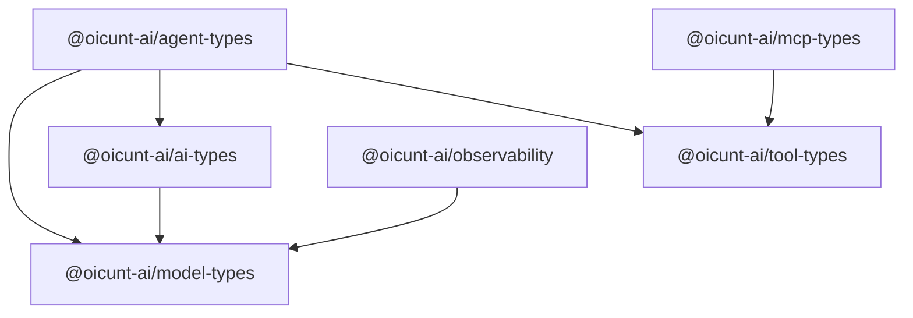

# Shared Packages (`packages/`)

This directory houses the foundational, domain-agnostic contracts, schemas, and shared utilities for the OICUNT AI Platform.

---

## 1. Architectural Principles & Ownership

1. **Pure Types & Contracts**:
   Packages define canonical domain types, schema definitions, and protocol interfaces. They contain zero service runtime state and zero infrastructure dependencies.
2. **Strict Inward Dependency Flow**:
   External layers (`services/*`, `workers/*`, `providers/*`, `templates/*`) depend on `packages/*`. Packages **never** depend on services, workers, providers, or templates.
3. **No Vendor Leaks**:
   Shared packages must never import or expose vendor-specific SDK types (e.g. OpenAI, upstream provider, Google SDK structures). All external representations are strictly mapped into normalized OICUNT AI Platform types.
4. **Directed Acyclic Graph (DAG)**:
   Inter-package dependencies form a strict acyclic graph enforced by TypeScript project references (`composite: true`). Circular dependencies are rejected by the compiler.
5. **No Service Duplication**:
   Shared packages must not contain business logic, database queries, or network transports. They define the ubiquitous language and interface contracts for the platform.

---

## 2. Package Catalog

| Package                            | Workspace Name             | Purpose                                                                                                | Direct Workspace Dependencies                                            |
| ---------------------------------- | -------------------------- | ------------------------------------------------------------------------------------------------------ | ------------------------------------------------------------------------ |
| [`model-types`](./model-types)     | `@oicunt-ai/model-types`   | Canonical model identifiers, capabilities, limits, pricing, and token usage accounting                 | None (Root of dependency DAG)                                            |
| [`ai-types`](./ai-types)           | `@oicunt-ai/ai-types`      | Universal message primitives, chat turns, completion requests/responses, and streaming events          | `@oicunt-ai/model-types`                                                 |
| [`tool-types`](./tool-types)       | `@oicunt-ai/tool-types`    | Tool schemas, parameter JSON definitions, execution contracts, and result models                       | None                                                                     |
| [`agent-types`](./agent-types)     | `@oicunt-ai/agent-types`   | Agent configuration, step states, execution loops, and lifecycle tracking                              | `@oicunt-ai/model-types`, `@oicunt-ai/ai-types`, `@oicunt-ai/tool-types` |
| [`mcp-types`](./mcp-types)         | `@oicunt-ai/mcp-types`     | Model Context Protocol (MCP) specifications, framing, resources, prompts, and tools                    | `@oicunt-ai/tool-types`                                                  |
| [`observability`](./observability) | `@oicunt-ai/observability` | GenAI OpenTelemetry semantic conventions, token attribution, latency tracking, and tracer test doubles | `@oicunt-ai/model-types`                                                 |

---

## 3. Dependency DAG

