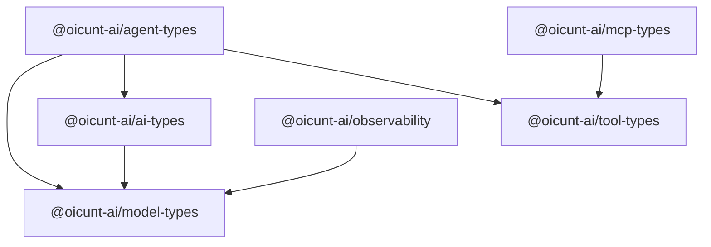

# Shared Packages (`packages/`)

This directory houses the foundational, domain-agnostic contracts, schemas, and shared utilities for the OICUNT AI Platform.

---

## 1. Architectural Principles

1. **Pure Types & Contracts**:
   Packages define canonical types, schema definitions, and protocol interfaces. They contain zero service runtime state and zero infrastructure dependencies.
2. **Strict Inward Dependency Direction**:
   External layers (`services/*`, `workers/*`, `providers/*`) depend on `packages/*`. Packages NEVER depend on services, workers, or providers.
3. **No Vendor Leaks**:
   Shared packages must never expose vendor-specific SDK types (e.g. OpenAI, Anthropic, Google SDK structures). All external representations are strictly mapped into normalized OICUNT AI Platform types.
4. **Independent Versioning & Clean Boundaries**:
   Each package is a distinct pnpm workspace package with strict TypeScript project references (`composite: true`).

---

## 2. Package Catalog

| Package                            | Workspace Name             | Purpose                                                                                             |
| ---------------------------------- | -------------------------- | --------------------------------------------------------------------------------------------------- |
| [`model-types`](./model-types)     | `@oicunt-ai/model-types`   | Canonical model identifiers, capabilities, token usage, and pricing structures                      |
| [`ai-types`](./ai-types)           | `@oicunt-ai/ai-types`      | Universal message primitives, chat turns, completion requests/responses, and streaming events       |
| [`tool-types`](./tool-types)       | `@oicunt-ai/tool-types`    | Tool schemas, parameter definitions, execution contracts, and result models                         |
| [`agent-types`](./agent-types)     | `@oicunt-ai/agent-types`   | Agent configuration, step states, execution loops, and lifecycle tracking                           |
| [`mcp-types`](./mcp-types)         | `@oicunt-ai/mcp-types`     | Model Context Protocol (MCP) specifications, framing, resources, prompts, and tools                 |
| [`observability`](./observability) | `@oicunt-ai/observability` | GenAI OpenTelemetry semantic conventions, token attribution, latency metrics, and tracing contracts |

---

## 3. Dependency Graph

